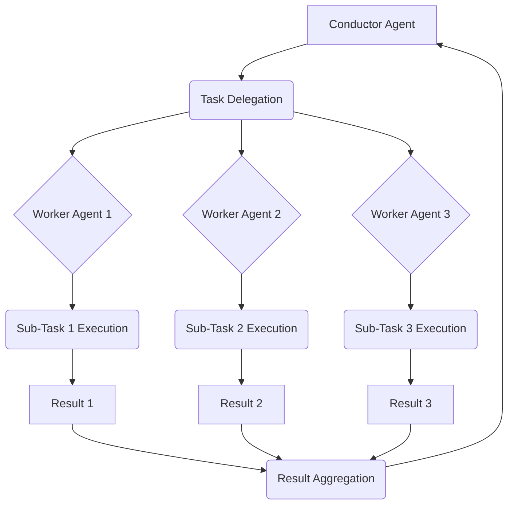

## 멀티 에이전트 시스템: 복잡한 태스크를 위한 협업 패턴 디자인

AI 에이전트 시스템이 특정 도메인 내에서 고도화되고 자율성을 갖추면서, 단일 에이전트가 처리하기 어려운 복잡한 작업을 해결하기 위한 멀티 에이전트 협업의 중요성이 증대되고 있다. 여러 에이전트가 상호작용하며 공동의 목표를 달성하는 것은 현대 AI 시스템 설계의 핵심적인 도전 과제이자 필수적인 역량이다. 이는 특히 실세계 문제 해결, 대규모 데이터 처리, 복잡한 비즈니스 로직 자동화 등에서 강력한 AI 시스템을 구축하는 데 결정적인 역할을 한다.

### 핵심 협업 메커니즘

효과적인 멀티 에이전트 협업을 위해서는 다음과 같은 핵심 메커니즘이 필수적이다.

*   **역할 기반 분해 (Role-based Decomposition)**: 복잡한 작업을 작은 하위 작업으로 분해하고, 각 하위 작업에 최적화된 역할을 가진 에이전트를 할당한다. 이는 에이전트의 전문성을 극대화하고 책임 범위를 명확히 하여 전체 시스템의 효율성을 높인다.
*   **통신 및 메시징 (Communication & Messaging)**: 에이전트 간 정보 교환은 정형화된 프로토콜과 메시지 형식을 통해 이루어져야 한다. 이는 오해를 줄이고 상호운용성을 보장한다. Publish/Subscribe, Request/Response, Broadcast 등의 패턴이 활용된다.
*   **공유 상태 및 지식 (Shared State & Knowledge)**: 에이전트들이 공동의 목표를 추적하고, 작업 진행 상황을 업데이트하며, 공통의 지식 기반을 참조할 수 있는 메커니즘이 필요하다. 이는 블랙보드 시스템 (Blackboard System) 또는 공유 컨텍스트 (Shared Context) 형태로 구현될 수 있다.
*   **조정 및 오케스트레이션 (Coordination & Orchestration)**: 개별 에이전트의 행동을 조율하고, 작업 순서를 관리하며, 자원 충돌을 해결하는 메커니즘이다. 오케스트레이터 에이전트 (Orchestrator Agent)나 분산 합의 (Distributed Consensus) 알고리즘이 사용될 수 있다.
*   **갈등 해결 (Conflict Resolution)**: 에이전트 간의 목표나 자원 사용에 대한 충돌이 발생했을 때 이를 감지하고 해결하는 전략이 필요하다. 우선순위, 협상, 중재자 패턴 등이 적용된다.

### 대표적인 멀티 에이전트 협업 패턴

다양한 복잡성 수준과 요구사항에 맞춰 여러 협업 패턴이 존재한다.

#### 1. 지휘자/오케스트레이터 패턴 (Conductor/Orchestrator Pattern)

중앙 집중식 조정 에이전트가 전체 작업 흐름을 관리하고, 하위 에이전트들에게 작업을 할당하며, 그들의 결과를 통합한다. 단순하고 제어가 용이하지만, 오케스트레이터가 단일 장애점(Single Point of Failure)이 될 수 있다.



#### 2. 블랙보드 패턴 (Blackboard Pattern)

모든 에이전트가 접근하고 수정할 수 있는 중앙 공유 데이터 구조(블랙보드)를 활용한다. 에이전트들은 블랙보드를 관찰하며 자신의 전문성에 맞는 작업 기회를 탐색하고, 정보를 추가하거나 수정한다. 유연성이 높고 새로운 에이전트 추가가 용이하지만, 블랙보드의 일관성 관리와 경쟁 조건(race condition) 처리가 중요하다.

#### 3. 계층적 에이전트 시스템 (Hierarchical Agent Systems)

에이전트들이 계층적으로 조직되어, 상위 에이전트가 하위 에이전트에게 목표를 위임하고, 하위 에이전트들은 이를 달성하기 위한 구체적인 계획을 수립하고 실행한다. 책임과 권한이 명확하여 대규모 시스템 관리에 유리하다.

#### 4. 워크플로우 엔진 기반 협업 (Workflow Engine-based Collaboration)

사전에 정의된 워크플로우 정의 언어(BPMN 등)를 사용하여 에이전트 간의 상호작용 순서와 조건을 명시한다. 워크플로우 엔진이 이 정의에 따라 에이전트 호출 및 데이터 흐름을 제어한다. 비즈니스 로직의 투명성과 감사 추적(audit trail)이 강점이다. 2026년에는 LLM이 워크플로우를 동적으로 생성하고, 에이전트 스킬셋에 따라 자동으로 워크플로우를 최적화하는 트렌드가 부상하고 있다.

### 코드 예제: 간단한 지휘자 패턴 구현 (Python)

아래 Python 예제는 지휘자 패턴을 활용하여 파일 분석이라는 복잡한 작업을 여러 에이전트에 분할하는 시나리오를 보여준다. `ConductorAgent`는 `FileReaderAgent`와 `AnalyzerAgent`를 조율한다.

```python
import asyncio

class Message:
    def __init__(self, sender, recipient, content):
        self.sender = sender
        self.recipient = recipient
        self.content = content

    def __repr__(self):
        return f"Message(from={self.sender}, to={self.recipient}, content={self.content})"

class Agent:
    def __init__(self, name):
        self.name = name
        self.inbox = asyncio.Queue()

    async def send(self, recipient_agent, content):
        msg = Message(self.name, recipient_agent.name, content)
        print(f"[{self.name}] Sending: {msg}")
        await recipient_agent.inbox.put(msg)

    async def receive(self):
        msg = await self.inbox.get()
        print(f"[{self.name}] Received: {msg}")
        return msg

    async def run(self):
        raise NotImplementedError

class FileReaderAgent(Agent):
    async def run(self, file_path):
        print(f"[{self.name}] Reading file: {file_path}")
        try:
            with open(file_path, 'r') as f:
                content = f.read()
            return {"status": "success", "content": content}
        except FileNotFoundError:
            return {"status": "error", "message": "File not found"}

class AnalyzerAgent(Agent):
    async def run(self, text_content):
        print(f"[{self.name}] Analyzing content...")
        # Simulate analysis
        word_count = len(text_content.split())
        char_count = len(text_content)
        return {"status": "success", "analysis": {"word_count": word_count, "char_count": char_count}}

class ConductorAgent(Agent):
    def __init__(self, name, file_reader, analyzer):
        super().__init__(name)
        self.file_reader = file_reader
        self.analyzer = analyzer

    async def orchestrate_analysis(self, file_path):
        print(f"[{self.name}] Starting orchestration for {file_path}")

        # Step 1: Request file content from FileReaderAgent
        file_read_result = await self.file_reader.run(file_path)

        if file_read_result["status"] == "error":
            print(f"[{self.name}] Error reading file: {file_read_result['message']}")
            return {"status": "failed", "reason": file_read_result['message']}

        file_content = file_read_result["content"]
        await asyncio.sleep(0.1) # Simulate network delay

        # Step 2: Send content to AnalyzerAgent
        analysis_result = await self.analyzer.run(file_content)

        if analysis_result["status"] == "error":
            print(f"[{self.name}] Error analyzing content.")
            return {"status": "failed", "reason": "Analysis failed"}

        final_report = {
            "file_path": file_path,
            "analysis": analysis_result["analysis"]
        }
        print(f"[{self.name}] Orchestration complete. Report: {final_report}")
        return {"status": "completed", "report": final_report}

async def main():
    file_reader = FileReaderAgent("FileReader")
    analyzer = AnalyzerAgent("Analyzer")
    conductor = ConductorAgent("Conductor", file_reader, analyzer)

    # Create a dummy file for testing
    with open("sample.txt", "w") as f:
        f.write("This is a sample text for multi-agent collaboration demonstration.")

    result = await conductor.orchestrate_analysis("sample.txt")
    print(f"Final Outcome: {result}")

if __name__ == "__main__":
    asyncio.run(main())
```

### 2026년 최신 트렌드 및 기술

2026년에는 멀티 에이전트 협업 패턴이 더욱 고도화되고 있다.

*   **동적 역할 및 능력 할당 (Dynamic Role & Capability Assignment)**: 에이전트가 고정된 역할에 묶이지 않고, 실시간으로 변화하는 태스크의 요구사항에 따라 동적으로 역할을 학습하고 적응하는 능력이 강화되고 있다. 이는 지식 그래프 (Knowledge Graph)와 온톨로지 (Ontology) 기반의 에이전트 메타데이터를 활용하여, 최적의 에이전트 조합을 구성하고 태스크를 위임하는 방식으로 발전한다.
*   **자기 조직화 및 적응형 통신 (Self-Organizing & Adaptive Communication)**: 복잡성이 높은 환경에서 에이전트 그룹이 중앙 제어 없이도 자체적으로 통신 채널과 협업 전략을 구축하고 최적화하는 자기 조직화 (Self-organization) 능력이 중요해지고 있다. 이는 강화 학습 (Reinforcement Learning) 및 진화 알고리즘(Evolutionary Algorithms)을 통해 에이전트 행동을 조정한다.
*   **컨텍스트 인식 및 공유 메모리 최적화 (Context-Aware & Optimized Shared Memory)**: LLM 에이전트의 컨텍스트 윈도우 한계를 극복하기 위해, 전체 시스템의 글로벌 컨텍스트 (Global Context)를 효율적으로 관리하고 필요한 정보만 선별적으로 에이전트에 제공하는 컨텍스트 압축 (Context Compaction) 및 RAG (Retrieval Augmented Generation) 기술이 필수적으로 적용된다. Vector Database와 Persistent Memory 시스템이 이러한 공유 메모리 구조를 뒷받침한다.
*   **안전성 및 제어 가능성 강화 (Enhanced Safety & Controllability)**: 자율성이 증대됨에 따라 에이전트 간의 상호작용에서 발생할 수 있는 의도치 않은 행동이나 오류 전파 (Error Propagation)를 방지하기 위한 안전 가드레일 (Safety Guardrails), 검증 메커니즘 (Validation Mechanisms), 런어웨이 코스트 방지 시스템 (Runaway Cost Prevention)이 통합된다. 인간 중심의 체크포인트 (Human Checkpoint)와 감사 로깅 (Audit Logging)도 중요한 요소이다.

## 트레이드오프

멀티 에이전트 협업 패턴 설계에는 여러 트레이드오프가 존재하며, 특정 상황과 요구사항에 따라 적절한 균형점을 찾아야 한다.

*   **복잡성 vs 유연성**:
    *   **언제 좋은가**: 시스템이 복잡하고 다양한 하위 태스크로 분해될 때, 각 태스크를 전문 에이전트에 위임하여 전체 시스템의 유연성과 적응성을 높일 수 있다. 특히 변화하는 요구사항에 빠르게 대응해야 하는 시나리오에 유리하다.
    *   **언제 나쁜가**: 단순한 작업을 처리하는 데 멀티 에이전트 시스템을 도입하면 불필요한 복잡성만 가중되어 개발, 유지보수 비용이 증가한다. 에이전트 간 통신 오버헤드가 단일 에이전트의 효율성을 저해할 수 있다.
*   **중앙 집중식 제어 vs 분산 자율성**:
    *   **언제 좋은가**: 중앙 집중식(Conductor 패턴 등)은 초기 구현이 쉽고, 전체 시스템의 일관된 목표 달성을 보장하기 용이하다. 특히 미션 크리티컬한 태스크나 명확한 순서가 필요한 경우에 적합하다. 분산 자율성은 특정 에이전트의 장애가 전체 시스템에 미치는 영향을 줄이고(내결함성), 대규모 시스템에서 병렬 처리 및 확장성을 높이는 데 유리하다.
    *   **언제 나쁜가**: 중앙 집중식은 단일 장애점이 될 수 있고, 오케스트레이터의 병목 현상으로 확장성에 한계가 있다. 분산 자율성은 에이전트 간의 조정 및 합의 메커니즘이 복잡해지고, 전체 시스템의 행동을 예측하거나 디버깅하기 어려울 수 있다.
*   **성능 vs 견고성**:
    *   **언제 좋은가**: 견고성(Robustness)을 우선하면 에이전트 오류나 외부 환경 변화에 강한 시스템을 구축할 수 있다. 이는 특히 금융, 의료, 자율 주행 등 높은 신뢰성이 요구되는 분야에서 필수적이다.
    *   **언제 나쁜가**: 과도한 견고성 메커니즘(예: 과도한 중복, 복잡한 합의 프로토콜)은 시스템의 성능(응답 시간, 처리량)을 저하시킬 수 있다. 모든 상황에 대비한 오류 처리는 개발 비용을 증가시키고 시스템을 불필요하게 복잡하게 만든다.
*   **초기 설계 명확성 vs 진화적 확장성**:
    *   **언제 좋은가**: 초기 단계에서 에이전트 역할, 통신 프로토콜, 협업 패턴을 명확하게 설계하면 개발 초기 혼란을 줄이고 안정적인 기반을 마련할 수 있다. 이는 요구사항이 비교적 명확하고 변경 가능성이 낮은 프로젝트에 적합하다. 진화적 확장성(Evolvability)은 비즈니스 요구사항이나 기술 스택이 빠르게 변화할 수 있는 환경에서 중요하다. 새로운 에이전트나 기능을 쉽게 추가, 수정, 제거할 수 있도록 유연한 아키텍처를 제공한다.
    *   **언제 나쁜가**: 너무 엄격한 초기 설계는 미래의 변화에 대한 적응성을 떨어뜨려 시스템이 경직될 수 있다. 반면, 진화적 확장성만을 목표로 하면 초기 시스템의 안정성이 떨어지거나, 아키텍처적 일관성 없이 무분별하게 확장될 위험이 있다.

## 실전 체크리스트

복잡한 작업을 위한 멀티 에이전트 협업 패턴을 설계하고 구현할 때 다음 체크리스트를 활용하여 시스템의 완성도와 안정성을 검증합니다.

- [ ] **에이전트 역할 및 책임 명확화**: 각 에이전트의 목표, 입력, 출력, 담당 기능이 명확하게 정의되었는가? (예: "FileReaderAgent는 파일 읽기만 담당하고, AnalyzerAgent는 텍스트 분석만 담당한다.")
- [ ] **통신 프로토콜 및 메시지 형식 표준화**: 에이전트 간 모든 통신이 일관된 프로토콜(예: JSON 기반 REST API, 메시지 큐)과 명확한 메시지 스키마를 따르는가?
- [ ] **공유 상태 관리 전략 수립**: 에이전트가 공유하는 데이터(블랙보드, 공유 DB 등)에 대한 접근 제어, 일관성 유지, 동시성 문제가 적절히 처리되는가? (예: "블랙보드 업데이트는 뮤텍스 또는 낙관적 잠금으로 보호된다.")
- [ ] **에러 처리 및 복구 메커니즘 구현**: 에이전트 장애, 통신 실패, 잘못된 데이터 처리 시 시스템이 어떻게 대응하고 복구할 수 있는가? (예: "에이전트 타임아웃 발생 시 재시도 로직이 동작하고, 실패 시 오케스트레이터에 알림을 보낸다.")
- [ ] **성능 및 확장성 고려**: 예상되는 최대 부하 상황에서 에이전트 시스템이 목표 응답 시간을 만족하며 확장될 수 있는가? (예: "초당 1000개 태스크 처리 시 에이전트 인스턴스가 자동으로 스케일 아웃된다.")
- [ ] **보안 및 접근 제어 설계**: 에이전트 간 통신 및 공유 자원 접근에 대한 인증, 인가 메커니즘이 적용되었는가? (예: "각 에이전트는 최소 권한 원칙에 따라 필요한 API만 호출할 수 있다.")
- [ ] **모니터링 및 로깅 체계 구축**: 에이전트의 실행 상태, 통신 내역, 오류 발생 등을 실시간으로 모니터링하고 기록하여 문제 진단 및 성능 분석에 활용할 수 있는가? (예: "Prometheus 및 Grafana를 통해 에이전트별 CPU/Memory 사용량과 태스크 완료율을 추적한다.")