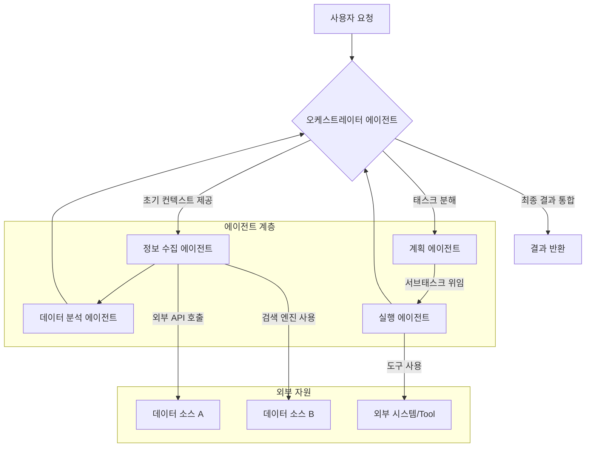

복잡한 문제의 해결은 단일 AI 에이전트의 역량을 넘어서는 경우가 많습니다. 이러한 한계를 극복하기 위해 여러 에이전트가 협력하고 조정되는 멀티 에이전트 시스템(Multi-Agent System, MAS)은 필수적인 설계 패턴으로 부상하고 있습니다. MAS는 각 에이전트가 특정 전문성과 역할을 가지고 상호작용하며 전체 시스템의 목표를 달성하도록 설계됩니다. 이는 모듈성, 확장성, 그리고 복잡한 환경에서의 견고성을 제공합니다. 특히 2026년 현재, 생성형 AI의 발전과 함께 에이전트의 자율성과 능력치가 크게 향상되면서, MAS는 더욱 정교하고 동적인 설계가 요구됩니다. 시스템 엔지니어링의 관점에서 MAS는 분산 시스템의 특성을 공유하며, 효율적인 통신, 조정, 그리고 충돌 해결 메커니즘이 핵심 성공 요인입니다.

## 멀티 에이전트 시스템의 핵심 설계 원칙

멀티 에이전트 시스템을 효과적으로 설계하기 위해서는 다음과 같은 핵심 원칙들을 고려해야 합니다.

### 1. 에이전트 역할 정의 (Agent Role Definition)
각 에이전트는 명확하고 고유한 역할을 가져야 합니다. 이는 시스템의 모듈성을 높이고, 각 에이전트가 특정 태스크에 집중하여 전문성을 발휘하도록 돕습니다. 예를 들어, 정보 수집 에이전트, 분석 에이전트, 의사 결정 에이전트, 실행 에이전트 등으로 역할을 분리할 수 있습니다. 역할 정의는 시스템의 복잡성을 관리하고, 에이전트 간의 책임 분리를 명확하게 합니다.

### 2. 통신 메커니즘 (Communication Mechanisms)
에이전트 간의 효율적인 정보 교환은 MAS의 성공에 필수적입니다. 통신 방식은 다음과 같은 요소를 고려합니다:
*   **메시지 전달 (Message Passing)**: 비동기 또는 동기 방식으로 에이전트 간에 구조화된 메시지를 교환합니다. 표준화된 프로토콜(예: FIPA ACL)을 사용하면 상호운용성을 높일 수 있습니다.
*   **공유 메모리/환경 (Shared Memory/Environment)**: 에이전트들이 접근하고 수정할 수 있는 공통 데이터 스페이스를 통해 상호작용합니다. 이는 간단한 시스템에 적합하지만, 동시성 제어가 중요합니다.
*   **브로드캐스트 (Broadcast)**: 특정 에이전트가 아닌 전체 시스템에 메시지를 전파합니다. 중요도가 낮은 정보나 긴급 상황 알림에 유용합니다.

### 3. 조정 및 협업 전략 (Coordination and Collaboration Strategies)
에이전트들이 공동의 목표를 향해 효율적으로 협력하도록 하는 전략입니다:
*   **중앙 집중식 조정 (Centralized Coordination)**: 중앙 오케스트레이터(Orchestrator) 에이전트가 모든 에이전트의 활동을 조율하고 자원을 할당합니다. 구현이 비교적 쉽지만, 단일 실패점(Single Point of Failure)이 될 수 있습니다.
*   **분산형 조정 (Decentralized Coordination)**: 에이전트들이 자율적으로 상호작용하며 협상, 경매, 사회적 규범 등을 통해 조율합니다. 견고성과 확장성이 우수하지만, 복잡한 설계와 구현이 필요합니다.
*   **하이브리드 방식 (Hybrid Approach)**: 중앙 집중식과 분산형의 장점을 결합하여 특정 계층에서는 중앙 집중식으로, 다른 계층에서는 분산형으로 운영하는 방식입니다.

### 4. 지속성 및 기억 관리 (Persistence and Memory Management)
장기 실행 태스크나 학습이 필요한 MAS에서는 에이전트의 상태, 학습 결과, 경험 등을 지속적으로 저장하고 관리하는 메커니즘이 필요합니다. Persistent Memory, Knowledge Graph, RAG (Retrieval Augmented Generation) 패턴을 활용하여 에이전트의 의사 결정에 필요한 컨텍스트를 제공합니다.

### 5. 도구 사용 및 통합 (Tool Use and Integration)
각 에이전트는 외부 시스템(API, 데이터베이스, 웹 서비스 등)과 상호작용하기 위한 도구(Tools)를 활용합니다. 효과적인 도구 통합은 에이전트의 능력을 확장하고, 현실 세계의 문제를 해결할 수 있는 실질적인 역량을 부여합니다. 강력한 Tool Error Recovery 메커니즘은 필수적입니다.

## 멀티 에이전트 시스템의 상호작용 흐름



이 다이어그램은 사용자 요청을 중앙 오케스트레이터 에이전트가 받아, 이를 여러 전문 에이전트에게 분해하고 위임하는 과정을 보여줍니다. 각 에이전트는 자신의 역할에 따라 데이터를 수집하거나, 분석하거나, 특정 액션을 실행하며, 그 결과를 다시 오케스트레이터에게 보고합니다. 최종적으로 오케스트레이터는 이 모든 결과를 통합하여 사용자에게 응답합니다.

```python
# Python (Pseudocode) for a Multi-Agent System Orchestrator

class Agent:
    def __init__(self, name, capabilities):
        self.name = name
        self.capabilities = capabilities
        self.memory = [] # Simple episodic memory

    def perceive(self, stimulus):
        # Simulate agent perception of environment/messages
        self.memory.append(stimulus)
        print(f"[{self.name}] Perceived: {stimulus}")

    def act(self, task, context):
        # Simulate agent action based on task and context
        if task == "search_info":
            return self._search_web(context)
        elif task == "analyze_data":
            return self._perform_analysis(context)
        elif task == "execute_action":
            return self._trigger_tool(context)
        else:
            return f"Unsupported task: {task}"

    def _search_web(self, query):
        print(f"[{self.name}] Searching web for: {query}")
        # Call external search tool API
        return f"Search results for '{query}'"

    def _perform_analysis(self, data):
        print(f"[{self.name}] Analyzing data: {data}")
        # Call analytical model or tool
        return f"Analysis report on '{data}'"

    def _trigger_tool(self, action_params):
        print(f"[{self.name}] Executing action with tool: {action_params}")
        # Call specific external tool
        return f"Action '{action_params}' completed"

class Orchestrator:
    def __init__(self):
        self.agents = {
            "planner": Agent("Planner", ["plan_task"]),
            "information_gatherer": Agent("InfoGatherer", ["search_info"]),
            "data_analyzer": Agent("Analyzer", ["analyze_data"]),
            "executor": Agent("Executor", ["execute_action"])
        }

    def process_request(self, request):
        print(f"\nOrchestrator received request: {request}")
        
        # Step 1: Planning
        planning_context = f"Break down '{request}' into subtasks."
        plan = self.agents["planner"].act("plan_task", planning_context)
        print(f"Orchestrator plan: {plan}")

        # Simulate dynamic subtask delegation based on 'plan'
        # For simplicity, hardcode a flow here
        
        # Step 2: Information Gathering
        info_query = f"Needed info for: {request}"
        info = self.agents["information_gatherer"].act("search_info", info_query)
        print(f"Orchestrator gathered info: {info}")

        # Step 3: Data Analysis
        analysis_result = self.agents["data_analyzer"].act("analyze_data", info)
        print(f"Orchestrator analyzed data: {analysis_result}")

        # Step 4: Execution (if needed)
        action_to_take = f"Implement based on {analysis_result}"
        execution_status = self.agents["executor"].act("execute_action", action_to_take)
        print(f"Orchestrator execution status: {execution_status}")
        
        final_result = f"Completed processing for '{request}'. Analysis: {analysis_result}. Action: {execution_status}"
        print(f"Orchestrator final result: {final_result}")
        return final_result

# Example usage
orchestrator = Orchestrator()
orchestrator.process_request("Analyze market trends for Q3 2026 and recommend investment strategies.")
```

## 트레이드오프

멀티 에이전트 시스템 설계에는 여러 장점과 단점이 공존하며, 프로젝트의 특성과 요구사항에 따라 적절한 트레이드오프를 고려해야 합니다.

*   **복잡성 vs. 확장성 및 견고성**: MAS는 단일 에이전트 시스템보다 설계 및 디버깅이 훨씬 복잡합니다. 하지만 이러한 복잡성을 감수하면 시스템은 개별 에이전트의 실패에도 불구하고 전체적으로 안정적으로 작동하며(견고성), 새로운 기능을 에이전트 추가로 쉽게 확장할 수 있습니다(확장성).
    *   **언제 좋고**: 높은 가용성과 유연한 기능 확장이 필수적인 대규모 엔터프라이즈 시스템이나 동적 환경에서 효과적입니다.
    *   **언제 나쁜지**: 빠른 프로토타이핑이나 기능이 고정적이고 변경 가능성이 낮은 소규모 단일 태스크 시스템에는 과도한 오버헤드가 발생할 수 있습니다.

*   **통신 오버헤드 vs. 모듈성 및 책임 분리**: 에이전트 간의 통신은 네트워크 지연 및 메시지 처리 비용을 발생시켜 시스템의 전반적인 성능에 영향을 줄 수 있습니다. 반면, 명확한 통신 프로토콜을 통해 각 에이전트는 독립적인 모듈로 개발 및 배포될 수 있으며, 이는 개발 효율성과 유지보수성을 크게 향상시킵니다.
    *   **언제 좋고**: 각 컴포넌트의 독립적인 개발과 배포가 중요하며, 팀 간의 협업이 필요한 대규모 개발 프로젝트에 적합합니다.
    *   **언제 나쁜지**: 실시간 응답 속도가 매우 중요하고, 에이전트 간의 데이터 전송량이 방대한 시스템에서는 통신 오버헤드가 병목 현상을 일으킬 수 있습니다.

*   **자원 관리 복잡성 vs. 병렬 처리 및 효율성**: 여러 에이전트가 동시에 실행되면서 자원 경합 및 효율적인 자원 할당 문제가 발생할 수 있습니다. 그러나 이를 잘 관리하면, 여러 태스크를 병렬로 처리하여 전체 처리 시간을 단축하고, 특정 자원을 필요로 하는 에이전트에게 유연하게 자원을 할당함으로써 시스템의 효율성을 극대화할 수 있습니다.
    *   **언제 좋고**: 다양한 유형의 컴퓨팅 자원(GPU, CPU, 특정 하드웨어)을 효율적으로 활용해야 하거나, 동시다발적인 태스크 처리가 요구되는 AI 워크로드에 유리합니다.
    *   **언제 나쁜지**: 자원이 제한적이거나, 태스크가 순차적으로만 처리될 수 있는 환경에서는 자원 관리의 복잡성만 증가시킬 수 있습니다.

## 실전 체크리스트

멀티 에이전트 시스템을 프로젝트에 적용하기 전, 다음 체크리스트를 통해 시스템의 견고성과 효율성을 검증하세요.

*   [ ] **명확한 에이전트 역할 정의**: 각 에이전트의 책임과 기능이 명확히 분리되었는가? (예: `PlanningAgent`, `ExecutionAgent`, `ReviewAgent`)
*   [ ] **표준화된 통신 프로토콜 구현**: 에이전트 간 메시지 형식 및 전달 방식이 표준화되어 상호운용성을 보장하는가? (`JSON` 기반의 `Agent Communication Language` 사용 등)
*   [ ] **견고한 오류 처리 및 복구 메커니즘**: 개별 에이전트 또는 통신 채널에 오류가 발생했을 때 시스템이 안정적으로 복구되는가? (`retry logic`, `dead-letter queue` 등)
*   [ ] **확장 가능한 조정 전략 설계**: 에이전트 수가 증가할 때 시스템의 성능 저하 없이 효율적으로 조정되는가? (중앙 오케스트레이터의 부하 분산 전략 또는 분산 조정 패턴 적용)
*   [ ] **지속적인 메모리 및 컨텍스트 관리**: 장기 실행 태스크에서 에이전트가 과거의 정보를 효과적으로 활용하고 의사 결정에 반영하는가? (`VectorDB` 기반의 `Persistent Memory` 시스템 확인)
*   [ ] **보안 도구 사용 및 접근 제어**: 에이전트가 외부 도구를 사용할 때 보안 취약점 없이 안전하게 접근하고 통제되는가? (강력한 `API Key Management`, `Sandbox Isolation` 적용)
*   [ ] **모니터링 및 로깅 시스템 구축**: 각 에이전트의 행동, 통신 내용, 성능 지표를 실시간으로 모니터링하고 추적할 수 있는가? (`Observability` 도구 통합)