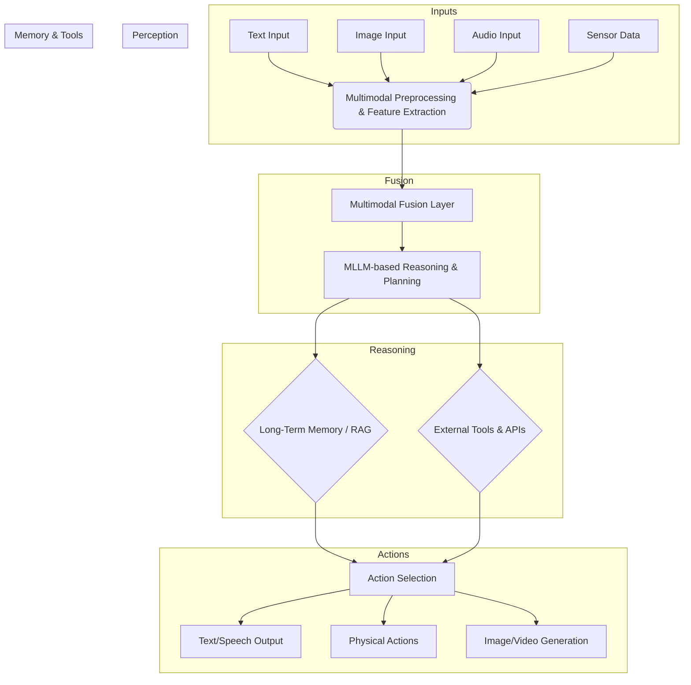

멀티모달 에이전트 시스템(Multimodal Agent Systems)은 텍스트, 이미지, 오디오, 비디오, 센서 데이터 등 다양한 형태의 정보를 동시에 이해하고 추론하며 상호작용하는 인공지능 엔티티를 의미한다. 이는 단일 모드(unimodal) AI의 한계를 넘어서 인간과 유사한 방식으로 세상을 인식하고 복합적인 문제를 해결하는 데 필수적인 요소이다. 2026년 기준, 멀티모달 Large Language Model (MLLM)의 발전과 온디바이스 AI(On-device AI)의 확산은 이러한 에이전트의 설계 및 구현을 더욱 가속화하고 있다. 궁극적으로 멀티모달 에이전트는 더욱 풍부하고 맥락적인 이해를 바탕으로 복잡한 현실 세계의 시나리오에서 효율적인 의사결정과 액션(action)을 수행한다.

## 멀티모달 에이전트 시스템 아키텍처

멀티모달 에이전트 시스템의 핵심은 다양한 모달리티(modality)에서 들어오는 정보를 효과적으로 수집, 처리, 융합(fusion)하고, 이를 바탕으로 일관된 추론과 의사결정을 수행하는 것이다. 일반적인 아키텍처는 다음과 같은 주요 컴포넌트로 구성된다.

### 1. 멀티모달 인지(Multimodal Perception) 모듈

각 모달리티별로 데이터를 수집하고 전처리하며 특징을 추출하는 역할을 한다. 여기에는 각 데이터 유형에 최적화된 모델(예: 이미지용 Vision Transformer, 오디오용 Audio Spectrogram Transformer, 텍스트용 LLM 임베딩)이 활용된다.

### 2. 융합(Fusion) 계층

인지 모듈에서 추출된 각 모달리티별 특징을 통합하여 통일된 표현(unified representation)을 생성하는 핵심 계층이다. 융합 전략은 크게 세 가지로 나뉜다.

*   **초기 융합 (Early Fusion)**: 각 모달리티의 원시 데이터(raw data)나 저수준 특징(low-level features)을 결합한 후 단일 모델에 입력한다. 데이터 손실이 적지만, 이질적인 데이터 간의 직접적인 결합이 어려울 수 있다.
*   **후기 융합 (Late Fusion)**: 각 모달리티별로 독립적으로 특징을 추출하고 추론을 수행한 후, 최종 단계에서 각 모달리티의 예측 결과나 고수준 특징(high-level features)을 결합하여 최종 결정을 내린다. 모듈성이 높고 각 모달리티 모델의 강점을 활용하기 용이하다.
*   **하이브리드 융합 (Hybrid Fusion)**: 초기 융합과 후기 융합의 장점을 결합한 방식으로, 중간 계층에서 여러 모달리티의 특징을 점진적으로 통합한다. MLLM은 임베딩 단계에서 다양한 모달리티를 통합하여 처리하는 형태로 볼 수 있다.

### 3. 추론 및 의사결정(Reasoning & Decision-Making) 엔진

융합된 멀티모달 표현을 기반으로 복잡한 추론을 수행하고 에이전트의 다음 행동을 결정하는 부분이다. 최신 MLLM이 이 역할을 담당하며, 외부 도구(tools) 사용, 장기 기억(long-term memory) 접근, 계획(planning) 수립 등을 포함한다.

### 4. 액션 및 상호작용(Action & Interaction) 모듈

추론 엔진의 결정에 따라 실제 세계에서 행동하거나 사용자에게 응답을 생성하는 부분이다. 텍스트, 음성, 이미지 생성은 물론, 로봇 팔 제어, 스마트 홈 기기 작동 등 다양한 형태로 나타날 수 있다.

### 5. 메모리 및 지식 베이스(Memory & Knowledge Base)

에이전트의 경험, 학습된 지식, 외부 정보를 저장하고 관리하는 시스템이다. 멀티모달 정보 검색(Multimodal RAG)이 중요하며, 텍스트, 이미지, 오디오 등 다양한 형식의 지식을 저장하고 필요에 따라 검색하여 추론에 활용한다.

## 멀티모달 에이전트 시스템 흐름도



## 멀티모달 에이전트 코드 예제 (Python)

다음은 가상의 멀티모달 LLM과 도구(tool) 사용을 포함하는 간략한 Python 코드 예제이다. 이 예제는 에이전트가 텍스트 명령과 이미지를 받아 이미지 내용을 분석하고 적절한 응답을 생성하는 흐름을 보여준다.

```python
import base64
from io import BytesIO
from PIL import Image

# 가상의 Multimodal LLM 클래스
class MultimodalLLM:
    def __init__(self, model_name="multimodal-agent-v1"):
        self.model_name = model_name

    def invoke(self, prompt: str, image_data: str = None, audio_data: str = None, tools: list = None) -> str:
        print(f"[LLM] Invoking {self.model_name} with prompt: '{prompt}'")
        if image_data:
            print("[LLM] Image data detected.")
        if audio_data:
            print("[LLM] Audio data detected.")
        if tools:
            print(f"[LLM] Available tools: {', '.join([t.__name__ for t in tools])}")

        # 가상의 추론 로직
        if image_data and "identify objects" in prompt.lower():
            image = Image.open(BytesIO(base64.b64decode(image_data)))
            # 실제로는 이미지 분석 도구를 호출하거나 LLM 내부에서 처리
            return f"Based on the image, I identify a {ImageAnalyzer.analyze_objects(image)}. The prompt was: {prompt}"
        elif "summarize" in prompt.lower() and image_data:
            return "The image likely contains natural scenery. (Summary based on hypothetical image understanding)"
        elif "weather" in prompt.lower() and ExternalWeatherTool in tools:
            weather_info = ExternalWeatherTool.get_current_weather("Seoul")
            return f"Current weather in Seoul: {weather_info}"
        return f"I processed your request: '{prompt}'. No specific multimodal action taken."

# 가상의 이미지 분석 도구
class ImageAnalyzer:
    @staticmethod
    def analyze_objects(image: Image.Image) -> str:
        # 실제로는 객체 탐지 모델 호출
        # 간단한 예시로 이미지 크기에 따라 다른 객체 반환
        if image.width > 500:
            return "large landscape with trees"
        else:
            return "small object on a desk"

# 가상의 외부 도구
class ExternalWeatherTool:
    @staticmethod
    def get_current_weather(location: str) -> str:
        return f"25°C and sunny in {location}"

# 이미지 파일을 base64로 인코딩하는 헬퍼 함수
def encode_image_to_base64(image_path: str) -> str:
    with open(image_path, "rb") as img_file:
        return base64.b64encode(img_file.read()).decode('utf-8')

# --- 에이전트 실행 --- #
llm = MultimodalLLM()

# 예시 이미지 (가상의 이미지 경로)
# 실제 사용 시에는 적절한 이미지 파일 경로를 지정해야 함
try:
    with open("sample_image.jpg", "wb") as f:
        f.write(base64.b64decode("iVBORw0KGgoAAAANSUhEUgAAAAEAAAABCAQAAAC1HAwCAAAAC0lEQVR42mNkYAAAAAYAAjCB0C8AAAAASUVORK5CYII=")) # 1x1 투명 이미지
    sample_image_base64 = encode_image_to_base64("sample_image.jpg")
except FileNotFoundError:
    sample_image_base64 = None # 이미지 파일이 없을 경우

# 텍스트 및 이미지 입력
print("\n--- Scenario 1: Identify objects in image ---")
response_1 = llm.invoke(
    prompt="Identify objects in this image.",
    image_data=sample_image_base64
)
print(response_1)

# 텍스트 입력만으로 외부 도구 사용
print("\n--- Scenario 2: Check weather with tool ---")
response_2 = llm.invoke(
    prompt="What is the weather like in Seoul?",
    tools=[ExternalWeatherTool]
)
print(response_2)

# 텍스트와 이미지 입력, 그리고 도구 사용이 결합된 시나리오
print("\n--- Scenario 3: Summarize image content and check weather ---")
response_3 = llm.invoke(
    prompt="Summarize the content of the image and then tell me the weather in Seoul.",
    image_data=sample_image_base64,
    tools=[ExternalWeatherTool]
)
print(response_3)
```

## 트레이드오프

멀티모달 에이전트 시스템 설계에는 여러 중요한 트레이드오프가 존재한다.

*   **복잡성 vs. 성능**: 초기 융합은 잠재적으로 더 풍부한 정보 통합을 제공하여 성능 향상에 기여하지만, 이질적인 모달리티 데이터를 단일 모델에 통합하는 복잡성이 매우 높다. 반면 후기 융합은 설계 복잡성은 낮지만, 초기 단계에서 모달리티 간의 미묘한 상호작용 정보가 손실될 수 있다.
    *   **언제 좋은가**: 높은 성능이 critical하고 데이터 통합 기술 스택이 성숙하다면 초기 융합이 유리하다. 모듈화된 개발 및 유지보수가 중요하고 각 모달리티별 모델 성능을 독립적으로 최적화해야 할 때는 후기 융합이 적합하다.
*   **데이터 이질성 vs. 통일된 표현**: 다양한 모달리티 데이터를 처리하려면 각 데이터의 특성을 살리면서도 공통된 벡터 공간으로 매핑하는 것이 중요하다. 그러나 너무 이질적인 데이터를 강제로 통합하면 표현력이 저하될 수 있다.
    *   **언제 좋은가**: MLLM과 같이 다중 모드 데이터를 직접적으로 처리할 수 있는 모델을 사용하는 경우 통일된 표현 생성이 용이하다. 기존의 단일 모드 모델을 재활용해야 하는 경우 데이터 이질성 처리에 더 많은 설계 노력이 필요하다.
*   **실시간 처리 vs. 정확도**: 자율주행, 로봇 제어와 같은 애플리케이션에서는 낮은 지연 시간(low latency)이 필수적이지만, 멀티모달 데이터 처리 및 융합은 계산 비용이 높아 지연 시간을 증가시킬 수 있다.
    *   **언제 좋은가**: 사용자 응답 속도가 중요한 대화형 에이전트에서는 효율적인 모델(예: 경량 MLLM, on-device AI)과 최적화된 융합 전략이 요구된다. 비동기 처리나 배치(batch) 처리가 가능한 백엔드 분석 시스템에서는 정확도에 더 집중할 수 있다.
*   **비용 효율성 vs. 기능성**: 고성능 멀티모달 모델은 GPU 자원을 많이 소모하고 API 호출 비용이 높을 수 있다. 반면, 경량 모델은 기능적 제약이 있을 수 있다.
    *   **언제 좋은가**: 상업적 서비스나 대규모 배포 시에는 추론 비용과 성능 간의 균형이 중요하다. 프로토타이핑이나 연구 단계에서는 최신 고성능 모델을 사용하여 기능성을 최대한 탐색하는 것이 유리하다.

## 실전 체크리스트

멀티모달 에이전트 시스템을 프로젝트에 적용할 때 다음 항목들을 검증한다.

*   - [ ] 각 모달리티별 데이터 수집 및 전처리 파이프라인이 안정적으로 작동하며, 데이터 품질 기준을 충족하는가?
*   - [ ] 선택된 융합 전략(early, late, hybrid)이 애플리케이션의 성능 요구사항과 데이터 특성에 적합하게 설계되었으며, 그 효과가 벤치마킹을 통해 검증되었는가?
*   - [ ] 에이전트의 추론 및 의사결정 엔진이 멀티모달 입력을 바탕으로 복합적인 의도를 정확히 이해하고 적절한 액션을 계획하는가?
*   - [ ] 에이전트의 장기 기억 및 지식 베이스가 멀티모달 정보를 효율적으로 저장, 검색, 활용하며, 최신 정보를 반영하는 업데이트 메커니즘을 갖추었는가?
*   - [ ] 시스템 전반의 지연 시간(latency)이 최종 사용자 경험 또는 실시간 제어 요구사항을 충족하는가? (예: `평균 응답 시간 < 500ms`)
*   - [ ] 각 모달리티별 입력에 대한 에러 처리 및 복구 메커니즘이 구현되어, 부분적인 입력 실패에도 시스템이 견고하게 작동하는가?
*   - [ ] 에이전트의 멀티모달 상호작용이 예상치 못한 편향(bias)이나 윤리적 문제를 일으키지 않도록 안전성 및 책임성 가이드라인이 통합되었는가?