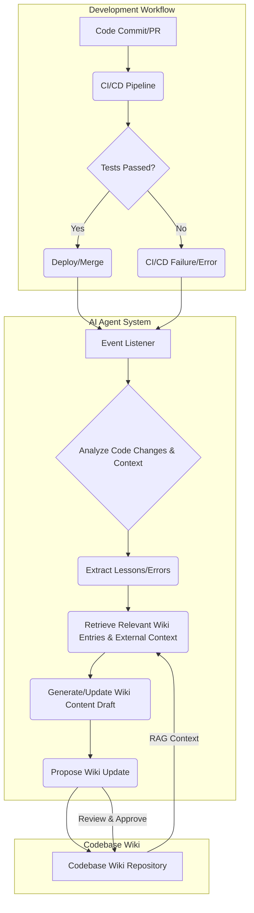

## 진화하는 코드베이스 위키: AI 에이전트 연동 전략

정적 코드 문서는 급변하는 소프트웨어 개발에서 빠르게 노후화되며, 이는 개발 생산성 저하와 지식 사일로를 야기합니다. 진화하는 코드베이스 위키는 AI 에이전트가 코드 변경 사항을 자동으로 감지하고 학습하며 문서화함으로써, 위키의 지식이 코드베이스와 함께 숨 쉬도록 합니다. 이 시스템은 Karpathy의 LLM Wiki 패턴을 확장하여 워커 에이전트의 경험(lessons)과 오류(errors)를 통해 위키가 스스로 업데이트되고, 외부 컨텍스트까지 통합하여 지식을 확장합니다.

### 코드베이스 위키의 동적 진화 메커니즘

핵심 아이디어는 코딩 에이전트를 코드베이스 변경 주기에 깊이 통합하는 것입니다. 에이전트는 Git 커밋, Pull Request(PR), 이슈, CI/CD 실패 로그를 지속적으로 모니터링합니다. 이러한 이벤트에서 코드 변경, 문제 발생 및 해결 과정에 대한 '교훈(lesson)'이나 '오류(error)' 데이터를 추출합니다.

1.  **지식 허브로서의 Wiki**: Karpathy LLM Wiki 패턴은 마크다운 파일 형태의 지식 단위를 담습니다. 각 파일은 함수, 모듈, 아키텍처 패턴, 디버깅 가이드 등 고유한 지식을 나타냅니다.
2.  **코딩 에이전트의 역할**:
    *   **변경 감지 및 분석**: 에이전트는 Git 훅 또는 CI/CD 통합을 통해 코드 변경을 수신하고, 관련 위키 엔트리에 미치는 영향을 분석합니다.
    *   **Lesson/Error Dispatch**: 개발자의 반복적인 문제, 성공적인 해결책, CI/CD 실패 등을 에이전트가 'Lesson' 또는 'Error'로 추출합니다. 이 데이터는 위키 업데이트의 핵심 입력이 됩니다.
    *   **콘텐츠 생성 및 업데이트**: 추출된 Lesson/Error 기반으로 새로운 위키 엔트리를 초안하거나 기존 엔트리를 업데이트하는 마크다운 콘텐츠를 생성합니다.
    *   **외부 컨텍스트 활용**: 필요에 따라 에이전트는 외부 소스(예: Stack Overflow, 라이브러리 문서)에서 관련 정보를 검색하고, RAG(Retrieval Augmented Generation) 패턴을 활용해 자체적으로 통합하여 풍부한 정보를 제공합니다.
3.  **지속적인 진화**: 에이전트가 제안한 위키 업데이트는 개발자 검토 또는 자동 반영을 거쳐 위키에 반영됩니다. 이 피드백 루프는 위키 정확성과 에이전트 문서화 능력을 향상시킵니다.

### 시스템 아키텍처 예시

다음 Mermaid 다이어그램은 코딩 에이전트 기반 코드베이스 위키의 진화 워크플로우를 보여줍니다.



### 코드 예제: Lesson 추출 및 위키 제안 (Python)

이 예제는 CI/CD 로그에서 특정 오류 패턴을 감지하고, 위키 업데이트를 제안하는 에이전트의 개념적인 동작을 보여줍니다.

```python
import os
from datetime import datetime

class WikiAgent:
    def __init__(self, wiki_repo_path="codebase-wiki"):
        self.wiki_repo_path = wiki_repo_path
        os.makedirs(wiki_repo_path, exist_ok=True)

    def analyze_ci_log(self, log_content: str) -> list:
        lessons_or_errors = []
        if "ModuleNotFoundError" in log_content and "pip install" not in log_content:
            lessons_or_errors.append({
                "type": "Error",
                "title": "ModuleNotFoundError with Missing Dependency",
                "description": "`ModuleNotFoundError` detected; missing `pip install` step.",
                "keywords": ["Python", "ModuleNotFoundError", "Dependency", "CI/CD"],
                "solution_hint": "Ensure `requirements.txt` is updated and `pip install -r` is run.",
                "affected_files": ["ci_pipeline.yml", "requirements.txt"]
            })
        if "def new_utility_function" in log_content:
             lessons_or_errors.append({
                "type": "Lesson",
                "title": "New Utility Function for Data Transformation",
                "description": "New data transformation utility added. Document usage.",
                "keywords": ["Python", "Utility", "Data Transformation"],
                "affected_files": ["src/utils.py"]
            })
        return lessons_or_errors

    def generate_wiki_proposal(self, event_data: dict) -> str:
        event_type = event_data["type"]
        title = event_data["title"]
        description = event_data["description"]
        keywords = ", ".join(event_data["keywords"])
        solution_hint = event_data.get("solution_hint", "N/A")
        affected_files = ", ".join(event_data["affected_files"])
        timestamp = datetime.now().strftime("%Y-%m-%d %H:%M:%S")

        markdown_content = f"""---
title: {title}
tags: [{keywords}]
date: {timestamp}
---

## {title}

### 개요
{description}

### 발생 원인
이 {event_type.lower()}는 `{affected_files}`와 관련됩니다.

### 권장 해결책 / 모범 사례
{solution_hint}
---
"""
        return markdown_content

    def propose_update(self, event_data: dict):
        markdown = self.generate_wiki_proposal(event_data)
        slug_title = event_data["title"].lower().replace(" ", "-").replace("/", "-").replace("`", "")
        filename = f"{self.wiki_repo_path}/{slug_title}.md"
        with open(filename, "w", encoding="utf-8") as f:
            f.write(markdown)

# Example Usage (conceptual)
agent = WikiAgent()
ci_failure_log = "ModuleNotFoundError: No module named 'requests'" # Shortened log
ci_success_log = "Adding def new_utility_function to handle data." # Shortened log

for error in agent.analyze_ci_log(ci_failure_log):
    agent.propose_update(error)
for lesson in agent.analyze_ci_log(ci_success_log):
    agent.propose_update(lesson)
```
이 코드는 실제 에이전트 시스템에서 LLM 기반 분석, 지식 그래프 검색, 외부 RAG 통합이 이루어질 수 있음을 보여주는 단순화된 예시입니다. 2026년에는 에이전트가 코드베이스의 의미론적 이해를 바탕으로 더욱 심층적인 교훈을 추출하고 다국어 문서화를 지원할 것입니다.

## 트레이드오프

진화하는 코드베이스 위키 시스템 구축에는 몇 가지 트레이드오프가 존재합니다.

*   **자동화 수준 vs. 신뢰성 및 제어**:
    *   **언제 좋은가**: 에이전트가 높은 정확도로 업데이트를 생성하고, 반복적이고 예측 가능한 문서화 작업에서 개발자 수고를 크게 줄일 때. 신뢰도 높은 코드 영역에 적합합니다.
    *   **언제 나쁜가**: 에이전트 생성 품질이 낮거나 중요한 설계 결정이 포함된 문서의 경우, 잘못된 정보 반영 위험. 인간 검토가 필수적이므로 자동화 이점이 상쇄됩니다.

*   **외부 컨텍스트 통합 vs. 복잡성 및 비용**:
    *   **언제 좋은가**: 코드베이스 내부 정보만으로 부족하고, 외부 라이브러리/프레임워크/일반 개발 패턴 지식이 필요한 경우 위키 질 향상에 기여. 빠르게 변화하는 기술 스택에 유용합니다.
    *   **언제 나쁜가**: 외부 컨텍스트 검색 및 통합은 추가 Latency, 컴퓨팅 자원, API 비용 발생. 외부 정보의 신뢰성과 최신성 검증 메커니즘 부재 시 위키 품질 저하 위험.

*   **지식의 최신성 vs. 위키의 안정성**:
    *   **언제 좋은가**: 빠르게 진화하는 마이크로서비스 아키텍처나 라이브러리 개발에서, 위키가 항상 최신 코드와 동기화되어야 할 때. 수동 문서화 부담을 덜어줍니다.
    *   **언제 나쁜가**: 문서화된 내용이 빈번하게 변경되어 개발자들이 혼란을 겪거나, 중요한 아키텍처 문서가 잘못된 업데이트로 인해 불필요하게 변경될 위험. 핵심 정보는 안정성을 유지해야 합니다.

*   **초기 구축 비용 vs. 장기적 유지보수 효율**:
    *   **언제 좋은가**: 대규모 코드베이스 장기 유지보수, 높은 온보딩 비용을 가진 팀에서 문서화 프로세스 효율성 극대화 시 큰 ROI 제공.
    *   **언제 나쁜가**: 초기 에이전트 시스템 구축, 훈련, 워크플로우 통합에 상당한 시간과 리소스 필요. 소규모/단기 프로젝트는 초기 투자 대비 효과를 보지 못할 수 있습니다.

## 실전 체크리스트

프로젝트에 코딩 에이전트 기반 진화하는 코드베이스 위키 시스템을 적용할 때 다음 항목들을 검증합니다.

*   - [ ] **코드 변경 감지 메커니즘 설정**: Git 훅, CI/CD 통합 등을 통해 코드 커밋/PR 이벤트를 에이전트가 안정적으로 감지하고 분석하는가?
*   - [ ] **Lesson/Error 추출 정책 정의**: 위키 업데이트를 위한 'Lesson' 또는 'Error'로 분류될 코드 변경, CI/CD 결과, 런타임 오류에 대한 명확한 규칙이 수립되었는가?
*   - [ ] **에이전트 생성 문서 품질 기준**: 에이전트가 생성하는 위키 문서의 최소 품질 기준(정확성, 일관성)이 정의되었으며, 자동 검증 가드레일이 존재하는가?
*   - [ ] **인간 검토 및 피드백 루프 구축**: 에이전트가 제안하는 위키 업데이트에 대한 인간 검토 프로세스가 마련되었고, 이 피드백이 에이전트 학습에 반영되는가?
*   - [ ] **외부 컨텍스트 RAG 통합 여부**: 외부 지식(예: 라이브러리 문서)을 검색하여 위키 콘텐츠를 보강하는 RAG 시스템이 효과적으로 연동되어 있는가?
*   - [ ] **위키 콘텐츠 버전 관리 및 롤백**: 위키 콘텐츠가 Git과 같은 버전 관리 시스템으로 관리되어 변경 이력 추적 및 필요한 롤백이 가능한가?
*   - [ ] **성능 및 비용 모니터링**: 에이전트의 실행 주기, Latency, API 사용 비용 등 시스템의 전반적인 성능과 비용을 지속적으로 모니터링하고 최적화하는 대시보드가 있는가?
