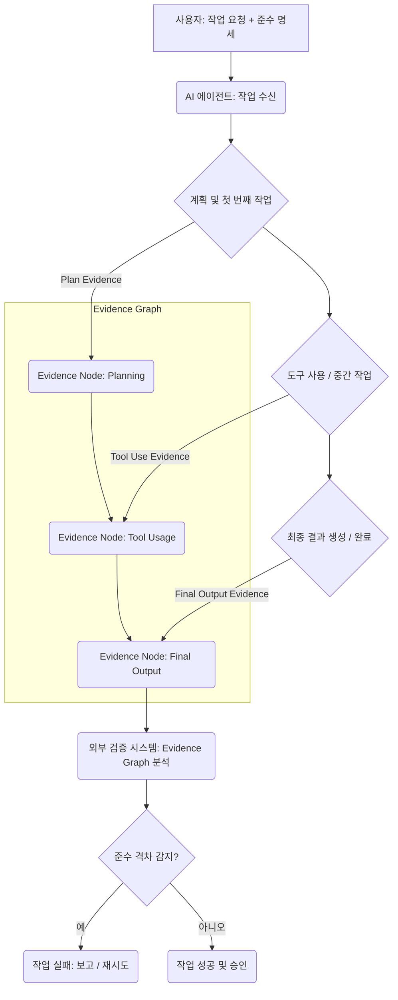

### AI 에이전트의 준수 격차와 Evidence Graph의 필요성

최신 AI 에이전트는 코드, 문서 생성 등 탁월한 성능을 보이지만, 여전히 주어진 명세(specifications)나 지침을 완전히 준수하지 못하는 '준수 격차(The Compliance Gap)' 문제를 겪습니다. 에이전트가 제약 조건을 무시하고 작업을 완료했다고 선언하는 상황은 프로덕션 환경에서 신뢰도를 저하시키고 예측 불가능한 결과를 초래합니다. Evidence Graph는 이 문제 해결을 위해 에이전트에 '증거 진술 의무(Duty of Evidence Declaration)'를 부여하는 개념입니다. 에이전트는 작업의 각 단계에서 판단 근거, 사용된 도구, 적용된 규칙 및 최종 결과가 지침을 어떻게 준수했는지에 대한 명시적인 '증거'를 생성하고 기록해야 합니다. 이 증거들은 연결된 그래프 형태로 저장되어 에이전트의 모든 작업 흐름을 투명하게 추적하고 검증 가능하게 합니다.

### Evidence Graph 작동 원리 및 기술적 구현

Evidence Graph는 에이전트의 실행 파이프라인에 통합되어, 에이전트가 작업을 수행하거나 결정을 내릴 때마다 행위에 대한 증거 객체(Evidence Object)를 생성합니다. 이 증거 객체는 행위, 관찰, 근거, 준수 조건, 그리고 이전 증거 ID(parent_evidence_id)를 포함합니다. 이 객체들은 Directed Acyclic Graph (DAG) 형태로 연결되어 에이전트의 인과 관계 체인을 형성합니다. 검증 시스템은 이 Evidence Graph를 분석하여 각 노드의 증거를 독립적으로 검증하고, 전체 작업의 준수 여부를 확인합니다.

다음은 Playbook의 AI 에이전트 하네스에 Evidence Graph를 통합하는 Python 예시입니다.

```python
import uuid
import json
from datetime import datetime

class EvidenceNode:
    def __init__(self, action: str, observation: dict, rationale: str, compliance_criteria: list, parent_id: str = None):
        self.id = str(uuid.uuid4())
        self.timestamp = datetime.utcnow().isoformat()
        self.action = action
        self.observation = observation
        self.rationale = rationale
        self.compliance_criteria = compliance_criteria
        self.parent_id = parent_id # Renamed for brevity

    def to_dict(self):
        return {
            "id": self.id, "timestamp": self.timestamp, "action": self.action,
            "observation": self.observation, "rationale": self.rationale,
            "compliance_criteria": self.compliance_criteria, "parent_id": self.parent_id
        }

class EvidenceGraphManager:
    def __init__(self):
        self.nodes = {}

    def add_node(self, node: EvidenceNode):
        self.nodes[node.id] = node

    def get_graph_json(self):
        return json.dumps([node.to_dict() for node in self.nodes.values()], indent=2, ensure_ascii=False)

class ComplianceAgent:
    def __init__(self, name: str, manager: EvidenceGraphManager, guidelines: dict):
        self.name = name
        self.manager = manager
        self.guidelines = guidelines
        self.last_evidence_id = None # Tracks the last generated evidence

    def perform_step(self, action: str, observation: dict, rationale: str, compliance_reqs: list):
        evidence = EvidenceNode(action, observation, rationale, compliance_reqs, self.last_evidence_id)
        self.manager.add_node(evidence)
        self.last_evidence_id = evidence.id
        return evidence.id

    def execute_task(self, task_description: str):
        # Initial planning step
        self.perform_step(
            "plan_task", {"task": task_description}, "Analyzing task and compliance needs.",
            [self.guidelines.get("overall_compliance")]
        )

        # Simulate a tool use step
        output = "Generated content adhering to policies."
        self.perform_step(
            "use_tool:content_gen", {"tool_output": output, "status": "success"},
            "Ensuring output adheres to content generation policies.",
            [self.guidelines.get("security_policy"), "content_policy:approved"]
        )

        # Final verification
        self.perform_step(
            "verify_output", {"final_output": output, "is_compliant": True},
            "Final check against task description and guidelines.",
            [self.guidelines.get("overall_compliance")]
        )
        return output

# Example Usage
manager = EvidenceGraphManager()
agent_guidelines = {
    "overall_compliance": "Task output must be accurate and safe.",
    "security_policy": "All data handling must be secure."
}
agent = ComplianceAgent("DocGenius", manager, agent_guidelines)
agent.execute_task("Create a secure document explaining data encryption.")

print(manager.get_graph_json())

```

### Mermaid Diagram: Evidence Graph 흐름



### Evidence Graph 도입의 이점

Evidence Graph는 AI 에이전트의 신뢰성과 투명성을 극대화하여 다음과 같은 이점을 제공합니다.

*   **준수 격차 해소**: 에이전트가 지침을 따르지 않을 경우, 어떤 단계에서 왜 준수하지 못했는지 명확한 증거를 통해 파악할 수 있습니다.
*   **투명성 및 설명 가능성**: 에이전트의 모든 결정과 행동에 대한 근거를 추적 가능하게 하여, 블랙박스 문제를 완화합니다.
*   **강화된 검증**: LLM 출력에 대한 단순한 검사를 넘어, 논리적이고 인과적인 증거 기반의 심층 검증을 가능하게 합니다.
*   **디버깅 및 문제 해결 용이성**: 실패 발생 시, Evidence Graph를 통해 문제의 원인이 된 특정 단계와 판단 근거를 신속하게 식별할 수 있습니다.
*   **감사 및 규제 준수**: 특정 규제(예: GDPR, SOC2) 준수 여부를 증명하는 데 필요한 상세한 기록을 제공합니다.

## 트레이드오프

Evidence Graph 개념을 AI 에이전트 시스템에 도입할 때 고려해야 할 트레이드오프는 다음과 같습니다.

*   **성능 오버헤드 (Performance Overhead) vs. 신뢰도 향상 (Increased Reliability)**
    *   **언제 좋은가**: 에이전트 작업이 높은 수준의 정확성, 규제 준수, 신뢰성 또는 안전성을 요구할 때 (예: 금융 거래 처리, 의료 진단 보조). 오버헤드 비용이 예상치 못한 오류로 인한 손실보다 적을 때 효과적입니다.
    *   **언제 나쁜가**: 실시간 처리 속도가 중요하고, 오류 영향이 미미하거나 자체 수정 메커니즘이 충분히 강력한 경우 (예: 간단한 정보 검색). 증거 생성 및 검증이 응답 시간을 현저히 저하시킬 수 있습니다.

*   **구현 복잡성 (Implementation Complexity) vs. 투명성 및 디버깅 용이성 (Transparency & Easier Debugging)**
    *   **언제 좋은가**: 복잡한 다단계 에이전트 시스템이나, 디버깅이 어렵고 실패 원인 파악에 많은 시간이 소요되는 경우 (예: 여러 도구를 연동하는 장기 실행 에이전트). 초기 구현 비용을 상쇄할 만큼 장기적인 유지보수 및 문제 해결 비용을 절감할 수 있습니다.
    *   **언제 나쁜가**: 단순하고 단일 목적의 에이전트, 또는 개발 주기가 매우 짧고 빠르게 프로토타이핑해야 하는 경우. Evidence Graph 구축 및 관리에 필요한 노력이 초기 개발 속도를 저해할 수 있습니다.

*   **데이터 저장 및 관리 비용 (Data Storage & Management Cost) vs. 감사 및 규제 준수 (Auditing & Regulatory Compliance)**
    *   **언제 좋은가**: 법적, 산업 표준 또는 내부 감사 요건이 엄격하여 에이전트의 모든 작업 기록과 판단 근거를 보존해야 하는 경우. 상당한 저장 공간과 관리 파이프라인(예: 노드 삭제, 압축)이 필요하지만, 규제 미준수 위험을 줄이는 데 기여합니다.
    *   **언제 나쁜가**: 증거 보존 의무가 없거나 데이터 보존 정책이 유연한 경우, 또는 에이전트 실행 빈도가 매우 높아 엄청난 양의 증거 데이터가 생성되는 경우. 운영 비용 증가로 이어질 수 있습니다.

## 실전 체크리스트

AI 에이전트에 Evidence Graph 개념을 도입할 때 다음 체크리스트를 활용하여 준비 상태를 검증합니다.

- [ ] **에이전트 작업 명세 정의**: 각 에이전트의 핵심 임무, 스킬즈 가이드라인, 준수해야 할 제약 조건을 명확하게 문서화했는가?
- [ ] **증거 객체 스키마 설계**: 어떤 정보(액션, 관찰, 근거, 준수 조건 등)를 증거로 수집할 것인지에 대한 표준화된 `EvidenceNode` 스키마를 정의하고, 모든 에이전트에서 일관되게 사용하도록 설계했는가?
- [ ] **증거 생성 로직 통합**: 에이전트의 핵심 실행 로직(예: 도구 호출 전후, 중요한 결정 시)에 `EvidenceNode`를 생성하고 `EvidenceGraphManager`에 추가하는 코드를 성공적으로 통합했는가?
- [ ] **Evidence Graph 저장소 구축**: 생성된 `EvidenceNode`들을 영구적으로 저장하고 검색할 수 있는 데이터베이스 또는 스토리지 시스템을 구축했는가?
- [ ] **자동화된 검증 시스템 개발**: Evidence Graph의 노드들을 순회하며 각 증거가 실제 지침에 따라 유효한지 검증하는 자동화된 `Verifier` 모듈을 개발하고 배포했는가?
- [ ] **준수 격차 알림 및 처리**: 자동화된 검증 시스템이 준수 격차를 감지했을 때, 관련 팀에 즉시 알리고 문제 해결 프로세스를 트리거하는 시스템을 구축했는가?
- [ ] **성능 영향 평가 및 최적화**: Evidence Graph 도입으로 인한 에이전트의 Latency 및 비용 증가를 측정하고, 필요한 경우 증거 생성 빈도 조절, 비동기 처리 등의 최적화 방안을 적용했는가?