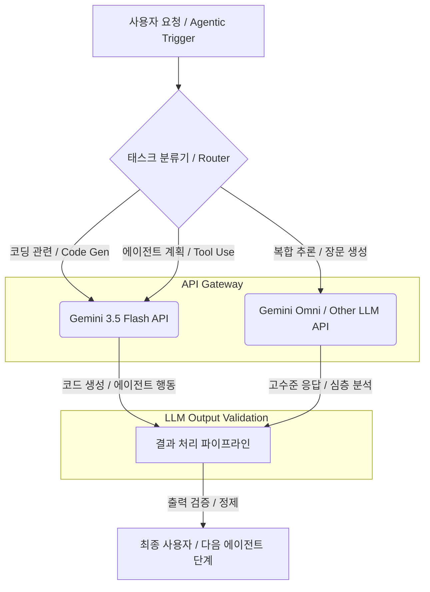

Gemini 3.5 Flash는 Google I/O 2026에서 발표된 최신 경량 모델로, 특히 에이전트(Agentic AI) 워크로드와 코딩 작업에 최적화되어 있습니다. 이 모델은 빠른 응답 속도와 비용 효율성을 강점으로 하며, 복잡한 자동화 파이프라인 및 개발자 생산성 도구에 통합될 때 높은 가치를 제공합니다. 기존 LLM 아키텍처에서 특정 전문화된 태스크를 Gemini 3.5 Flash로 오프로드함으로써 전체 시스템의 효율성과 경제성을 향상시킬 수 있습니다.

## Gemini 3.5 Flash의 핵심 특성

Gemini 3.5 Flash는 전반적인 성능과 비교하여 특히 다음 영역에서 강점을 보입니다.

### 고속 추론 및 비용 효율성
대규모 언어 모델(LLM)의 주요 제약 사항 중 하나는 추론 지연 시간(latency)과 운영 비용입니다. Gemini 3.5 Flash는 이러한 문제 해결에 중점을 둔 모델로, 더 작은 모델 크기와 최적화된 아키텍처를 통해 매우 빠른 응답 시간을 제공하며, 이는 실시간 에이전트 상호작용 및 빈번한 API 호출이 필요한 코딩 지원 도구에 필수적입니다. 더불어, 토큰 당 비용이 낮아 대량의 트래픽을 처리하는 애플리케이션에 경제적인 솔루션이 될 수 있습니다.

### 에이전트 워크로드 최적화
에이전트 시스템은 반복적인 계획, 실행, 피드백 루프를 통해 목표를 달성합니다. Gemini 3.5 Flash는 다음과 같은 에이전트 태스크에 특화되어 있습니다:

*   **Tool Use (도구 사용)**: 외부 API, 데이터베이스, 스크립트 등 다양한 도구를 효과적으로 호출하고 그 결과를 해석하는 능력.
*   **Planning (계획 수립)**: 복잡한 목표를 하위 태스크로 분해하고 실행 순서를 결정하는 논리적 추론.
*   **Reflection (반성)**: 이전 실행 단계의 오류를 분석하고 다음 행동을 개선하는 자기 수정 능력.

이러한 특성 덕분에 Gemini 3.5 Flash는 복잡한 멀티-에이전트 시스템에서 특정 전문 에이전트 역할을 수행하거나, 메인 오케스트레이터의 지시를 받아 경량 서브태스크를 처리하는 데 적합합니다.

### 코딩 및 개발자 지원 기능
코딩은 명확한 로직과 구조화된 출력을 요구하는 특화된 도메인입니다. Gemini 3.5 Flash는 코드 생성(Code Generation), 코드 리팩토링(Code Refactoring), 버그 디버깅 지원(Bug Debugging Assistance), 테스트 케이스 생성(Test Case Generation) 등 개발 워크플로우를 가속화하는 데 필요한 기능을 강화했습니다. 특히 `Claude Code harness`와 같은 기존 코드 기반 에이전트 시스템에 통합되어, 더 빠르고 효율적인 코드 관련 작업을 수행할 수 있습니다.

## Gemini 3.5 Flash를 활용한 LLM 라우팅 전략

기존의 LLM 워크플로우에 Gemini 3.5 Flash를 도입하는 것은 단순한 모델 교체를 넘어선 전략적 최적화를 의미합니다. 특정 태스크에 특화된 모델을 라우팅함으로써 전체 시스템의 성능과 비용 효율성을 극대화할 수 있습니다.



위 다이어그램은 Multi-LLM 라우팅 전략을 보여줍니다. `태스크 분류기 (Router)`는 들어오는 요청의 성격을 분석하여 가장 적합한 LLM으로 라우팅합니다. 예를 들어, 코드 스니펫 생성이나 특정 도구 호출 계획과 같은 명확하고 빠른 응답이 필요한 태스크는 `Gemini 3.5 Flash`로 보내지고, 복잡한 다단계 추론이나 장문의 창의적 콘텐츠 생성은 `Gemini Omni`와 같은 더 강력한 모델로 처리됩니다.

## 실제 적용 코드 예제: Python을 이용한 코드 스니펫 생성

다음은 Python에서 가상의 `gemini_api_client`를 사용하여 Gemini 3.5 Flash에 코딩 요청을 보내는 예제입니다. 이 예제는 특정 기능을 수행하는 Python 함수를 생성하도록 요청합니다.

```python
import os
# Hypothetical Gemini API client
# In a real scenario, this would be an official SDK or a custom wrapper
class GeminiApiClient:
    def __init__(self, api_key, model_name="gemini-3.5-flash"):
        self.api_key = api_key
        self.model_name = model_name
        # Initialize client with API key (placeholder)
        print(f"Initializing Gemini client for {self.model_name}...")

    def generate_code_snippet(self, prompt: str, temperature: float = 0.7) -> str:
        print(f"Sending code generation request to {self.model_name}...")
        # Simulate API call
        if "quick sort" in prompt.lower():
            return """def quick_sort(arr):
    if len(arr) <= 1:
        return arr
    pivot = arr[len(arr) // 2]
    left = [x for x in arr if x < pivot]
    middle = [x for x in arr if x == pivot]
    right = [x for x in arr if x > pivot]
    return quick_sort(left) + middle + quick_sort(right)
"""
        elif "fizzbuzz" in prompt.lower():
            return """def fizzbuzz(n):
    results = []
    for i in range(1, n + 1):
        if i % 15 == 0:
            results.append("FizzBuzz")
        elif i % 3 == 0:
            results.append("Fizz")
        elif i % 5 == 0:
            results.append("Buzz")
        else:
            results.append(str(i))
    return results
"""
        else:
            return f"# Code generation for '{prompt}' using {self.model_name}\n# (Actual code would be generated by the LLM)"

# Usage
api_key = os.getenv("GEMINI_API_KEY", "YOUR_GEMINI_API_KEY")
client = GeminiApiClient(api_key)

# Request to generate a quick sort function
code_prompt_1 = "Python으로 주어진 리스트를 정렬하는 quick sort 함수를 작성해줘."
snippet_1 = client.generate_code_snippet(code_prompt_1)
print("\n--- Generated Quick Sort Function ---")
print(snippet_1)

# Request to generate a FizzBuzz function
code_prompt_2 = "Python으로 FizzBuzz 게임을 구현하는 함수를 만들어줘. 1부터 n까지 숫자를 확인하고 3의 배수면 Fizz, 5의 배수면 Buzz, 15의 배수면 FizzBuzz를 출력해."
snippet_2 = client.generate_code_snippet(code_prompt_2)
print("\n--- Generated FizzBuzz Function ---")
print(snippet_2)
```

이 예제는 `GeminiApiClient` 클래스를 통해 Gemini 3.5 Flash 모델에 프롬프트를 전달하고, 코드 스니펫을 응답으로 받는 과정을 시뮬레이션합니다. 실제 환경에서는 API 키 관리, 오류 처리, 비동기 호출 등의 로직이 추가되어야 합니다.

## 트레이드오프

Gemini 3.5 Flash의 도입은 여러 가지 트레이드오프를 고려해야 합니다.

*   **성능 vs. 범용성**: Gemini 3.5 Flash는 에이전트 및 코딩 태스크에 최적화되어 빠른 속도와 낮은 비용을 제공합니다. 하지만 이는 광범위한 지식 추론, 복잡한 창의적 글쓰기, 또는 미묘한 뉘앙스를 요구하는 작업에서는 `Gemini Omni`와 같은 더 크고 강력한 모델보다 성능이 저조할 수 있습니다. 경량 모델의 장점이 극대화되는 시나리오 (예: 반복적인 짧은 코드 생성, 도구 호출 로직)에 적합하고, 심도 있는 분석이나 폭넓은 지식 탐색이 필요한 경우 (예: 복잡한 시스템 설계, 장문 보고서 작성)에는 다른 모델을 고려해야 합니다.

*   **비용 효율성 vs. 최상위 정확도**: 낮은 토큰 비용으로 대규모 워크로드를 처리하는 데 유리하지만, 코드 생성이나 에이전트 계획에서 미세한 오류나 비효율적인 결과가 발생할 가능성이 있습니다. 엄격한 정확도와 안전성이 최우선인 미션 크리티컬한 코딩 작업이나 에이전트 의사 결정 (예: 금융 거래 시스템)에서는 비용이 더 들더라도 최고 성능의 모델을 사용하고, 생성된 결과에 대한 `강력한 검증 파이프라인 (validation pipeline)`을 필수적으로 적용해야 합니다.

*   **빠른 개발 주기 vs. API 안정성**: 새로운 모델인 만큼 API 스펙이나 성능이 빠르게 개선될 수 있습니다. 이는 새로운 기능에 대한 빠른 접근을 가능하게 하지만, 동시에 API 변경으로 인한 기존 코드 수정 작업이 발생할 위험도 있습니다. 프로토타이핑 및 빠른 MVP 개발에는 유리하지만, 장기적인 프로덕션 시스템에서는 API 변경에 대한 예측 및 마이그레이션 전략이 중요합니다.

*   **컨텍스트 윈도우 크기 vs. 복잡성 처리**: Gemini 3.5 Flash는 효율적인 컨텍스트 윈도우를 제공하지만, 매우 방대한 코드베이스를 한 번에 분석하거나 장기적인 에이전트 메모리 관리(Long-Term Memory Management)가 필요한 경우 한계가 있을 수 있습니다. 따라서, `컨텍스트 압축 (Context Compaction)`이나 `RAG (Retrieval Augmented Generation)` 전략과 결합하여 컨텍스트 윈도우의 제약을 보완해야 합니다.

## 실전 체크리스트

Gemini 3.5 Flash 모델을 프로젝트에 성공적으로 적용하기 위한 실전 체크리스트입니다.

*   [ ] **API 연결 및 인증**: Gemini 3.5 Flash API의 안정적인 연결 및 `인증 프로토콜 (authentication protocol)`을 확립하고, 서비스 중단 시 `재시도 로직 (retry logic)`을 구현했는가?
*   [ ] **기존 파이프라인 통합**: 기존 `LLM 출력 검증 파이프라인 (LLM output validation pipeline)`에 Gemini 3.5 Flash 응답 처리 로직을 통합하고, 예상치 못한 응답 형식에 대한 `안전망 (safety net)`을 마련했는가?
*   [ ] **코딩 벤치마킹**: `Claude Code 하네스 (Claude Code Harness)` 또는 유사 코딩 환경에서 Gemini 3.5 Flash의 코드 생성 및 수정 정확도를 `핵심 지표 (key metrics)` 기반으로 벤치마킹하고, 기존 모델 대비 성능 향상 또는 비용 절감 효과를 측정했는가?
*   [ ] **에이전트 성능 측정**: 에이전트 워크플로우 내에서 Gemini 3.5 Flash의 특정 태스크 (예: 툴 호출, 계획 수립) 처리 `Latency` 및 `Throughput`을 측정하고, 서비스 레벨 목표(SLO)를 충족하는지 확인했는가?
*   [ ] **비용 최적화 모니터링**: Gemini 3.5 Flash 도입 후 전체 시스템의 `토큰 비용 (token cost)` 변화를 `실시간 (realtime)`으로 모니터링하고, 예산 초과 방지를 위한 `자동화된 경고 시스템 (automated alert system)`을 구축했는가?
*   [ ] **장애 복구 및 대체 모델**: Gemini 3.5 Flash API 장애 발생 시 대체 모델(fallback) 또는 재시도 로직을 구현하여 서비스 연속성을 보장하고, `LLM API dependency risk mitigation strategy`를 수립했는가?
*   [ ] **프롬프트 엔지니어링 가이드라인**: Gemini 3.5 Flash의 최적 활용을 위한 `Prompt Engineering 가이드라인 (Prompt Engineering guidelines)`을 수립하고, 팀 내 공유 및 지속적인 `개선 프로세스 (improvement process)`를 마련했는가?
*   [ ] **보안 및 규정 준수**: Gemini 3.5 Flash를 통해 처리되는 데이터의 `보안 및 프라이버시 (security and privacy)` 요구사항을 충족하며, 관련 `규정 준수 (compliance)` 사항을 검토하고 반영했는가?