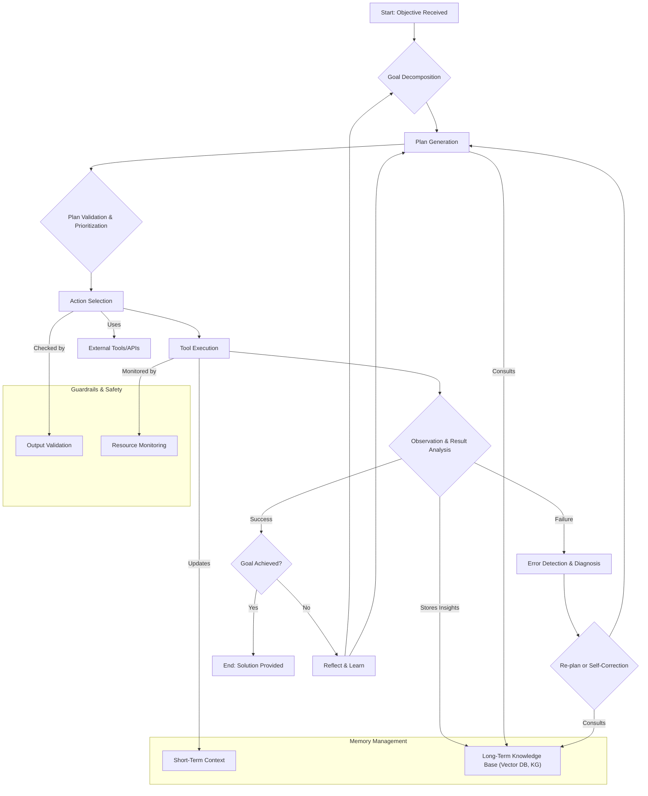

생성형 AI 에이전트가 복잡한 실제 문제를 자율적으로 해결하는 능력은 2026년 AI 시스템의 핵심 역량으로 부상하고 있습니다. 단순한 질의응답을 넘어, 에이전트가 스스로 목표를 설정하고, 계획을 수립하며, 이를 실행하고, 결과에 따라 학습하여 적응하는 '자율적 문제 해결 흐름' 설계는 필수적입니다. 이 엔트리는 이러한 자율성을 달성하기 위한 핵심 설계 패턴과 구현 가이드라인을 제시합니다.

## 자율적 문제 해결의 핵심 구성 요소

생성형 AI 에이전트의 자율적 문제 해결 흐름은 여러 상호 연결된 모듈로 구성됩니다. 각 모듈은 에이전트가 복잡한 환경과 상호작용하며 목표를 달성하도록 지원합니다.

### 1. 목표 설정 및 이해 (Goal Setting & Understanding)
에이전트는 주어진 상위 수준의 지시나 환경의 변화로부터 명확하고 구체적인 목표를 도출해야 합니다. 이는 종종 대규모 언어 모델(LLM)의 강력한 추론 능력을 활용하여 모호한 요구사항을 실행 가능한 하위 목표로 분해하는 과정(Goal Decomposition)을 포함합니다. 장기 기억(Long-Term Memory)에 저장된 과거 경험이나 지식 그래프(Knowledge Graph)를 참조하여 목표의 우선순위를 정하고 맥락을 이해하는 것이 중요합니다.

### 2. 계획 수립 (Planning)
설정된 목표를 달성하기 위해 에이전트는 일련의 행동(Action) 시퀀스를 계획합니다. 이 단계에서는 다음과 같은 패턴들이 활용될 수 있습니다.
*   **리액트(ReAct) 패턴**: 추론(Reasoning)과 행동(Acting)을 번갈아 수행하며 계획을 점진적으로 개선합니다.
*   **트리 오브 생각(Tree of Thoughts, ToT)**: 여러 가능한 계획 경로를 탐색하고 평가하여 최적의 경로를 선택합니다.
*   **계층적 계획(Hierarchical Planning)**: 복잡한 문제를 여러 하위 문제로 분해하고, 각 하위 문제에 대한 계획을 별도로 수립한 후 통합합니다.

### 3. 실행 및 모니터링 (Execution & Monitoring)
수립된 계획에 따라 에이전트는 외부 도구(Tools)를 호출하거나 내부 함수를 실행합니다. 이 과정에서 중요한 것은 실행 결과를 지속적으로 모니터링하고, 예상치 못한 오류나 환경 변화를 감지하는 것입니다. 견고한 도구 사용(Robust Tool Use) 패턴은 실패에 대한 회복력(Resilience)을 높이는 데 필수적입니다. 실행 컨텍스트(Execution Context)는 현재 상태, 사용된 도구, 관찰 결과 등을 포함하여 다음 의사결정에 중요한 정보를 제공합니다.

### 4. 관찰 및 회고 (Observation & Reflection)
실행 결과와 환경 변화는 에이전트에 의해 관찰되고 분석됩니다. 이 회고(Reflection) 단계에서 에이전트는 자신의 행동과 계획이 목표 달성에 얼마나 효과적이었는지 평가하고, 실패의 원인을 진단하며, 향후 계획 수립에 반영할 교훈을 추출합니다. 자기 수정(Self-Correction) 메커니즘은 에이전트가 자체적으로 오류를 감지하고 수정 계획을 세우도록 돕습니다.

### 5. 기억 및 학습 (Memory & Learning)
에이전트의 모든 경험(관찰, 계획, 실행, 회고)은 장기 기억 시스템에 저장되어야 합니다. 이는 에이전트가 시간이 지남에 따라 학습하고 발전할 수 있는 기반이 됩니다. 회고를 통해 얻은 통찰력은 지식 그래프(Knowledge Graph)나 벡터 데이터베이스(Vector Database) 형태로 저장되어 미래의 목표 설정 및 계획 수립에 활용됩니다. 장기 기억 관리(Long-Term Memory Management) 전략은 관련성 높은 정보를 효율적으로 검색하고, 오래되거나 부정확한 정보를 제거하는 데 중요합니다.

## 자율적 문제 해결 흐름 설계 패턴

복잡한 문제 해결을 위한 에이전트의 자율성을 극대화하기 위해 다음과 같은 설계 패턴을 활용할 수 있습니다.

### 1. ReAct 기반의 다단계 추론 루프 (ReAct-based Multi-Stage Reasoning Loop)
에이전트의 기본적인 문제 해결 단위는 ReAct 패턴을 확장한 다단계 루프입니다. 이 루프는 '관찰(Observation) -> 생각(Thought) -> 행동(Action)'의 반복으로 구성됩니다.
*   **관찰**: 환경에서 새로운 정보를 수집하고 이전 행동의 결과를 확인합니다.
*   **생각**: 관찰된 정보를 바탕으로 다음 행동을 추론하고 계획을 업데이트합니다. 이 단계에서 LLM은 복잡한 추론을 수행하고, 필요에 따라 하위 목표를 설정하거나 기존 계획을 수정합니다.
*   **행동**: 생각의 결과로 특정 도구를 호출하거나 외부 시스템과 상호작용합니다.

```python
from typing import List, Dict, Any

class Tool:
    def __init__(self, name: str, description: str):
        self.name = name
        self.description = description

    def execute(self, params: Dict[str, Any]) -> Any:
        raise NotImplementedError

class SearchTool(Tool):
    def __init__(self):
        super().__init__("Search", "Performs a web search for given query.")

    def execute(self, params: Dict[str, Any]) -> str:
        query = params.get("query")
        if not query:
            return "Error: query parameter is required for Search tool."
        # Simulate web search
        return f"Search results for '{query}': AI agents are becoming more autonomous. Latest trends include multi-modal agents."

class CodeInterpreterTool(Tool):
    def __init__(self):
        super().__init__("CodeInterpreter", "Executes Python code in a sandboxed environment.")

    def execute(self, params: Dict[str, Any]) -> str:
        code = params.get("code")
        if not code:
            return "Error: code parameter is required for CodeInterpreter tool."
        try:
            # In a real system, this would be a secure sandbox execution
            exec_globals = {}
            exec(code, exec_globals)
            return str(exec_globals.get("result", "Code executed successfully, no explicit result variable set."))
        except Exception as e:
            return f"Code execution error: {e}"

class Agent:
    def __init__(self, llm_client, tools: List[Tool], max_iterations: int = 10):
        self.llm_client = llm_client
        self.tools = {tool.name: tool for tool in tools}
        self.max_iterations = max_iterations
        self.history = []

    def _format_tools_description(self) -> str:
        return "\n".join([f"- {t.name}: {t.description}" for t in self.tools.values()])

    def _get_prompt(self, objective: str) -> str:
        tool_desc = self._format_tools_description()
        history_str = "\n".join(self.history)
        return f"""
        You are an autonomous AI agent designed to solve complex problems.
        Your goal is: {objective}

        Available tools:
        {tool_desc}

        You must respond in a specific format for each step:
        Thought: Your reasoning process to achieve the objective. Break down the problem, consider options, and plan your next action.
        Action: {{ \"tool\": \"ToolName\", \"params\": {{ \"key\": \"value\" }} }}
        Observation: The result of your action.

        Begin!

        {history_str}
        """

    def solve(self, objective: str) -> str:
        self.history = []
        current_observation = f"Initial objective: {objective}"

        for i in range(self.max_iterations):
            self.history.append(f"Observation: {current_observation}")
            prompt = self._get_prompt(objective)
            llm_response = self.llm_client.generate(prompt) # Simulate LLM call
            self.history.append(f"Thought: {llm_response.thought}")

            if llm_response.is_final_answer: # Assuming LLM can indicate final answer
                return llm_response.answer

            action_data = llm_response.action
            tool_name = action_data.get("tool")
            params = action_data.get("params", {})

            if tool_name not in self.tools:
                current_observation = f"Error: Unknown tool '{tool_name}'."
                self.history.append(f"Action: {action_data}")
                continue

            tool = self.tools[tool_name]
            try:
                action_result = tool.execute(params)
                current_observation = action_result
                self.history.append(f"Action: {action_data}")
            except Exception as e:
                current_observation = f"Tool execution failed: {tool_name} with params {params}. Error: {e}"
                self.history.append(f"Action: {action_data}")

        return "Max iterations reached without achieving the objective."

# Dummy LLM Client for demonstration
class DummyLLMClient:
    def generate(self, prompt: str):
        # In a real scenario, this would parse LLM output for Thought, Action, etc.
        # For simplicity, we'll hardcode some responses.
        class LLMResponse:
            thought: str = ""
            action: Dict[str, Any] = {}
            is_final_answer: bool = False
            answer: str = ""

        response = LLMResponse()
        if "Initial objective: Find current AI agent trends" in prompt and "Search" not in prompt:
            response.thought = "The objective requires current information. I should use the Search tool to find the latest AI agent trends."
            response.action = {"tool": "Search", "params": {"query": "current AI agent trends 2026"}}
        elif "Search results for 'current AI agent trends 2026': AI agents are becoming more autonomous. Latest trends include multi-modal agents." in prompt and "Final Answer" not in prompt:
            response.thought = "I have the search results. I can now synthesize the information and provide a final answer."
            response.is_final_answer = True
            response.answer = "The current AI agent trends for 2026 indicate a strong move towards more autonomous agents, with a particular emphasis on multi-modal capabilities and sophisticated problem-solving workflows."
        else:
            response.thought = "I am stuck or the problem is more complex than this dummy can handle."
            response.is_final_answer = True
            response.answer = "Unable to provide a satisfactory answer with current dummy logic."
        return response

# Example Usage:
# llm = DummyLLMClient()
# agent = Agent(llm, [SearchTool(), CodeInterpreterTool()])
# result = agent.solve("Find current AI agent trends for 2026")
# print(result)
```

### 2. 계층적 목표 분해 및 조정 (Hierarchical Goal Decomposition & Coordination)
복잡한 문제는 단일 에이전트가 한 번에 해결하기 어렵습니다. 이 패턴은 최상위 목표를 여러 개의 관리 가능한 하위 목표(Sub-goals)로 분해합니다. 각 하위 목표는 독립적인 ReAct 루프를 통해 처리될 수 있으며, 상위 에이전트(Supervisor Agent)는 하위 목표들의 진행 상황을 모니터링하고 필요에 따라 재조정합니다. 이 구조는 LLM 에이전트의 복잡한 작업 처리 능력(Complex Task Planning & Orchestration)을 향상시킵니다.

### 3. 지속적 메모리 및 자기 학습 (Persistent Memory & Self-Learning)
에이전트의 경험은 단일 세션에 국한되어서는 안 됩니다.
*   **단기 기억(Short-Term Memory)**: 현재 추론 컨텍스트 내에서 빠르게 접근 가능한 정보 (예: 현재 프롬프트 내의 대화 기록, 최근 관찰 결과).
*   **장기 기억(Long-Term Memory)**: 과거의 계획, 실행 결과, 회고를 통해 얻은 통찰력, 지식 그래프 등을 저장합니다. 벡터 데이터베이스를 활용하여 관련성 높은 기억을 효율적으로 검색(Retrieval Augmented Generation, RAG)하고, 에이전트가 과거의 성공/실패 사례로부터 학습할 수 있도록 합니다.
*   **자기 반성(Self-Reflection)**: 주기적으로 장기 기억을 분석하여 패턴을 추출하고, 추론 전략이나 도구 사용 방식을 개선합니다. 이는 에이전트의 적응형 학습(Adaptive Learning) 메커니즘을 강화합니다.

### 4. 오류 감지 및 회복 (Error Detection & Recovery)
자율 에이전트 시스템에서는 오류가 필연적으로 발생합니다. 견고한 시스템은 이를 감지하고 복구하는 메커니즘을 포함합니다.
*   **가드레일(Guardrails)**: 에이전트의 행동을 제약하고, 예상 범위를 벗어나는 출력을 필터링합니다. (AI Agent Safety Control Mechanisms)
*   **실행 감사(Execution Audit)**: 도구 호출의 성공 여부, 반환 값의 유효성 등을 검증합니다.
*   **재계획(Re-planning)**: 오류 발생 시, 에이전트는 오류의 원인을 분석하고, 새로운 관찰을 바탕으로 계획을 수정하거나 대체 전략을 수립하여 다시 시도합니다. (LLM Autonomous Agent Error Recovery Strategies)

## 자율적 문제 해결 흐름 시각화

다음 Mermaid 다이어그램은 생성형 AI 에이전트의 자율적 문제 해결 흐름을 시각적으로 나타냅니다.



## 트레이드오프

### 1. 자율성 vs. 제어 (Autonomy vs. Control)
*   **언제 좋은가**: 예측 불가능하고 복잡한 환경에서 에이전트가 스스로 문제를 해결하고 적응해야 할 때 매우 효과적입니다. 개발자의 개입 없이 광범위한 문제를 처리할 수 있습니다.
*   **언제 나쁜가**: 높은 수준의 안전성, 규제 준수, 또는 특정 결과에 대한 정확한 제어가 요구되는 미션 크리티컬한 시스템에서는 과도한 자율성이 예상치 못한 행동이나 비용 초과(Cost Overrun)로 이어질 수 있습니다.

### 2. 계획 복잡성 vs. 반응성 (Planning Complexity vs. Reactivity)
*   **언제 좋은가**: 장기적인 목표를 가지고 있거나, 여러 단계의 추론이 필요한 복잡한 문제에 대해 심층적인 계획을 수립할 때 유리합니다. 최적화된 경로를 통해 효율적인 문제 해결이 가능합니다.
*   **언제 나쁜가**: 실시간으로 변화하는 환경에 빠르게 반응해야 하는 경우, 복잡한 계획 과정이 지연을 유발하여 에이전트의 적시성(Timeliness)을 저해할 수 있습니다. 경량화된 ReAct 루프가 더 적합할 수 있습니다.

### 3. 기억의 깊이 vs. 컨텍스트 비용 (Memory Depth vs. Context Cost)
*   **언제 좋은가**: 에이전트가 과거의 모든 경험을 학습하여 지능을 향상시키고, 장기적인 일관성을 유지하며, 반복적인 실수를 줄일 때 효과적입니다. 특히 오랜 기간에 걸쳐 지속되는 복잡한 프로젝트에 유용합니다.
*   **언제 나쁜가**: LLM 컨텍스트 윈도우(Context Window)의 제한과 API 호출 비용을 고려할 때, 너무 많은 정보(Persistent Memory)를 유지하고 검색하는 것은 비효율적이며 비용을 증가시킬 수 있습니다. 관련 없는 정보를 필터링하고 요약하는 전략이 필수적입니다.

### 4. 도구 사용의 유연성 vs. 보안 (Tool Use Flexibility vs. Security)
*   **언제 좋은가**: 에이전트가 다양한 외부 시스템(External Tool Integration)과 상호작용하여 문제 해결 능력을 확장할 때 필수적입니다. 새로운 도구를 쉽게 통합하여 에이전트의 역량을 빠르게 확장할 수 있습니다.
*   **언제 나쁜가**: 외부 도구에 대한 무분별한 접근은 보안 취약점(Sandbox Escape, Data Leakage)을 야기하고, 민감한 정보 유출이나 시스템 오작동의 위험을 증가시킬 수 있습니다. 엄격한 권한 관리와 샌드박스 환경(VM Isolation Security Hardening)이 필요합니다.

## 실전 체크리스트

생성형 AI 에이전트의 자율적 문제 해결 흐름을 설계할 때 다음 체크리스트를 활용하여 시스템의 견고성과 효율성을 검증합니다.

*   [ ] **목표 명확성 검증**: 에이전트가 최상위 목표를 명확하고 측정 가능한 하위 목표로 성공적으로 분해하는가? (Goal Decomposition)
*   [ ] **계획의 유효성 평가**: 에이전트가 생성한 계획이 목표 달성에 논리적으로 적합하며, 사용 가능한 도구와 자원을 고려하는가? (Plan Generation, Tool Use)
*   [ ] **오류 감지 및 복구 메커니즘 구현**: 실행 중 발생하는 예상치 못한 오류(예: API 실패, 도구 오작동)를 에이전트가 효과적으로 감지하고, 재계획 또는 자기 수정(Self-Correction)을 통해 복구하는가?
*   [ ] **장기 기억 활용 효율성 측정**: 에이전트가 과거의 경험과 학습된 지식(Persistent Memory)을 새로운 문제 해결에 얼마나 효과적으로 활용하며, 컨텍스트 비용은 최적화되어 있는가? (RAG Integration, Context Window Optimization)
*   [ ] **가드레일 및 안전 메커니즘 적용**: 에이전트의 자율적 행동이 시스템의 안전(AI Agent Safety) 및 보안 정책을 준수하며, 예상치 못한 부작용(Cost Overrun)을 방지하기 위한 가드레일이 충분히 구현되어 있는가?
*   [ ] **회고 루프의 주기적 실행**: 에이전트가 자신의 성능을 정기적으로 평가하고, 실패 사례로부터 학습하여 전략을 개선하는 회고(Reflection) 프로세스가 설계되어 있는가? (Feedback Loop Design)
*   [ ] **모니터링 및 로깅 시스템 구축**: 에이전트의 모든 의사결정, 행동, 관찰 결과를 추적하고 디버깅할 수 있는 상세한 로깅(Transparent Execution) 및 모니터링 시스템이 구축되어 있는가?