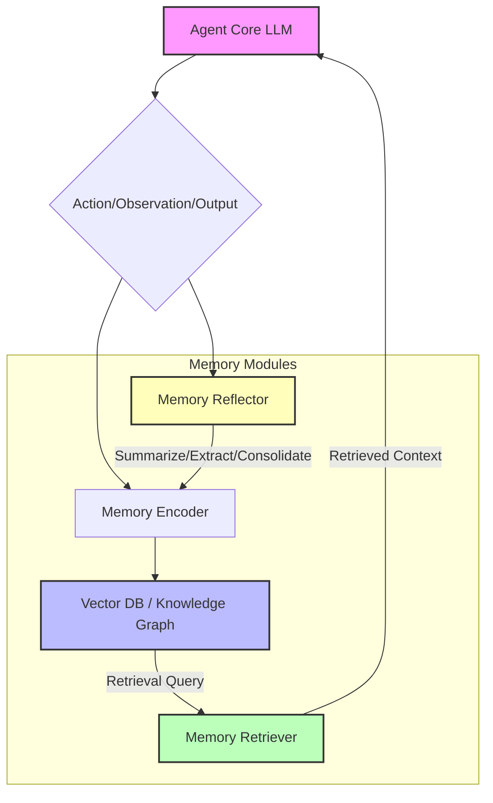

생성형 AI 에이전트의 실용성은 단기 컨텍스트 윈도우(context window)의 한계를 넘어 장기적인 지식과 경험을 얼마나 효과적으로 관리하고 활용하는지에 달려 있습니다. 2026년 기준, 에이전트의 장기 기억(Long-Term Memory)은 단순한 데이터 저장소를 넘어, 복잡한 문제 해결, 지속적인 학습, 그리고 일관된 행동 패턴을 가능하게 하는 핵심 요소로 부상하고 있습니다. 장기 기억 관리 전략은 에이전트가 현실 세계의 장기 실행 태스크(long-running tasks)를 수행하고 인간과의 상호작용에서 연속성을 유지하는 데 필수적입니다. 이 엔트리는 에이전트의 장기 기억 아키텍처, 관리 방법 및 활용 전략을 다룹니다.

## 장기 기억의 필요성 및 유형

대규모 언어 모델(LLM) 기반 에이전트는 컨텍스트 윈도우 내에서 뛰어난 추론 능력을 발휘하지만, 이 윈도우를 벗어나는 정보는 '망각'하는 경향이 있습니다. 이는 에이전트가 여러 세션에 걸쳐 작업을 수행하거나, 특정 도메인에 대한 깊은 지식을 축적해야 할 때 심각한 제약으로 작용합니다. 장기 기억은 이러한 문제를 해결하며, 에이전트가 다음과 같은 기억 유형을 활용할 수 있도록 돕습니다.

*   **서술 기억(Declarative Memory)**: 명시적으로 인코딩되고 검색될 수 있는 사실 및 사건에 대한 기억입니다. 이는 다시 의미 기억(Semantic Memory, 일반적인 사실과 개념)과 일화 기억(Episodic Memory, 특정 사건과 경험)으로 나뉩니다.
*   **절차 기억(Procedural Memory)**: 특정 작업을 수행하는 방법, 즉 '기술'에 대한 기억입니다. 에이전트의 도구 사용(tool use) 패턴이나 특정 워크플로우 실행 방식이 여기에 해당합니다.

## 장기 기억 아키텍처 컴포넌트

효과적인 장기 기억 시스템은 여러 기술 스택의 조합으로 구성됩니다.

### 1. 벡터 데이터베이스 (Vector Database)

가장 일반적인 형태의 장기 기억 저장소입니다. 에이전트의 경험, 관찰, 대화 내용 등을 임베딩(embedding)으로 변환하여 저장하고, 필요할 때 시맨틱 유사성(semantic similarity) 기반으로 검색합니다. Pinecone, Weaviate, Milvus와 같은 솔루션이 활용됩니다.

### 2. 지식 그래프 (Knowledge Graph)

구조화된 지식을 저장하고 관계를 표현하는 데 유용합니다. 엔티티(entity)와 관계(relation)를 그래프 형태로 표현하여, 에이전트가 복잡한 사실 관계를 이해하고 추론하는 데 도움을 줍니다. Neo4j, JanusGraph 등이 사용됩니다.

### 3. 상징적 기억 (Symbolic Memory)

규칙, 제약 조건, 명시적인 계획 등을 저장하는 데 사용됩니다. 이는 에이전트의 행동을 제어하고 특정 도메인 지식을 정확하게 인코딩하는 데 효과적입니다. 예를 들어, 특정 API 호출 스키마나 비즈니스 로직 규칙 등이 여기에 해당합니다.

## 장기 기억 관리 및 활용 전략

### 1. 검색 증강 생성 (Retrieval Augmented Generation, RAG)

에이전트가 현재의 태스크 컨텍스트와 관련된 정보를 장기 기억에서 검색하여 LLM 프롬프트에 주입하는 방식입니다. 이는 LLM의 환각(hallucination)을 줄이고 최신 또는 도메인 특정 지식을 활용하는 데 핵심적입니다.

*   **정보 인코딩**: 에이전트의 모든 의미 있는 상호작용, 관찰, 생성된 결과는 임베딩으로 변환되어 벡터 데이터베이스에 저장됩니다.
*   **검색 질의 생성**: 현재 태스크의 목표, 현재 상태, 이전 대화 등을 기반으로 최적의 검색 질의를 생성합니다.
*   **필터링 및 랭킹**: 검색된 문서 중 가장 관련성 높은 정보를 선별하고, 프롬프트의 컨텍스트 윈도우 크기에 맞게 압축합니다.

### 2. 기억 통합 및 압축 (Memory Consolidation and Compression)

에이전트가 경험을 통해 얻은 정보를 단순히 축적하는 것을 넘어, 의미 있게 통합하고 압축하여 효율적인 검색을 가능하게 합니다. 이는 기억의 과부하(memory overload)를 방지하고, 검색 속도와 정확성을 높이는 데 기여합니다.

*   **반영(Reflection)**: 에이전트가 주기적으로 자신의 경험을 되돌아보고, 새로운 지식이나 패턴을 추출하여 장기 기억에 저장합니다. 이는 자기 성찰(self-reflection) 메커니즘을 통해 이루어질 수 있습니다.
*   **압축(Compression)**: 유사하거나 중복되는 기억을 통합하거나 요약하여 저장 공간을 최적화합니다. 예를 들어, 여러 번 반복된 유사한 경험은 하나의 일반화된 기억으로 압축될 수 있습니다.
*   **망각(Forgetting)**: 중요도가 낮거나 오래된 기억은 점진적으로 제거하거나 희석시켜, 기억 공간을 효율적으로 관리합니다. 이는 단순한 삭제가 아닌, 중요도에 따른 가중치 조절 방식을 따를 수 있습니다.

### 3. 장기 계획 및 목표 관리 (Long-Term Planning and Goal Management)

장기 기억은 에이전트가 지속적인 목표를 설정하고 이를 달성하기 위한 장기 계획을 수립하는 데 필수적입니다. 에이전트는 과거의 성공 및 실패 경험을 바탕으로 미래 행동을 조정하고, 목표 달성 과정을 추적할 수 있습니다.

## 코드 예제: 간단한 에이전트 메모리 시스템 (Python)

아래는 Python으로 구현된 매우 기본적인 에이전트 장기 기억 시스템의 구조입니다. 실제 구현에서는 벡터 DB, LLM 호출 등 복잡한 로직이 포함됩니다.

```python
from collections import deque
import uuid
import time

class MemoryEntry:
    def __init__(self, content: str, timestamp: float = None, metadata: dict = None):
        self.id = str(uuid.uuid4())
        self.content = content
        self.timestamp = timestamp if timestamp is not None else time.time()
        self.metadata = metadata if metadata is not None else {}

    def __repr__(self):
        return f"MemoryEntry(id='{self.id[:4]}...', content='{self.content[:30]}...')"

class SimpleAgentLongTermMemory:
    def __init__(self, capacity: int = 100):
        self.memories = deque(maxlen=capacity) # Episodic memory as a deque
        self.semantic_store = {} # Placeholder for semantic/vector store

    def add_memory(self, content: str, metadata: dict = None):
        entry = MemoryEntry(content, metadata=metadata)
        self.memories.append(entry)
        # In a real system, 'content' would be embedded and stored in a vector DB
        selfm.semantic_store[entry.id] = {"content": content, "embedding": self._generate_embedding(content)}
        print(f"[Memory Added] {entry.content}")
        return entry.id

    def _generate_embedding(self, text: str) -> list[float]:
        # This would call an embedding model (e.g., OpenAI, Cohere, local model)
        # For simplicity, returning a dummy embedding
        return [hash(c) % 100 / 100.0 for c in text + "embedding"][:16] # Dummy embedding

    def retrieve_memories(self, query: str, top_k: int = 3) -> list[MemoryEntry]:
        query_embedding = self._generate_embedding(query)
        # In a real system, perform vector similarity search here
        # For demo, just find exact matches or simple substring matches on content
        relevant_memories = []
        for entry in list(self.memories):
            if query.lower() in entry.content.lower():
                relevant_memories.append(entry)

        # Sort by relevance (dummy, for a real system, use cosine similarity with query_embedding)
        relevant_memories.sort(key=lambda x: abs(len(query) - len(x.content)), reverse=False)

        print(f"[Memory Retrieved for '{query}'] Found {len(relevant_memories)} entries.")
        return relevant_memories[:top_k]

    def reflect_and_consolidate(self, llm_agent_func):
        # Simulate reflection: Summarize recent memories or identify patterns
        recent_memories_content = "\n".join([m.content for m in list(self.memories)[-5:]])
        if not recent_memories_content: return

        prompt = f"Given the following recent agent activities:\n{recent_memories_content}\nWhat are the key takeaways or new insights? Summarize them concisely." # {Curly braces} in comments are okay
        reflection_result = llm_agent_func(prompt) # Call to LLM for reflection

        if reflection_result:
            self.add_memory(f"Reflection: {reflection_result}", metadata={"type": "reflection"})
            print(f"[Reflection Added] {reflection_result}")

# Example usage with a dummy LLM function
def dummy_llm_call(prompt: str) -> str:
    if "key takeaways" in prompt:
        return "The agent frequently interacts with user preferences and task deadlines. It needs better context management for follow-up questions."
    return "Dummy LLM response."

memory = SimpleAgentLongTermMemory(capacity=10)
memory.add_memory("사용자가 프로젝트 계획에 대한 업데이트를 요청했습니다.", {"user": "Alice"})
memory.add_memory("지난 미팅에서 논의된 백로그 아이템을 검토했습니다.")
memory.add_memory("새로운 기능 X 개발을 위한 기술 스택을 조사했습니다.")
memory.add_memory("프로젝트 매니저에게 주간 보고서를 제출했습니다.", {"report_type": "weekly"})

query_result = memory.retrieve_memories("프로젝트 계획 업데이트")
for m in query_result:
    print(f"- {m.content}")

memory.reflect_and_consolidate(dummy_llm_call)

query_result_after_reflection = memory.retrieve_memories("새로운 통찰")
for m in query_result_after_reflection:
    print(f"- {m.content}")
```

## 장기 기억 흐름 다이어그램

아래 Mermaid 다이어그램은 생성형 AI 에이전트의 장기 기억 시스템 내 정보 흐름을 시각화합니다.



## 트레이드오프

장기 기억 관리 전략을 도입할 때는 다음과 같은 트레이드오프를 고려해야 합니다.

*   **메모리 복잡성 vs. 성능**: 기억 시스템이 복잡할수록 에이전트는 더 정교한 추론을 할 수 있지만, 검색 및 업데이트에 드는 비용(cost)과 지연 시간(latency)이 증가합니다. 언제 좋냐면, 에이전트가 복잡하고 다단계의 장기 태스크를 수행해야 할 때 좋습니다. 언제 나쁘냐면, 실시간 응답이 중요하거나 태스크의 범위가 제한적일 때 나쁩니다.
*   **데이터 스케일 vs. 유지보수**: 장기 기억에 저장되는 데이터의 양이 많아질수록 시스템의 스케일 확장 및 유지보수 부담이 커집니다. 언제 좋냐면, 방대한 양의 도메인 지식이 필요하거나 에이전트의 '경험'이 계속 축적되어야 할 때 좋습니다. 언제 나쁘냐면, 데이터의 휘발성이 높거나 정보의 유효 기간이 짧은 경우 불필요한 오버헤드가 발생합니다.
*   **기억의 정확성 vs. LLM의 추론 유연성**: 구조화된 지식(knowledge graph, symbolic memory)은 정확성을 높이지만, LLM의 자유로운 추론 능력을 제한할 수 있습니다. 언제 좋냐면, 사실 관계의 정확성이나 규정 준수(compliance)가 중요한 도메인(예: 법률, 의료)에서 좋습니다. 언제 나쁘냐면, 창의적인 문제 해결이나 열린 질문에 대한 탐색적 답변이 필요한 경우 LLM의 잠재력을 저해할 수 있습니다.
*   **반영/압축 주기 vs. 자원 소모**: 기억을 주기적으로 반영하고 압축하는 과정은 추가적인 LLM 호출과 컴퓨팅 자원을 필요로 합니다. 언제 좋냐면, 에이전트가 장기간에 걸쳐 지속적으로 학습하고 진화해야 할 때 좋습니다. 언제 나쁘냐면, 자원 예산이 제한적이거나 기억 내용의 변화가 적어 반영의 이득이 미미할 경우 비효율적입니다.

## 실전 체크리스트

생성형 AI 에이전트의 장기 기억 시스템을 구축할 때 다음 항목들을 검토하십시오.

*   [ ] **기억 데이터 모델 정의**: 에이전트의 경험(경험, 관찰, 대화, 결정)이 어떤 형식(텍스트, JSON, 그래프 노드)으로 저장될지 명확히 정의되었는가?
*   [ ] **임베딩 모델 선정 및 최적화**: 사용될 임베딩 모델이 에이전트 도메인의 시맨틱 유사성을 잘 반영하며, 검색 성능과 비용 효율성 균형을 이루는가?
*   [ ] **벡터 데이터베이스 선정 및 인덱싱 전략**: 저장될 기억의 양과 검색 빈도를 고려하여 적절한 벡터 DB (Pinecone, Weaviate, Milvus 등)를 선택하고, 효율적인 인덱싱 전략을 수립했는가?
*   [ ] **RAG 파이프라인 최적화**: 검색 질의 생성, 문서 검색, 랭킹, 그리고 프롬프트 구성 각 단계에서 지연 시간과 관련성 정확도를 최적화했는가?
*   [ ] **기억 업데이트 및 반영 메커니즘**: 에이전트의 새로운 경험이 장기 기억에 효과적으로 추가되고, 주기적인 반영(reflection) 및 압축(consolidation)을 통해 기억의 품질이 유지되는가?
*   [ ] **오래된 기억 관리 정책**: 중요도나 시간 경과에 따른 기억 제거(forgetting) 또는 압축 정책이 정의되어, 기억 과부하를 방지하는가?
*   [ ] **기억 일관성 및 무결성 검증**: 멀티 에이전트 환경이나 장기 실행 태스크에서 기억의 일관성과 무결성이 유지되는 메커니즘을 갖추고 있는가?