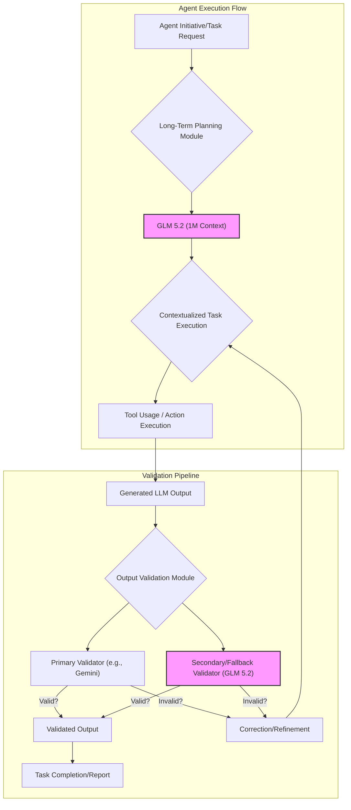

GLM 5.2는 1M 컨텍스트 윈도우와 장기 과제를 독립적으로 수행할 수 있는 능력을 갖춘 오픈소스 대규모 언어 모델(LLM)이다. 이는 복잡한 에이전트 애플리케이션 구축에 필수적인 기반을 제공하며, 특히 프런티어 모델에 대한 접근이 제한되거나 특정 비즈니스 요구사항을 충족해야 할 때 전략적 가치를 가진다.

## GLM 5.2 기반 에이전트 하네스 프로토타이핑

GLM 5.2의 1M 컨텍스트 윈도우는 에이전트가 단일 세션 내에서 방대한 양의 정보를 처리하고, 여러 단계에 걸친 복잡한 작업을 기억하며, 장기적인 목표를 유지할 수 있도록 한다. 이는 특히 `playbook`과 같은 시스템에서 AI 에이전트 하네스(harness)를 프로토타이핑할 때 강력한 이점을 제공한다. 에이전트는 장기적인 목표 설정, 계획 수립, 실행 및 자체 수정 과정에서 이전 대화, 문서, 코드, 로그 등 방대한 과거 컨텍스트를 지속적으로 참조하며 일관성 있는 행동을 유지할 수 있다.

```python
from glm_api import GLMClient

class GLM52AgentHarness:
    def __init__(self, api_key: str):
        self.client = GLMClient(api_key=api_key)
        self.long_term_memory = [] # Simulate 1M context via append/summarize

    def add_to_memory(self, content: str):
        # In a real scenario, this would involve sophisticated context management
        # for a 1M token window (e.g., sliding window, summarization, retrieval)
        self.long_term_memory.append(content)
        # For demonstration, assume memory management handles 1M tokens

    def execute_long_term_task(self, task_description: str) -> str:
        full_context = "\n".join(self.long_term_memory) + "\n" + task_description
        # Truncate or summarize full_context if it exceeds 1M tokens (hypothetical)
        response = self.client.chat.completions.create(
            model="GLM-5.2",
            messages=[
                {"role": "system", "content": "You are an autonomous agent capable of long-term planning and execution based on provided context."},
                {"role": "user", "content": f"Given the following history and task: {full_context}\nExecute the task and provide a detailed plan and outcome."}
            ],
            max_tokens=2048 # Agent's output might also be substantial
        )
        return response.choices[0].message.content

# Usage example
# agent = GLM52AgentHarness(api_key="YOUR_GLM_API_KEY")
# agent.add_to_memory("Initial project brief: Develop a new feature for the user authentication system.")
# agent.add_to_memory("Previous meeting notes: Discussed OAuth2 flow and JWT implementation.")
# result = agent.execute_long_term_task("Generate a comprehensive plan for implementing the new user authentication feature, including design choices and a phased rollout strategy.")
# print(result)
```

## LLM 출력 검증 파이프라인 강화

GLM 5.2는 LLM 출력 검증 파이프라인에서 Gemini API의 보조 또는 대체 모델로 통합될 수 있다. 이는 모델 다양성을 확보하고, 특정 프런티어 모델의 접근이 불안정하거나 비용이 과도할 때 시스템의 견고성을 높이는 전략이다. GLM 5.2는 대규모 컨텍스트를 활용하여 복잡한 검증 규칙, 배경 정보, 과거 실행 기록 등을 포괄적으로 이해하고, LLM 출력의 정확성, 일관성, 안전성 등을 다각도로 평가하는 데 기여할 수 있다.

```python
from glm_api import GLMClient
from gemini_api import GeminiClient # Hypothetical Gemini client

class LLMOutputValidator:
    def __init__(self, glm_api_key: str, gemini_api_key: str = None):
        self.glm_client = GLMClient(api_key=glm_api_key)
        self.gemini_client = GeminiClient(api_key=gemini_api_key) if gemini_api_key else None

    def validate_output(self, generated_output: str, context: str, validation_criteria: str) -> dict:
        validation_prompt = (
            f"Given the context: '{context}', and the generated output: '{generated_output}'. "
            f"Evaluate if the output meets the following criteria: '{validation_criteria}'. "
            "Provide a 'score' (0-100) and 'reasoning'."
        )

        # Primary validation with Gemini (if available)
        if self.gemini_client:
            try:
                gemini_response = self.gemini_client.generate_content(
                    contents=[{"parts": [{"text": validation_prompt}]}],
                    model="gemini-pro"
                ).candidates[0].content.parts[0].text
                # Parse gemini_response into score and reasoning
                # For simplicity, assume parsing yields {'score': int, 'reasoning': str}
                if "score" in gemini_response and "reasoning" in gemini_response: # Simple check
                    return {"validator": "gemini", "status": "success", "details": gemini_response}
            except Exception as e:
                print(f"Gemini validation failed: {e}. Falling back to GLM 5.2.")

        # Fallback/Secondary validation with GLM 5.2
        try:
            glm_response = self.glm_client.chat.completions.create(
                model="GLM-5.2",
                messages=[
                    {"role": "system", "content": "You are a robust LLM output validator."},
                    {"role": "user", "content": validation_prompt}
                ],
                max_tokens=512
            ).choices[0].message.content
            # Parse glm_response into score and reasoning
            return {"validator": "glm52", "status": "success", "details": glm_response}
        except Exception as e:
            return {"validator": "glm52", "status": "failure", "error": str(e)}

# Usage example
# validator = LLMOutputValidator(glm_api_key="YOUR_GLM_API_KEY", gemini_api_key="YOUR_GEMINI_API_KEY")
# output_to_validate = "The quick brown fox jumps over the lazy dog."
# relevant_context = "A children's pangram for typing practice."
# criteria = "Ensure the output is a valid English pangram and grammatically correct."
# validation_result = validator.validate_output(output_to_validate, relevant_context, criteria)
# print(validation_result)
```

### GLM 5.2를 활용한 에이전트 확장 및 검증 파이프라인


## 트레이드오프

### 1. 대규모 컨텍스트 윈도우 활용
*   **언제 좋은가**: 복잡하고 다단계적인 장기 과제 수행, 이전 상호작용의 일관성 유지, 심층적인 지식 통합이 필요한 에이전트 개발에 매우 효과적이다.
*   **언제 나쁜가**: 모든 요청에 1M 컨텍스트를 사용할 경우 토큰 비용 및 처리 지연이 증가할 수 있다. 관련 없는 정보가 많아질수록 '정보 노이즈'가 발생하여 성능 저하로 이어질 수도 있다.

### 2. 오픈소스 모델의 유연성 및 비용 효율성
*   **언제 좋은가**: 클로즈드 소스 프런티어 모델에 대한 종속성을 줄이고, 자체 환경에 배포하여 커스터마이징 및 비용 최적화를 자유롭게 수행할 수 있다. 특정 비즈니스 도메인에 특화된 파인튜닝 기회가 제공된다.
*   **언제 나쁜가**: 모델 배포 및 운영을 위한 인프라 관리 부담이 발생한다. 최적의 성능을 끌어내기 위한 추가적인 엔지니어링 노력과 커뮤니티 지원 의존성이 필요할 수 있다.

### 3. LLM 출력 검증을 위한 모델 다양성 확보
*   **언제 좋은가**: 특정 LLM API의 서비스 중단, 성능 저하, 비용 인상 등 외부 요인에 대한 시스템의 복원력(resilience)을 강화한다. 다양한 모델의 강점을 활용하여 검증의 신뢰도와 커버리지를 높이고, 모델 편향(bias)을 상호 보완할 수 있다.
*   **언제 나쁜가**: 여러 모델을 통합하고 관리하는 복잡도가 증가한다. 모델 간 출력 형식 및 성능 차이로 인해 검증 로직을 표준화하고 일관성을 유지하는 데 추가적인 엔지니어링 오버헤드가 발생할 수 있다.

## 실전 체크리스트

프로젝트에 GLM 5.2를 적용할 때 다음 항목들을 검증하여 성공적인 통합을 보장한다.

*   [ ] GLM 5.2 기반 에이전트의 장기 과제(예: 7일 이상 지속되는 프로젝트) 목표 달성률 및 단계별 성공 지표를 정의하고 측정한다. (예: `F1-Score` for sub-task completion).
*   [ ] 1M 컨텍스트 윈도우를 활용하는 에이전트의 평균 Latency와 최대 Resource Usage (CPU, Memory)를 벤치마킹하고, 프로덕션 환경의 SLA(Service Level Agreement)를 충족하는지 확인한다.
*   [ ] LLM 출력 검증 파이프라인에 GLM 5.2를 보조 모델로 통합한 후, 기존 Gemini 모델 단독 사용 대비 검증 정확도 및 오탐률(False Positive Rate) 변화를 모니터링한다.
*   [ ] GLM 5.2 에이전트가 장기 과제를 수행하는 동안 'Context Drift' (컨텍스트 유실 또는 오염) 발생 여부를 주기적으로 검증하고, 이를 감지하고 회복하는 메커니즘이 정상 작동하는지 테스트한다.
*   [ ] 오픈소스 GLM 5.2 모델 배포 환경에 대한 보안 취약점 점검을 수행하고, 모델 업데이트 및 보안 패치 적용을 위한 정기적인 정책을 수립한다.
*   [ ] GLM 5.2 통합 에이전트 및 검증 파이프라인 롤아웃 전, A/B 테스트를 통해 GLM 5.2 통합의 정량적 효과(예: 에이전트 생산성 10% 향상, 검증 오류 5% 감소)를 측정하고 평가한다.
*   [ ] GLM 5.2 모델의 추론(inference) 비용을 예측하고, 실제 운영 비용과 비교하여 예산 내에서 효율적으로 사용되는지 지속적으로 관리한다.