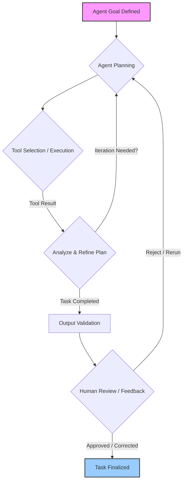

GPT-5.5의 등장은 복잡한 작업을 자율적으로 계획하고, 다양한 도구를 조합하며, 목표 달성까지 전 과정을 수행하는 에이전트 기반 AI 시스템의 새로운 지평을 열었다. 코드 작성 및 디버깅, 웹 조사, 데이터 분석, 문서 생성, 소프트웨어 조작 등 광범위한 영역에서의 잠재력은 2026년 기업 워크플로우 자동화의 핵심 동력이 될 것이다.

### 에이전트 핵심 역량 및 2026년 전망

GPT-5.5와 같은 에이전트 모델은 자율적 계획(Autonomous Planning), 도구 활용(Tool Utilization), 상태 관리 및 기억(State Management & Memory), 환경 상호작용(Environment Interaction) 역량을 기반으로 한다. 특히 per-token latency를 유지하면서도 coding, computer vision 등 복합적인 인지 작업을 수행한다. 2026년에는 실시간 피드백 루프와 강화 학습을 통한 메타-에이전트 시스템, 그리고 멀티모달(multi-modal) 자율 에이전트가 보편화될 것으로 예측된다.

### GPT-5.5 API PoC 및 비교 평가

GPT-5.5의 실제 가치 평가는 복잡한 워크플로우 자동화 태스크에 대한 Proof of Concept (PoC) 수행을 통해 이루어진다. 이는 기존 Claude/Gemini 에이전트와의 성능, 비용, 정확도 비교를 포함한다.

**PoC 대상 태스크 예시:**
*   **코드 작성 및 디버깅**: 기능 요구사항 분석, 코드 작성, 테스트, 버그 수정 자동화.
*   **데이터 분석 및 리포팅**: 데이터 분석, 인사이트 도출, 시각화된 보고서 자동 생성.
*   **웹 조사 및 요약**: 특정 주제 웹 정보 수집, 요약 보고서 작성.

```python
import openai
import json

class GPT5_5AgentClient:
    def __init__(self, api_key: str):
        self.client = openai.OpenAI(api_key=api_key) 
        self.model = "gpt-5.5-agent-turbo" # Hypothetical model

    def execute_agent_task(self, task_description: str, tools: list) -> dict:
        """
        Executes a complex task using GPT-5.5 agent.
        This method simulates an agent's planning and tool-use loop.
        """
        messages = [
            {"role": "system", "content": "You are an autonomous AI agent."},
            {"role": "user", "content": f"Accomplish: {task_description}"}
        ]
        
        try:
            response = self.client.chat.completions.create(
                model=self.model,
                messages=messages,
                tools=tools,
                tool_choice="auto" 
            )
            
            tool_calls = response.choices[0].message.tool_calls
            if tool_calls:
                # Agent decided to use a tool.
                first_call = tool_calls[0].function
                return {"status": "tool_invocation", "tool_name": first_call.name, "args": json.loads(first_call.arguments)}
            else:
                return {"status": "completed", "output": response.choices[0].message.content}

        except Exception as e:
            return {"status": "error", "message": str(e)}

# Example Tool Definitions
web_search_tool = {
    "type": "function",
    "function": {
        "name": "search_web",
        "description": "Searches the web for information.",
        "parameters": {"type": "object", "properties": {"query": {"type": "string"}}, "required": ["query"]}
    }
}
data_analysis_tool = {
    "type": "function",
    "function": {
        "name": "analyze_data",
        "description": "Analyzes structured data.",
        "parameters": {"type": "object", "properties": {"data_json": {"type": "string"}}, "required": ["data_json"]}
    }
}

# Example Conceptual Usage:
# api_key = "YOUR_API_KEY"
# agent_client = GPT5_5AgentClient(api_key=api_key)
# task_desc = "Research recent LLM evaluation metrics."
# result = agent_client.execute_agent_task(task_desc, tools=[web_search_tool, data_analysis_tool])
# print(result)
```

### 평가 지표 및 통합 전략

GPT-5.5 에이전트 평가는 정확도(Accuracy), 완결성(Completeness), 효율성(Efficiency, per-token latency 포함), 비용(Cost), 견고성(Robustness), 확장성(Scalability) 지표를 중점적으로 고려한다. 정량적/정성적 분석을 병행하여 에이전트의 추론 과정과 도구 활용 전략을 심층적으로 평가한다.

기존 시스템과의 통합은 플러그인/모듈 형태 또는 독립형 자율 에이전트 시스템 구축 두 가지 전략이 있다. 어떤 방식을 선택하든 `Human-in-the-Loop` 메커니즘과 `LLM Output Validation` 시스템 설계가 필수적이다.



## 트레이드오프

GPT-5.5 에이전트 모델 도입 시 고려할 주요 트레이드오프는 다음과 같다.

*   **성능 vs. 비용**:
    *   **언제 좋음**: 고부가가치 복합 태스크에서 인적 개입 감소 및 생산성 향상.
    *   **언제 나쁨**: 단순 반복 작업에 GPT-5.5 적용 시 높은 API 비용으로 비효율적.
*   **통합 복잡성 vs. 자율성**:
    *   **언제 좋음**: 높은 자율성으로 개발 및 운영 복잡성 감소.
    *   **언제 나쁨**: `tool utilization` 인터페이스, `error handling`, `observability` 확보 등 초기 엔지니어링 노력 요구. 비결정론적 행동으로 디버깅 복잡성 증가.
*   **정확도 vs. 속도**:
    *   **언제 좋음**: 심층 추론을 통한 높은 정확도, 정밀한 분석 및 오류 없는 코드 생성에 탁월.
    *   **언제 나쁨**: 높은 정확도를 위한 추론 및 도구 호출이 태스크 완료 시간을 증가시켜, 실시간 응답이 필요한 애플리케이션에서 지연 문제 발생 가능.

## 실전 체크리스트

프로젝트에 GPT-5.5 에이전트 모델을 적용할 때 다음 항목들을 검증한다.

*   - [ ] **PoC 태스크 및 성공 기준 명확화**: 자동화할 복합 태스크를 정의하고, PoC의 성공 기준(측정 가능 목표)을 명확히 설정했는가?
*   - [ ] **평가 지표 수립 및 벤치마킹 환경 구축**: 정확도, Latency, 비용 등 핵심 평가 지표를 수립하고, 기존 에이전트와 비교할 표준 벤치마킹 환경을 구축했는가?
*   - [ ] **도구 통합 및 API 연동 설계**: 에이전트가 활용할 외부 도구 목록을 정의하고, 각 도구와의 API 연동 및 데이터 교환 프로토콜을 설계했는가?
*   - [ ] **오류 처리 및 Human-in-the-Loop 설계**: 에이전트 오류 감지, 복구, `Human-in-the-Loop` 개입 전략을 구현했는가?
*   - [ ] **보안 및 데이터 프라이버시 준수**: 에이전트가 처리하는 데이터의 보안 및 프라이버시 정책 준수 여부를 확인했는가? (예: PII 마스킹)
*   - [ ] **모니터링 및 로깅 시스템 구축**: 에이전트의 의사결정 과정, 도구 호출, 결과 등을 모니터링하고 로깅하는 시스템을 구축했는가?
*   - [ ] **모델 드리프트 감지 및 완화 계획**: 모델 업데이트 또는 환경 변화에 따른 성능 저하를 감지하고, 재평가/재학습 계획을 수립했는가?