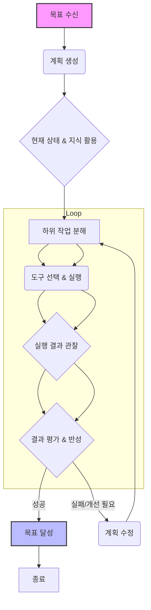

AI 에이전트가 단일 작업을 넘어 복잡하고 다단계적인 문제를 해결하려면, 정교하게 설계된 추론 체인(Inference Chain)이 필수적입니다. 추론 체인은 에이전트가 목표를 달성하기 위해 정보를 처리하고, 의사결정을 내리고, 행동을 실행하며, 피드백을 통합하는 일련의 과정을 의미합니다. 이는 에이전트의 자율성과 문제 해결 능력을 극대화하기 위한 핵심적인 엔지니어링 접근 방식입니다. 특히 2026년에는 단순 질의응답을 넘어 실제 세계에서 의미 있는 작업을 수행하는 에이전트의 요구사항이 증대되면서, 견고하고 유연한 추론 체인 설계의 중요성이 더욱 부각되고 있습니다. 이 접근 방식은 에이전트가 현재의 상태와 목표 사이의 '갭'을 분석하고, 이를 줄여나가는 과정을 체계화하는 데 기여합니다.

## 추론 체인의 핵심 구성 요소

효과적인 추론 체인은 다음과 같은 반복적인 단계를 포함합니다.

### 1. 계획 (Planning)
에이전트는 주어진 목표를 달성하기 위해 필요한 단계들을 정의합니다. 이 단계에서는 장기적인 목표를 더 작고 관리 가능한 하위 작업(sub-tasks)으로 분해합니다. 고급 에이전트는 동적 계획(Dynamic Planning) 기능을 통해 예상치 못한 상황에 따라 계획을 수정할 수 있습니다.

### 2. 실행 (Execution)
계획된 하위 작업을 수행합니다. 이 과정에서 에이전트는 외부 도구(External Tools)를 호출하거나, API를 사용하거나, 코드 실행 환경과 상호작용할 수 있습니다. 도구 사용의 성공 여부와 결과는 에이전트의 다음 행동에 중요한 영향을 미칩니다.

### 3. 관찰 (Observation)
실행 단계의 결과를 모니터링하고 환경으로부터 피드백을 수집합니다. 이는 에이전트의 내부 상태 업데이트, 외부 시스템의 응답 분석, 또는 사용자 피드백을 포함할 수 있습니다. 이 정보는 다음 추론 단계의 입력으로 사용됩니다.

### 4. 반성/성찰 (Reflection)
관찰된 결과를 바탕으로 에이전트는 현재의 진행 상황과 목표 달성도를 평가합니다. 문제가 발생했거나 최적화가 필요한 경우, 에이전트는 계획을 수정하거나 다른 접근 방식을 모색합니다. 자기 수정(Self-correction) 메커니즘은 에이전트가 실패로부터 학습하고 시간이 지남에 따라 성능을 향상시키는 데 필수적입니다.

## 추론 체인 시각화

다음 Mermaid 다이어그램은 기본적인 AI 에이전트의 추론 체인 흐름을 보여줍니다.



## 실전 코드 예제: 간단한 계획-실행-반성 에이전트

여기서는 파이썬(Python)으로 구현된 매우 단순화된 추론 체인의 개념을 보여줍니다. 실제 에이전트는 훨씬 복잡한 LLM 호출, 도구 사용, 메모리 관리 로직을 포함합니다.

```python
import time

class SimpleAgent:
    def __init__(self, name="AgentAlpha"):
        self.name = name
        self.memory = []
        self.tools = {
            "search_web": lambda query: f"Web search for '{query}' returned: ...",
            "write_code": lambda instruction: f"Code written for: {instruction} ...",
            "execute_code": lambda code: f"Code execution result: Success/Failure ..."
        }

    def plan(self, objective):
        print(f"[{self.name}] Planning for: {objective}")
        # Simulate LLM thinking process for planning
        plan_steps = [
            f"Step 1: Understand '{objective}' via web search.",
            f"Step 2: Based on search, write a Python script for '{objective}'.",
            f"Step 3: Execute the script and observe result.",
            f"Step 4: Refine if necessary."
        ]
        self.memory.append(f"Planned: {plan_steps}")
        return plan_steps

    def execute(self, step_instruction):
        print(f"[{self.name}] Executing: {step_instruction}")
        if "web search" in step_instruction:
            result = self.tools["search_web"]("how to " + step_instruction.split(" ")[-2])
        elif "write a Python script" in step_instruction:
            result = self.tools["write_code"]("solve 