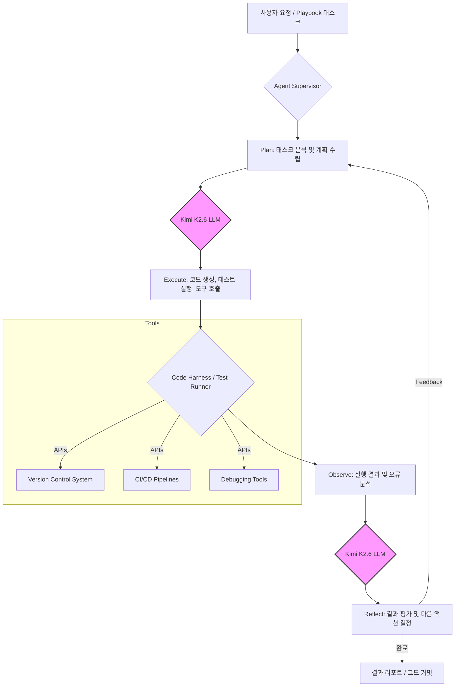

## Kimi K2.6: 오픈소스 에이전트형 코딩 모델 실전 통합 전략

Kimi K2.6은 장기 컨텍스트 코딩과 복잡한 에이전트형 작업에 특화된 오픈소스 LLM입니다. 기존 LLM이 단일 프롬프트 기반 코드 생성에 머물렀다면, Kimi K2.6은 수천 회 도구 호출과 12시간 이상 연속 실행이 가능한 지속 실행형 코딩 환경에서 복잡한 엔지니어링 작업을 자율적으로 처리합니다. 이는 애플리케이션 개발, 프런트엔드 최적화, DevOps 자동화, 성능 개선 등 전반적인 소프트웨어 개발 라이프사이클에 걸쳐 일반화된 성능을 제공합니다.

### 에이전트형 코딩의 부상과 Kimi K2.6의 역할

2026년 소프트웨어 개발은 LLM이 자율 에이전트로서 반복적 작업을 자동화하고, 문제 해결을 자체적으로 계획, 실행, 검증하는 방향으로 진화할 것입니다. Kimi K2.6과 같은 오픈소스 모델은 이러한 에이전트의 핵심 엔진으로서 다음 강점을 제공합니다:

*   **장기 컨텍스트 처리:** 수십만 토큰에 달하는 코드베이스, 문서, 실행 로그를 처리하여 광범위한 프로젝트 이해도를 유지합니다.
*   **다국어/도메인 지원:** 다양한 프로그래밍 언어와 엔지니어링 도메인(프런트엔드, 백엔드, 모바일, 인프라 등)에 걸쳐 적용 가능합니다.
*   **지속 실행 능력:** Plan-Execute-Reflect Agentic loop 내에서 계획, 도구 사용, 코드 변경, 테스트, 디버깅, 반영 과정을 반복하여 목표를 자율적으로 달성합니다.

이러한 Kimi K2.6의 능력은 Playbook의 코드 하네스에 통합되어, 비용 효율적이면서 특정 도메인에 최적화된 자율 코딩 환경 구축의 핵심 기반이 됩니다.

### Kimi K2.6 기반 에이전트 아키텍처

Kimi K2.6을 활용한 에이전트 시스템은 Plan-Execute-Reflect 패턴을 따릅니다. 아래는 Code Harness에 오픈소스 LLM을 통합하는 기본적인 아키텍처입니다.



이 아키텍처는 Kimi K2.6이 에이전트 Supervisor의 지시를 받아 초기 계획 수립(Plan), 코드 생성 및 실행(Execute), 결과 분석 및 반영(Reflect)의 과정을 반복하며 태스크를 자율적으로 완료하는 흐름을 보여줍니다.

```python
import subprocess
import json

class KimiK26Agent:
    def __init__(self, model_api_client):
        self.model = model_api_client
        self.context = []
        self.tools = {
            "run_command": self._run_command,
            "read_file": self._read_file,
            "write_file": self._write_file
        }

    def _run_command(self, command):
        try:
            result = subprocess.run(command, shell=True, capture_output=True, text=True, check=True)
            return {"stdout": result.stdout, "stderr": result.stderr}
        except subprocess.CalledProcessError as e:
            return {"stdout": e.stdout, "stderr": e.stderr, "error": str(e)}

    def _read_file(self, filename):
        try:
            with open(filename, 'r') as f:
                return {"content": f.read()}
        except FileNotFoundError:
            return {"error": f"File {filename} not found."}

    def _write_file(self, filename, content):
        try:
            with open(filename, 'w') as f:
                f.write(content)
            return {"status": "success"}
        except Exception as e:
            return {"error": str(e)}

    def _call_tool(self, tool_name, *args, **kwargs):
        if tool_name in self.tools:
            return self.tools[tool_name](*args, **kwargs)
        else:
            return {"error": f"Tool {tool_name} not found."}

    def execute_task(self, initial_prompt, max_iterations=10):
        self.context.append({"role": "user", "content": initial_prompt})

        for i in range(max_iterations):
            response = self.model.generate(
                messages=self.context,
                tools=list(self.tools.keys()),
                tool_choice="auto"
            )

            if response.tool_calls:
                for tool_call in response.tool_calls:
                    tool_output = self._call_tool(
                        tool_call.function.name,
                        **json.loads(tool_call.function.arguments)
                    )
                    self.context.append({
                        "role": "tool",
                        "tool_call_id": tool_call.id,
                        "content": json.dumps(tool_output)
                    })
            elif response.content:
                print(f"Final Answer: {response.content}")
                return response.content
            else:
                print("No tool calls or final answer. Continuing...")

            self.context.append({"role": "assistant", "content": response.content if response.content else ""})

        return "Task did not complete within max iterations."

# Example Usage (assuming a mock Kimi K2.6 client)
class MockKimiK26Client:
    def generate(self, messages, tools, tool_choice):
        last_message = messages[-1]["content"]
        if "create a simple Python script" in last_message:
            return type('obj', (object,), {
                'tool_calls': [{
                    'function': type('obj', (object,), {
                        'name': 'write_file',
                        'arguments': '{"filename": "hello.py", "content": "print(\'Hello, Kimi!\')"}'
                    }),
                    'id': 'call_123'
                }],
                'content': ''
            })()
        elif "hello.py" in last_message and "success" in last_message:
            return type('obj', (object,), {
                'tool_calls': [{
                    'function': type('obj', (object,), {
                        'name': 'run_command',
                        'arguments': '{"command": "python hello.py"}'
                    }),
                    'id': 'call_456'
                }],
                'content': ''
            })()
        elif "Hello, Kimi!" in last_message:
            return type('obj', (object,), {'tool_calls': [], 'content': 'Script executed successfully.'})()
        return type('obj', (object,), {'tool_calls': [], 'content': 'I am processing your request.'})()

# kimi_client = MockKimiK26Client()
# agent = KimiK26Agent(kimi_client)
# result = agent.execute_task("Create a simple Python script that prints 'Hello, Kimi!' and then execute it.")
# print(result)
```

이 예제는 Kimi K2.6을 활용하여 파일 생성 및 명령 실행 도구를 사용하는 간단한 에이전트 구성 방법을 보여줍니다.

## 트레이드오프

Kimi K2.6과 같은 오픈소스 에이전트형 LLM 도입 시 다음 트레이드오프를 고려해야 합니다.

*   **비용 효율성 vs. 인프라 투자:**
    *   **언제 좋은가:** 상용 LLM API 비용 절감, 예측 가능한 운영 비용, 자체 인프라를 통한 확장성 제어가 필요할 때.
    *   **언제 나쁜가:** 초기 하드웨어(GPU) 및 전문 인력 투자 여력이 부족하거나, 소규모/빠른 프로토타이핑에 집중할 때.

*   **커스터마이징 유연성 vs. 유지보수 복잡성:**
    *   **언제 좋은가:** 특정 도메인 이해 필수, 보안/데이터 주권으로 모델 내부 제어가 필요할 때.
    *   **언제 나쁜가:** 모델 업데이트, 보안 패치, 성능 최적화 등 자체 관리 리소스가 부족할 때.

*   **제어 가능성 vs. 개발 속도:**
    *   **언제 좋은가:** 모델 출력 제어, 안전성, 투명성이 매우 중요할 때. 에이전트 행동 세밀 조정 및 예측 가능성 증대가 필요할 때.
    *   **언제 나쁜가:** 시장 출시 시간(Time-to-market)이 중요하거나, 범용 솔루션을 빠르게 구축해야 할 때.

## 실전 체크리스트

Kimi K2.6과 같은 오픈소스 에이전트형 코딩 모델을 실제 프로젝트에 적용하기 전 다음 항목들을 검증해야 합니다.

*   - [ ] **모델 벤치마킹 완료:** 특정 코딩 태스크(버그 수정, 기능 추가 등)에서 Kimi K2.6의 정확도, 일관성, 속도가 기대치를 충족하는지 벤치마킹 완료 여부. (`evaluation/llm-output-validation-quality-metrics-design` 참조)
*   - [ ] **에이전트 Tool Calling 안정성:** 외부 도구(Git, 빌드 시스템 등) 호출 및 API 연동 로직이 오류 없이 안정적으로 작동하는지, edge-case 처리 포함 여부.
*   - [ ] **장기 실행 작업 모니터링 및 최적화:** 수천 토큰 컨텍스트 및 장시간 실행 시 메모리, 토큰 사용량, API 호출 횟수 등을 모니터링하고 최적화하여 병목 현상 방지 여부.
*   - [ ] **Human-in-the-Loop (HITL) 검토 프로세스:** 에이전트가 생성/수정한 코드에 대한 인간 개발자 검토 및 승인 워크플로우(예: Pull Request) 수립 및 적용 여부. (`harness-engineering/guard-test-pattern` 참조)
*   - [ ] **Self-correction 및 Reflection 메커니즘 평가:** 에이전트가 실패로부터 학습하여 문제 해결 능력 향상에 기여하는지 정량적/정성적으로 평가 완료 여부.
*   - [ ] **오픈소스 모델 보안 점검 및 완화:** Kimi K2.6 모델 및 인프라의 잠재적 보안 취약점 정기 점검 및 완화 전략(샌드박싱, 입력 유효성 검사 등) 적용 여부. (`harness-engineering/vercel-breach-third-party-ai-oauth-supply-chain-security` 고려)
*   - [ ] **로컬 배포 환경 요구사항 충족 및 모니터링:** Kimi K2.6 배포를 위한 하드웨어(GPU) 및 소프트웨어 요구사항 충족, 배포 후 응답 시간, 처리량, 자원 사용률 등 지속 모니터링 체계 구축 여부.
*   - [ ] **multi-agent 오케스트레이션 노드 적합성:** Kimi K2.6을 단독 코딩 에이전트가 아닌 multi-agent 워크플로우 (planner / executor / critic 등) 의 한 노드로 사용할 때, 역할별 프롬프트 / context window 분리 / inter-agent 핸드오프 메시지 포맷 검증 여부. 오픈소스라 자가 호스팅 가능 → 다중 인스턴스 동시 운용 비용 우위가 있음.
