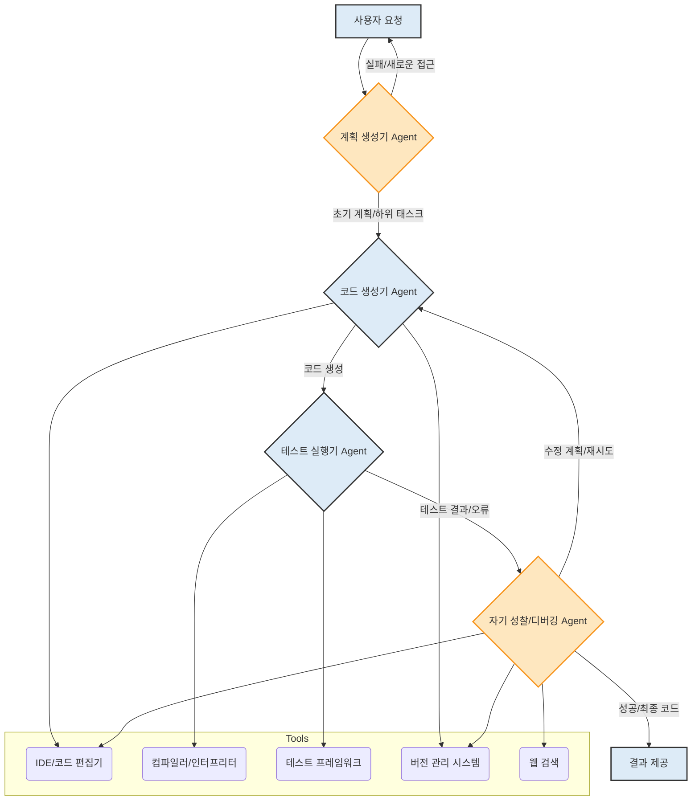

2026년 현재, 대규모 언어 모델(LLM) 기반의 자율 에이전트(Autonomous Agents)는 단순 질의응답을 넘어 복잡한 태스크를 스스로 해결하는 방향으로 발전하고 있습니다. 이러한 에이전트의 핵심은 인간의 개입 없이도 목표를 설정하고, 계획을 수립하며, 외부 도구를 활용하고, 발생한 문제를 스스로 진단하고 수정하는 능력에 있습니다. 복잡한 문제를 해결하기 위한 자율 에이전트의 설계는 단순히 프롬프트 엔지니어링을 넘어선 체계적인 아키텍처와 전략적 패턴을 요구합니다. 이 엔트리에서는 이러한 자율 에이전트의 디자인 원칙과 구현 방안을 다룹니다.

## 자율 에이전트 설계 핵심 원칙

복잡한 태스크를 위한 LLM 기반 에이전트는 다음과 같은 핵심 원칙을 기반으로 설계됩니다.

### 1. 계층적 계획 (Hierarchical Planning)

단일 LLM 호출로 복잡한 문제를 해결하는 것은 불가능에 가깝습니다. 효율적인 자율 에이전트는 전체 목표를 더 작고 관리 가능한 하위 태스크(Sub-tasks)로 분해하는 계층적 계획 능력을 갖춰야 합니다. 각 하위 태스크는 자체적인 계획, 실행, 검증 주기를 가질 수 있습니다. 최상위 에이전트(Planner Agent)는 전체 로드맵을 정의하고, 하위 에이전트(Worker Agent)는 개별 태스크를 실행하며, 그 결과를 상위 에이전트에게 보고하는 방식입니다. 이는 장기적인 목표 달성 과정에서 에이전트의 컨텍스트 윈도우(Context Window) 한계를 극복하고, 집중력을 유지하는 데 필수적입니다.

### 2. 동적 도구 활용 및 선택 (Dynamic Tool Use and Selection)

LLM은 본질적으로 텍스트 예측 모델이므로, 외부 환경과 상호작용하기 위한 도구(Tools)가 필수적입니다. 데이터베이스 쿼리, API 호출, 코드 실행, 웹 브라우징 등 다양한 도구를 적시에, 그리고 동적으로 선택하여 활용하는 능력은 에이전트의 문제 해결 범위를 확장합니다. 중요한 것은 단순히 도구를 사용하는 것을 넘어, 현재 태스크의 맥락에 가장 적합한 도구를 판단하고 선택하는 LLM 에이전트 동적 도구 선택 최적화(`agents/llm-agent-dynamic-tool-selection-optimization`) 전략입니다.

### 3. 자기 성찰 및 오류 수정 (Self-Correction and Reflection)

자율 에이전트의 중요한 특징 중 하나는 자신의 행동과 그 결과를 평가하고, 필요하다면 계획을 수정하거나 새로운 접근 방식을 시도하는 능력입니다. 이는 LLM의 환각(Hallucination) 현상을 완화하고, 불확실한 환경에서 견고한 동작을 보장하는 데 기여합니다. 에이전트는 자신의 출력(Output)을 분석하고, 예상 결과와 비교하며, 실패 원인을 진단한 후 다음 단계를 결정하는 Reflection Prompt를 활용합니다. 이는 에이전트가 실패로부터 학습하고 시간이 지남에 따라 성능을 향상시키는 반복적인 학습 루프를 형성합니다.

### 4. 지속적인 상태 관리 및 메모리 (Persistent State Management and Memory)

복잡한 장기 태스크를 수행하는 에이전트는 과거의 경험과 정보를 기억하고 활용해야 합니다. 단기 컨텍스트 메모리(Short-term Context Memory)는 현재 대화나 태스크의 즉각적인 정보를 유지하지만, 장기 메모리(Long-term Memory)는 벡터 데이터베이스(Vector Database) 등을 활용하여 과거의 학습 내용, 성공/실패 사례, 도구 사용법 등을 저장합니다. 이러한 정보는 새로운 태스크를 계획하거나 기존 문제를 해결하는 데 중요한 맥락으로 작용하며, 에이전트의 컨텍스트 윈도우 최적화(`context-engineering/ai-agent-context-window-optimization-session-longevity`)와도 밀접하게 연결됩니다.

## 에이전트 아키텍처 예시: 자율 코드 생성 및 디버깅

다음 Mermaid 다이어그램은 자율 코드 생성 및 디버깅 에이전트의 흐름을 보여줍니다. 이 에이전트는 사용자 요구사항을 분석하여 코드를 생성하고, 테스트하며, 오류 발생 시 스스로 디버깅하여 수정하는 과정을 자율적으로 수행합니다.



이 예시 아키텍처에서 각 Agent는 LLM을 코어로 가지며, 특정 역할을 수행합니다. `계획 생성기 Agent`는 초기 요청을 분석하고 실행 가능한 하위 태스크 목록을 생성합니다. `코드 생성기 Agent`는 이 계획에 따라 코드를 작성하고, `테스트 실행기 Agent`는 생성된 코드를 테스트 프레임워크를 이용해 검증합니다. 만약 테스트에서 오류가 발생하면, `자기 성찰/디버깅 Agent`는 오류 메시지를 분석하고 코드베이스를 탐색하며 수정 방안을 도출하여 `코드 생성기 Agent`에게 피드백을 제공합니다. 이 과정은 성공할 때까지 반복됩니다.

```python
import json
import os

class Tool:
    def __init__(self, name, description, func):
        self.name = name
        self.description = description
        self.func = func

    def __call__(self, *args, **kwargs):
        return self.func(*args, **kwargs)

# 예시 도구: Python 코드 실행
def execute_python_code(code: str) -> str:
    try:
        exec_globals = {}
        exec(code, exec_globals)
        return "코드 실행 성공."
    except Exception as e:
        return f"코드 실행 오류: {e}"

python_executor = Tool("python_executor", "Python 코드를 실행합니다.", execute_python_code)

class LLM:
    # 실제 LLM API 호출을 시뮬레이션
    def __init__(self, model_name="gpt-4o"):
        self.model_name = model_name

    def invoke(self, prompt: str) -> str:
        # 실제 LLM 호출 로직은 여기에 구현됩니다.
        # 여기서는 단순한 응답을 시뮬레이션합니다.
        if "계획" in prompt:
            return "계획: 사용자 요청을 분석하고, 필요한 도구를 식별한 뒤, 단계별로 해결합니다."
        elif "코드 생성" in prompt:
            return "print('Hello, autonomous agent!')"
        elif "테스트" in prompt:
            return json.dumps({"status": "fail", "message": "SyntaxError: Invalid syntax"}) # 테스트 실패 시뮬레이션
        elif "디버깅" in prompt and "SyntaxError" in prompt:
            return "오류 진단: Python 문법 오류. 코드 구문을 수정해야 합니다. 'print' 함수 사용법을 확인하세요."
        return "LLM 응답 시뮬레이션."

class AutonomousAgent:
    def __init__(self, llm: LLM, tools: list[Tool]):
        self.llm = llm
        self.tools = {tool.name: tool for tool in tools}
        self.history = []

    def run(self, task: str, max_iterations: int = 5) -> str:
        self.history.append(f"사용자 요청: {task}")
        current_plan = ""
        for i in range(max_iterations):
            print(f"--- Iteration {i+1} ---")
            
            # 1. 계획 수립 (Planning)
            planning_prompt = f"이 태스크를 어떻게 해결할 수 있을까요?:\n{task}\n현재까지의 진행 상황:\n{'' .join(self.history)}\n다음 단계를 계획해주세요."
            plan_response = self.llm.invoke(planning_prompt)
            current_plan = plan_response.replace("계획: ", "").strip()
            self.history.append(f"계획: {current_plan}")
            print(f"Agent Plan: {current_plan}")

            if "코드 생성" in current_plan:
                # 2. 코드 생성 (Code Generation)
                code_prompt = f"'{task}'를 위한 Python 코드를 생성해주세요. 계획: {current_plan}"
                generated_code = self.llm.invoke(code_prompt)
                self.history.append(f"생성된 코드:\n```python\n{generated_code}\n```")
                print(f"Generated Code: {generated_code}")

                # 3. 도구 실행 (Tool Execution - 테스트)
                test_result = self.tools["python_executor"](generated_code)
                self.history.append(f"테스트 결과: {test_result}")
                print(f"Test Result: {test_result}")

                # 4. 자기 성찰 및 디버깅 (Reflection and Self-Correction)
                if "오류" in test_result or "fail" in test_result:
                    reflection_prompt = f"다음 코드에 대한 테스트가 실패했습니다. 이유를 분석하고 수정 방안을 제시해주세요.\n코드:\n```python\n{generated_code}\n```\n테스트 결과: {test_result}\n진행 상황:\n{'' .join(self.history)}"
                    debug_suggestion = self.llm.invoke(reflection_prompt)
                    self.history.append(f"디버깅 제안: {debug_suggestion}")
                    print(f"Debug Suggestion: {debug_suggestion}")
                    # 여기서는 간단히 다시 시도하는 것으로 처리 (실제로는 계획 수정 후 코드 재생성)
                else:
                    return f"태스크 성공! 최종 코드: {generated_code}"

        return f"최대 반복 횟수 도달. 태스크 실패. 마지막 기록: {self.history[-1]}"

# 에이전트 실행
llm_model = LLM()
agent_tools = [python_executor]
agent = AutonomousAgent(llm_model, agent_tools)

# result = agent.run("화면에 'Hello, World!'를 출력하는 Python 코드를 작성하고 실행하세요.")
# print(f"Final Result: {result}")
```
이 코드 예시는 `AutonomousAgent` 클래스를 통해 계획(Planning), 도구 사용(Tool Use), 자기 성찰(Self-Correction)의 기본 흐름을 보여줍니다. `LLM` 클래스는 실제 LLM API 호출을 대체하는 시뮬레이션 역할을 하며, `Tool` 클래스는 외부 Python 코드 실행과 같은 기능을 추상화합니다. 에이전트는 `run` 메서드 내에서 반복적으로 계획을 세우고, 코드를 생성하며, 테스트하고, 실패 시 `디버깅` 프롬프트를 통해 수정 제안을 받아 다음 반복에 활용합니다. 이 반복적인 프로세스는 에이전트가 복잡한 문제를 점진적으로 해결할 수 있도록 돕습니다.

## 트레이드오프

LLM 기반 자율 에이전트의 복잡한 문제 해결 디자인은 강력한 능력을 제공하지만, 다음과 같은 트레이드오프를 고려해야 합니다.

*   **복잡성 및 개발 시간 (Complexity and Development Time)**
    *   **언제 좋음:** 고도로 복잡하고 반복적인 태스크를 자동화하여 장기적으로 개발 및 운영 효율성을 극대화할 때 유용합니다. 에이전트의 자율성이 높아질수록 인간의 개입이 줄어들어 인력 비용을 절감합니다.
    *   **언제 나쁨:** 단순하거나 예측 가능한 태스크에는 과도한 설계가 될 수 있습니다. 초기 개발에 많은 시간과 리소스가 필요하며, 에이전트 간의 상호작용 및 상태 관리 로직이 복잡해져 개발 난이도가 높아집니다.

*   **비용 및 지연 시간 (Cost and Latency)**
    *   **언제 좋음:** 고가치 태스크(예: 복잡한 코드 생성, 시장 분석)에서 사람의 시간이나 리소스 비용보다 LLM 호출 비용이 상대적으로 낮을 때 경제적 이점을 제공합니다. 백그라운드에서 비동기적으로 실행되는 장기 태스크에 적합합니다.
    *   **언제 나쁨:** LLM 호출 횟수가 증가하고, 여러 에이전트가 순차적으로 또는 병렬로 작업할수록 API 호출 비용이 기하급수적으로 늘어날 수 있습니다. 실시간 응답이 필수적인 애플리케이션에서는 여러 LLM 호출로 인한 지연 시간(Latency)이 사용자 경험을 저해할 수 있습니다.

*   **예측 불가능성 및 제어 (Unpredictability and Control)**
    *   **언제 좋음:** 창의적 문제 해결이나 탐색적 태스크처럼 명확한 해결책이 없는 경우, 에이전트의 자율성이 새로운 관점이나 해결책을 제시할 수 있습니다. 예상치 못한 상황에 유연하게 대처해야 할 때 강점을 발휘합니다.
    *   **언제 나쁨:** 결과의 일관성이나 정확성이 매우 중요하며, 예측 가능한 동작이 요구되는 태스크(예: 금융 거래, 규제 준수)에는 에이전트의 '창의성'이 오히려 문제가 될 수 있습니다. 에이전트의 행동을 완벽하게 제어하기 어렵고, 잘못된 방향으로 자율성이 발현될 위험이 있습니다.

*   **디버깅 및 투명성 (Debugging and Transparency)**
    *   **언제 좋음:** 잘 설계된 로깅 및 관찰 가능성(Observability) 시스템을 갖춘 경우, 에이전트의 의사결정 과정을 추적하고 분석하여 시스템 개선에 활용할 수 있습니다.
    *   **언제 나쁨:** 다단계 자율 에이전트의 의사결정 과정은 복잡하고 불투명할 수 있습니다. LLM의 블랙박스 특성상 에이전트가 왜 특정 결정을 내렸는지, 혹은 왜 실패했는지 파악하기 어려워 디버깅이 매우 어렵습니다. 이는 문제 발생 시 빠른 진단 및 해결을 방해합니다.

*   **확장성 및 리소스 관리 (Scalability and Resource Management)**
    *   **언제 좋음:** 적절한 워크로드 분할(Workload Partitioning) 및 멀티 에이전트 시스템 효율적 상호작용 디자인 패턴(`agents/multi-agent-system-efficient-interaction-design-patterns`)을 통해 여러 태스크를 동시에 처리하거나 대규모 운영 환경에 적합하게 확장할 수 있습니다.
    *   **언제 나쁨:** 에이전트가 사용하는 컴퓨팅 리소스(GPU, CPU, 메모리) 및 LLM API 토큰 사용량에 대한 정교한 관리가 이루어지지 않으면, 확장 시 엄청난 비용이 발생하거나 성능 저하로 이어질 수 있습니다.

## 실전 체크리스트

LLM 기반 자율 에이전트를 실제 프로젝트에 적용할 때 다음 체크리스트를 활용하여 디자인의 견고성을 검증하세요.

- [ ] **태스크 분해 전략 수립 여부**: 복잡한 메인 태스크가 독립적이고 실행 가능한 하위 태스크로 명확하게 분해되었는가? 각 하위 태스크의 성공 기준과 실패 시 대체 경로가 정의되었는가?
- [ ] **동적 도구 활용 시스템 구축 여부**: 에이전트가 활용할 수 있는 외부 도구(API, DB, 코드 인터프리터 등)의 레지스트리가 구성되어 있고, 현재 태스크 맥락에 따라 도구를 동적으로 선택하고 사용할 수 있는 로직이 구현되었는가?
- [ ] **자기 성찰 및 오류 처리 메커니즘 확인**: 에이전트가 자신의 출력(Output)을 평가하고, 예상과 다른 결과나 오류 발생 시 이를 진단하여 계획을 수정하거나 재시도할 수 있는 자기 성찰(Reflection) 및 오류 처리 루프가 명확하게 설계되었는가?
- [ ] **지속적인 메모리 관리 전략 구현 여부**: 에이전트가 장기 태스크를 수행하는 과정에서 필요한 정보(과거 성공/실패 사례, 학습된 지식 등)를 저장하고 검색할 수 있는 장기 메모리(Vector DB 등) 시스템이 통합되었으며, 컨텍스트 관리가 효율적으로 이루어지는가?
- [ ] **비용 및 성능 모니터링 시스템 구축 여부**: LLM API 호출 비용과 에이전트의 태스크 처리 지연 시간(Latency)을 실시간으로 모니터링하고, 특정 임계치 초과 시 알림을 보내거나 최적화 전략(예: 캐싱, 모델 전환)을 자동으로 적용하는 시스템이 준비되었는가?
- [ ] **실패 모드 및 복구 경로 정의**: 에이전트가 예상치 못한 입력, 도구 오류, LLM 환각 등 다양한 실패 상황에 직면했을 때, 시스템이 완전히 다운되지 않고 안전하게 복구되거나 사용자에게 명확한 피드백을 줄 수 있는 복구 경로가 설계되었는가?
- [ ] **성능 벤치마크 및 평가 프로토콜 수립**: 에이전트의 핵심 태스크 성공률, 처리 시간, 자원 소모량 등에 대한 정량적 벤치마크가 정의되었고, 이를 주기적으로 평가하고 개선할 수 있는 평가 프로토콜이 마련되었는가?