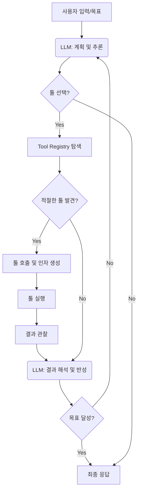

LLM 에이전트는 복잡한 목표를 달성하기 위해 외부 툴(tool)을 동적으로 선택하고 사용하는 능력에 따라 그 유용성이 크게 좌우됩니다. 단순한 질의응답을 넘어 실제 세상의 문제를 해결하려면, 에이전트는 특정 상황에 가장 적합한 툴을 식별하고, 이를 효과적으로 호출하며, 결과를 해석하여 다음 행동을 결정해야 합니다. 이 과정의 최적화는 에이전트의 효율성, 정확성, 그리고 유연성을 극대화하는 핵심 요소입니다.

## 동적 툴 선택의 필요성
초기 LLM 에이전트 구현은 종종 미리 정의된 고정된 툴셋에 의존하거나, 툴 사용 로직이 프롬프트 엔지니어링에 깊이 내재되어 있었습니다. 그러나 실제 시나리오에서는 다음과 같은 이유로 동적인 툴 선택 및 사용이 필수적입니다.
*   **복잡성 증가**: 해결해야 할 태스크가 복잡해질수록 필요한 툴의 종류와 조합이 기하급수적으로 늘어납니다. 모든 상황에 대응하는 정적 로직은 유지보수 불가능해집니다.
*   **환경 변화**: 외부 시스템, API, 데이터 소스는 지속적으로 변화합니다. 에이전트는 이러한 변화에 유연하게 적응하여 새로운 툴을 통합하거나 기존 툴의 사용 방식을 조정해야 합니다.
*   **효율성**: 불필요하거나 비효율적인 툴 호출은 비용과 지연 시간을 증가시킵니다. 가장 적절한 툴을 선택하는 것은 리소스 최적화에 직결됩니다.

## LLM 에이전트의 동적 툴 사용 패턴
LLM 에이전트의 동적 툴 사용은 일반적으로 다음과 같은 순환(loop) 구조를 따릅니다.

1.  **계획 (Planning)**: LLM이 주어진 목표와 현재 상태를 바탕으로 다음 행동을 계획합니다. 이때 어떤 툴이 필요한지, 어떤 정보를 얻어야 하는지 등을 추론합니다.
2.  **툴 선택 (Tool Selection)**: 계획 단계에서 도출된 필요에 따라, 사용 가능한 툴 목록(Tool Registry)에서 가장 적합한 툴을 하나 이상 선택합니다. 이 과정에서 툴의 설명(description)과 인자(arguments)를 고려합니다.
3.  **툴 실행 (Tool Execution)**: 선택된 툴을 호출하고 필요한 인자를 전달하여 실행합니다. 이는 외부 API 호출, 데이터베이스 질의, 코드 실행 등 다양한 형태가 될 수 있습니다.
4.  **관찰 및 반성 (Observation & Reflection)**: 툴 실행 결과를 관찰하고, 이를 바탕으로 원래의 목표에 얼마나 근접했는지 평가합니다. 필요에 따라 계획을 수정하거나 다음 행동을 결정합니다.

이러한 순환은 목표가 달성되거나 특정 종료 조건에 도달할 때까지 반복됩니다.



## 동적 툴 선택 및 사용 최적화 기법

### 1. Contextual Tool Filtering (상황별 툴 필터링)
모든 툴을 항상 LLM에게 노출하는 것은 비효율적입니다. 현재 태스크의 컨텍스트(context)에 따라 관련성이 낮은 툴을 미리 필터링하여 LLM이 고려해야 할 툴셋의 크기를 줄일 수 있습니다.
*   **Semantic Matching**: 쿼리 또는 태스크 설명과 툴 설명을 임베딩(embedding) 기반으로 유사도를 측정하여 관련 툴만 선별합니다.
*   **Rule-based Filtering**: 특정 키워드, 카테고리 또는 작업 유형에 따라 툴을 활성화/비활성화하는 규칙을 정의합니다. 예: "데이터 분석" 태스크일 때만 통계 관련 툴 활성화.

### 2. Semantic Tool Descriptions (의미론적 툴 설명)
LLM이 툴의 목적과 사용법을 정확히 이해하도록 명확하고 구조화된 설명을 제공하는 것이 중요합니다.
*   **명확한 목적**: 툴이 `무엇을` 하는지 명확하게 설명합니다.
*   **입출력 형식**: 툴의 예상 입력(parameters)과 출력(return values) 형식을 구체적으로 명시합니다. 이는 JSON 스키마 등으로 표현될 수 있습니다.
*   **사용 예시**: 실제 사용될 수 있는 예시를 제공하여 LLM의 이해도를 높입니다.

```python
from typing import Dict, Any, List

class Tool:
    def __init__(self, name: str, description: str, parameters: Dict, func):
        self.name = name
        self.description = description
        self.parameters = parameters
        self.func = func

    def execute(self, **kwargs) -> Any:
        return self.func(**kwargs)

# 예시 툴: 웹 검색
def web_search_tool_func(query: str) -> str:
    # 실제 웹 검색 API 호출 로직 (예: Google Search API)
    print(f"Executing web search for: {query}")
    return f"Search results for '{query}': ... (simplified)"

web_search_tool = Tool(
    name="web_search",
    description="주어진 쿼리에 대해 웹 검색을 수행하고 관련 정보를 반환합니다.",
    parameters={
        "type": "object",
        "properties": {
            "query": {"type": "string", "description": "검색할 키워드 또는 문장"}
        },
        "required": ["query"]
    },
    func=web_search_tool_func
)

# 예시 툴: 계산기
def calculator_tool_func(expression: str) -> float:
    try:
        result = eval(expression) # 보안에 주의하여 사용! 실제 프로덕션에서는 안전한 파서 사용
        print(f"Executing calculator for: {expression}")
        return float(result)
    except Exception as e:
        return f"Error: {e}"

calculator_tool = Tool(
    name="calculator",
    description="수학적 표현식을 계산합니다.",
    parameters={
        "type": "object",
        "properties": {
            "expression": {"type": "string", "description": "계산할 수학적 표현식 (예: '2+2*3')"}
        },
        "required": ["expression"]
    },
    func=calculator_tool_func
)

# Tool Registry
tool_registry: Dict[str, Tool] = {
    web_search_tool.name: web_search_tool,
    calculator_tool.name: calculator_tool
}

# LLM을 이용한 툴 선택 및 실행 (개념적 예시)
def llm_agent_step(task_description: str, available_tools: Dict[str, Tool]):
    # 실제 LLM 호출을 대체하는 가상의 로직
    # LLM은 task_description과 available_tools 설명을 보고 어떤 툴을 호출할지, 어떤 인자를 전달할지 결정
    print(f"Agent received task: {task_description}")
    
    # 이 부분은 LLM의 툴 호출 형식에 따라 달라짐 (예: function calling API)
    # 여기서는 간단히 규칙 기반으로 시뮬레이션
    if "계산" in task_description:
        tool_name = "calculator"
        args = {"expression": "15 * 3 + 7"} # LLM이 생성했다고 가정
    elif "최신 뉴스" in task_description:
        tool_name = "web_search"
        args = {"query": "오늘의 주요 기술 뉴스"} # LLM이 생성했다고 가정
    else:
        print("No suitable tool found for this task yet.")
        return

    if tool_name in available_tools:
        tool = available_tools[tool_name]
        print(f"LLM decided to use tool: {tool.name} with args: {args}")
        result = tool.execute(**args)
        print(f"Tool execution result: {result}")
        return result
    else:
        print(f"Error: Tool '{tool_name}' not found in registry.")

# 에이전트 실행 예시
llm_agent_step("15 * 3 + 7을 계산해줘", tool_registry)
llm_agent_step("오늘의 주요 기술 뉴스를 찾아줘", tool_registry)
llm_agent_step("날씨가 어때?", tool_registry) # 적절한 툴이 없어 실행 안 됨
```
위 코드는 LLM 에이전트가 툴을 정의하고, 등록하며, 컨텍스트에 따라 개념적으로 툴을 선택하고 실행하는 과정을 보여줍니다. 실제 LLM 통합 시에는 OpenAI Function Calling, Anthropic Tools 같은 API를 활용하여 LLM이 JSON 형식으로 툴 호출을 생성하게 됩니다.

### 3. Tool Orchestration Patterns (툴 오케스트레이션 패턴)
단일 툴 호출로는 해결하기 어려운 복합적인 작업을 위해 툴 호출을 체이닝(chaining)하거나 병렬(parallel)로 실행하는 패턴이 필요합니다.
*   **Sequential Chaining**: 한 툴의 출력이 다음 툴의 입력이 되는 직렬 연결. 예: `웹 검색` -> `결과 요약` -> `번역`.
*   **Parallel Execution**: 여러 툴을 동시에 실행하고 그 결과를 병합. 예: `복수 소스에서 데이터 검색` -> `결과 병합 및 분석`.
*   **Conditional Branching**: 툴 실행 결과에 따라 다음 툴을 조건부로 선택. 예: `API 호출` -> `성공 시 데이터 처리`, `실패 시 에러 핸들링 툴 호출`.

### 4. Self-Correction and Adaptation (자율 수정 및 적응)
툴 실행 결과가 기대에 미치지 못하거나 오류가 발생했을 때, 에이전트가 스스로 문제를 진단하고 툴 사용 전략을 수정하는 능력입니다.
*   **Error Handling**: 툴 실행 중 발생하는 예외(exception)를 포착하고, LLM이 이를 분석하여 다른 툴을 시도하거나 프롬프트를 재구성하도록 합니다.
*   **Feedback Loop**: 툴 실행 결과를 지속적으로 모니터링하고, 실패율이 높거나 비효율적인 툴 사용 패턴을 감지하면 LLM의 계획 또는 툴 선택 로직에 피드백을 제공하여 개선합니다.

## 트레이드오프

### 1. 툴 Registry 복잡성 vs. 유연성
*   **언제 좋은가**: 툴 Registry가 잘 정의되어 있고, 각 툴의 기능과 인터페이스가 명확하며, 메타데이터(설명, 태그, 예시)가 풍부할수록 LLM의 툴 선택 정확도가 높아지고 에이전트의 유연성이 증대됩니다. 새로운 툴을 쉽게 추가하고 기존 툴을 업데이트할 수 있습니다.
*   **언제 나쁜가**: 툴의 수가 너무 많아지거나 설명이 부실하면 LLM이 올바른 툴을 선택하는 데 혼란을 겪을 수 있습니다. Registry를 관리하고 유지보수하는 오버헤드가 커지며, 툴 간의 의존성 관리도 복잡해집니다.

### 2. Contextual Filtering의 엄격성 vs. 포괄성
*   **언제 좋은가**: 관련성이 낮은 툴을 미리 필터링하여 LLM의 인지 부하를 줄이고, 추론 시간 및 비용을 절감할 수 있습니다. 특히 툴셋이 방대할 때 효율적입니다.
*   **언제 나쁜가**: 필터링 로직이 너무 엄격하거나 부정확하면, LLM이 실제로 필요로 하는 툴이 필터링되어 핵심 기능을 수행하지 못하는 `False Negative` 문제가 발생할 수 있습니다. 예상치 못한 상황에서 유연성을 잃을 수 있습니다.

### 3. LLM 기반 툴 선택 vs. 규칙 기반 툴 선택
*   **언제 좋은가**: LLM 기반의 동적 선택은 예측 불가능하거나 복잡한 태스크에서 탁월한 유연성과 적응성을 제공합니다. 새로운 종류의 태스크나 툴에 대해 별도의 규칙 코딩 없이 대응할 수 있습니다.
*   **언제 나쁜가**: LLM 추론에 의존하므로 Latency가 발생하고 비용이 높을 수 있습니다. 또한, LLM의 `환각(Hallucination)`이나 잘못된 추론으로 인해 잘못된 툴을 선택하거나 유효하지 않은 인자를 생성할 위험이 있습니다. 안정성과 예측 가능성이 중요한 미션 크리티컬한 상황에서는 규칙 기반이 더 적합할 수 있습니다.

### 4. 툴 정의의 추상화 vs. 구체성
*   **언제 좋은가**: 툴 정의가 추상적이고 범용적일수록 재사용성이 높아지고, LLM이 다양한 시나리오에 툴을 적용할 수 있는 유연성이 커집니다.
*   **언제 나쁜가**: 너무 추상적인 툴 정의는 LLM이 툴의 실제 동작이나 적절한 사용 인자를 파악하기 어렵게 만들어, 잘못된 툴 호출로 이어질 수 있습니다. 특히 복잡한 비즈니스 로직을 가진 툴의 경우, 구체적인 설명과 예시가 필수적입니다.

## 실전 체크리스트

*   [ ] **툴 Registry 중앙화 및 메타데이터 표준화**: 모든 툴이 명확하고 일관된 형식(JSON 스키마, Markdown 설명 등)으로 등록되어 있는지 확인하고, 검색 및 필터링 가능한 메타데이터(카테고리, 목적, 예시)를 포함하는가?
*   [ ] **컨텍스트 기반 툴 필터링 적용**: 현재 태스크의 초기 컨텍스트를 분석하여 LLM에 전달되는 툴 목록을 최소화하는 사전 필터링 로직이 구현되어 있으며, `False Negative` 발생률을 주기적으로 모니터링하는가?
*   [ ] **LLM의 툴 호출 형식 이해도 검증**: 사용 중인 LLM(예: GPT-4, Claude 3)이 툴의 `description`, `parameters`, `required` 필드를 정확히 이해하고 올바른 형식의 툴 호출(function call)을 생성하는지 충분히 테스트했는가?
*   [ ] **툴 실행 후 반성 및 재시도 메커니즘**: 툴 실행 결과가 실패하거나 예상과 다를 경우, 에이전트가 이를 감지하고 LLM에 피드백하여 다른 툴을 시도하거나 인자를 수정하여 재시도하는 로직이 구현되어 있는가?
*   [ ] **비동기 툴 실행 및 타임아웃 처리**: 장시간 소요되는 툴 호출에 대비하여 비동기 실행 메커니즘을 갖추고 있으며, 무한 대기를 방지하기 위한 적절한 타임아웃 및 폴링(polling) 전략이 적용되어 있는가?
*   [ ] **보안 및 권한 관리**: 툴이 접근하는 외부 시스템(DB, API 등)에 대한 권한이 최소한의 원칙(Least Privilege)에 따라 관리되고, LLM이 민감한 정보에 접근하거나 악의적인 명령을 생성하지 않도록 입력/출력 유효성 검사(sanitization) 및 가드레일(guardrails)이 철저하게 적용되어 있는가?
*   [ ] **성능 및 비용 최적화 모니터링**: 툴 호출 횟수, Latency, API 비용 등을 주기적으로 모니터링하여 병목 현상이나 비효율적인 툴 사용 패턴을 식별하고 개선하는 지표와 시스템이 구축되어 있는가?