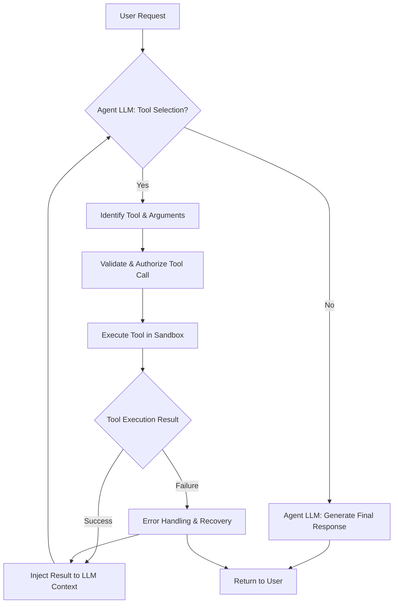

LLM 에이전트의 핵심 역량은 외부 툴 연동을 통한 실세계 상호작용이다. 언어 모델의 추론 능력과 외부 리소스의 실질적인 실행 능력을 결합하여 에이전트의 역량을 확장하며, 2026년 에이전트 발전의 중요한 축을 이룬다. 이 통합은 LLM을 단순한 텍스트 생성기에서 실제 문제를 해결하는 실행 가능한 엔티티로 변모시킨다.

## 툴 인터페이스 정의 (Tool Interface Definition)

에이전트가 툴을 사용하려면 명확한 메타데이터가 필요하다. 이는 주로 JSON Schema 기반의 함수 서명과 자연어 설명으로 정의되며, LLM이 이 정의를 바탕으로 툴 사용 여부와 필요한 인자를 결정한다.

**예시: 툴 정의**

```json
{
  "name": "web_search",
  "description": "Performs a web search for current information.",
  "parameters": {
    "type": "object",
    "properties": {
      "query": {
        "type": "string",
        "description": "The search query."
      }
    },
    "required": ["query"]
  }
}
```

**동적 툴 선택 (Dynamic Tool Selection)**: 에이전트는 RAG(Retrieval Augmented Generation) 패턴 또는 컨텍스트 기반의 휴리스틱(Heuristics)을 활용하여 수많은 툴 중 현재 태스크에 가장 적합한 툴을 동적으로 탐색하고 선택할 수 있어야 한다.

## 툴 제어 흐름 및 실행 (Tool Control Flow and Execution)

**의사결정 및 호출 (Decision & Invocation)**: LLM은 사용자 요청과 내부 상태를 기반으로 툴 호출이 필요한지 판단한다. 필요한 경우, JSON 형식으로 툴 이름과 인자를 생성한다. 이 과정에서 프롬프트 엔지니어링을 통해 툴 사용 가이드라인과 제약 조건을 명시할 수 있다.

**실행 환경 및 결과 처리 (Execution Environment & Result Handling)**: 선택된 툴은 안전하고 샌드박스화된 환경(Sandbox)에서 실행되어 보안을 강화한다. 툴 실행 결과는 다시 에이전트의 컨텍스트로 주입되어 추가 추론이나 최종 응답 생성에 활용되는 피드백 루프(Feedback Loop)를 구성한다.

**에러 처리 및 복구 (Error Handling & Recovery)**: 툴 실행 중 발생하는 에러에 대비하여 재시도(Retry) 로직, 대체 툴 사용, 사용자 개입(Human-in-the-loop) 요청 등 견고한 복구 로직이 필수적이다. 이는 에이전트의 안정성과 신뢰성을 보장한다.

## 관측 가능성 및 보안 (Observability and Security)

**관측 가능성 (Observability)**: 툴 선택, 인자 생성, 실행, 결과 처리 등 모든 툴 사용 단계를 로깅(Logging), 트레이싱(Tracing), 모니터링(Monitoring)하여 에이전트의 의사결정 과정을 투명하게 하고 디버깅을 용이하게 한다. (예: SpanLens, OpenTelemetry)

**안전 가드레일 (Safety Guardrails)**: 툴 호출 전 권한 검증, 입력/출력 유효성 검사, 자원 사용량 제한 등 다층적인 보안 가드레일(Guardrails)을 적용하여 오남용 및 보안 취약점을 방지한다.

## 예시: Python 에이전트 툴 사용 패턴 (Python Agent Tool Usage Pattern)

아래는 Python에서 에이전트가 툴을 정의하고 사용하는 간결한 예시 코드이다.

```python
import json

# 1. 툴 정의 (함수 객체)
def web_search_tool(query: str) -> str:
    """Performs a web search for current information."""
    # 실제 웹 검색 API 호출 대신 시뮬레이션
    return f"Simulated search result for: {query}"

tools_config = [
    {
        "name": "web_search_tool",
        "description": web_search_tool.__doc__,
        "parameters": {
            "type": "object",
            "properties": {"query": {"type": "string"}},
            "required": ["query"],
        },
        "function": web_search_tool # 실제 실행 함수 연결
    }
]

# 2. LLM의 툴 호출 의사결정 시뮬레이션
def simulate_llm_tool_call(user_prompt: str, available_tools_config: list) -> dict:
    # 실제 환경에서는 LLM이 프롬프트와 툴 정의를 기반으로 응답 생성
    if "weather" in user_prompt.lower() or "capital" in user_prompt.lower():
        return {"tool_name": "web_search_tool", "arguments": {"query": user_prompt}}
    return {"response": f"Direct LLM response for: {user_prompt}"}

# 3. 에이전트 실행 로직
user_request = "What is the current weather in Seoul?"
llm_decision = simulate_llm_tool_call(user_request, tools_config)

if "tool_name" in llm_decision:
    tool_name = llm_decision["tool_name"]
    arguments = llm_decision["arguments"]
    
    # 툴 찾기 및 실행
    selected_tool_entry = next((t for t in tools_config if t["name"] == tool_name), None)
    if selected_tool_entry and "function" in selected_tool_entry:
        print(f"Agent calls: {tool_name}({arguments})")
        tool_output = selected_tool_entry["function"](**arguments)
        print(f"Tool output: {tool_output}")
        # 이후 LLM이 tool_output을 처리하여 최종 사용자 응답 생성
    else:
        print(f"Error: Tool {tool_name} not found.")
else:
    print(llm_decision["response"])

user_request_no_tool = "Tell me a fun fact about cats."
llm_decision_no_tool = simulate_llm_tool_call(user_request_no_tool, tools_config)
if "response" in llm_decision_no_tool:
    print(llm_decision_no_tool["response"])
```

## 툴 연동 흐름 (Tool Integration Flow)



## 트레이드오프

*   **복잡성 증가 vs 기능 확장**: 
    *   **언제 좋음**: 에이전트가 현실 세계와 상호작용하며 복잡하고 동적인 작업을 수행해야 할 때 필수적이다. LLM의 한계를 극복하고 실질적인 가치를 제공한다.
    *   **언제 나쁨**: 단순 질의응답이나 정적인 지식 검색만 필요한 경우, 툴 연동은 불필요한 오버헤드와 시스템 복잡성을 증가시킨다. 개발 및 유지보수 비용이 상승한다.
*   **제어력 상실 위험 vs 자율성 강화**: 
    *   **언제 좋음**: 에이전트가 예측 가능한 범위 내에서 다양한 작업을 자율적으로 수행하며 생산성을 극대화할 수 있을 때 효율적이다. 특히 반복적이고 잘 정의된 태스크에 유용하다.
    *   **언제 나쁨**: 툴이 민감한 데이터에 접근하거나 비가역적인 작업을 수행할 수 있는 경우, 에이전트의 오작동은 심각한 결과를 초래할 수 있다. 엄격한 가드레일과 사용자 개입 메커니즘이 필수적이다.
*   **성능 저하 vs 정확성 향상**: 
    *   **언제 좋음**: 최신 정보를 검색하거나 실시간 계산을 수행하는 등 LLM 자체의 지식 한계를 보완하여 답변의 정확성과 신뢰성을 크게 향상시킬 수 있다.
    *   **언제 나쁨**: 툴 호출은 네트워크 지연, 외부 서비스 응답 시간 등으로 인해 전체 응답 시간을 증가시킨다. 실시간 응답이 critical한 서비스에는 성능 저하가 문제가 될 수 있다.

## 실전 체크리스트

*   - [ ] 모든 외부 툴에 대해 JSON Schema 기반의 명확한 인터페이스 정의(입력, 출력, 에러 포함)가 존재하는가?
*   - [ ] LLM의 툴 선택 및 인자 생성 과정이 프롬프트 엔지니어링을 통해 최적화되고 예측 가능한가?
*   - [ ] 툴 실행 환경이 샌드박스화(Sandbox) 또는 컨테이너 기반으로 격리되어 보안 위협을 완화하는가?
*   - [ ] 툴 실행 실패 시 자동 재시도, 대체 툴 사용, 사용자 개입 요청 등 견고한 에러 복구 로직이 구현되어 있는가?
*   - [ ] 에이전트의 툴 선택 및 실행 과정에 대한 상세한 로깅, 트레이싱, 모니터링 시스템(Observability)이 구축되어 의사결정 과정을 투명하게 확인할 수 있는가?
*   - [ ] 민감한 시스템에 접근하는 툴의 경우, 호출 전 추가적인 사용자 승인(Human-in-the-loop) 또는 권한 검증 절차가 포함되어 있는가?
*   - [ ] 툴 사용으로 인한 잠재적 성능 저하를 측정하고, 캐싱 또는 비동기 처리 등으로 최적화 방안을 고려했는가?