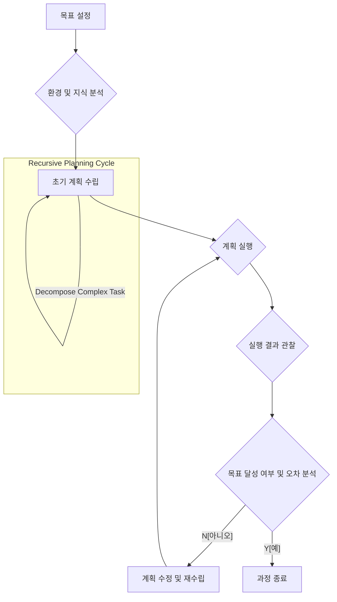

2026년 실무 환경에서 자율 에이전트가 복잡한 태스크를 안정적으로 수행하기 위한 핵심 역량은 정교한 플래닝 디자인에 달려 있습니다. 단순한 질의응답을 넘어 여러 단계를 거쳐야 하는 목표를 달성하기 위해, LLM 기반 에이전트는 효과적인 계획 수립 및 실행 전략을 필요로 합니다. 이는 에이전트의 신뢰성과 효율성을 결정하는 핵심 요소입니다.

## 핵심 플래닝 패턴

LLM 기반 자율 에이전트의 목표 달성 플래닝은 주로 다음 세 가지 핵심 패턴을 중심으로 발전합니다.

### 1. 계층적 플래닝 (Hierarchical Planning)
복잡한 목표를 더 작고 관리 가능한 하위 태스크로 분해하는 방식입니다. LLM은 상위 수준의 목표를 바탕으로 거시적인 계획을 수립하고, 각 하위 태스크에 대해 다시 세부적인 계획을 생성합니다. 이는 복잡성 관리에 필수적이며, 각 단계에서 실패 시에도 전체 시스템의 견고성을 유지하는 데 기여합니다.

```python
# Conceptual Python example for hierarchical planning
class Planner:
    def __init__(self, llm_model):
        self.llm = llm_model

    def decompose_task(self, goal: str) -> list[str]:
        # LLM을 사용하여 상위 목표를 하위 태스크로 분해
        prompt = f"Given the goal: '{goal}', decompose it into sequential, actionable sub-tasks."
        response = self.llm.generate(prompt)
        # Parse LLM output into a list of sub-tasks
        return [task.strip() for task in response.split("\n") if task.strip()]

    def plan_sub_task(self, sub_task: str, context: str) -> str:
        # 각 하위 태스크에 대한 구체적인 실행 계획 수립
        prompt = f"Given the sub-task: '{sub_task}' and current context: '{context}', devise a detailed execution plan including necessary tools."
        response = self.llm.generate(prompt)
        return response

    def execute_plan(self, plan: str):
        print(f"Executing: {plan}")
        # Placeholder for actual tool execution or code generation
        # This would involve calling specific tools, APIs, or generating code
        pass

# Example usage
# llm_agent_model = SomeLLMAPI() # Assume an LLM API wrapper
# planner = Planner(llm_agent_model)
#
# overall_goal = "Research AI agent planning patterns and summarize findings."
# sub_tasks = planner.decompose_task(overall_goal)
#
# current_context = ""
# for i, task in enumerate(sub_tasks):
#     print(f"Sub-task {i+1}: {task}")
#     plan = planner.plan_sub_task(task, current_context)
#     planner.execute_plan(plan)
#     # Update context based on execution results
#     current_context += f"Executed sub-task '{task}' with plan: '{plan}'.\n"
```

### 2. 반복적 플래닝 및 수정 (Iterative Planning and Refinement)
초기 계획을 수립한 후, 실행 결과나 환경 변화에 따라 계획을 지속적으로 평가하고 수정하는 패턴입니다. 이는 ReAct (Reasoning and Acting) 프레임워크와 같은 접근 방식에서 두드러지게 나타나며, 에이전트가 예상치 못한 상황에 유연하게 대처하고, 목표 달성을 위한 최적의 경로를 탐색할 수 있도록 돕습니다. 계획-실행-관찰-반영 (Plan-Execute-Observe-Reflect) 주기가 핵심입니다.

### 3. 도구 통합 플래닝 (Tool-Integrated Planning)
LLM 에이전트가 특정 작업을 수행하기 위해 외부 도구 (API 호출, 데이터베이스 조회, 코드 실행 등)를 언제, 어떻게 사용할지 계획하는 능력입니다. 효과적인 도구 통합 플래닝은 LLM의 한계를 보완하고, 실제 세계와 상호작용하며 복잡한 문제를 해결하는 데 필수적입니다. 플래닝 단계에서 사용 가능한 도구 목록과 그 기능을 고려하여 최적의 도구 사용 시퀀스를 결정합니다.

## 플래닝 프로세스 다이어그램



## 2026년 실무 적용 트렌드

2026년에는 LLM 기반 에이전트의 플래닝 역량이 더욱 고도화될 것입니다. 단순히 선형적인 계획 수립을 넘어, 비결정적(non-deterministic) 환경에서의 강건한(robust) 추론, 다중 에이전트 협업 환경에서의 분산 플래닝, 그리고 자가 회복(self-healing) 메커니즘을 포함한 자율성 강화가 주요 트렌드가 될 것입니다. 특히, 복잡한 비즈니스 프로세스 자동화, 데이터 기반 의사결정 지원, 그리고 소프트웨어 개발 수명 주기(SDLC) 전반에 걸친 자율 에이전트 활용이 가속화될 것으로 예상됩니다. Context Engineering을 통한 Ambient Knowledge Injection은 플래닝 품질을 향상시킬 것입니다.

## 트레이드오프

LLM 기반 자율 에이전트의 플래닝 패턴 적용은 여러 장점과 단점을 수반합니다.

*   **정교한 복합 태스크 처리 능력**:
    *   **언제 좋고**: 다단계 추론, 다양한 외부 도구 사용, 불확실한 환경에서의 의사결정이 필요한 복잡한 목표 달성에 매우 효과적입니다. 에이전트가 `Long-term dependencies`를 관리하고 `Coherence`를 유지하는 데 필수적입니다.
    *   **언제 나쁜지**: 단순 반복적이거나 명확한 규칙 기반의 태스크에는 과도한 오버헤드를 발생시킬 수 있습니다.

*   **강건성 (Robustness) 및 적응성**:
    *   **언제 좋고**: 예측 불가능한 `Edge cases`나 실행 중 발생하는 오류에 대해 스스로 계획을 수정하고 적응할 수 있는 유연성을 제공합니다. `Real-time environment changes`에 대한 대응력을 높입니다.
    *   **언제 나쁜지**: 계획 수정 로직의 복잡성 증가로 인해 디버깅 및 유지보수가 어려워질 수 있으며, 무한 루프나 `Planning paralysis`에 빠질 위험이 있습니다.

*   **자율성 및 휴먼 인 더 루프 (Human-in-the-Loop) 감소**:
    *   **언제 좋고**: 반복적인 수동 개입 없이도 에이전트가 독립적으로 목표를 향해 나아갈 수 있도록 하여 운영 효율성을 크게 향상시킵니다.
    *   **언제 나쁜지**: 치명적인 오류나 의도치 않은 결과가 발생했을 때 인간의 개입 시점을 놓치거나, 에이전트의 불투명한 의사결정 과정으로 인해 `Accountability` 문제가 발생할 수 있습니다.

*   **성능 (Latency) 및 비용**:
    *   **언제 좋고**: 장기적으로는 수동 작업에 드는 비용과 시간을 절약할 수 있습니다.
    *   **언제 나쁜지**: 각 플래닝 단계에서 LLM 호출이 발생하므로, `API Latency`가 증가하고 `Computational cost`가 상승합니다. 특히 `Real-time` 응답이 중요한 시스템에는 제약이 될 수 있습니다.

*   **환각 (Hallucination) 및 오류 전파 완화**:
    *   **언제 좋고**: 계획의 각 단계에서 `Reflection` 및 `Validation` 메커니즘을 통해 LLM의 환각이나 잘못된 추론이 다음 단계로 전파되는 것을 조기에 탐지하고 수정할 기회를 제공합니다. 이는 `LLM output validation` 전략과 결합될 때 특히 효과적입니다.
    *   **언제 나쁜지**: 계획 자체가 잘못되었을 경우, 이를 인지하고 수정하는 데 추가적인 지연이 발생할 수 있습니다. 또한, 잘못된 `Observation`은 올바른 계획 수정으로 이어지지 못할 수 있습니다.

## 실전 체크리스트

프로젝트에 LLM 기반 자율 에이전트의 플래닝 패턴을 적용할 때 다음 사항들을 검증해야 합니다.

*   - [ ] 에이전트가 해결해야 할 목표와 하위 태스크가 명확히 정의되고, 각 태스크의 성공 기준이 측정 가능하도록 설정되었는지 확인합니다. (`Evaluation/LLM-Output-Validation-Quality-Metrics-Design` 참조)
*   - [ ] 계층적 플래닝 구조가 깊이가 너무 깊지 않아 `Planning latency`를 과도하게 증가시키지 않는지, 또는 너무 얕아서 복잡성을 효과적으로 관리하지 못하는지 검토합니다.
*   - [ ] 에이전트의 `Reflection` 및 `Self-correction` 메커니즘이 `Execution results`와 `Environmental feedback`을 바탕으로 효과적으로 계획을 수정하는지 테스트 케이스를 통해 검증합니다. (`Harness-Engineering/Guard-Test-Pattern` 활용)
*   - [ ] 에이전트가 활용할 외부 도구 (`Tool-use`)의 목록, 각 도구의 기능, 그리고 LLM이 도구를 호출하는 방식이 명확히 정의되고, `Error handling`이 고려되었는지 확인합니다.
*   - [ ] 플래닝 과정에서 생성되는 중간 결과물 (`Intermediate thoughts`, `Execution traces`)이 로깅되어 `Troubleshooting` 및 `Post-mortem analysis`에 활용될 수 있는지 확인합니다.
*   - [ ] `Long-running tasks`의 경우, `Checkpointing` 및 `Resumption` 전략이 구현되어 에이전트가 중단 후에도 이어서 작업을 수행할 수 있는지 검토합니다.
*   - [ ] 에이전트의 자율성이 증가함에 따라, `Human-in-the-loop` 개입이 필요한 `Critical failure` 시나리오를 식별하고, 적절한 `Alerting` 및 `Intervention points`가 설계되었는지 확인합니다. (`Data-Engineering/Production-DB-AI-Agent-Guardrails` 참조)