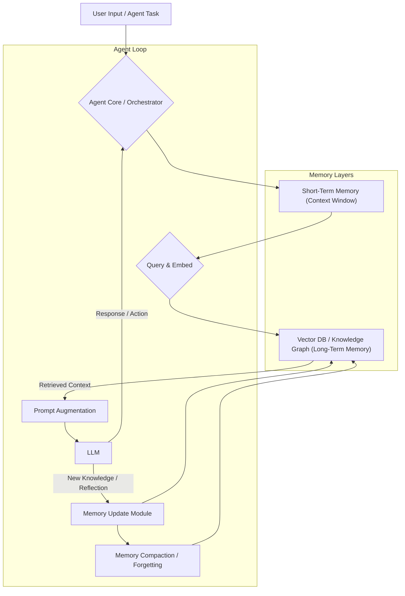

The power of Large Language Models (LLMs) is undeniable, but their fundamental limitation – the fixed context window – often hinders their ability to perform complex, long-running tasks and learn continuously. **Long-term memory** is the essential solution, enabling LLM agents to transcend transient interactions, accumulate knowledge, and drive more robust, autonomous behaviors.

## 장기 기억의 필요성 (Necessity of Long-Term Memory)

LLM 에이전트가 실제 세계의 복잡한 문제를 해결하고 지속적으로 진화하기 위해서는 다음 핵심 기능이 필수적입니다:

*   **컨텍스트 제약 극복 (Overcoming Context Limitations)**: 제한된 LLM 컨텍스트 윈도우 문제를 해결하고, 과거 정보를 영구적으로 저장 및 효율적으로 검색합니다.
*   **지속적인 학습 (Continuous Learning)**: 새로운 정보와 경험을 축적하고, 에이전트의 지능을 지속적으로 확장시킵니다.
*   **개인화 및 상태 유지 (Personalization & State Persistence)**: 사용자별 선호도, 과거 상호작용, 프로젝트 상태 등을 기억하여 일관되고 개인화된 서비스를 제공합니다.
*   **복잡한 작업 수행 (Complex Task Execution)**: 다단계 및 장기 작업의 중간 결과, 계획, 제약 조건을 관리하는 데 필수적입니다.

## LLM 에이전트 장기 기억 디자인 패턴 (LLM Agent Long-Term Memory Design Patterns)

장기 기억 시스템은 정보의 인코딩, 저장, 검색, 활용 방식에 대한 다양한 패턴을 포함합니다. 2026년 현재 주요 패턴은 다음과 같습니다.

### 1. 계층적 기억 시스템 (Hierarchical Memory Systems)

에이전트의 기억을 여러 계층으로 나누어 관리합니다.

*   **단기 기억 (Short-Term Memory - STM)**: 현재 컨텍스트 윈도우 정보. 즉각적인 추론.
*   **작업 기억 (Working Memory - WM)**: 현재 태스크 중간 결과, 계획, 목표. 압축 또는 장기 기억으로 전이.
*   **장기 기억 (Long-Term Memory - LTM)**: 모든 과거 경험, 지식, 사실. 벡터 DB, 지식 그래프 등으로 구현.

에이전트는 이 계층들을 오가며 정보를 처리, STM 부족 시 WM 또는 LTM에서 정보 보충.

### 2. 검색 증강 생성 (Retrieval-Augmented Generation, RAG)

LLM이 외부 장기 기억 저장소에서 관련 정보를 검색하여 프롬프트 컨텍스트를 강화하는 강력한 패턴입니다.

*   **과정**: 사용자 쿼리 -> 임베딩 -> 벡터 DB 유사도 검색 -> 관련 정보 LLM 프롬프트에 추가 -> 답변 생성.
이를 통해 LLM은 최신 정보나 특정 도메인 지식을 활용하여 환각을 줄이고 정확도를 높입니다.

### 3. 반성 및 자기 수정 (Reflection and Self-Correction)

에이전트가 과거 행동을 되돌아보고 오류를 식별하여 미래 행동을 개선하는 패턴입니다. 작업 결과가 기대에 미치지 못할 때, 행동 로그, 관찰, 목표를 장기 기억에 저장하고 분석하여 새로운 지식, 제약 조건, 또는 전략으로 업데이트합니다.

### 4. 기억 압축 및 망각 (Memory Compaction and Forgetting)

장기 기억의 무한한 증가를 방지하고 검색 효율성을 유지하는 패턴입니다.

*   **압축 (Compaction)**: 유사하거나 중복되는 기억을 통합, 핵심 정보 추출.
*   **망각 (Forgetting)**: 오래되거나 중요도 낮은 기억, 오류 기억 제거. 기억의 관련성과 효율성 유지.

## 구현 예시: 간단한 RAG 기반 장기 기억 에이전트 (Implementation Example: Simple RAG-based Long-Term Memory Agent)

다음은 Python으로 구현된 간단한 RAG 에이전트의 의사 코드입니다. `vector_store`는 장기 기억을 시뮬레이션하며, 사용자 입력에 따라 관련 정보를 검색하여 LLM 프롬프트에 추가합니다.

```python
from typing import List, Dict
from datetime import datetime

# 가정: 실제 LLM API 호출 및 임베딩 함수는 별도 구현

class SimpleVectorStore:
    def __init__(self):
        self.documents: List[Dict] = []
        self.next_id = 0

    def add_document(self, content: str, metadata: Dict = None):
        doc_id = self.next_id
        self.next_id += 1
        self.documents.append({
            "id": doc_id,
            "content": content,
            "metadata": metadata if metadata else {"timestamp": datetime.now().isoformat()}
        })
        print(f"Document added: {content[:30]}...")
        return doc_id

    def retrieve(self, query: str, top_k: int = 2) -> List[Dict]:
        print(f"Retrieving for query: '{query}'")
        relevant_docs = [doc for doc in self.documents if query.lower() in doc["content"].lower()]
        return relevant_docs[:top_k]

class LLMAgentWithMemory:
    def __init__(self, memory_store: SimpleVectorStore):
        self.memory_store = memory_store

    def _generate_response_with_context(self, prompt: str, context: List[str]) -> str:
        full_prompt = f"Context:\n{''.join(context)}\n\nUser Query: {prompt}\n\nAgent Response:"
        print(f"--- LLM Input (simulated) ---\n{full_prompt}\n--------------------------")
        if "오늘 날씨" in prompt:
            return "오늘 날씨는 맑고 쾌청합니다."
        if "프로젝트 계획" in prompt and any("프로젝트 시작일" in c for c in context):
            # Split and get value more robustly
            start_date = next((c.split(': ')[1] for c in context if "프로젝트 시작일" in c), "정보 없음")
            current_stage = next((c.split(': ')[1] for c in context if "현재 단계" in c), "정보 없음")
            return f"프로젝트는 {start_date}에 시작했으며, 현재 {current_stage} 단계입니다."
        if "프로젝트 B의 목표" in prompt and any("프로젝트 B 목표" in c for c in context):
            project_b_goal = next((c.split(': ')[1] for c in context if "프로젝트 B 목표" in c), "정보 없음")
            return f"프로젝트 B 목표: {project_b_goal}"
        return "죄송합니다. 현재 정보로는 답변하기 어렵습니다."

    def chat(self, user_query: str) -> str:
        retrieved_info = self.memory_store.retrieve(user_query, top_k=2)
        context_texts = [doc["content"] for doc in retrieved_info]
        response = self._generate_response_with_context(user_query, context_texts)
        if "정보 저장" in user_query:
            self.memory_store.add_document(f"사용자가 중요하다고 언급한 정보: {user_query}")
        return response

# 에이전트 초기화
memory_store = SimpleVectorStore()
agent = LLMAgentWithMemory(memory_store)

# 장기 기억에 정보 추가
memory_store.add_document("프로젝트 A 시작일: 2026년 3월 1일")
memory_store.add_document("프로젝트 A 현재 단계: 요구사항 분석")
memory_store.add_document("프로젝트 B 목표: AI 에이전트 개발 및 배포")
memory_store.add_document("서울 날씨는 대체로 온화함.")

# 에이전트와 대화
print(agent.chat("오늘 날씨는 어떤가요?"))
print(agent.chat("프로젝트 A의 현재 상황을 알려줘."))
print(agent.chat("프로젝트 B의 목표가 무엇이지?"))
```

## LLM 에이전트 장기 기억 아키텍처 (LLM Agent Long-Term Memory Architecture)



## 2026년 최신 트렌드: 진화하는 장기 기억 시스템 (2026 Trends: Evolving Long-Term Memory Systems)

*   **하이브리드 메모리 아키텍처 (Hybrid Memory Architectures)**: 벡터 DB를 넘어 그래프 DB, RDB, NoSQL 등 다양한 저장소를 결합하여 에피소드, 의미론적, 절차적 기억을 효율적으로 관리하는 복합 시스템이 보편화됩니다.
*   **적응형 검색 전략 (Adaptive Retrieval Strategies)**: 단순히 유사도 기반 검색을 넘어, 에이전트의 목표, 대화 맥락, 사용자 의도에 따라 동적으로 관련성 높은 기억을 탐색하고 가져오는 고급 기법이 중요해지고 있습니다.
*   **지속적 학습 및 자가 개선 (Continuous Learning & Self-Improvement)**: 에이전트가 상호작용과 경험을 통해 장기 기억을 자동 업데이트하고, 지식 기반을 확장하며, 기억 관리 전략까지 최적화하는 메타 학습 역량이 강화됩니다.
*   **상태 전이 및 일관성 관리 (State Transition & Consistency Management)**: 복잡한 장기 태스크에서 에이전트의 상태를 장기 기억 내에서 일관되게 유지하고, 상태 전이 로직을 명확히 정의하여 예측 가능성과 신뢰성을 높이는 패턴이 중요해집니다.

## 트레이드오프 (Trade-offs)

장기 기억 도입 시 성능, 복잡성, 비용 측면에서 신중한 고려가 필요합니다.

*   **복잡성 vs. 성능 향상 (Complexity vs. Performance Improvement)**:
    *   **언제 좋고**: 방대한 정보와 장기간 일관된 지식이 필요한 복잡한 애플리케이션 (고객 서비스, 프로젝트 관리). 성능과 신뢰도를 비약적으로 향상시킵니다.
    *   **언제 나쁜지**: 단기 질의응답이나 단순 반복 작업처럼 컨텍스트 윈도우만으로 충분한 경우. 불필요한 복잡성 및 유지보수 비용을 증가시킵니다.
*   **검색 정확도 vs. 지연 시간 (Recall Accuracy vs. Latency)**:
    *   **언제 좋고**: 미션 크리티컬한 정보 검색이나 높은 정확도가 요구되는 시나리오. 정교한 검색은 정확도를 높이지만 지연 시간이 길어질 수 있습니다.
    *   **언제 나쁜지**: 실시간 응답이 중요하고 약간의 부정확성이 허용되는 애플리케이션 (캐주얼 챗봇). 과도한 검색 로직은 사용자 경험을 저해합니다.
*   **메모리 풋프린트 vs. 비용 (Memory Footprint vs. Cost)**:
    *   **언제 좋고**: 대량의 데이터를 장기간 보존 및 활용하는 엔터프라이즈 환경. 분산 저장 및 효율적 압축으로 비용을 관리하며 방대한 기억을 유지합니다.
    *   **언제 나쁜지**: 리소스가 제한적이거나 예산이 빠듯한 프로젝트. 불필요한 데이터 저장이나 비효율적 인덱싱은 스토리지 및 컴퓨팅 비용을 급증시킵니다.
*   **일반화 vs. 특수화 (Generalization vs. Specialization)**:
    *   **언제 좋고**: 특정 도메인에 깊은 전문성이 요구될 때. 고도로 정제되고 특수화된 지식을 저장하여 해당 도메인에서 탁월한 성능을 발휘합니다.
    *   **언제 나쁜지**: 다양한 주제를 광범위하게 다루는 범용 에이전트. 과도한 특수화는 일반적인 답변 능력을 저해하거나 기억 관리 복잡성, 편향을 증가시킵니다.

## 실전 체크리스트 (Practical Checklist)

LLM 에이전트에 장기 기억 패턴을 적용할 때 고려할 핵심 검증 항목들입니다.

-   [ ] **기억 유형 정의 및 저장 전략 수립**: 저장할 정보 유형(에피소드, 의미론적, 절차적), 적합한 DB(벡터 DB, 그래프 DB 등), 스키마 설계가 완료되었는가?
-   [ ] **검색 효율성 및 정확도 검증**: 검색 메커니즘이 정보를 빠르고 정확하게 찾아내는지 평가하고, `top_k` 및 임베딩 모델 적합성을 벤치마킹했는가?
-   [ ] **메모리 업데이트 및 일관성 관리 로직 구현**: 에이전트의 새로운 정보, 경험, 반성 결과 저장 로직이 정의되었으며, 기억 간 일관성이 유지되는지 확인했는가?
-   [ ] **기억 압축 및 망각 정책 정의**: 기억 저장소 크기 관리를 위한 압축 주기, 비활성 기억 제거 정책, 중요도 평가 메커니즘이 수립되어 있는가?
-   [ ] **지연 시간 (Latency) 및 비용 최적화**: 장기 기억 검색/업데이트가 전체 응답 시간에 미치는 영향을 측정하고, 캐싱, 인덱싱, 배치 처리 등을 통해 최적화했는가?
-   [ ] **에이전트 자가 개선 루프 설계**: 과거 성능을 평가하고 장기 기억을 통해 학습하여 스스로 전략을 개선하는 메커니즘이 구현되었는가?
-   [ ] **데이터 보안 및 접근 제어**: 장기 기억 내 민감 정보에 대한 암호화, 접근 제어, 감사 로그 등 보안 및 규정 준수 원칙이 준수되었는가?
