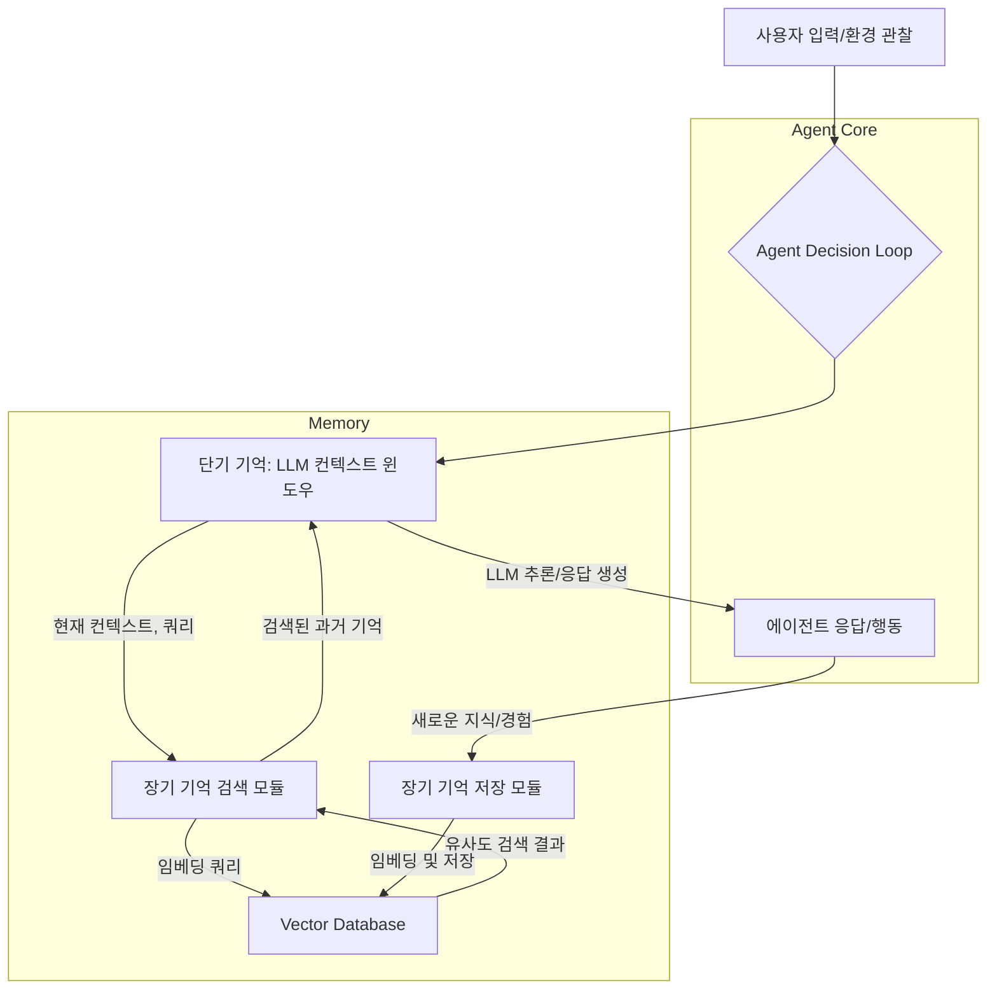

LLM(Large Language Model) 기반 자율 에이전트가 단순한 질의응답을 넘어 복잡한 작업을 수행하고 지속적으로 학습하기 위해서는 인간과 유사한 '장기 기억(Long-Term Memory)' 시스템이 필수적입니다. LLM의 컨텍스트 윈도우(Context Window)는 단기 기억(Short-Term Memory) 역할을 하지만, 그 용량의 한계로 인해 과거의 모든 정보를 유지하기는 어렵습니다. 장기 기억 시스템은 이러한 제약을 극복하고, 에이전트가 시간의 흐름에 따라 경험을 축적하고 이를 필요할 때 효과적으로 회상하여 활용할 수 있도록 돕습니다. 이는 에이전트의 지능, 유연성, 그리고 자율성을 극대화하는 핵심 요소입니다.

## 핵심 개념 및 구성 요소

LLM 에이전트의 장기 기억 시스템은 크게 세 가지 유형의 기억으로 나눌 수 있습니다:

*   **에피소드 기억(Episodic Memory):** 에이전트의 특정 경험, 상호작용, 수행된 작업 등 시간 순서에 따른 사건들을 저장합니다. '무엇을 언제 했는지'에 대한 기록으로, 과거의 행동 패턴이나 실패 사례를 통해 학습하는 데 중요합니다.
*   **의미 기억(Semantic Memory):** 일반적인 지식, 개념, 사실, 그리고 에이전트가 학습한 도메인별 정보를 저장합니다. 이는 언어 모델의 사전 학습된 지식과 더불어, 에이전트가 상호작용하며 새롭게 얻은 지식의 총합을 의미합니다.
*   **절차 기억(Procedural Memory):** '어떻게 하는지'에 대한 기억으로, 특정 도구를 사용하는 방법, 작업 흐름, 문제 해결 전략 등 에이전트의 스킬셋과 관련된 지식입니다. 이는 에이전트가 반복적인 작업을 효율적으로 수행하는 데 기여합니다.

이러한 기억 유형들은 상호 보완적으로 작동하며, 다음과 같은 구성 요소를 통해 관리됩니다.

### 1. 정보 저장 (Storage)

대부분의 장기 기억 시스템은 RAG(Retrieval Augmented Generation) 패턴을 기반으로 합니다. 에이전트가 새롭게 얻은 정보, 사용자의 요청, 또는 수행 결과를 텍스트 형태로 임베딩(Embedding)하고, 이를 Vector Database에 저장합니다. `ChromaDB`, `Pinecone`, `Weaviate`와 같은 솔루션이 주로 활용됩니다. 각 기억은 메타데이터(timestamp, source, relevance score 등)와 함께 저장되어 검색의 효율성을 높입니다.

### 2. 정보 검색 및 회상 (Retrieval and Recall)

에이전트가 특정 작업을 수행하거나 질문에 답할 때, 현재의 컨텍스트와 가장 관련성 높은 과거 기억을 Vector Database에서 검색합니다. 이 과정은 쿼리 임베딩과 저장된 기억 임베딩 간의 유사도(Similarity) 비교를 통해 이루어집니다. 검색된 정보는 LLM의 컨텍스트 윈도우에 주입되어, LLM이 더 풍부하고 정확한 정보를 바탕으로 추론하고 응답을 생성하도록 돕습니다.

### 3. 정보 정제 및 압축 (Refinement and Compaction)

장기 기억이 무한정 커지는 것을 방지하고, 중요한 정보의 밀도를 높이기 위해 주기적인 정제 및 압축 메커니즘이 필요합니다. 이는 중복된 정보를 제거하거나, 여러 개의 작은 기억을 하나의 포괄적인 개념으로 요약하고, 더 이상 관련성이 낮은 기억을 삭제하는 과정을 포함합니다. 자기 반성(Self-Reflection) 메커니즘을 통해 에이전트 스스로 기억의 중요도를 평가하고 업데이트할 수 있습니다.

## 장기 기억 시스템 디자인 패턴

### 1. 계층적 기억 구조 (Hierarchical Memory Architecture)

에이전트는 컨텍스트 윈도우라는 단기 기억을 통해 현재 대화나 작업을 관리하고, 외부 Vector Database는 장기 기억을 담당합니다. 이러한 계층 구조는 LLM의 인지 부하를 줄이고, 관련성 높은 정보를 효율적으로 활용하게 합니다.



### 2. 자기 성찰 및 기억 업데이트 (Self-Reflection and Memory Update)

에이전트가 자신의 과거 행동, 성공 및 실패 사례를 주기적으로 검토하고, 이를 바탕으로 장기 기억을 업데이트하는 패턴입니다. 이는 에이전트의 지속적인 학습(Continuous Learning)과 성능 향상에 기여합니다. 예를 들어, 특정 목표 달성에 실패했을 때, 관련 에피소드 기억들을 분석하여 '왜 실패했는지'에 대한 새로운 의미 기억을 생성하고 저장할 수 있습니다.

### 3. 멀티모달 기억 (Multimodal Memory)

텍스트 외에도 이미지, 오디오, 비디오 등 다양한 형태의 정보를 장기 기억에 저장하고 검색하는 방식입니다. 이는 에이전트가 실제 환경과 상호작용하는 멀티모달(Multimodal) 작업을 수행할 때 필수적입니다. 각 모달리티별로 적합한 임베딩 모델과 저장 전략이 필요하며, 통합된 검색 인터페이스를 제공하는 것이 중요합니다.

## 구현 방법론

LLM 에이전트의 장기 기억 시스템을 구축하기 위한 일반적인 접근 방식은 다음과 같습니다.

1.  **데이터 소스 정의:** 에이전트가 기억할 정보의 출처(사용자 대화, 도구 사용 로그, 외부 문서 등)를 명확히 합니다.
2.  **정보 청킹 및 임베딩:** 원시 데이터를 의미 있는 단위로 분할(Chunking)하고, `OpenAI Embeddings`, `Sentence Transformers`와 같은 임베딩 모델을 사용하여 벡터로 변환합니다.
3.  **Vector Database 선택 및 구축:** `ChromaDB`, `Pinecone`, `Weaviate`, `Qdrant` 등 프로젝트 요구사항에 맞는 Vector Database를 선택하고 설정합니다.
4.  **검색 전략 구현:** Similarity Search(유사도 검색), Max Marginal Relevance(MMR), Re-ranking 등 다양한 검색 알고리즘을 활용하여 쿼리에 가장 적합한 기억을 추출합니다.
5.  **기억 스트림 관리:** 새로운 기억을 저장하고, 기존 기억을 업데이트하거나 삭제하는 라이프사이클을 관리하는 로직을 구현합니다. `LangChain`이나 `LlamaIndex`와 같은 프레임워크는 이러한 과정을 추상화하여 쉽게 구현할 수 있도록 돕습니다.

### Python 코드 예제: VectorDB 기반 장기 기억 시스템

```python
from langchain_community.vectorstores import Chroma
from langchain_openai import OpenAIEmbeddings
from langchain_core.documents import Document
import os

# OpenAI API 키 설정 (환경 변수 또는 직접 설정)
os.environ["OPENAI_API_KEY"] = "YOUR_OPENAI_API_KEY"

# 1. 임베딩 모델 초기화
embeddings = OpenAIEmbeddings()

# 2. Vector Database 초기화 (여기서는 ChromaDB 사용, 인메모리 방식)
# 실제 서비스에서는 지속성을 위해 디렉토리 경로를 지정하거나 클라우드 DB 사용
persistent_directory = "./chroma_db"
vector_store = Chroma(persist_directory=persistent_directory, embedding_function=embeddings)

# 3. 새로운 기억 저장 함수
def add_memory(content: str, metadata: dict = None):
    doc = Document(page_content=content, metadata=metadata or {})
    vector_store.add_documents([doc])
    print(f"새로운 기억 저장 완료: {content[:50]}...")

# 4. 기억 검색 함수
def retrieve_memory(query: str, k: int = 3):
    # 유사도 기반으로 관련성 높은 기억 검색
    results = vector_store.similarity_search(query, k=k)
    print(f"'{query}'에 대한 기억 검색 결과:")
    for i, doc in enumerate(results):
        print(f"  {i+1}. 내용: {doc.page_content[:100]}..., 메타데이터: {doc.metadata}")
    return results

if __name__ == "__main__":
    # 기억 추가
    add_memory("나는 2026년 5월 1일에 한국에서 진행된 AI 컨퍼런스에 참석했다.", {"type": "episodic", "date": "2026-05-01"})
    add_memory("AI 에이전트의 장기 기억은 컨텍스트 윈도우 한계를 극복하는 데 중요하다.", {"type": "semantic", "topic": "AI Agents"})
    add_memory("파이썬에서 LangChain을 사용하여 LLM 에이전트를 개발하는 방법을 학습했다.", {"type": "procedural", "skill": "LangChain"})
    add_memory("오늘 아침에 복잡한 코드 리팩토링 작업을 성공적으로 완료했다.", {"type": "episodic", "date": "2026-05-28"})

    # 기억 검색
    retrieve_memory("과거에 참석했던 컨퍼런스는 무엇인가요?")
    retrieve_memory("LLM 컨텍스트 한계를 어떻게 극복하나요?")
    retrieve_memory("LangChain으로 무엇을 했나요?")
    retrieve_memory("최근에 완료한 작업은 무엇인가요?")

    # 인메모리 ChromaDB는 스크립트 종료 시 데이터 손실. 실제 사용 시 `vector_store.persist()` 호출
    # vector_store.persist() # 주석 해제하여 디스크에 저장 가능
```

## 트레이드오프

LLM 에이전트의 장기 기억 시스템을 설계할 때는 다양한 트레이드오프를 고려해야 합니다.

*   **RAG 복잡성 vs. 성능 및 비용:**
    *   **언제 좋은가:** 최신 정보 반영, 환각(Hallucination) 감소, 도메인 특화 지식 활용에 유리합니다. LLM의 제약된 컨텍스트 윈도우를 효과적으로 확장합니다.
    *   **언제 나쁜가:** 추가적인 검색(Retrieval) 과정으로 인해 전체 응답 Latency가 증가하고, 임베딩 및 Vector Database 운영 비용이 발생합니다. 검색 관련성(Relevance)이 떨어지면 오히려 잘못된 정보를 주입할 위험이 있습니다.

*   **기억 정제/압축 vs. 정보 손실 위험:**
    *   **언제 좋은가:** 관련성 높은 정보의 밀도를 유지하여 검색 효율을 높이고, 불필요한 정보로 인한 노이즈를 줄여 LLM의 추론 정확도를 향상시킵니다.
    *   **언제 나쁜가:** 압축 과정에서 미묘하지만 중요한 디테일이 손실될 수 있으며, 자동화된 정제 로직이 에이전트의 '잊어서는 안 될' 기억을 잘못 삭제할 위험이 있습니다. 이 과정 자체에 추가적인 컴퓨팅 리소스가 소모됩니다.

*   **임베딩 모델 선택 (범용 vs. 도메인 특화):**
    *   **언제 좋은가:** 특정 도메인에 최적화된 임베딩 모델(예: 의학, 법률)은 해당 분야의 문맥을 더 잘 이해하고 정확한 유사도 검색을 가능하게 합니다. 초기 개발 시에는 범용 모델이 빠르게 프로토타이핑을 가능하게 합니다.
    *   **언제 나쁜가:** 도메인 특화 모델은 학습 데이터 구축 및 미세 조정(Fine-tuning)에 많은 시간과 비용이 들 수 있으며, 범용성이 떨어져 다른 도메인으로의 확장이 어렵습니다. 범용 모델은 특정 니즈에 대한 성능이 낮을 수 있습니다.

*   **기억 구조 복잡성 (단일 VectorDB vs. 계층적/그래프 구조):**
    *   **언제 좋은가:** 간단한 단일 Vector Database는 구현이 용이하고 빠르게 시작할 수 있습니다. 계층적이거나 Knowledge Graph 기반의 복잡한 구조는 에이전트의 심층적인 추론과 관계형 지식 활용에 유리합니다.
    *   **언제 나쁜가:** 복잡한 기억 구조는 초기 설계 및 구현 비용이 높고, 관리 및 유지보수가 어렵습니다. 과도한 복잡성은 오히려 성능 저하나 불필요한 오버헤드를 유발할 수 있습니다.

## 실전 체크리스트

LLM 에이전트의 장기 기억 시스템을 프로젝트에 적용할 때 다음 항목들을 검증하여 성공적인 구현을 보장합니다.

*   [ ] **기억 검색 Latency 목표 정의 및 달성 여부:** 최종 사용자의 경험을 저해하지 않도록, 기억 검색 Latency (예: < 200ms)를 명확히 정의하고 실제 시스템에서 측정하여 목표를 충족하는지 확인합니다.
*   [ ] **임베딩 전략 최적화 검증:** 사용 중인 임베딩 모델, 청킹(Chunking) 방법, 오버랩(Overlap) 설정이 특정 도메인 및 데이터 유형에 대해 최적의 검색 정확도를 제공하는지 정량적으로 평가하고 문서화합니다.
*   [ ] **기억 업데이트 및 압축 정책 구현:** 에이전트의 기억이 불필요하게 비대해지지 않고, 최신 정보가 적절히 반영되도록 주기적인 업데이트(예: 일별, 주별) 및 압축(Compaction) 정책이 구현되었는지 확인합니다.
*   [ ] **검색 관련성 및 환각률 측정:** 검색된 정보가 LLM의 응답에 얼마나 관련성이 높은지, 그리고 관련 없는 정보 주입으로 인한 환각률이 특정 임계값 이하로 유지되는지 지속적으로 모니터링합니다.
*   [ ] **Vector Database 비용-효율성 분석 완료:** 다양한 Vector Database 솔루션(Managed vs. Self-hosted)의 비용, 확장성, 성능을 비교 분석하여 프로젝트의 예산 및 요구사항에 가장 적합한 솔루션을 선택했는지 확인합니다.
*   [ ] **복합 장기 작업 성능 검증:** 에이전트가 장기 기억을 활용하여 여러 단계를 거쳐야 하는 복잡한 작업을 성공적으로 수행하는지, 그리고 시간이 지남에 따라 성능이 유지 또는 개선되는지 엔드투엔드(End-to-End) 테스트를 통해 검증합니다.
*   [ ] **기억 저장소의 데이터 보안 및 프라이버시 조치:** 저장되는 기억 데이터의 민감도를 고려하여, 암호화, 접근 제어, 데이터 익명화 등 적절한 데이터 보안 및 프라이버시(Privacy) 보호 조치가 구현되었는지 점검합니다.