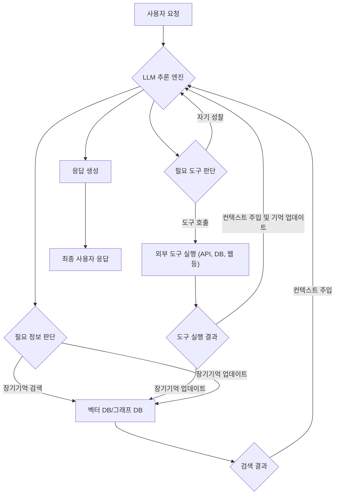

LLM 기반 자율 에이전트가 단순 질의응답을 넘어 복잡하고 다단계적인 태스크를 성공적으로 수행하기 위해서는 인간과 유사한 '기억'과 '행동' 능력이 필수적입니다. 여기서 기억은 장기기억(Long-Term Memory)을, 행동은 외부 도구(Tool) 사용을 의미합니다. 이 두 가지 핵심 역량의 효과적인 설계 및 구현 패턴은 에이전트의 지능적 의사결정, 지속적인 학습, 그리고 현실 세계와의 상호작용 능력을 결정합니다.

## 장기기억 패턴 (Long-Term Memory Patterns)
에이전트의 장기기억은 제한된 컨텍스트 윈도우(context window)를 넘어 과거의 경험, 지식, 학습 내용을 지속적으로 참조할 수 있게 합니다. 이는 에이전트가 복잡한 문제 해결, 장기 계획 수립, 일관된 페르소나 유지를 가능하게 하는 핵심 요소입니다.

### 1. RAG(Retrieval Augmented Generation) 기반 지식 검색
가장 널리 사용되는 장기기억 패턴입니다. 외부 지식 베이스(예: 문서, 데이터베이스, 웹)에서 관련 정보를 검색하여 LLM의 컨텍스트에 주입합니다.
*   **구현**: 텍스트 청킹(chunking), 임베딩(embedding), 벡터 데이터베이스(Vector Database) 저장 및 유사도 검색을 통해 이루어집니다.
*   **장점**: 최신 정보 반영, 환각(hallucination) 감소, 도메인 특화 지식 활용.
*   **고려사항**: 검색 성능, 청킹 전략, 임베딩 모델 선택, 벡터 DB 관리 비용.

### 2. 그래프 기반 지식 표현 (Graph-based Knowledge Representation)
단순 검색을 넘어 지식 간의 복잡한 관계를 파악해야 할 때 유용합니다.
*   **구현**: Neo4j 같은 그래프 데이터베이스에 엔티티(entity)와 관계(relationship)를 저장하고, Cypher 쿼리 등을 통해 지식을 추론합니다.
*   **장점**: 복잡한 추론, 맥락적 이해 증진, 지식 간의 연결성 시각화.
*   **고려사항**: 스키마 설계, 데이터 입력 자동화, 쿼리 복잡성.

### 3. 계층적 메모리 시스템 (Hierarchical Memory Systems)
단기(Short-Term), 작업(Working), 장기(Long-Term) 메모리 등 여러 계층으로 나누어 효율성을 높입니다.
*   **단기 메모리**: 현재 대화 또는 태스크와 관련된 정보를 저장 (주로 LLM 컨텍스트 윈도우).
*   **작업 메모리**: 현재 진행 중인 태스크의 중간 결과, 계획, 목표 등을 저장 (예: JSON 또는 스크래치패드).
*   **장기 메모리**: 영구적인 지식, 과거 경험, 학습된 패턴 등을 저장 (RAG, 그래프 DB).
*   **상호작용**: 에이전트의 의사결정 루프는 이 세 가지 메모리 유형을 오가며 정보를 검색하고 업데이트합니다.

## 도구 사용 패턴 (Tool Usage Patterns)
에이전트가 외부 세계와 상호작용하고, LLM의 한계를 극복하며, 특정 태스크를 정밀하게 수행하도록 돕는 것이 도구입니다.

### 1. 함수 호출 기반 도구 (Function Calling-based Tools)
가장 일반적인 도구 사용 패턴으로, LLM이 주어진 태스크를 해결하기 위해 호출해야 할 외부 함수의 이름과 인자를 생성합니다.
*   **구현**: LLM에 함수 스키마(function schema)를 제공하고, LLM이 생성한 함수 호출(function call)을 파싱하여 실제 함수를 실행합니다.
*   **장점**: LLM의 추론 능력과 외부 시스템의 실행 능력을 결합.
*   **고려사항**: 정확한 스키마 정의, 에러 처리, 보안.

### 2. 도구 오케스트레이션 (Tool Orchestration)
단일 도구 사용을 넘어 여러 도구를 조합하여 복잡한 워크플로우를 구성합니다.
*   **순차적 오케스트레이션**: 한 도구의 출력이 다음 도구의 입력이 되는 직렬 구조.
*   **병렬 오케스트레이션**: 여러 도구를 동시에 실행하고 그 결과를 취합.
*   **조건부 오케스트레이션**: 특정 조건에 따라 다른 도구 경로를 선택.
*   **장점**: 복잡한 비즈니스 로직 처리, 유연한 태스크 수행.
*   **고려사항**: 상태 관리, 의존성 해결, 에러 전파.

### 3. 자기 성찰 기반 도구 선택 및 개선 (Self-Reflection for Tool Selection and Refinement)
에이전트가 도구 사용 결과에 대해 스스로 평가하고, 필요한 경우 도구 선택이나 사용 방법을 개선하는 패턴입니다.
*   **구현**: 도구 사용 후 LLM에 결과와 원래 목표를 다시 제시하여 피드백을 생성하고, 이를 바탕으로 다음 행동을 계획하거나 도구 사용 전략을 수정합니다.
*   **장점**: 자율성 증대, 에러로부터의 학습, 복잡한 문제 해결 능력 향상.
*   **고려사항**: 피드백 루프 설계, 재시도 로직, 무한 루프 방지.

## 장기기억과 도구의 시너지 (Synergy of Long-Term Memory and Tools)
장기기억과 도구는 상호보완적인 관계를 가집니다. 에이전트는 장기기억에서 검색한 정보를 기반으로 가장 적절한 도구를 선택하고, 도구 사용을 통해 얻은 새로운 정보를 다시 장기기억에 저장하여 지식을 업데이트합니다.



### 코드 예제: 장기기억 (RAG) 및 도구 사용 통합

```python
# Python 예제: LLM 에이전트의 장기기억 (RAG) 및 도구 사용 패턴

import json
# from openai import OpenAI # 실제 LLM API 호출 라이브러리 (예: OpenAI, Anthropic)
# from qdrant_client import QdrantClient, models # 실제 Vector DB 라이브러리

class AgentMemory:
    """장기기억 관리 (RAG 패턴)"""
    def __init__(self):
        # self.vector_db = QdrantClient(...) # 실제 Vector DB 클라이언트
        self.knowledge_base = {
            "회사 정책": "모든 직원은 연 20일의 유급 휴가를 사용할 수 있습니다.",
            "팀 구조": "개발팀은 백엔드, 프론트엔드, AI 파트로 구성됩니다.",
            "비용 처리 절차": "비용은 '경비청구 시스템'을 통해 제출해야 합니다."
        } # 예시를 위한 단순 딕셔너리

    def retrieve(self, query: str, top_k: int = 1) -> list[str]:
        """쿼리와 관련된 지식을 검색합니다."""
        # 실제로는 query를 임베딩하여 Vector DB에서 유사도 검색
        related_info = []
        for key, value in self.knowledge_base.items():
            if query in key or query in value: # 단순 키워드 매칭 (예시)
                related_info.append(value)
        return related_info[:top_k]

    def add_or_update(self, fact: str, content: str):
        """새로운 지식을 추가하거나 업데이트합니다."""
        # 실제로는 fact와 content를 임베딩하여 Vector DB에 저장/업데이트
        self.knowledge_base[fact] = content
        print(f"메모리 업데이트: {fact}")

class AgentTools:
    """에이전트 도구 정의 및 실행"""
    def get_calendar_events(self, date: str) -> str:
        """특정 날짜의 캘린더 이벤트를 조회합니다."""
        if date == "2026-07-20":
            return "2026년 7월 20일에는 '주간 팀 회의'와 '프로젝트 A 발표'가 있습니다."
        return f"{date}에는 예정된 이벤트가 없습니다."

    def submit_expense_report(self, amount: int, description: str) -> str:
        """경비 청구서를 제출합니다."""
        if amount > 0:
            return f"{description}에 대해 {amount}원 경비 청구서가 성공적으로 제출되었습니다."
        return "유효하지 않은 금액입니다."

    def get_tool_definitions(self) -> list[dict]:
        """LLM이 이해할 수 있는 도구 정의 스키마를 반환합니다."""
        return [
            {
                "type": "function",
                "function": {
                    "name": "get_calendar_events",
                    "description": "특정 날짜의 캘린더 이벤트를 조회하는 도구입니다.",
                    "parameters": {
                        "type": "object",
                        "properties": {"date": {"type": "string", "description": "조회할 날짜 (YYYY-MM-DD 형식)"}},
                        "required": ["date"],
                    },
                },
            },
            {
                "type": "function",
                "function": {
                    "name": "submit_expense_report",
                    "description": "경비 청구서를 제출하는 도구입니다.",
                    "parameters": {
                        "type": "object",
                        "properties": {
                            "amount": {"type": "integer", "description": "청구 금액"},
                            "description": {"type": "string", "description": "청구 내용"},
                        },
                        "required": ["amount", "description"],
                    },
                },
            },
        ]

class LLMAgent:
    """LLM 기반 자율 에이전트 (기억 및 도구 통합)"""
    def __init__(self):
        # self.llm_client = OpenAI(...) # 실제 LLM 클라이언트 초기화
        self.memory = AgentMemory()
        self.tools = AgentTools()
        self.conversation_history = []

    def _call_llm(self, messages: list[dict], tools: list[dict]):
        """LLM 호출을 시뮬레이션합니다."""
        # 실제 LLM API 호출 로직
        # 예시 응답 (get_calendar_events 도구 호출 유도)
        if "2026년 7월 20일" in messages[-1]["content"]:
            return {
                "role": "assistant",
                "tool_calls": [
                    {
                        "id": "call_123",
                        "function": {
                            "name": "get_calendar_events",
                            "arguments": '{"date": "2026-07-20"}',
                        },
                        "type": "function",
                    }
                ],
            }
        # 예시 응답 (정보 검색 및 응답)
        if "휴가" in messages[-1]["content"]:
            return {"role": "assistant", "content": "회사 정책에 따르면 연 20일의 유급 휴가를 사용할 수 있습니다."}
        # 예시 응답 (경비 청구 도구 호출 유도)
        if "경비 처리" in messages[-1]["content"] and "15000원" in messages[-1]["content"]:
            return {
                "role": "assistant",
                "tool_calls": [
                    {
                        "id": "call_456",
                        "function": {
                            "name": "submit_expense_report",
                            "arguments": '{"amount": 15000, "description": "점심 식대"}',
                        },
                        "type": "function",
                    }
                ],
            }
        return {"role": "assistant", "content": "죄송합니다. 현재 요청을 처리할 수 없습니다."}


    def process_query(self, user_query: str):
        """사용자 쿼리를 처리하는 에이전트 루프."""
        print(f"\n--- 사용자: {user_query} ---")

        # 1. 장기기억에서 관련 정보 검색 (RAG)
        retrieved_context = self.memory.retrieve(user_query)
        context_message = {"role": "system", "content": f"관련 지식: {'; '.join(retrieved_context)}"}

        messages = [
            {"role": "system", "content": "당신은 유용한 LLM 에이전트입니다. 장기기억과 도구를 활용하여 태스크를 수행하세요."},
            context_message
        ] + self.conversation_history + [{"role": "user", "content": user_query}]

        # 2. LLM 호출 (도구 정의 포함)
        llm_response = self._call_llm(messages, self.tools.get_tool_definitions())
        response_message = llm_response # LLM의 응답 메시지 (tool_calls 또는 content)

        self.conversation_history.append({"role": "user", "content": user_query}) # 사용자 쿼리도 기록
        self.conversation_history.append(response_message) # LLM 응답도 기록

        # 3. 도구 호출 실행 (Tool Usage Pattern)
        if "tool_calls" in response_message and response_message["tool_calls"]:
            tool_call = response_message["tool_calls"][0]
            function_name = tool_call["function"]["name"]
            function_args = json.loads(tool_call["function"]["arguments"])

            print(f"에이전트 (도구 호출): {function_name} with {function_args}")

            # 실제 도구 실행
            if hasattr(self.tools, function_name):
                tool_function = getattr(self.tools, function_name)
                tool_output = tool_function(**function_args)
                print(f"도구 실행 결과: {tool_output}")

                # 도구 실행 결과를 LLM 컨텍스트에 다시 주입하여 최종 응답 생성
                messages.append(response_message) # LLM이 도구 호출했음을 기록
                messages.append({
                    "role": "tool",
                    "tool_call_id": tool_call["id"],
                    "name": function_name,
                    "content": tool_output,
                })
                final_llm_response = self._call_llm(messages, []) # 도구 결과를 바탕으로 재추론
                final_content = final_llm_response.get("content", "도구 실행 후 최종 응답을 생성하지 못했습니다.")
                print(f"에이전트: {final_content}")
                self.memory.add_or_update("최신 도구 사용 결과", f"{function_name} 결과: {tool_output}") # 메모리 업데이트
                return final_content
            else:
                print(f"에이전트 오류: 알 수 없는 도구 {function_name}")
                return "요청을 처리할 수 없습니다. 알 수 없는 도구입니다."
        else:
            final_content = response_message.get("content", "응답 생성에 실패했습니다.")
            print(f"에이전트: {final_content}")
            return final_content

# 에이전트 실행
agent = LLMAgent()

agent.process_query("2026년 7월 20일에 무슨 이벤트가 있나요?")
agent.process_query("오늘 점심 식대로 15000원 경비 처리해 주세요.")
agent.process_query("회사 휴가 정책이 어떻게 되나요?")
```

## 트레이드오프 (Trade-offs)

*   **RAG Latency vs. 컨텍스트 윈도우 비용**: 
    *   **언제 좋고**: 최신 또는 방대한 외부 지식이 필수적인 경우, LLM의 컨텍스트 윈도우 한계를 넘어서는 정보를 활용할 때 효과적입니다.
    *   **언제 나쁜지**: 실시간 응답 속도가 중요하거나, 검색 대상 데이터셋의 변화가 잦아 임베딩 업데이트 비용이 높은 경우 성능 저하를 야기할 수 있습니다.

*   **도구 복잡성 vs. 에이전트 견고성**: 
    *   **언제 좋고**: 특정 외부 시스템과의 정밀한 상호작용이 필요하거나, LLM 자체의 연산/논리적 한계를 넘어서는 작업(예: 복잡한 데이터 분석, API 호출)을 수행할 때 강력합니다.
    *   **언제 나쁜지**: 도구의 개수가 너무 많거나, 각 도구의 인터페이스가 복잡할수록 에이전트가 올바른 도구를 선택하고 인자를 생성하는 데 어려움을 겪어 오류 발생 가능성이 높아집니다.

*   **메모리 업데이트 빈도 vs. 데이터 일관성**: 
    *   **언제 좋고**: 에이전트가 지속적으로 학습하고 진화해야 하는 환경(예: 장기적인 사용자 상호작용, 동적으로 변화하는 지식 베이스)에서는 높은 업데이트 빈도가 에이전트의 최신성 유지에 필수적입니다.
    *   **언제 나쁜지**: 업데이트 빈도가 과도하게 높으면 임베딩 및 저장 비용이 증가하고, 동시성 문제로 인한 데이터 불일치(inconsistency) 위험이 커질 수 있습니다. 또한, 잘못된 정보의 전파를 막기 위한 검증 로직이 복잡해집니다.

*   **자기 성찰 메커니즘 vs. 처리 비용**: 
    *   **언제 좋고**: 복잡하고 불확실한 태스크에서 에이전트가 스스로 오류를 감지하고 수정하며 학습하는 능력을 향상시키는 데 매우 효과적입니다. 에이전트의 자율성과 적응성을 높입니다.
    *   **언제 나쁜지**: 추가적인 LLM 호출을 유발하여 응답 시간과 토큰 비용을 증가시킵니다. 단순하고 반복적인 태스크에서는 오버헤드가 커서 비효율적일 수 있습니다.

## 실전 체크리스트 (Practical Checklist)

프로젝트에 LLM 기반 자율 에이전트의 장기기억 및 도구 사용 패턴을 적용할 때 다음 항목들을 검증합니다.

- [ ] **메모리 계층 설계**: 에이전트의 태스크 특성을 고려하여 단기(컨텍스트 윈도우), 작업(스크래치패드), 장기(RAG/그래프 DB) 메모리의 역할과 상호작용 방식을 명확히 정의했는가?
- [ ] **RAG 파이프라인 최적화**: 지식 베이스의 청킹 전략, 임베딩 모델, 벡터 데이터베이스의 검색 성능 및 관련성(relevance)이 에이전트의 의사결정에 충분한 품질을 제공하는가?
- [ ] **도구 스키마 및 인터페이스 정의**: 에이전트가 사용할 각 도구의 기능, 입력/출력, 사용 예시를 명확하고 간결하게 LLM에 전달할 수 있도록 스키마(예: OpenAPI 형식)를 정의했는가?
- [ ] **도구 실행 안정성 및 에러 처리**: 외부 도구 호출 시 발생할 수 있는 네트워크 오류, API 제한, 비정상 응답 등에 대한 재시도(retry), 폴백(fallback), 로깅(logging) 메커니즘을 구현했는가?
- [ ] **메모리 업데이트 정책**: 에이전트의 새로운 학습이나 태스크 결과가 장기기억에 언제, 어떻게 반영될지(예: 태스크 완료 시, 특정 정보 임계치 초과 시) 명확한 정책을 수립하고 자동화했는가?
- [ ] **자기 성찰 및 피드백 루프**: 에이전트가 도구 사용 결과나 태스크 진행 상황을 스스로 평가하고, 실패 시 재시도 또는 전략 변경을 시도하는 자기 성찰 루프가 효과적으로 작동하는가?
- [ ] **보안 및 접근 제어**: 에이전트가 접근하는 외부 도구나 메모리 시스템에 대한 권한 관리, 민감 정보 처리, 보안 취약점 점검이 이루어졌는가?
