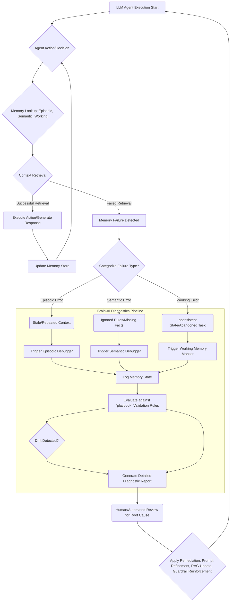

LLM 에이전트의 신뢰성과 행동 예측 가능성을 확보하는 것은 장기 실행(long-running) 작업에서 매우 중요하다. 기존에는 에이전트가 오래된 정보를 사용하거나, 이미 질문한 내용을 반복하거나, 규칙을 무시하는 등의 문제들을 광범위하게 "retrieval 문제"로 진단하는 경향이 있었다. 그러나 이러한 모호한 진단은 근본 원인을 파악하고 효과적인 개선책을 마련하는 데 한계를 가진다. Brain-AI Memory 아키텍처는 에이전트의 메모리 실패를 보다 세분화하여 진단할 수 있는 프레임워크를 제공함으로써, 이러한 문제 해결에 핵심적인 역할을 한다.

## Brain-AI Memory 아키텍처의 핵심 개념

Brain-AI Memory는 에이전트의 기억을 세 가지 주요 범주로 분류하여 관리하고 진단한다. 각 메모리 유형은 에이전트의 특정 행동 실패 패턴과 직접적으로 연관된다.

### 1. Episodic Memory (일화 기억)
에이전트가 특정 시점에 경험하거나 수행한 일련의 사건, 대화, 관찰 결과 등 순차적인 맥락 정보를 저장한다. 이는 단기 기억(short-term memory)에 해당하며, 에이전트가 최근의 상호작용을 기억하고 일관된 대화를 이어가거나 반복적인 작업을 피하는 데 필수적이다.

*   **진단 시나리오**: 에이전트가 이전에 언급된 내용을 다시 묻거나, 최근 수행된 작업을 불필요하게 반복하는 경우. 이는 `episodic memory`의 부재, 손실, 혹은 잘못된 업데이트로 인해 발생할 수 있다.

### 2. Semantic Memory (의미론적 기억)
에이전트의 일반적인 지식, 규칙, 개념, 사실, 작업 절차 등 장기적인 추상화된 정보를 저장한다. 이는 에이전트의 '상식'이나 '전문 지식'에 해당하며, 복잡한 문제 해결이나 특정 도메인 규칙을 준수하는 데 사용된다.

*   **진단 시나리오**: 에이전트가 정의된 정책이나 규칙을 무시하거나, 기본적인 도메인 지식을 잘못 적용하는 경우. 이는 `semantic memory`의 누락, 오염, 혹은 비활성으로 인해 발생할 수 있다.

### 3. Working Memory (작업 기억)
현재 에이전트가 수행 중인 특정 작업의 중간 상태, 임시 계산 결과, 현재 목표 및 조건 등 활성 상태의 정보를 저장한다. 이는 인간의 작업 기억과 유사하게, 복잡한 추론이나 다단계 작업에서 필요한 정보를 일시적으로 보관한다.

*   **진단 시나리오**: 에이전트가 다단계 절차를 중간에 포기하거나, 일관성 없는 중간 결과를 도출하는 경우. 이는 `working memory`의 용량 부족, 불안정성, 또는 잘못된 상태 관리로 인해 발생할 수 있다.

## LLM 출력 검증 파이프라인 및 드리프트 감지 통합

`playbook`의 LLM 출력 검증 파이프라인에 Brain-AI Memory 진단 아키텍처를 통합함으로써, 에이전트의 행동이 예상 범주를 벗어날 때 그 원인을 보다 정확하게 진단할 수 있다. 일반적인 `retrieval` 실패를 넘어, 어떤 유형의 메모리 문제가 발생했는지 식별하여 에이전트의 신뢰성을 높이고 드리프트 감지 로직의 정밀도를 향상시킨다. 예를 들어, `episodic memory` 문제로 인한 반복 질문은 `context compaction` 전략을 재검토하게 하고, `semantic memory` 문제로 인한 규칙 위반은 `RAG` 지식 베이스의 업데이트나 `guardrail` 강화로 이어질 수 있다.

```python
import datetime
from collections import deque
from typing import Any, Dict, List, Optional

class AgentMemoryStore:
    def __init__(self, episodic_capacity: int = 100):
        self.episodic_memory: deque[Dict[str, Any]] = deque(maxlen=episodic_capacity)
        self.semantic_memory: Dict[str, Any] = {}
        self.working_memory: Dict[str, Any] = {}

    def add_episodic_event(self, event_description: str, timestamp: datetime.datetime = None, metadata: Optional[Dict] = None):
        """에이전트의 최근 상호작용 또는 관찰을 기록합니다."""
        event = {
            "description": event_description,
            "timestamp": timestamp or datetime.datetime.now(),
            "metadata": metadata or {}
        }
        self.episodic_memory.append(event)
        return event

    def update_semantic_knowledge(self, key: str, value: Any, source: Optional[str] = None):
        """에이전트의 장기적인 지식이나 규칙을 업데이트합니다."""
        self.semantic_memory[key] = {"value": value, "source": source, "last_updated": datetime.datetime.now()}
        return self.semantic_memory[key]

    def update_working_state(self, key: str, value: Any):
        """현재 작업의 중간 상태를 업데이트합니다."""
        self.working_memory[key] = value
        return self.working_memory[key]

    def get_memory(self, memory_type: str, key: Optional[str] = None):
        """특정 메모리 유형에서 정보를 검색합니다."""
        if memory_type == "episodic":
            return list(self.episodic_memory)
        elif memory_type == "semantic" and key:
            return self.semantic_memory.get(key)
        elif memory_type == "working" and key:
            return self.working_memory.get(key)
        return None

    def diagnose_potential_failure(self, agent_output: str, task_context: Dict[str, Any]) -> str:
        """에이전트의 출력과 태스크 컨텍스트를 기반으로 잠재적인 메모리 실패를 진단합니다."""
        diagnosis_report = []

        # 1. Episodic Memory Failure (반복 질문, 오래된 정보 사용)
        recent_events = [e["description"] for e in list(self.episodic_memory)[-5:]]
        if any(keyword in agent_output for keyword in ["다시 질문", "반복 언급"]) and any(re_event in agent_output for re_event in recent_events):
            diagnosis_report.append("EpisodicMemoryFailure: Agent repeated previous information.")
        
        # 2. Semantic Memory Failure (규칙 무시, 잘못된 지식 적용)
        expected_rules = task_context.get("expected_rules", [])
        if any(rule in expected_rules for rule in ["보안 정책 준수", "특정 포맷 유지"]) and "규칙 위반" in agent_output:
            if not self.semantic_memory.get("security_policy_adherence", False):
                 diagnosis_report.append("SemanticMemoryFailure: Agent ignored a critical security policy.")
            if not self.semantic_memory.get("output_format_guideline", False):
                diagnosis_report.append("SemanticMemoryFailure: Agent violated output format guidelines.")

        # 3. Working Memory Failure (중간 절차 포기, 일관성 없는 상태)
        expected_steps = task_context.get("expected_workflow_steps", [])
        current_step = self.working_memory.get("current_workflow_step")
        if current_step and current_step != expected_steps[-1] and "작업 포기" in agent_output:
            diagnosis_report.append(f"WorkingMemoryFailure: Agent abandoned task at step {current_step}.")
        if "불일치" in agent_output and self.working_memory.get("temp_result_A") != self.working_memory.get("temp_result_B"):
            diagnosis_report.append("WorkingMemoryFailure: Inconsistent intermediate results detected.")

        return "NoSpecificMemoryFailure" if not diagnosis_report else "; ".join(diagnosis_report)

# 사용 예시:
# memory_store = AgentMemoryStore()
# memory_store.add_episodic_event("사용자에게 프로젝트 계획 요청")
# memory_store.update_semantic_knowledge("security_policy_adherence", True, "System_Config")
# memory_store.update_working_state("current_workflow_step", 1)
#
# # 에이전트가 "프로젝트 계획을 다시 요청합니다"라고 응답했다고 가정
# agent_output_1 = "프로젝트 계획을 다시 요청합니다. 이전 대화 기록을 찾을 수 없습니다."
# task_context_1 = {"expected_rules": [], "expected_workflow_steps": [1, 2, 3]}
# print(memory_store.diagnose_potential_failure(agent_output_1, task_context_1))
# # 출력: EpisodicMemoryFailure: Agent repeated previous information.
#
# # 에이전트가 "보안 정책을 무시하고 데이터를 처리했습니다"라고 응답했다고 가정
# agent_output_2 = "보안 정책을 무시하고 데이터를 처리했습니다. 빠른 처리를 위함입니다."
# task_context_2 = {"expected_rules": ["보안 정책 준수"], "expected_workflow_steps": []}
# print(memory_store.diagnose_potential_failure(agent_output_2, task_context_2))
# # 출력: SemanticMemoryFailure: Agent ignored a critical security policy.
```

## Brain-AI Memory 진단 아키텍처 플로우



## 2026년 LLM 에이전트 트렌드와 Brain-AI Memory

2026년에는 LLM 에이전트가 실제 비즈니스 환경에 깊숙이 통합되면서 신뢰성, 설명 가능성(explainability), 그리고 자율적인 문제 해결 능력이 더욱 중요해질 것이다. Brain-AI Memory 아키텍처는 이러한 트렌드에 발맞춰 에이전트의 '블랙박스' 내부에서 발생하는 오류의 원인을 명확히 제시하는 데 기여한다. 단순히 "에이전트가 오작동했다"를 넘어, "특정 작업의 `working memory`에서 중간 상태 불일치가 발생하여 다음 단계로 넘어가지 못했다"와 같이 구체적인 진단을 가능하게 함으로써, 에이전트의 디버깅 및 개선 주기를 획기적으로 단축시킨다. 이는 복잡한 `multi-agent system`이나 `long-running agent`의 운영 비용을 절감하고 예측 가능성을 높이는 데 필수적인 요소가 될 것이다.

## 트레이드오프

*   **진단 정밀도 vs. 시스템 복잡성**:
    *   **장점**: 메모리 실패 원인을 Episodic, Semantic, Working으로 세분화하여 진단함으로써 근본적인 문제 해결 능력이 크게 향상된다. 이는 에이전트의 신뢰성과 안정성을 높이는 데 기여한다.
    *   **단점**: 각 메모리 유형을 독립적으로 추적하고 진단 로직을 구현해야 하므로 초기 시스템 설계 및 구현 복잡성이 증가한다. 특히 메모리 간의 상호작용을 고려할 경우 관리 오버헤드가 발생할 수 있다.

*   **초기 구현 노력 vs. 장기 운영 비용 절감**:
    *   **장점**: 초기 단계에서 Brain-AI Memory 아키텍처를 도입하는 것은 상당한 설계 및 개발 노력을 요구하지만, 장기적으로 에이전트의 오작동 및 실패를 줄이고 디버깅 시간을 단축하여 운영 및 유지보수 비용을 크게 절감한다.
    *   **단점**: 단기 프로젝트나 프로토타입 단계에서는 복잡한 메모리 진단 시스템 구축이 불필요하게 느껴질 수 있으며, 빠른 개발 속도를 저해할 수 있다.

*   **자원 사용량 vs. 에이전트 행동 예측 가능성**:
    *   **장점**: 메모리 상태를 상세히 기록하고 분석함으로써 에이전트의 다음 행동을 더 정확하게 예측하고, 예기치 않은 오류 발생 시 원인을 빠르게 특정할 수 있다.
    *   **단점**: 각 메모리 유형의 상태를 지속적으로 기록하고 관리하는 과정에서 추가적인 컴퓨팅 자원(메모리, 스토리지, CPU)이 소모될 수 있다. 이는 특히 대규모 에이전트 시스템에서 성능 병목으로 이어질 가능성이 있다.

*   **표준화된 RAG/Guardrail vs. 맞춤형 진단**:
    *   **장점**: 기존의 RAG나 Guardrail 시스템이 "왜 실패했는지"를 명확히 설명하지 못하는 한계를 넘어, 메모리 유형별 진단을 통해 RAG 문서 최적화나 Guardrail 규칙 강화의 방향성을 구체적으로 제시할 수 있다.
    *   **단점**: Brain-AI Memory의 진단 결과를 기존의 RAG/Guardrail 시스템에 통합하고 연동하는 과정에서 추가적인 커스터마이징 및 통합 작업이 필요할 수 있다.

## 실전 체크리스트

프로젝트에 Brain-AI Memory 진단 아키텍처를 적용할 때 다음 항목들을 검증해야 한다.

- [ ] 에이전트의 각 핵심 모듈에서 `Episodic Memory` (최근 대화, 상호작용 기록)가 명확히 분리되어 관리되고 있는가?
- [ ] `Semantic Memory` (핵심 규칙, 도메인 지식)가 `RAG` 소스 또는 내부 지식 그래프와 연동되어 최신성을 유지하고 있으며, 필요에 따라 업데이트되는 파이프라인이 구축되어 있는가?
- [ ] `Working Memory` (현재 작업 상태, 중간 결과)가 에이전트의 각 태스크 단계별로 일관되게 업데이트 및 관리되고 있으며, 예상치 못한 상태 변화를 감지하는 로직이 포함되어 있는가?
- [ ] 에이전트의 실패 패턴(예: 반복 질문, 규칙 위반, 작업 포기) 발생 시, `Brain-AI Memory` 진단 로직을 통해 해당 실패가 어떤 메모리 유형(Episodic, Semantic, Working)과 연관되어 있는지 자동으로 식별되는가?
- [ ] 식별된 메모리 실패 유형에 따라 `playbook`의 LLM 출력 검증 파이프라인에서 적절한 진단 리포트가 생성되고, 드리프트 감지 로직이 활성화되는가?
- [ ] 메모리 진단 결과가 에이전트의 장기적인 신뢰성 지표(예: 반복 질문 비율 감소, 규칙 준수율 증가) 개선에 기여하는지 정량적으로 측정하고 있는가?
- [ ] 메모리 진단 아키텍처 도입으로 인한 추가적인 컴퓨팅 자원(메모리, CPU) 사용량이 허용 가능한 범위 내에 있으며, 성능 병목 현상은 없는가?