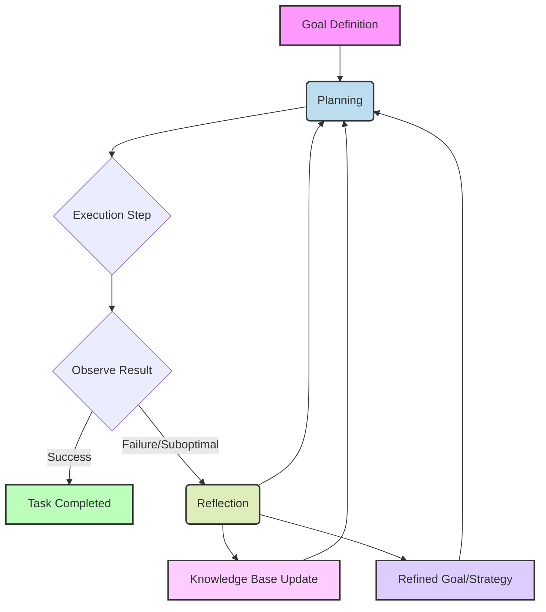

LLM 기반 에이전트의 자율성은 복잡한 문제 해결의 핵심입니다. Planning (계획 수립)과 Reflection (반성 및 개선) 패턴은 에이전트의 자율성을 극대화하고 문제 해결 능력을 강화하는 데 필수적입니다. 이를 통해 에이전트는 전략 수립, 결과 평가, 자체 학습 및 발전을 이룰 수 있습니다.

## Planning (계획 수립) 패턴

Planning은 에이전트가 복잡한 목표 달성을 위해 일련의 논리적 행동 단계를 미리 정의하는 과정입니다.

### 핵심 Planning 기법

*   **Chain of Thought (CoT)**: LLM이 중간 추론 과정을 명시적으로 생성, 문제를 하위 문제로 분해하고 단계별 해결책 도출.
*   **Tree of Thoughts (ToT)**: CoT 확장, 여러 사고 경로 탐색/평가, 최적 경로 선택. 백트래킹 지원.

### Planning 패턴 코드 예제 (Chain of Thought)

CoT 활용 Planning Python 예시입니다. (Mock LLM 사용)

```python
class MockLLM:
    def __init__(self, responses): self.responses = responses; self.call_count = 0
    def completions(self): return self
    def create(self, model, messages, temperature):
        response = self.responses[self.call_count % len(self.responses)]
        self.call_count += 1
        return type('obj', (object,), {'choices': [{'message': {'content': response}}]})()

mock_llm_responses = [
    "단계 1: 문제 이해 및 목표 정의.",
    "단계 2: 하위 문제 해결 전략 수립.",
    "단계 3: 계획 실행 및 결과 확인."
]
client = MockLLM(mock_llm_responses)

def generate_plan_cot(problem_description: str) -> str:
    prompt = f"""You are an expert planner. Break down the problem, outline a detailed plan. Think step-by-step.
    Problem: {problem_description}
    """
    response = client.completions.create(
        model="gpt-4o", messages=[{"role": "system", "content": "Assistant."}, {"role": "user", "content": prompt}], temperature=0.7,
    )
    return response.choices[0].message.content

problem = "사용자 데이터 분석 요청을 받아, 파이썬 스크립트 작성 및 결과 시각화 프로세스를 계획하라."
plan = generate_plan_cot(problem)
```

## Reflection (반성 및 개선) 패턴

Reflection은 에이전트가 행동 및 결과물을 평가하고, 실패로부터 학습하여 미래 행동을 개선하는 과정입니다.

### 핵심 Reflection 기법

*   **Self-Correction (자기 수정)**: 실행 오류나 불만족스러운 결과 인지 후 스스로 수정. 원인 파악 및 해결책 제시 포함.
*   **Meta-Cognition (초인지)**: 자신의 사고 과정 검토 및 개선. Planning 전략 효과성, 실패 원인 분석 후 미래 Planning에 반영.

### Reflection 패턴 코드 예제 (Self-Correction)

실행 결과를 반성하고 개선 방안을 도출하는 Python 예시입니다.

```python
mock_llm_responses_reflection = [
    "분석: '데이터 전처리' 단계 누락 값 많아 스크립트 실행 실패. 원인: 초기 데이터 검증 미흡.",
    "개선: 다음 계획 수립 시 '데이터 검증 및 클리닝' 단계 추가."
]
reflection_client = MockLLM(mock_llm_responses_reflection)

def perform_reflection(original_plan: str, execution_result: str, feedback: str) -> str:
    prompt = f"""You are an expert in self-correction. Analyze plan, result, feedback. Identify deficiencies, propose concrete improvements.
    Original Plan: {original_plan}
    Execution Result: {execution_result}
    Feedback/Observations: {feedback}
    Think step-by-step.
    """
    response = reflection_client.completions.create(
        model="gpt-4o", messages=[{"role": "system", "content": "Assistant."}, {"role": "user", "content": prompt}], temperature=0.7,
    )
    return response.choices[0].message.content

original_plan_example = "데이터 수집 -> 전처리 -> 모델 학습 -> 결과 시각화"
execution_result_example = "전처리 단계 오류 발생. 시각화 불가."
feedback_example = "데이터 누락 값 많아 스크립트 중단됨."
correction = perform_reflection(original_plan_example, execution_result_example, feedback_example)
```

### Planning과 Reflection의 통합

Planning과 Reflection은 에이전트의 학습 루프를 형성하며 상호 보완적으로 작동합니다. 초기 계획 시작 후 실행 결과를 Reflection으로 평가하여 얻은 통찰을 다음 계획에 반영, 지속적 개선과 환경 적응을 가능하게 합니다.



## 트레이드오프

LLM 에이전트의 Planning 및 Reflection 패턴 적용 시 다음 트레이드오프를 고려해야 합니다.

*   **1. 복잡성과 성능 오버헤드 (Complexity vs. Performance Overhead)**
    *   **좋음**: 복잡/예측 불가능 환경, 높은 실패 비용.
    *   **나쁨**: 단순 반복 작업, 실시간 응답 필수.

*   **2. 탐색 깊이와 자원 소모 (Exploration Depth vs. Resource Consumption)**
    *   **좋음**: 최적 해결책 탐색 중요, 문제 공간 넓음.
    *   **나쁨**: 컴퓨팅 자원 제한, '충분히 좋은' 해결책으로 충분.

*   **3. 일반화와 과적합 (Generalization vs. Overfitting)**
    *   **좋음**: 다양한 상황 적용 가능한 일반화된 학습 능력 목표.
    *   **나쁨**: 특정 도메인 최적화 시, 특정 실패 사례에 과도한 집중 위험.

*   **4. 인간 개입과 자율성 (Human Oversight vs. Autonomy)**
    *   **좋음**: 점진적 자율성 증대로 인간 개입 감소, 생산성 향상.
    *   **나쁨**: 초기 개발/고위험 시스템 (통제 어려움, Guardrails 필수).

## 실전 체크리스트

Planning 및 Reflection 패턴 적용 시 다음 항목들을 검증하십시오.

*   - [ ] Planning이 목표를 구체적이고 실행 가능한 하위 작업으로 명확히 분해하는가?
*   - [ ] Planning 프롬프트에 CoT/ToT 활용 구조화된 지시어가 포함되는가?
*   - [ ] Reflection 프로세스가 에이전트의 실행 결과와 환경 피드백을 정확히 수집하는가?
*   - [ ] Reflection 로직이 실패 원인 분석 및 구체적 개선 방안 제시 구조화된 프롬프트를 사용하는가?
*   - [ ] 지식 베이스가 Reflection 교훈을 지속 업데이트하고 다음 Planning에 자동 반영되는가?
*   - [ ] Planning-Execution-Reflection 루프의 각 단계별 LLM 호출 비용 및 Latency를 모니터링/최적화하는가?
*   - [ ] 에이전트의 자율적 문제 해결 능력이 실제 시나리오에서 일정 수준 이상의 성공률을 보이는지 주기적으로 평가하는가?