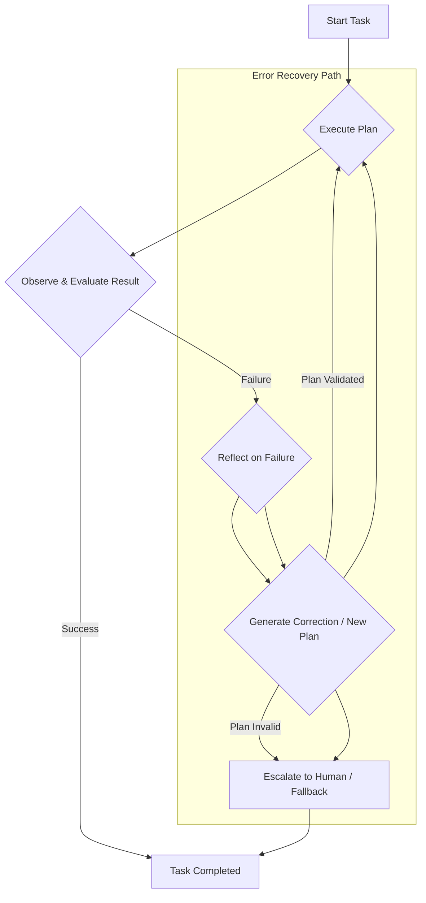

LLM 기반 자율 에이전트의 실용적 활용을 위해 안정성과 신뢰성 확보는 필수적입니다. 복잡한 환경에서 태스크를 수행하는 에이전트는 예상치 못한 오류, 불완전한 정보, 외부 도구의 실패 등 다양한 문제에 직면할 수 있습니다. 이러한 상황에서 에이전트가 스스로 문제를 진단하고 수정하며, 오류로부터 복구하는 능력은 시스템의 견고함과 효율성을 결정하는 핵심 요소입니다.

### 자기 수정 메커니즘: Reflection과 Re-planning

자율 에이전트의 자기 수정은 주로 'Reflection(성찰)'과 'Re-planning(재계획)'이라는 순환적 과정을 통해 이루어집니다. 에이전트는 초기 계획에 따라 태스크를 실행한 후, 그 결과를 평가하고 발생한 문제점을 분석하여 다음 행동을 결정합니다.

*   **Observation & Evaluation**: 에이전트가 실행 결과를 관찰하고, 정의된 목표나 제약 조건 대비 현재 상태를 평가합니다. 이는 결과가 기대와 다른 경우, 또는 오류가 발생한 경우 트리거됩니다.
*   **Reflection**: LLM은 관찰된 결과와 실패 원인을 분석하여, 무엇이 잘못되었는지, 왜 발생했는지, 그리고 어떻게 개선할 수 있을지에 대해 '생각'합니다. 이 과정에서 에이전트의 내부 상태, 과거 경험, 관련 지식 등을 활용합니다.
*   **Re-planning / Re-execution**: 성찰을 통해 얻은 통찰을 바탕으로, 에이전트는 기존 계획을 수정하거나 새로운 계획을 수립합니다. 이후 수정된 계획에 따라 태스크를 다시 실행합니다.

이러한 순환 과정은 Mermaid 다이어그램으로 시각화할 수 있습니다.



### 오류 복구 방법론: 감지, 분류 및 대응

자기 수정 메커니즘이 에이전트의 '지능적' 복구 능력을 담당한다면, 오류 복구 방법론은 '시스템적'으로 에이전트의 견고성을 강화합니다.

#### 1. 오류 감지 (Error Detection)
오류 감지는 에이전트가 잘못된 경로로 진입했거나, 기대와 다른 결과를 생성했을 때 이를 인지하는 첫 단계입니다.

*   **Syntax & Format Validation**: LLM 출력이 특정 JSON 형식이나 코드 문법을 따라야 할 때 유효성을 검사합니다.
*   **Semantic Validation**: 생성된 내용이 주어진 컨텍스트나 목표와 의미적으로 일치하는지 확인합니다. 예를 들어, 특정 API 호출의 인자가 유효한지 검증합니다.
*   **External Tool Execution Monitoring**: 에이전트가 사용하는 외부 도구 (API, 코드 인터프리터 등)의 반환 값, 에러 코드, 타임아웃 등을 모니터링합니다.

#### 2. 오류 분류 (Error Classification)
감지된 오류의 유형을 분류하는 것은 적절한 복구 전략을 선택하는 데 중요합니다.

*   **Transient Errors**: 일시적인 네트워크 문제, 리소스 부족 등 재시도로 해결될 수 있는 오류.
*   **Persistent Errors**: 잘못된 계획, 불가능한 목표, 로직 버그 등 근본적인 수정이 필요한 오류.
*   **Critical Errors**: 시스템의 안정성을 위협하거나 안전 제약 조건을 위반하는 오류.

#### 3. 복구 전략 (Recovery Strategies)
오류 분류에 따라 다양한 복구 전략이 적용됩니다.

*   **Retry with Exponential Backoff**: 일시적인 오류의 경우, 일정 시간 간격을 두고 재시도합니다.
    ```python
    import time
    import random

    def execute_tool_with_retry(tool_function, max_retries=3):
        for i in range(max_retries):
            try:
                result = tool_function()
                return result
            except Exception as e:
                print(f"Tool execution failed: {e}. Retrying in {2**i} seconds...")
                time.sleep(2**i + random.uniform(0, 1))
        raise Exception(f"Tool failed after {max_retries} retries.")

    # Example usage
    # def flaky_tool():
    #     if random.random() < 0.7: # 70% chance of failure
    #         raise ValueError("Simulated network error")
    #     return "Success!"
    #
    # try:
    #     output = execute_tool_with_retry(flaky_tool)
    #     print(f"Final output: {output}")
    # except Exception as e:
    #     print(f"Failed to get output: {e}")
    ```
*   **Fallback Mechanisms**: 주된 실행 경로가 실패했을 때, 미리 정의된 대체 경로 (예: 더 간단한 모델 사용, 기본값 반환, 다른 도구 사용)를 따릅니다.
*   **Contextual Re-prompting**: LLM의 출력이 기대에 미치지 못할 경우, 오류 메시지나 추가적인 지침을 포함하여 프롬프트를 다시 구성하고 LLM에게 재시도를 요청합니다.
*   **Human-in-the-Loop (HITL)**: 에이전트가 스스로 해결할 수 없는 복잡하거나 치명적인 오류의 경우, 인간 운영자에게 개입을 요청하고 필요한 정보를 제공합니다. 2026년 트렌드는 이러한 HITL 지점을 더욱 정교하게 설계하여, 인간의 개입이 필요한 시점을 정확히 파악하고 최소한의 노력으로 최대의 효과를 얻도록 하는 것입니다.

### 2026년 최신 트렌드: Proactive Self-Healing 및 World Model Integration

최근 LLM 에이전트의 오류 복구는 단순히 반응적인(reactive) 방식에서 벗어나, 사전 예측적인(proactive) 'Self-Healing' 개념으로 발전하고 있습니다.

*   **Proactive Error Prediction**: 에이전트가 현재의 상황과 계획을 기반으로 잠재적인 오류를 미리 예측하고, 발생하기 전에 회피 또는 수정하는 기능입니다. 이는 LLM이 더욱 정교한 내부 'World Model'을 구축하고, 시뮬레이션을 통해 미래 상태를 예측하는 능력이 향상되면서 가능해지고 있습니다.
*   **Dynamic Guardrails**: 고정된 안전 제약 조건 대신, 에이전트의 현재 목표, 컨텍스트, 위험 수준에 따라 실시간으로 변화하는 동적 가드레일(guardrails)을 적용하여, 에런트 행동(errant behavior)을 보다 유연하게 방지하고 수정합니다.
*   **Automated Root Cause Analysis**: 오류 발생 시, 에이전트가 자체적으로 실행 로그, 메모리, 외부 환경 등을 분석하여 근본 원인을 파악하고, 이를 통해 재발 방지를 위한 학습 메커니즘을 통합합니다.

## 트레이드오프

LLM 기반 자율 에이전트의 자기 수정 및 오류 복구 메커니즘을 설계할 때는 다음과 같은 트레이드오프를 고려해야 합니다.

*   **비용(Cost) vs. 신뢰성(Reliability)**:
    *   **언제 좋은가**: 자기 수정 및 복구 로직은 추가적인 LLM 호출, 계산 리소스, 시스템 복잡도를 증가시켜 운영 비용을 높입니다. 미션 크리티컬하거나 오류 비용이 매우 높은 시스템(예: 금융 거래, 의료 진단)에서는 높은 신뢰성이 비용 증가를 상회합니다.
    *   **언제 나쁜가**: 단순 반복 작업이나 오류가 발생해도 큰 문제가 없는(low-stakes) 작업의 경우, 과도한 복구 메커니즘은 불필요한 비용 낭비로 이어질 수 있습니다.
*   **지연 시간(Latency) vs. 정확성(Accuracy)**:
    *   **언제 좋은가**: 오류를 감지하고 수정하는 과정은 추가적인 처리 시간을 필요로 합니다. 고도의 정확성이 요구되는 분석 작업이나 복잡한 문제 해결 과정에서는 지연 시간을 감수하고서라도 정확성을 높이는 것이 중요합니다.
    *   **언제 나쁜가**: 실시간 상호작용이 중요한 애플리케이션(예: 대화형 챗봇, 게임 AI)에서는 지연 시간이 사용자 경험에 치명적인 영향을 미칠 수 있으므로, 빠른 응답을 위해 복구 로직의 깊이를 제한해야 합니다.
*   **자율성(Autonomy) vs. 안전(Safety)/제어(Control)**:
    *   **언제 좋은가**: 에이전트가 스스로 오류를 처리하고 복구하는 능력은 인간의 개입 없이 장기적인 태스크를 수행하는 데 필수적입니다. 자율성을 극대화하여 인간의 워크로드를 줄이고자 할 때 유리합니다.
    *   **언제 나쁜가**: 높은 자율성은 예상치 못한 위험한 행동이나 무한 루프에 빠질 가능성을 내포합니다. 안전이 최우선인 환경(예: 물리적 로봇 제어, 중요 인프라 관리)에서는 인간의 감독 및 개입 지점(Human-in-the-Loop)을 명확히 설정해야 합니다.
*   **복잡성(Complexity) vs. 유지보수성(Maintainability)**:
    *   **언제 좋은가**: 복잡한 오류 시나리오를 처리하기 위한 정교한 복구 로직은 시스템의 견고성을 높이지만, 동시에 시스템의 복잡도를 증가시킵니다. 다양한 엣지 케이스를 다루고 장기적인 안정성을 확보해야 하는 대규모 시스템에 적합합니다.
    *   **언제 나쁜가**: 과도하게 복잡한 복구 로직은 디버깅, 테스트, 업데이트를 어렵게 만들어 유지보수 비용을 증가시킬 수 있습니다. 단순한 에이전트나 빠르게 개발해야 하는 프로토타입에서는 간결한 접근 방식이 선호됩니다.
*   **일반성(Generalizability) vs. 특화성(Specialization)**:
    *   **언제 좋은가**: 다양한 오류 유형에 대응할 수 있는 일반적인 복구 패턴은 에이전트가 예상치 못한 상황에 유연하게 대처할 수 있도록 합니다. 넓은 범위의 태스크를 수행하는 범용 에이전트에 유리합니다.
    *   **언제 나쁜가**: 특정 도메인이나 태스크에 특화된 오류는 일반적인 복구 로직으로는 해결하기 어렵거나 비효율적일 수 있습니다. 특정 유형의 오류가 자주 발생하고, 그 영향이 클 경우, 해당 오류에 대한 특화된 감지 및 복구 로직을 구현하는 것이 더 효과적입니다.

## 실전 체크리스트

LLM 기반 자율 에이전트의 자기 수정 및 오류 복구 방법을 프로젝트에 적용할 때 다음 항목들을 검증합니다.

*   - [ ] **오류 분류 체계 정의**: 에이전트가 마주할 수 있는 주요 오류 유형(네트워크, API 응답, LLM 출력 형식, 로직 오류 등)을 명확히 정의하고, 각 유형에 대한 우선순위와 영향도를 문서화했습니다.
*   - [ ] **실행 추적 및 로깅 구현**: 에이전트의 각 단계(계획, 도구 사용, LLM 호출, 성찰 등)에서 발생하는 모든 이벤트와 오류를 상세히 로깅하고, 실행 추적(trace)을 통해 문제 발생 시 원인 분석이 가능하도록 시스템을 구축했습니다.
*   - [ ] **자동화된 유효성 검사 및 재시도 로직 적용**: LLM 출력 형식, 의미론적 유효성, 도구 실행 결과 등에 대한 자동화된 검증 로직을 구현하고, 일시적인 오류에 대비한 지수 백오프(exponential backoff) 기반 재시도 메커니즘을 적용했습니다.
*   - [ ] **명시적 성찰(Reflection) 프롬프트 설계**: 에이전트가 실패하거나 예상치 못한 결과에 직면했을 때, 문제의 원인을 분석하고 개선 방안을 도출하도록 유도하는 명확하고 효과적인 성찰 프롬프트를 설계했습니다.
*   - [ ] **인간 개입(Human-in-the-Loop) 지점 정의**: 에이전트가 스스로 복구할 수 없는 복잡하거나 치명적인 오류 상황에서 인간 운영자에게 알림을 보내고, 필요한 정보를 제공하여 개입을 요청하는 명확한 프로토콜을 설정했습니다.
*   - [ ] **에이전트 성능 지표 모니터링**: 에이전트의 성공률, 오류 발생률, 재시도 횟수, 복구 시간 등 핵심 성능 지표를 지속적으로 모니터링하여 시스템의 안정성과 효율성을 정량적으로 평가하고 개선할 수 있는 대시보드를 구축했습니다.
*   - [ ] **동적 안전 가드레일(Guardrails) 구현**: 에이전트의 행동을 제약하고 위험한 출력을 방지하기 위해 컨텍스트에 따라 동적으로 조정될 수 있는 가드레일 메커니즘을 개발했습니다. (예: 특정 민감 정보 필터링, 자원 사용량 제한).