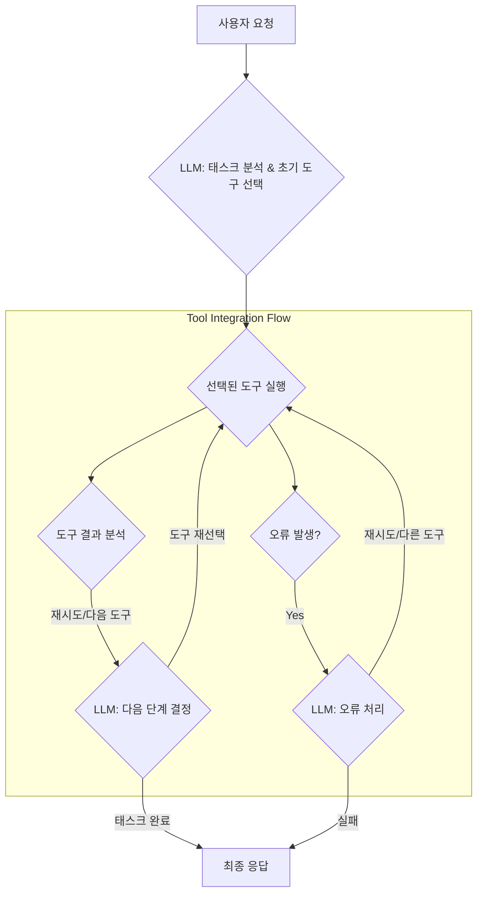

LLM 기반 자율 에이전트(Autonomous LLM Agents)가 복잡한 현실 세계 태스크를 효과적으로 수행하기 위해서는 외부 도구(External Tools)와의 통합이 필수적입니다. LLM 자체의 한계인 최신 정보 접근, 복잡한 연산 수행, 외부 시스템 제어 등을 극복하기 위해 플러그인(Plugin) 형태의 도구 사용 능력은 에이전트의 지능과 자율성을 비약적으로 향상시킵니다. 그러나 이러한 도구 통합은 단순한 API 호출을 넘어선 정교한 관리 및 오케스트레이션(Orchestration) 패턴을 요구합니다. 2026년 기준, 에이전트 시스템은 단순히 도구를 사용하는 것을 넘어, 도구의 선택, 실행, 결과 분석, 오류 처리, 그리고 전반적인 라이프사이클 관리에 대한 지능적인 접근 방식을 필요로 합니다.

## 핵심 개념: 도구 통합의 중요성

에이전트는 프롬프트(Prompt)를 통해 주어진 목표를 달성하기 위해 필요한 스킬셋(Skillset)으로 도구를 인식하고 활용합니다. 이때 도구는 데이터베이스 쿼리, 웹 검색, 코드 실행, 외부 API 호출 등 다양한 형태를 가질 수 있습니다. 효과적인 도구 통합은 에이전트가 동적으로 적절한 도구를 찾아 사용하고, 예상치 못한 상황에 유연하게 대처하며, 궁극적으로 더 높은 수준의 문제 해결 능력을 갖추게 합니다. 특히 복잡한 엔터프라이즈 환경에서는 수많은 도구들 간의 의존성 관리, 보안, 그리고 성능 최적화가 핵심 과제로 부상하고 있습니다.

## 플러그인 도구 통합 패턴

LLM 에이전트의 도구 통합에는 여러 전략적 패턴이 존재합니다.

### 1. 동적 도구 선택 (Dynamic Tool Selection)

에이전트가 현재 태스크의 컨텍스트(Context)와 목표에 따라 가장 적합한 도구를 실시간으로 식별하고 선택하는 패턴입니다. 이는 고정된 도구 체인(Tool Chain)을 사용하는 것보다 유연하며, 예상치 못한 상황 변화에 강합니다. Tool-use LLM의 추론 능력에 크게 의존합니다.

```python
from typing import List, Dict, Callable

class Tool:
    def __init__(self, name: str, description: str, func: Callable):
        self.name = name
        self.description = description
        self.func = func

    def run(self, *args, **kwargs):
        return self.func(*args, **kwargs)

def search_web(query: str) -> str:
    # Hypothetical web search API call
    print(f"Searching web for: {query}")
    return f"Results for '{query}': AI agents are evolving rapidly."

def code_interpreter(code: str) -> str:
    # Hypothetical code execution environment
    print(f"Executing code: {code}")
    try:
        result = eval(code) # Simplified, in reality would be sandboxed
        return f"Code execution result: {result}"
    except Exception as e:
        return f"Code execution error: {e}"

tools = [
    Tool("web_search", "Performs a web search to get up-to-date information.", search_web),
    Tool("code_interpreter", "Executes Python code in a sandboxed environment.", code_interpreter)
]

def agent_decide_tool(task: str, available_tools: List[Tool]) -> Dict:
    # This part would typically be handled by the LLM
    # For demonstration, a simple heuristic
    if "latest information" in task or "news" in task:
        return {"tool_name": "web_search", "args": {"query": task}}
    elif "calculate" in task or "execute code" in task:
        return {"tool_name": "code_interpreter", "args": {"code": "100 * 2 + 5"}}
    else:
        return {"tool_name": None, "args": {}}

# Example usage
task1 = "Find the latest information about LLM agent trends."
decision1 = agent_decide_tool(task1, tools)
if decision1["tool_name"]:
    selected_tool = next(t for t in tools if t.name == decision1["tool_name"])
    print(selected_tool.run(**decision1["args"]))

task2 = "Calculate 100 multiplied by 2 plus 5."
decision2 = agent_decide_tool(task2, tools)
if decision2["tool_name"]:
    selected_tool = next(t for t in tools if t.name == decision2["tool_name"])
    print(selected_tool.run(**decision2["args"]))
```

### 2. 도구 오케스트레이션 및 체이닝 (Tool Orchestration & Chaining)

단일 태스크를 완료하기 위해 여러 도구를 순차적 또는 병렬적으로 조합하여 사용하는 패턴입니다. 한 도구의 출력이 다른 도구의 입력으로 연결되는 체이닝은 복잡한 워크플로우(Workflow)를 가능하게 합니다. 2026년에는 DAG(Directed Acyclic Graph) 기반의 정교한 오케스트레이터(Orchestrator)가 보편화되어 에이전트가 복잡한 태스크를 분해하고 도구 실행 계획을 동적으로 수립합니다.



## 플러그인 도구 관리 패턴

도구 통합의 효율성을 높이기 위해서는 견고한 관리 전략이 필수적입니다.

### 1. 중앙 집중식 도구 레지스트리 (Centralized Tool Registry)

사용 가능한 모든 도구의 메타데이터(Metadata), 설명, 사용법, 접근 권한 등을 중앙에서 관리하는 시스템입니다. 에이전트는 이 레지스트리를 통해 필요한 도구를 검색하고, 도구 관리자는 도구의 버전 업데이트, 보안 정책 적용을 용이하게 할 수 있습니다. 이를 통해 도구의 재사용성을 높이고, 에이전트의 도구 탐색 오버헤드(Overhead)를 줄입니다.

### 2. 보안 및 샌드박싱 (Security & Sandboxing)

에이전트가 외부 도구를 호출할 때 발생할 수 있는 보안 취약점(Vulnerability)을 최소화하는 것이 중요합니다. 특히 코드 인터프리터와 같이 임의 코드를 실행하는 도구는 반드시 격리된 샌드박스(Sandbox) 환경에서 동작하도록 해야 합니다. 최소 권한 원칙(Principle of Least Privilege)을 적용하여 각 도구가 필요한 최소한의 리소스와 권한만을 가지도록 설계합니다.

### 3. 모니터링 및 로깅 (Monitoring & Logging)

도구 호출의 성공/실패 여부, 실행 시간, 입력/출력, 그리고 발생한 오류에 대한 상세한 로깅(Logging)은 에이전트의 행동을 디버깅(Debugging)하고 최적화하는 데 필수적입니다. 실시간 모니터링 시스템은 비정상적인 도구 사용 패턴이나 반복되는 오류를 감지하여 에이전트의 안정성을 보장합니다. 2026년에는 강화된 `spanlens-llm-observability-agent-trace-monitoring`과 같은 솔루션이 에이전트의 복잡한 추론 과정과 도구 사용을 투명하게 시각화합니다.

## 트레이드오프 (Trade-offs)

### 1. 유연성(Flexibility) vs. 복잡성(Complexity)
- **언제 좋음:** 동적 도구 선택과 다양한 플러그인 통합은 에이전트가 예측 불가능한 태스크와 환경 변화에 유연하게 대응하도록 돕습니다.
- **언제 나쁨:** 통합할 도구가 많아지고 동적인 선택 로직이 복잡해질수록 시스템의 관리, 디버깅, 안정성 확보가 어려워집니다.

### 2. 자율성(Autonomy) vs. 제어(Control)
- **언제 좋음:** 에이전트가 폭넓은 도구 접근 권한을 가질수록 스스로 문제 해결 경로를 찾아 자율적으로 행동할 수 있습니다.
- **언제 나쁨:** 도구 사용에 대한 강력한 제어 메커니즘이 없을 경우, 에이전트가 의도치 않은 결과를 초래하거나 보안 위협을 발생시킬 위험이 증가합니다. 특히 `ai-agent-safety-constraint-control-design-patterns`의 부재는 치명적입니다.

### 3. 성능(Performance) vs. 안정성(Reliability)
- **언제 좋음:** 도구 호출 전후의 검증 로직(Validation Logic)이나 재시도(Retry) 메커니즘은 시스템의 안정성을 높여 에이전트가 실패에 강건하게 동작하도록 합니다.
- **언제 나쁨:** 과도한 검증이나 재시도는 도구 실행 시간을 증가시켜 에이전트의 전반적인 응답 속도(Latency)를 저하시킬 수 있습니다.

### 4. 확장성(Scalability) vs. 비용(Cost)
- **언제 좋음:** 클라우드 기반의 외부 도구를 활용하면 에이전트 시스템의 기능을 빠르게 확장할 수 있습니다.
- **언제 나쁨:** 외부 API 사용은 호출 횟수 및 데이터 전송량에 따라 비용이 증가하며, 비효율적인 도구 사용 패턴은 불필요한 비용을 발생시킬 수 있습니다. 이는 `llm-runaway-cost-prevention-control-systems`와 직결됩니다.

## 실전 체크리스트 (Practical Checklist)

LLM 기반 자율 에이전트에 플러그인 도구를 통합하고 관리할 때 다음 사항을 확인해야 합니다.

- [ ] **중앙 집중식 도구 레지스트리 구현 여부:** 모든 도구의 메타데이터, 스키마, 권한이 명확히 정의되고 관리되는가?
- [ ] **도구 접근 제어 및 샌드박싱 적용 여부:** 각 도구가 최소한의 권한으로 격리된 환경에서 실행되며, 민감한 리소스에 대한 접근이 통제되는가?
- [ ] **강력한 오류 처리 및 재시도 메커니즘 구현 여부:** 도구 호출 실패 시 에이전트가 적절히 대응(로깅, 재시도, 대안 도구 선택 등)할 수 있는가? 이는 `ai-agent-robust-tool-error-recovery`와 일맥상통합니다.
- [ ] **도구 사용 모니터링 및 로깅 시스템 구축 여부:** 도구 실행 현황, 성능 지표, 오류 발생 패턴 등을 실시간으로 추적하고 분석할 수 있는가?
- [ ] **동적 도구 검색 및 업데이트 전략 존재 여부:** 새로운 도구가 추가되거나 기존 도구가 업데이트될 때 에이전트가 이를 자동으로 인지하고 활용할 수 있는가?
- [ ] **외부 API 도구 비용 관리 체계 마련 여부:** 도구 호출 비용을 추적하고, 비효율적인 사용을 방지하기 위한 제어 시스템이 있는가?
- [ ] **인간 개입(Human-in-the-Loop) 지점 정의 여부:** 중요한 결정이나 예상치 못한 상황 발생 시 인간 운영자가 개입할 수 있는 명확한 프로세스가 있는가?