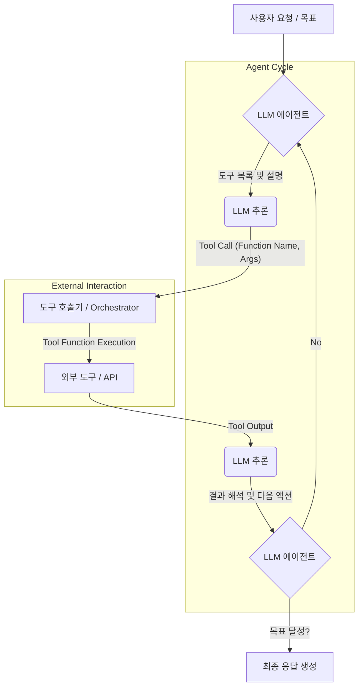

LLM 기반 에이전트가 현실 세계와 상호작용하는 지능형 시스템으로 진화하려면 외부 도구(Tools)의 효과적인 활용이 필수적입니다. LLM의 추론 능력과 외부 시스템의 실행력을 결합하는 이 전략은 에이전트가 최신 정보 접근, 복잡한 계산, 특정 액션 수행을 가능하게 하여 그 활용도를 비약적으로 높입니다. 2026년에는 도구 연동 능력의 정교함과 자율성 강화가 핵심 트렌드입니다.

### 도구 사용의 중요성 및 핵심 개념
LLM은 방대한 텍스트 데이터를 학습하여 뛰어난 추론 능력을 갖추지만, 실시간 정보 접근, 복잡한 수치 계산, 특정 API 호출 등 외부 기능 수행에는 한계가 있습니다. 이러한 한계를 극복하기 위해 에이전트는 도구를 사용하며, 이때 'Function Calling'은 LLM이 목표 달성을 위해 어떤 도구를 어떤 인자로 호출해야 할지 스스로 결정하여 JSON 형태로 출력하는 핵심 메커니즘입니다.

### LLM 에이전트의 도구 사용 워크플로우
에이전트의 도구 사용은 목표 분석, 도구 선택, 인자 생성, 도구 실행, 결과 관찰 및 해석, 그리고 반복 및 개선의 단계를 거쳐 진행됩니다.



### 도구 연동 디자인 패턴

#### 1. 단순 Function Calling 패턴
가장 기본적인 형태로, LLM이 직접 호출할 수 있는 함수 스키마를 제공하고, LLM이 이에 맞춰 함수 호출을 제안하면 외부 로직이 이를 실행하는 방식입니다.

```python
import json

class Tool:
    def __init__(self, name, description, schema, func):
        self.name = name
        self.description = description
        self.schema = schema
        self.func = func

    def call(self, **kwargs):
        return self.func(**kwargs)

def get_current_weather(location: str, unit: str = "celsius"):
    """현재 특정 위치의 날씨를 조회합니다."""
    weather_data = {
        "Seoul": {"temperature": 25, "unit": "celsius", "condition": "Sunny"},
        "Tokyo": {"temperature": 28, "unit": "celsius", "condition": "Cloudy"}
    }
    temp = weather_data.get(location, {}).get("temperature")
    cond = weather_data.get(location, {}).get("condition")

    if temp is not None:
        return {"location": location, "temperature": temp, "unit": unit, "condition": cond}
    return {"error": f"날씨 정보를 찾을 수 없습니다: {location}"}

weather_tool_schema = {
    "name": "get_current_weather",
    "description": "현재 특정 위치의 날씨를 조회합니다.",
    "parameters": {
        "type": "object",
        "properties": {
            "location": {"type": "string", "description": "조회할 도시 이름"},
            "unit": {"type": "string", "enum": ["celsius", "fahrenheit"], "description": "온도 단위"}
        },
        "required": ["location"]
    }
}
weather_tool = Tool("get_current_weather", "현재 날씨 정보 조회", weather_tool_schema, get_current_weather)

llm_response_for_weather = {
    "tool_calls": [
        {
            "id": "call_123",
            "function": {
                "name": "get_current_weather",
                "arguments": "{\"location\": \"Seoul\", \"unit\": \"celsius\"}"
            },
            "type": "function"
        }
    ]
}

def execute_tool_call(tool_response, available_tools):
    tool_calls = tool_response.get("tool_calls", [])
    results = []
    for call in tool_calls:
        function_name = call["function"]["name"]
        arguments = json.loads(call["function"]["arguments"]) # LLM이 생성한 JSON 스트링을 파싱

        for tool in available_tools:
            if tool.name == function_name:
                tool_output = tool.call(**arguments)
                results.append({"tool_call_id": call["id"], "output": tool_output})
                break
        else:
            results.append({"tool_call_id": call["id"], "output": {"error": f"Tool not found: {function_name}"}})
    return results

available_tools = [weather_tool]
tool_execution_results = execute_tool_call(llm_response_for_weather, available_tools)
# print(json.dumps(tool_execution_results, indent=2, ensure_ascii=False))
```

#### 2. 도구 오케스트레이션 및 라우팅 패턴 (Tool Orchestration & Routing)
여러 도구를 관리하고 복잡한 요청에 따라 조합하거나 순서대로 호출하는 방식입니다. LangChain, CrewAI 같은 프레임워크가 이 패턴을 따르며, 다단계 계획 수립 및 실행을 가능하게 합니다.

#### 3. 동적 도구 생성 패턴 (Dynamic Tool Creation)
에이전트가 특정 상황에 맞춰 필요한 도구를 동적으로 정의하고 생성합니다. 예: 사용자 데이터 스키마에 맞는 데이터베이스 쿼리 함수 생성. 이는 2026년 이후 자율적 에이전트의 핵심 역량입니다.

### 2026년 주요 도구 사용 트렌드
*   **Proactive Tool Learning**: 에이전트가 새로운 도구를 스스로 발견하고 학습하여 등록.
*   **Multi-modal Tool Interaction**: 텍스트 외 이미지, 음성 등 다양한 모달리티 처리 도구와 연동하여 복합 작업 수행.
*   **Secure & Sandboxed Tool Execution**: 도구 실행 환경의 보안 강화 및 격리된 환경에서 안전하게 도구 실행.

## 트레이드오프

### 1. 복잡성 vs. 유연성
*   **언제 좋고**: 다양한 외부 시스템 연동 및 기능 고도화가 필요한 경우, 에이전트의 수행 능력을 크게 확장시킵니다.
*   **언제 나쁜지**: 도구 수가 많아질수록 관리 복잡성이 증가하며, 적절한 도구 선택을 위한 프롬프트 엔지니어링이 어려워지고 디버깅/유지보수 비용이 증가합니다.

### 2. 성능(응답 시간) vs. 기능 확장
*   **언제 좋고**: LLM 자체의 한계를 넘어 특정 도메인 작업(예: 계산, 실시간 데이터 조회)을 수행할 때 에이전트의 실용성을 대폭 향상시킵니다.
*   **언제 나쁜지**: 각 도구 호출마다 네트워크 지연과 LLM의 반복 추론 사이클이 추가되어 전체 응답 시간이 길어집니다. 실시간 응답이 필요한 애플리케이션에는 불리합니다.

### 3. 보안 및 안정성 vs. 개방성
*   **언제 좋고**: 외부 도구 연동은 에이전트 활용 범위를 무한히 확장하며, 강력한 사용자 경험을 제공합니다.
*   **언제 나쁜지**: 에이전트가 호출하는 도구들이 외부 시스템에 직접 영향을 미치므로 보안 취약점(예: SQL 인젝션) 위험이 있습니다. 안정적인 도구 스키마 관리와 실행 환경 격리 없이는 운영이 어렵습니다.

## 실전 체크리스트

다음은 LLM 에이전트의 도구 사용을 디자인하고 구현할 때 고려해야 할 실전 체크리스트입니다.

- [ ] **도구 스키마 명확성**: 각 도구의 `name`, `description`, `parameters` 스키마가 LLM이 이해하기 쉽고 명확하게 정의되어 있는가?
- [ ] **에러 핸들링 및 복구 로직**: 도구 실행 실패 시 LLM에게 에러를 효과적으로 전달하고, 에이전트가 이를 기반으로 재시도하거나 대체 계획을 수립할 수 있는 복구 로직이 구현되어 있는가?
- [ ] **보안 및 접근 제어**: 도구에 대한 접근 권한이 최소한의 원칙(Least Privilege)에 따라 설정되어 있으며, 입력 및 출력 검증 로직이 적용되어 있는가?
- [ ] **관찰 가능성(Observability)**: 각 도구 호출의 시작, 종료, 성공/실패 여부, 입력 인자, 출력 결과 등이 로깅되고 모니터링되어 도구 사용 흐름을 추적하고 디버깅할 수 있는가?
- [ ] **성능 및 지연 시간 분석**: 도구 호출로 인한 전체 응답 시간 증가를 측정하고, 병목 현상이 발생하는 도구에 대한 최적화 또는 캐싱 전략이 고려되어 있는가?