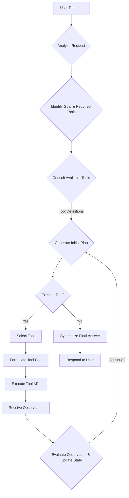

LLM 에이전트의 외부 도구(External Tools) 활용 능력은 복잡한 실제 문제를 해결하는 데 필수적입니다. 단순히 지식을 검색하는 것을 넘어, 계산 수행, API 호출, 데이터베이스 조회 등 실제 환경과 상호작용하는 능력이 에이전트의 실용성을 결정합니다. 효과적인 도구 사용(Tool Use)을 위한 프롬프트 디자인은 에이전트의 성능과 안정성을 극대화하는 핵심 요소입니다.

## 핵심 도구 사용 프롬프트 디자인 패턴

LLM 에이전트가 외부 도구를 성공적으로 활용하도록 유도하는 체계적인 프롬프트 디자인 패턴은 다음과 같습니다.

### 1. ReAct (Reasoning and Acting) 패턴

ReAct 패턴은 LLM 에이전트가 추론(Reasoning)과 행동(Acting)을 번갈아 수행하며 문제를 해결하도록 안내합니다. 이는 에이전트가 계획을 세우고, 도구를 실행하며, 결과를 관찰하고, 필요에 따라 계획을 수정하는 반복적인 과정을 가능하게 합니다.

**프롬프트 구조:**
에이전트는 'Thought', 'Action', 'Observation' 세 가지 구성 요소를 사용하여 현재 상태를 명확히 하고 다음 단계를 결정합니다.

```
You are an intelligent assistant capable of using various tools.
Available tools:
- search(query: str): Searches the web for the given query.
- calculator(expression: str): Evaluates a mathematical expression.
- api_caller(url: str, method: str, body: dict): Calls an external API.

Your goal is to answer the user's request.
Begin!

User Request: Calculate the square root of 144 and then search for "current weather in Seoul".

Thought: The user wants two things: first, a calculation, then a web search. I should start by calculating the square root.
Action: calculator("sqrt(144)")
Observation: 12.0
Thought: I have the first result. Now I need to perform the web search.
Action: search("current weather in Seoul")
Observation: Current weather in Seoul: 25°C, sunny.
Thought: I have completed both tasks. I will now provide the answer.
Answer: The square root of 144 is 12.0, and the current weather in Seoul is 25°C and sunny.
```

### 2. Tool Schema & Constraint Definition

에이전트에게 사용할 수 있는 도구의 기능, 입력 매개변수, 예상 출력 형식, 그리고 사용 제약 조건을 명확하게 정의하는 것은 오작동을 줄이고 효율적인 도구 선택을 돕습니다. JSON Schema와 같은 구조화된 포맷을 활용하는 것이 일반적입니다.

```
You have access to the following tools. Each tool is described below with its parameters.
Respond using a JSON object in the format: { "tool": "tool_name", "parameters": { ... } } if you need to use a tool.
If you have the final answer, respond with { "answer": "your final answer" }.

Tool: get_stock_price
Description: Fetches the current stock price for a given ticker symbol.
Parameters:
  symbol (string): The stock ticker symbol (e.g., "AAPL", "GOOG").
  Required: true
Output: A float representing the stock price.

Tool: send_email
Description: Sends an email to a recipient.
Parameters:
  to (string): The recipient's email address.
  subject (string): The subject of the email.
  body (string): The content of the email.
  Required: true for all parameters.
Output: A string indicating success or failure.

User Request: What is the current price of NVIDIA stock?
```

에이전트는 이 정의를 바탕으로 `{"tool": "get_stock_price", "parameters": {"symbol": "NVDA"}}`와 같이 정확한 JSON 형태의 도구 호출을 생성하게 됩니다.

### 3. Contextual Tool Selection & Chaining

특정 상황에서 어떤 도구를 사용해야 하는지, 그리고 여러 도구를 어떻게 조합해야 하는지 에이전트가 판단하도록 유도합니다. 이 패턴은 복잡한 다단계 작업을 처리할 때 특히 유용합니다.

**Mermaid Diagram: LLM Agent Tool Use Workflow**



이 워크플로우는 에이전트가 요청 분석, 도구 식별, 계획 수립, 실행, 관찰 및 평가의 반복 주기를 거치며 목표를 달성하는 과정을 시각화합니다.

### 4. Self-Correction & Error Handling

도구 실행에 실패하거나 예상치 못한 결과가 나왔을 때, 에이전트가 스스로 오류를 감지하고 수정 전략을 세우도록 프롬프팅합니다. 여기에는 재시도, 다른 도구 사용, 사용자에게 추가 정보 요청 등의 옵션이 포함될 수 있습니다.

```
You just attempted to use the 'api_caller' tool, but received the following error:
Error: API returned status code 404, {"message": "Endpoint not found."}

Thought: The API call failed because the endpoint was not found. This indicates an incorrect URL or resource path. I need to re-evaluate the request and potentially try a different approach or inform the user. I will first check if there is an alternative tool or a common mistake in similar API calls. If not, I will ask for clarification.
Action: search("alternative API for {original_request_purpose}") // Hypothetical retry/re-evaluation
Observation: ... // Results of search
```

## 트레이드오프

### 1. 프롬프트 복잡성 vs. 에이전트 역량 강화
*   **언제 좋은가**: LLM 에이전트가 복잡한 문제 해결, 여러 외부 시스템과의 상호작용, 동적인 환경 변화에 대응해야 할 때 필수적입니다. 명확하고 구조화된 프롬프트는 에이전트의 안정성과 예측 가능성을 높입니다.
*   **언제 나쁜가**: 단순한 질의응답이나 단일 도구 사용만으로 충분한 시나리오에서는 과도한 오버헤드가 될 수 있습니다. 프롬프트의 길이가 길어지면 토큰 비용이 증가하고 추론 속도가 저하될 수 있습니다.

### 2. Latency (지연 시간) vs. Accuracy (정확성) 및 Robustness (견고성)
*   **언제 좋은가**: 높은 정확성과 오류 복구 능력이 중요한 업무(예: 금융 거래, 코드 생성, 중요한 데이터 처리)에서는 도구 사용을 통한 검증과 반복적인 자가 수정 과정이 필수적입니다. 초기 지연이 발생하더라도 최종 결과의 신뢰성을 높이는 것이 중요할 때 적합합니다.
*   **언제 나쁜가**: 실시간 상호작용이 중요하거나 빠른 응답이 핵심인 애플리케이션(예: 채팅봇의 즉각적인 응답, 간단한 정보 검색)에서는 여러 단계의 도구 호출 및 추론 과정이 사용자 경험을 저해할 수 있습니다.

### 3. 유연성 vs. 제어 가능성
*   **언제 좋은가**: 에이전트가 예상치 못한 상황에 직면했을 때, 정의된 도구와 ReAct 같은 패턴을 통해 스스로 새로운 해결책을 탐색하고 적응하는 유연성을 제공합니다. 이를 통해 개발자가 모든 예외 상황을 미리 코딩할 필요가 없어집니다.
*   **언제 나쁜가**: 보안이 중요하거나 특정 로직을 반드시 준수해야 하는 규제 환경에서는 에이전트의 자율적인 도구 사용이 의도치 않은 결과를 초래할 수 있습니다. 엄격한 제어와 감사가 필요한 경우에는 도구 호출을 명시적으로 화이트리스트(whitelist)하고 검증하는 추가적인 계층이 필요합니다.

### 4. 일반화 가능성 vs. 도메인 특화 성능
*   **언제 좋은가**: 다양한 도구와 문제 유형에 적용될 수 있는 일반적인 패턴(ReAct, Tool Schema)은 새로운 도구나 태스크가 추가될 때 재사용성이 높습니다. 에이전트를 다양한 도메인에 걸쳐 활용할 때 유용합니다.
*   **언제 나쁜가**: 특정 도메인에 최적화된 고성능이 요구되는 경우, 일반적인 패턴보다는 해당 도메인의 특성과 제약을 깊이 반영한 맞춤형 프롬프트 디자인이 더 나은 성능을 보일 수 있습니다.

## 실전 체크리스트

프로젝트에 LLM 에이전트의 도구 사용 능력을 적용할 때 다음 항목들을 검증하세요.

- [ ] **도구 정의의 명확성 및 일관성**: 모든 외부 도구에 대해 기능, 입력, 출력, 제약 조건이 JSON Schema와 같은 표준화된 형식으로 명확하게 정의되어 있는가?
- [ ] **에이전트의 도구 호출 형식 준수**: 에이전트가 도구를 호출할 때 정의된 형식(예: JSON)을 정확히 준수하는지, 그리고 잘못된 형식을 생성할 경우 올바르게 오류를 처리하는지 모니터링 및 테스트하고 있는가?
- [ ] **도구 사용 로그 및 관찰 가능성**: 에이전트가 어떤 도구를 언제 호출했고, 어떤 입력을 주었으며, 어떤 출력을 받았는지 추적할 수 있는 상세한 로그 시스템이 구축되어 있는가? (Observation)
- [ ] **자가 수정 및 오류 복구 메커니즘**: 도구 호출 실패 시 에이전트가 재시도, 대체 도구 사용, 사용자에게 정보 요청 등 적절한 자가 수정 및 오류 복구 전략을 실행하도록 프롬프트가 설계되어 있는가?
- [ ] **컨텍스트 윈도우(Context Window) 효율성**: 도구 사용 이력과 관찰 결과를 효율적으로 요약하고 관리하여 프롬프트의 컨텍스트 윈도우를 최적화하고, 불필요한 정보로 인한 노이즈를 줄이고 있는가?
- [ ] **보안 및 권한 관리**: 에이전트가 호출하는 외부 도구들이 최소 권한 원칙(Principle of Least Privilege)에 따라 접근 권한이 설정되어 있으며, 민감한 작업에 대한 추가적인 사용자 승인 또는 가드레일(Guardrails)이 마련되어 있는가?
- [ ] **성능 벤치마킹 및 최적화**: 특정 태스크에 대해 도구 사용 에이전트의 종단 간(End-to-End) 지연 시간(Latency)과 성공률(Success Rate)을 정기적으로 벤치마킹하고, 병목 현상을 식별하여 최적화 작업을 수행하고 있는가?