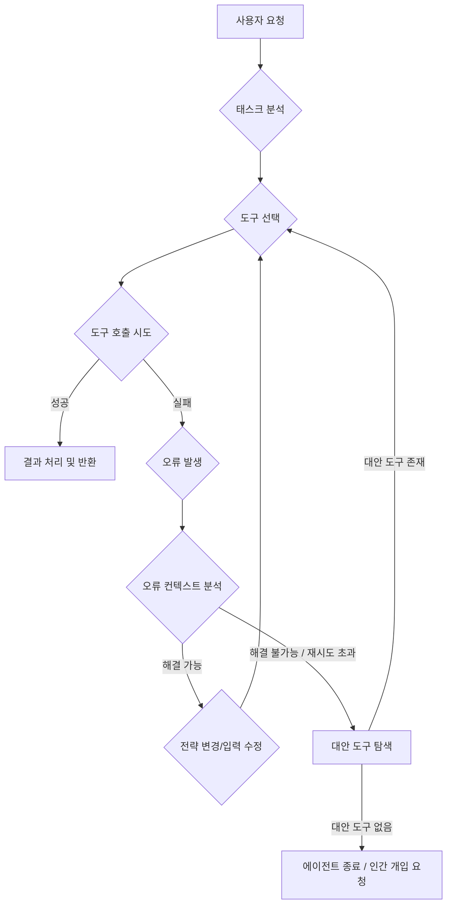

LLM 기반 에이전트의 핵심 역량 중 하나는 외부 도구(Tool)를 활용하여 자체 한계를 넘어서는 것입니다. 검색 엔진을 통한 정보 탐색, 데이터베이스 쿼리, 코드 실행, 외부 API 호출 등 다양한 도구는 에이전트가 현실 세계와 상호작용하고 복잡한 문제를 해결하는 데 필수적입니다. 그러나 도구 사용의 비효율성은 불필요한 비용 증가, 응답 시간 지연, 그리고 예측 불가능한 결과로 이어질 수 있습니다. 본 문서에서는 LLM 에이전트의 도구 사용을 최적화하여 효율성과 신뢰성을 극대화하는 방법을 다룹니다.

## 동적 도구 선택 (Dynamic Tool Selection)

에이전트가 주어진 태스크에 가장 적합한 도구를 능동적으로 식별하고 활용하는 능력은 매우 중요합니다. 이는 단순히 사용 가능한 도구 목록을 나열하는 것을 넘어, 태스크의 의도와 현재 컨텍스트를 기반으로 최적의 도구를 선택하는 고급 추론 과정을 포함합니다.

### 컨텍스트 인지형 도구 설명 (Context-Aware Tool Descriptions)
도구의 기능과 사용법을 LLM이 이해하기 쉬운 형태로 명확하게 제공해야 합니다. 이는 정적(static)인 설명뿐만 아니라, 특정 사용 시나리오에 맞는 예시(few-shot examples)나 동적으로 생성되는 추가 컨텍스트를 포함할 수 있습니다. 예를 들어, `search_web` 도구는 "인터넷에서 최신 정보를 검색할 때 사용"과 같이 명확히 정의되어야 합니다.

### 자가 성찰 기반 선택 (Self-Reflective Selection)
에이전트는 도구 호출 전에 어떤 도구가 가장 적합한지 자가 성찰(self-reflection) 과정을 거쳐야 합니다. 또한, 도구 실행 후 그 결과가 태스크 목표에 부합하는지 평가하고, 필요한 경우 다른 도구를 선택하거나 재시도하는 메커니즘을 포함합니다.

```python
from typing import Dict, Any, Callable

class Tool:
    def __init__(self, name: str, description: str, func: Callable):
        self.name = name
        self.description = description
        self.func = func

    def execute(self, **kwargs) -> Any:
        print(f"Executing tool: {self.name} with args: {kwargs}")
        return self.func(**kwargs)

def search_web_func(query: str) -> str:
    # 실제 웹 검색 API 호출 로직 (생략)
    if "latest LLM trends" in query:
        return "2026년 LLM 에이전트는 멀티모달 이해와 자율 학습 능력이 강화됩니다."
    return f"결과: {query}에 대한 검색 결과"

def calculate_func(expression: str) -> float:
    try:
        return eval(expression)
    except Exception as e:
        return f"Error: {e}"

tools_registry: Dict[str, Tool] = {
    "search_web": Tool(
        name="search_web",
        description="인터넷에서 최신 정보를 검색하거나 특정 쿼리에 대한 사실을 찾을 때 사용합니다.",
        func=search_web_func
    ),
    "calculate": Tool(
        name="calculate",
        description="수학적 표현식을 계산할 때 사용합니다. (예: 10 * 5 + 3)",
        func=calculate_func
    ),
}

# LLM이 도구를 선택하고 인자를 생성하는 프롬프트 예시 (실제 LLM 호출은 생략)
def agent_decide_and_act(task: str, available_tools: Dict[str, Tool]) -> Any:
    # 이 부분은 LLM 추론 로직으로 대체됩니다.
    # LLM이 task를 분석하여 tool_name과 tool_args를 결정한다고 가정합니다.
    if "2026년 LLM 트렌드" in task:
        tool_name = "search_web"
        tool_args = {"query": "2026 LLM trends"}
    elif "50 더하기 30" in task:
        tool_name = "calculate"
        tool_args = {"expression": "50 + 30"}
    else:
        print("No suitable tool found for the task.")
        return None

    if tool_name in available_tools:
        selected_tool = available_tools[tool_name]
        return selected_tool.execute(**tool_args)
    else:
        print(f"Tool {tool_name} not found in registry.")
        return None

# 예시 사용
# print(agent_decide_and_act("2026년 LLM 트렌드에 대해 알려줘.", tools_registry))
# print(agent_decide_and_act("50 더하기 30은?", tools_registry))
```

## 견고한 오류 처리 및 복구 (Robust Error Handling and Recovery)

도구 호출은 네트워크 문제, 잘못된 입력, API 제한 등으로 인해 실패할 수 있습니다. 에이전트는 이러한 실패에 대해 단순 종료가 아닌, 견고한 복구 전략을 가져야 합니다.

### 재시도 및 대안 도구 사용 (Retry and Alternative Tool Usage)
도구 호출 실패 시, 즉시 포기하기보다 정해진 횟수만큼 재시도하거나, 문제가 지속될 경우 유사한 기능을 수행하는 다른 도구를 찾아 사용하는 패턴을 적용합니다. 예를 들어, `google_search`가 실패하면 `bing_search`로 전환하는 방식입니다.

### 오류 컨텍스트 분석 및 자가 수정 (Error Context Analysis and Self-Correction)
에이전트는 도구에서 반환된 오류 메시지를 분석하여 문제의 원인을 파악하고, 자체적으로 입력을 수정하거나 전략을 변경하는 자가 수정(Self-correction) 루프를 구현할 수 있습니다. 이는 프롬프트 엔지니어링을 통해 LLM에게 오류 처리 가이드라인을 제공함으로써 강화됩니다.



## 비용 및 성능 최적화 (Cost and Performance Optimization)

도구 사용은 LLM의 추론 비용 외에 외부 서비스 사용 비용, 응답 지연을 발생시킵니다. 이를 최소화하기 위한 전략이 필요합니다.

### 캐싱 메커니즘 (Caching Mechanisms)
자주 호출되는 도구의 결과나 비용이 많이 드는 연산 결과는 캐싱하여 불필요한 재호출을 방지합니다. TTL(Time-To-Live)을 설정하여 데이터 신선도를 유지하면서도 효율성을 높일 수 있습니다.

### 병렬 도구 실행 (Parallel Tool Execution)
서로 의존성이 없는 여러 도구 호출은 병렬로 실행하여 전체 태스크 완료 시간을 단축할 수 있습니다. 이는 복잡한 워크플로우에서 특히 중요합니다.

## 트레이드오프

*   **동적 도구 선택 (Dynamic Tool Selection)**
    *   **장점**: 높은 유연성으로 다양한 태스크와 예상치 못한 상황에 효과적으로 대응합니다. 새로운 도구가 추가될 때 시스템 변경 없이 빠르게 적용 가능합니다.
    *   **단점**: LLM 추론 비용이 증가할 수 있고, 잘못된 도구 선택으로 인해 불필요한 호출이나 태스크 실패 위험이 있습니다. 특히 도구 설명이 모호하거나 태스크가 복잡할 때 발생합니다.
*   **견고한 오류 처리 및 복구 (Robust Error Handling and Recovery)**
    *   **장점**: 시스템의 안정성과 신뢰성을 크게 향상시키고, 최종 사용자 경험을 개선합니다. 에이전트의 자율성을 높여 인간의 개입을 줄입니다.
    *   **단점**: 오류 처리 로직 구현이 복잡해지며, 복구 시도가 반복될 경우 총 처리 시간 및 비용이 증가할 수 있습니다. 잘못된 복구 전략은 무한 루프에 빠질 위험도 있습니다.
*   **캐싱 메커니즘 (Caching Mechanisms)**
    *   **장점**: 도구 호출 비용과 지연 시간을 현저히 줄여 전반적인 성능을 개선합니다. 특히 반복적이거나 자주 접근되는 데이터에 효과적입니다.
    *   **단점**: 캐시된 데이터의 신선도(staleness) 관리 문제가 발생할 수 있습니다. 캐시 불일치는 잘못된 정보 사용으로 이어질 수 있으며, 캐시 인프라 유지보수 비용이 발생합니다.
*   **병렬 도구 실행 (Parallel Tool Execution)**
    *   **장점**: 여러 독립적인 도구 호출을 동시에 처리하여 전체 워크플로우 시간을 단축하고 처리량을 늘립니다.
    *   **단점**: 도구 간의 잠재적 의존성을 정확히 파악해야 하며, 병렬 처리 중 발생하는 오류 관리나 컨텍스트 동기화가 복잡해질 수 있습니다. 자원 사용량도 증가합니다.

## 실전 체크리스트

*   - [ ] 각 도구의 기능, 입력, 출력, 예상 오류 케이스에 대한 LLM 친화적인 설명이 명확하게 작성되었는가?
*   - [ ] 에이전트가 도구 선택 전 현재 태스크 목표와 컨텍스트를 기반으로 자가 성찰(self-reflection)하는 프롬프트/메커니즘이 포함되어 있는가?
*   - [ ] 도구 호출 실패 시, 최소 1회 이상의 재시도 로직이 구현되어 있으며, 재시도 횟수 제한이 설정되어 있는가?
*   - [ ] 도구 오류 발생 시, 오류 메시지를 분석하고 대안 도구 탐색 또는 입력 수정 등의 자가 수정(self-correction) 전략이 작동하는가?
*   - [ ] 자주 호출되거나 비용이 높은 도구에 대한 캐싱 메커니즘이 구현되어 있으며, 캐시 유효 기간(TTL)이 적절하게 관리되는가?
*   - [ ] 병렬 실행이 가능한 도구 호출에 대해 비동기/병렬 처리 로직이 적용되어 전체 워크플로우 지연 시간을 단축하는가?
*   - [ ] 도구 호출 빈도, 성공/실패율, 평균 응답 시간 등 핵심 지표를 모니터링하여 병목 현상이나 비효율성을 지속적으로 파악하는가?