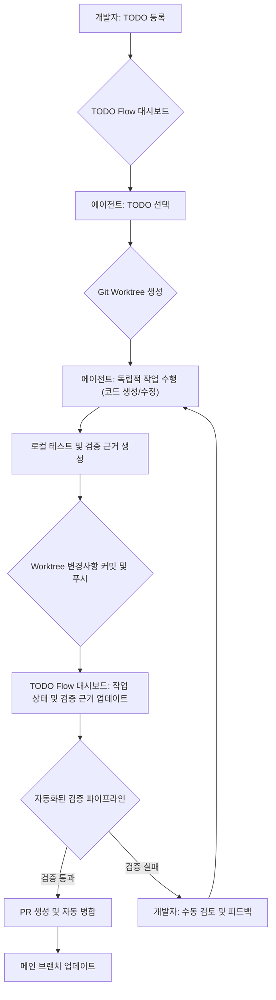

LLM 에이전트의 복잡한 작업 수행 능력 증대와 함께, 이들의 작업을 효율적으로 관리하고 정확성을 검증하는 워크플로의 중요성이 부각되고 있습니다. 특히 병렬적으로 진행되는 에이전트 작업의 상태를 추적하고, 생성된 결과물의 신뢰성을 확보하는 것은 필수적입니다. TODO Flow와 같은 접근 방식은 대화형 세션의 한계를 넘어, 구조화된 환경에서 에이전트 작업을 통합 관리하고 검증하는 실질적인 해결책을 제시합니다.

## Git Worktree 기반 병렬 작업 관리

Git worktree는 단일 Git 리포지토리 내에서 여러 작업 브랜치를 동시에 관리할 수 있는 강력한 기능을 제공합니다. 이를 LLM 에이전트 워크플로에 적용하면, 각 에이전트가 특정 TODO 항목에 할당되어 독립적인 작업 환경(worktree)에서 코드를 생성, 수정, 테스트할 수 있습니다. 이는 에이전트 간의 작업 충돌을 최소화하고, 각 작업의 진행 상황을 명확하게 분리하여 추적할 수 있게 합니다. 에이전트가 실패하더라도 다른 worktree에 영향을 미치지 않아 안정적인 병렬 처리가 가능하며, 이는 2026년 대규모 에이전트 시스템에서 요구되는 고가용성과 견고성(robustness)을 달성하는 데 기여합니다.

```bash
#!/bin/bash

# Initialize a new Git repository for demonstration
mkdir agent_workspace && cd agent_workspace
git init -b main
echo "Initial content" > initial.txt
git add . && git commit -m "Initial commit"

# Simulate a TODO list
echo "TODO: Implement feature A" > TODO.md
echo "TODO: Fix bug B" >> TODO.md

# Agent picks up "Implement feature A"
TASK_ID="feature-a"
git worktree add ../agent-worktree-$TASK_ID $TASK_ID

echo "Agent starting work on $TASK_ID..."
# Simulate agent activity in its worktree
(
    cd ../agent-worktree-$TASK_ID
    echo "Feature A implemented" > feature_a.py
    git add .
    git commit -m "feat: Implement feature A"
    echo "Automated test for feature A passed." > validation_log.txt
    git push origin $TASK_ID # Push to a remote branch
)

echo "Agent work on $TASK_ID completed. Initiating validation."

# Back in main workspace, monitor and validate
git fetch origin $TASK_ID
git checkout $TASK_ID # Temporarily switch to agent's branch for review
echo "Reviewing changes from agent-worktree-$TASK_ID:"
git diff main..$TASK_ID

# Simulate validation based on logs or tests
if grep -q "passed" ../agent-worktree-$TASK_ID/validation_log.txt; then
    echo "Validation successful for $TASK_ID."
    # Optionally merge or create PR
else
    echo "Validation failed for $TASK_ID. Requires human intervention."
fi

# Clean up
git worktree remove ../agent-worktree-$TASK_ID
git branch -D $TASK_ID
cd .. && rm -rf agent_workspace
```

## 로컬 대시보드를 통한 작업 및 검증 가시성

로컬 대시보드는 진행 중인 모든 에이전트 작업의 실시간 현황을 한눈에 파악할 수 있도록 돕습니다. 각 worktree의 상태, 에이전트가 생성한 변경사항, 테스트 결과, 그리고 검증 근거(rationale) 등을 시각적으로 제공합니다. 이는 개발자가 에이전트의 작업을 모니터링하고, 필요한 경우 개입하거나 피드백을 제공하는 휴먼-인-더-루프(Human-in-the-Loop) 시스템 구축에 핵심적인 역할을 합니다. 검증 근거의 외부화는 에이전트의 의사결정 과정을 투명하게 만들어 디버깅 및 감사에도 용이합니다. 이러한 투명성은 2026년 AI 거버넌스 및 책임 있는 AI 개발의 중요성이 강조됨에 따라 더욱 필수적인 요소가 됩니다.

## 워크플로 통합 및 자동화

이 워크플로는 기존 CI/CD 파이프라인과 통합되어 에이전트가 생성한 코드를 자동으로 테스트하고, 리뷰 요청(Pull Request)을 생성하며, 최종적으로 메인 브랜치에 병합(merge)하는 과정을 자동화할 수 있습니다. 에이전트의 작업 계획 등록, TODO 선택, 병렬 작업 실행, 검증, 그리고 리뷰 단계는 전체 개발 프로세스의 효율성을 극대화합니다. 이는 에이전트 복리 자동화(Agentic Compounding Automation)를 실현하고, 개발 주기를 단축하며, 인간 개발자가 더 복잡하고 창의적인 작업에 집중할 수 있도록 지원합니다.



## 트레이드오프

*   **병렬 작업 효율성 vs 관리 복잡도**
    *   **장점**: 다수의 에이전트가 동시에 독립적인 작업을 진행하여 전체 개발 속도를 크게 향상시킨다. 각 작업의 격리(isolation)는 한 에이전트의 실패가 다른 작업에 미치는 영향을 최소화한다.
    *   **단점**: Git worktree 및 대시보드 관리 오버헤드가 발생하며, 작업 간 복잡한 의존성이 있을 경우 동기화 및 병합(merge) 충돌 해결에 추가 노력이 필요할 수 있다.

*   **검증 및 가시성 vs 구현 비용**
    *   **장점**: 에이전트의 모든 작업 과정과 생성된 결과, 검증 근거가 대시보드를 통해 투명하게 공개되어 신뢰도를 높이고 디버깅을 용이하게 한다. 이는 특히 2026년 이후 강화될 것으로 예상되는 AI 시스템의 투명성 요구에 부합한다.
    *   **단점**: 상세한 로깅 및 대시보드 구현에 상당한 개발 비용이 소요될 수 있으며, 정보의 과부하(information overload)로 인해 핵심 정보를 놓칠 위험이 있다.

*   **휴먼-인-더-루프(Human-in-the-Loop) 제어 vs 자율성 저해**
    *   **장점**: 에이전트의 자율성과 개발자의 제어를 균형 있게 유지하여, 중요한 의사결정이나 복잡한 문제 해결에 인간의 전문성을 활용할 수 있다.
    *   **단점**: 인간의 개입이 필요한 시점을 정확히 파악하고, 효과적인 피드백 루프를 설계하는 것이 어려울 수 있으며, 잘못된 개입은 에이전트의 학습 및 자동화를 저해할 수 있다.

## 실전 체크리스트

이 지식을 프로젝트에 적용할 때 다음 항목들을 검증해야 합니다:

- [ ] LLM 에이전트가 Git worktree를 생성하고 관리할 수 있도록 Git CLI 또는 관련 라이브러리 연동이 완료되었는가?
- [ ] 각 worktree에서 에이전트가 독립적으로 코드 수정, 테스트 실행, 커밋/푸시를 수행하는 End-to-End 워크플로가 자동화되었는가?
- [ ] 에이전트가 생성한 코드에 대한 자동화된 테스트 스위트(test suite)가 구축되어 있으며, 테스트 결과가 대시보드에 실시간으로 반영되는가?
- [ ] 에이전트의 작업 진행 상황, 생성된 검증 근거(예: 테스트 로그, rationale), 그리고 최종 결과물을 시각화하는 로컬 대시보드가 구현되었는가?
- [ ] 에이전트가 특정 작업을 완료했을 때, 자동으로 코드 리뷰 요청(Pull Request)을 생성하고, 검증 근거를 PR 설명에 포함하는 기능이 있는가?
- [ ] 병렬 작업을 관리하는 중앙 오케스트레이션 레이어(Orchestration Layer)가 있어, 작업 할당, 상태 추적, 충돌 감지 및 해결 메커니즘을 제공하는가?
- [ ] 에이전트의 실패 시, 해당 worktree의 상태를 보존하고 인간의 개입을 유도하는 복구 메커니즘이 설계되었는가?