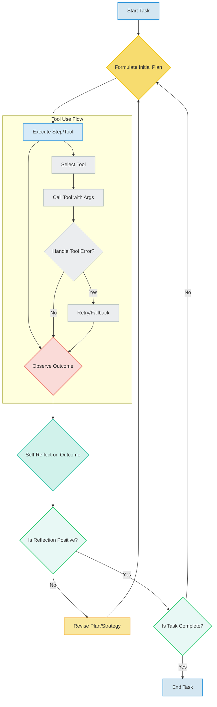

LLM(Large Language Model) 기반 자율 에이전트는 복잡한 환경에서 목표를 달성하기 위해 계획, 실행, 관찰, 그리고 재계획 과정을 반복합니다. 이러한 에이전트의 핵심 역량은 바로 '자기 성찰(Self-Reflection)'과 '도구 사용(Tool Use)' 능력에 있습니다. 자기 성찰은 에이전트가 자신의 행동, 계획, 결과에 대해 비판적으로 평가하고 개선점을 찾는 과정을 의미하며, 도구 사용은 외부 환경과 상호작용하고 특정 작업을 수행하기 위한 필수적인 수단입니다. 이 두 가지 패턴의 효과적인 구현은 에이전트의 자율성과 문제 해결 능력을 비약적으로 향상시킵니다.

## 자기 성찰 메커니즘 설계

자기 성찰은 에이전트가 복잡한 문제에 직면했을 때 고착 상태에 빠지거나 비효율적인 경로를 반복하는 것을 방지합니다. 이를 위한 설계 원칙은 다음과 같습니다.

### 1. 비판적 사고 프롬프트(Critical Thinking Prompting)
에이전트에게 현재 상태, 실행 결과, 계획의 적절성에 대해 스스로 질문하도록 유도하는 프롬프트 엔지니어링 기법입니다. '무엇이 잘못되었는가?', '더 나은 접근 방식은 무엇인가?', '이 결과가 목표 달성에 기여하는가?' 와 같은 질문을 통해 에이전트의 추론 능력을 활성화시킵니다.

```python
class Agent:
    def __init__(self, llm_client, memory):
        self.llm = llm_client
        self.memory = memory
        self.current_plan = []

    def reflect(self, observation, previous_action, current_task_state):
        prompt = f"""
        Context: {self.memory.get_recent_history()}
        Previous Action: {previous_action}
        Observation: {observation}
        Current Task State: {current_task_state}

        Analyze the current situation. What went well? What went wrong? 
        Identify any discrepancies between the observation and expected outcome. 
        Suggest improvements for the next steps or a revised plan. 
        Focus on enhancing efficiency and accuracy.
        """
        reflection_output = self.llm.generate(prompt)
        self.memory.add_reflection(reflection_output)
        return reflection_output

    def revise_plan(self, reflection_output):
        # Use reflection to update self.current_plan
        pass
```

### 2. 장기 기억 통합(Long-Term Memory Integration)
성찰의 깊이를 더하기 위해 과거의 경험, 성공/실패 사례, 학습된 지식(learned knowledge)을 활용해야 합니다. 벡터 데이터베이스 등을 통해 관련성 높은 과거 성찰 기록이나 문제 해결 패턴을 검색하여 현재 성찰 과정에 주입함으로써 에이전트는 더욱 정교한 통찰을 얻을 수 있습니다.

### 3. 피드백 루프 및 재계획(Feedback Loop and Re-planning)
성찰 결과는 반드시 다음 행동 계획에 반영되어야 합니다. 이는 에이전트가 단순히 반성하는 것을 넘어 실제 학습하고 발전하는 메커니즘입니다. 실패 시 재시도(retry) 전략, 계획 수정, 심지어 태스크 분해(task decomposition)까지 포함될 수 있습니다.

## 도구 사용 패턴 최적화

LLM 에이전트가 외부 환경과 효과적으로 상호작용하기 위해서는 도구 사용 패턴이 중요합니다. 2026년 트렌드는 단순한 API 호출을 넘어선 동적이고 지능적인 도구 활용에 중점을 둡니다.

### 1. 동적 도구 선택(Dynamic Tool Selection)
주어진 태스크와 현재 상태에 따라 가장 적절한 도구를 동적으로 선택하는 능력입니다. 이는 LLM의 추론 능력과 풍부한 도구 메타데이터(설명, 사용 예시)를 활용하여 구현됩니다. LangChain의 `Agent`와 `Tools` 개념이 대표적입니다.

```python
# 예시: 도구 메타데이터 정의
tools = [
    {
        "name": "search_web",
        "description": "Perform a web search for current information."
    },
    {
        "name": "code_interpreter",
        "description": "Execute Python code for calculations or data processing."
    }
    # ... more tools
]

# 에이전트가 상황에 맞는 도구를 선택하도록 프롬프트 구성
# 예: LLM에게 현재 태스크와 사용 가능한 도구를 제시하고, 
#      어떤 도구를 사용할지, 어떤 인자로 호출할지 JSON 형식으로 응답 요청
```

### 2. 도구 오케스트레이션 및 체이닝(Tool Orchestration and Chaining)
하나의 복잡한 태스크를 해결하기 위해 여러 도구를 순차적으로 또는 병렬적으로 호출하고 그 결과를 통합하는 패턴입니다. 예를 들어, 웹 검색(Web Search) 결과로 얻은 데이터를 코드 인터프리터(Code Interpreter)로 분석한 후, 결과를 사용자에게 보고하는 방식입니다.

### 3. 견고한 오류 처리 및 복구(Robust Error Handling and Recovery)
도구 호출은 네트워크 문제, 잘못된 입력, 외부 서비스 오류 등으로 실패할 수 있습니다. 에이전트는 이러한 오류를 인지하고, 재시도, 대체 도구 사용, 계획 수정 또는 사용자에게 보고하는 등 적절한 복구 전략을 수행해야 합니다. 자기 성찰 메커니즘과 결합하여 오류 원인을 분석하고 장기적으로 동일한 오류를 피하는 학습도 가능합니다.

## 자기 성찰 및 도구 사용 패턴의 통합 워크플로우

다음은 자율 에이전트가 자기 성찰과 도구 사용을 결합하여 태스크를 수행하는 일반적인 워크플로우입니다.



## 트레이드오프

자기 성찰 및 도구 사용 패턴을 구현할 때는 다음과 같은 트레이드오프를 고려해야 합니다.

*   **정확성 vs. 비용/속도**: 자기 성찰은 에이전트의 의사결정 정확도를 높이지만, 추가적인 LLM 호출을 유발하여 컴퓨팅 비용과 응답 시간을 증가시킵니다. 언제 복잡한 성찰이 필요한 복잡한 태스크에 적용하고, 언제 간단한 태스크에 대해 신속한 실행을 우선시할지 판단해야 합니다.
*   **자율성 vs. 제어 가능성**: 에이전트가 더 많은 자율성을 가지고 도구를 사용하고 성찰을 통해 계획을 수정할수록, 개발자나 사용자의 직접적인 제어는 줄어듭니다. 이는 예측 불가능한 행동이나 안전 문제로 이어질 수 있으므로, 언제 엄격한 가드레일(Guardrails)이 필요하고 언제 에이전트의 탐색적 행동을 허용할지 결정해야 합니다.
*   **복잡성 관리 vs. 유연성**: 정교한 성찰 및 도구 사용 패턴은 에이전트 시스템의 전체적인 복잡도를 증가시킵니다. 이는 개발, 디버깅, 유지보수를 어렵게 할 수 있습니다. 언제 일반적인 태스크에 대해 간결한 패턴을 사용하고, 언제 고도의 유연성이 요구되는 문제에 복잡한 아키텍처를 도입할지 균형을 찾아야 합니다.
*   **기억 활용 vs. 컨텍스트 길이**: 장기 기억을 활용한 성찰은 에이전트의 학습 능력을 향상시키지만, 관련 컨텍스트를 검색하고 LLM 프롬프트에 포함하는 과정에서 컨텍스트 윈도우 한계에 직면할 수 있습니다. 언제 핵심 정보만 요약하여 주입하고, 언제 더 넓은 범위의 정보를 제공하여 성찰의 깊이를 늘릴지 고민해야 합니다.

## 실전 체크리스트

LLM 기반 자율 에이전트에 자기 성찰 및 도구 사용 패턴을 적용할 때 다음 체크리스트를 활용하여 구현의 완성도를 높일 수 있습니다.

- [ ] 에이전트의 목표와 태스크 복잡도에 따라 성찰 단계의 필요성과 빈도가 적절하게 정의되었는가?
- [ ] 에이전트가 비판적으로 스스로의 행동을 평가하도록 유도하는 성찰 프롬프트(Reflection Prompt)가 명확하고 포괄적인가?
- [ ] 도구 호출 실패 시, 에이전트가 오류를 인지하고 적절한 재시도(Retry) 또는 대체 전략을 실행하는 로직이 구현되었는가?
- [ ] 에이전트가 태스크 수행 중 어떤 도구를 언제, 왜 사용했는지, 그리고 그 결과가 어떠했는지 기록하는 추적(Logging) 및 관찰(Observability) 메커니즘이 마련되었는가?
- [ ] 장기 기억(Long-Term Memory) 시스템이 에이전트의 과거 성찰 결과 및 성공/실패 사례를 저장하고, 필요 시 관련 컨텍스트를 검색하여 현재 성찰에 활용하는가?
- [ ] 에이전트가 외부 도구 사용 시 발생할 수 있는 보안 취약점(예: 프롬프트 인젝션 통한 도구 오용)에 대한 가드레일 및 검증 로직이 포함되었는가?
- [ ] 에이전트의 자기 성찰 및 도구 사용 워크플로우가 예상치 못한 상황(Edge Cases)이나 모호한 지시(Ambiguous Instructions)에 대해 얼마나 유연하게 대응하는지 테스트 및 검증되었는가?