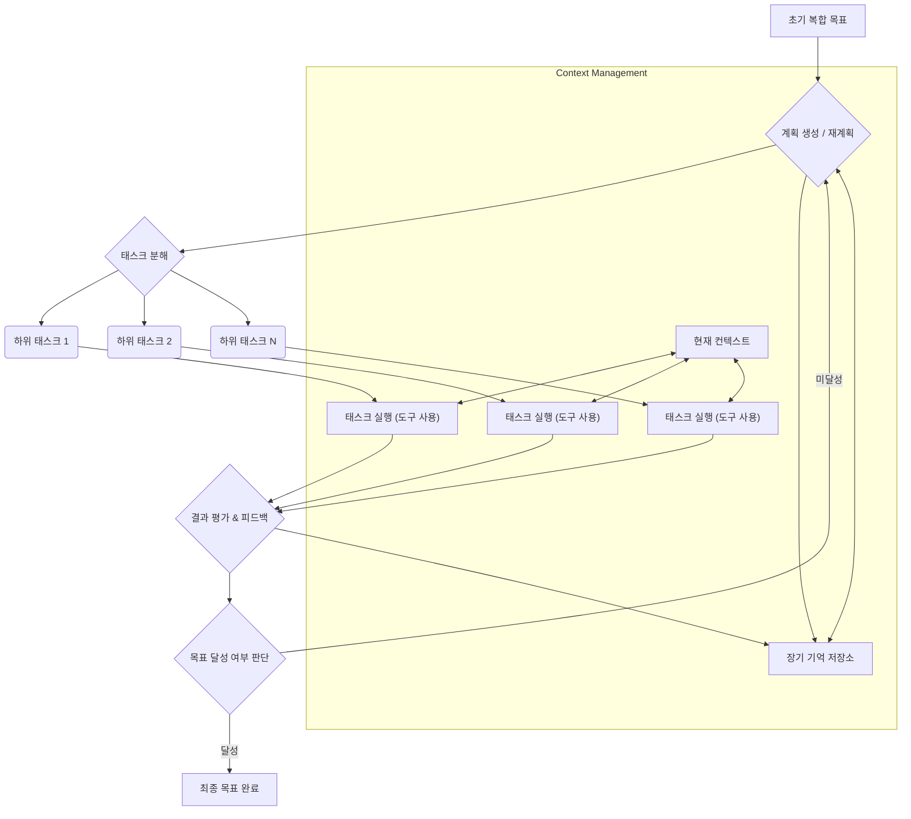

LLM 기반 자율 에이전트가 복잡한 목표를 효과적으로 달성하기 위해서는 정교한 목표 달성 전략과 효율적인 태스크 분해 패턴이 필수적입니다. 단순히 일련의 도구를 호출하는 것을 넘어, 에이전트가 고수준 목표를 이해하고, 이를 실행 가능한 하위 태스크로 나누며, 변화하는 환경에 적응하는 능력은 에이전트 시스템의 성공을 좌우합니다.

## 왜 계층적 태스크 분해가 중요한가?

복잡한 목표는 단일 프롬프트나 순차적인 도구 사용만으로는 해결하기 어렵습니다. 인간이 복잡한 프로젝트를 관리하는 방식과 유사하게, LLM 에이전트도 대규모 목표를 작고 관리 가능한 단위로 쪼개야 합니다. 이는 다음과 같은 이점을 제공합니다:

*   **복잡성 관리 (Complexity Management)**: 전체 시스템의 인지 부하를 줄여줍니다.
*   **강건성 향상 (Increased Robustness)**: 특정 하위 태스크 실패 시 전체 시스템의 실패로 이어지지 않고, 재시도 또는 대체 경로 탐색이 용이합니다.
*   **진행 상황 추적 (Progress Tracking)**: 각 하위 태스크의 진행 상황을 명확히 모니터링하여 전체 목표 달성률을 파악할 수 있습니다.
*   **자원 효율성 (Resource Efficiency)**: 관련성 높은 정보만 특정 하위 태스크의 컨텍스트로 제공함으로써 토큰 비용을 최적화할 수 있습니다.

## 핵심 개념 및 패턴

### 1. 계층적 태스크 네트워크 (Hierarchical Task Network, HTN) 기반 태스크 분해

HTN은 고수준 목표를 하위 목표로, 다시 구체적인 액션으로 재귀적으로 분해하는 방법론입니다. 에이전트는 초기 목표를 받아들이고, 이를 실행 가능한 최소 단위의 서브태스크(primitive tasks) 또는 더 분해될 수 있는 복합 태스크(compound tasks)로 나눕니다. 이 과정에서 현재 상태, 사용 가능한 도구, 제약 조건 등을 고려합니다.

### 2. 동적 계획 및 재계획 (Dynamic Planning & Replanning)

계획은 정적이지 않습니다. 에이전트는 태스크 실행 중 예상치 못한 상황, 오류, 또는 새로운 정보에 직면할 수 있습니다. 동적 재계획은 이러한 변화를 감지하고, 기존 계획을 수정하거나 완전히 새로운 계획을 생성하여 목표 달성 경로를 유연하게 조정하는 능력입니다.

### 3. 피드백 루프 및 자기 수정 (Feedback Loops & Self-Correction)

모든 태스크 실행 후에는 그 결과를 평가하고, 목표 대비 진행 상황을 측정하는 피드백 루프가 작동해야 합니다. 에이전트는 이 피드백을 통해 자신의 행동을 성찰하고(self-reflection), 오류를 식별하며, 다음 액션 또는 계획에 반영하여 자기 수정을 수행합니다. 이는 LLM 에이전트의 강건성(robustness)과 신뢰성(reliability)을 극대화하는 핵심 요소입니다.

### 4. 누적 진행 상황 추적 (Cumulative Progress Tracking)

장기 목표(long-term goals) 달성에는 단순한 현재 상태 모니터링을 넘어선 누적 진행 상황 추적 시스템이 필요합니다. 에이전트는 완료된 태스크, 실패한 태스크, 보류 중인 태스크에 대한 '인내 원장(patience ledger)' 또는 '누적 기록(cumulative tracking)'을 유지하여 전체적인 맥락과 진척도를 관리합니다. 이는 에이전트가 목표에서 벗어나거나, 반복적인 실패에 빠지는 것을 방지합니다.

## 태스크 분해 패턴 예시

다음 Mermaid 다이어그램은 LLM 에이전트의 일반적인 태스크 분해 및 실행 흐름을 보여줍니다.



### 코드 예시: Python 기반 재귀적 태스크 분해 및 실행 (Pseudocode)

이 예시는 `Agent` 클래스가 `Goal`을 받아 `sub_tasks`로 분해하고, 각 태스크를 `execute_task` 메서드를 통해 처리하는 재귀적 구조를 보여줍니다.

```python
from typing import List, Dict, Any

class Agent:
    def __init__(self, llm_model, tools: List[Any]):
        self.llm = llm_model
        self.tools = {tool.name: tool for tool in tools}
        self.memory = [] # 장기 기억 저장소

    def plan_and_decompose(self, goal: str, context: List[str]) -> List[Dict]:
        # LLM을 사용하여 목표를 하위 태스크로 분해
        prompt = f"""
        Given the main goal: {goal}
        And current context: {context}
        Break down this goal into a list of smaller, actionable sub-tasks. 
        Each sub-task should include a 'description', 'tool_needed' (or null if none), and 'dependencies'.
        """
        response = self.llm.generate(prompt)
        # 응답을 파싱하여 태스크 리스트 반환
        return self.parse_task_list(response)

    def execute_task(self, task: Dict, global_context: List[str]) -> Any:
        print(f"Executing task: {task['description']}")
        tool_name = task.get('tool_needed')
        if tool_name and tool_name in self.tools:
            tool = self.tools[tool_name]
            # LLM을 사용하여 도구 호출에 필요한 인자 생성
            tool_prompt = f"""
            Given the task: {task['description']}
            And global context: {global_context}
            Generate arguments for the tool '{tool_name}'.
            """
            args_response = self.llm.generate(tool_prompt)
            args = self.parse_tool_arguments(args_response)
            result = tool.run(**args) # 도구 실행
            self.memory.append(f"Task '{task['description']}' executed with result: {result}")
            return result
        else:
            # 도구 없이 LLM이 직접 처리하는 태스크
            llm_prompt = f"""
            Perform the task: {task['description']}
            Using provided global context: {global_context}
            """
            result = self.llm.generate(llm_prompt)
            self.memory.append(f"Task '{task['description']}' completed by LLM with result: {result}")
            return result

    def achieve_goal(self, initial_goal: str) -> bool:
        current_goal = initial_goal
        global_context = []

        while True:
            print(f"\nPlanning for goal: {current_goal}")
            sub_tasks = self.plan_and_decompose(current_goal, global_context)

            if not sub_tasks: # 더 이상 분해할 태스크가 없거나 완료된 경우
                print("No more sub-tasks. Goal likely achieved.")
                return True

            for task in sub_tasks:
                if task.get('dependencies'):
                    # 종속성 처리 로직 (생략)
                    pass
                
                task_result = self.execute_task(task, global_context)
                global_context.append(f"Result from '{task['description']}': {task_result}")
                
                # 피드백 및 자기 수정 (LLM을 통해 결과 평가)
                reflection_prompt = f"""
                Evaluate the result '{task_result}' for task '{task['description']}'.
                Is this satisfactory? Any issues or next steps?
                """
                reflection = self.llm.generate(reflection_prompt)
                print(f"Reflection: {reflection}")
                self.memory.append(f"Reflection on '{task['description']}': {reflection}")

                # 필요시 재계획 또는 다음 단계 결정 로직 추가
            
            # 모든 서브태스크 완료 후, 메인 목표 달성 여부 재평가 (생략)
            # if self.evaluate_main_goal_completion(initial_goal, global_context):
            #    return True
            break # 예시를 위해 1회 루프 후 종료

        return False

    def parse_task_list(self, response: str) -> List[Dict]:
        # 실제 LLM 응답 파싱 로직 (JSON, Markdown 등) 구현 필요
        return [{'description': 'Search for relevant documents', 'tool_needed': 'search_engine', 'dependencies': []},
                {'description': 'Summarize search results', 'tool_needed': None, 'dependencies': ['Search for relevant documents']}]
    
    def parse_tool_arguments(self, response: str) -> Dict:
        # 실제 LLM 응답 파싱 로직 구현 필요
        return {'query': 'LLM autonomous agents'}

# --- Usage Example (실제 환경에서는 더 정교한 도구와 LLM이 필요합니다) ---
# class MockLLM:
#     def generate(self, prompt: str) -> str:
#         if 'Break down this goal' in prompt:
#             return """[{"description": "Understand user's request", "tool_needed": null, "dependencies": []}, {"description": "Search current market trends", "tool_needed": "web_search", "dependencies": []}]"""
#         elif 'Generate arguments' in prompt:
#             return "{"query": "current market trends"}"
#         elif 'Perform the task' in prompt:
#             return "User request understood: 'Provide market analysis'."
#         elif 'Evaluate the result' in prompt:
#             return "Satisfactory. Proceed to next step."
#         return ""

# class WebSearchTool:
#     name = "web_search"
#     def run(self, query: str) -> str:
#         return f"Results for '{query}': AI market growing rapidly, focus on generative models."

# mock_llm = MockLLM()
# mock_agent = Agent(llm_model=mock_llm, tools=[WebSearchTool()])
# mock_agent.achieve_goal("Provide a market analysis report for AI industry")
```

## 트레이드오프

LLM 기반 자율 에이전트의 목표 달성 전략과 태스크 분해 패턴을 설계할 때는 다음과 같은 트레이드오프를 고려해야 합니다.

*   **계획 세분화 (Plan Granularity): 추상화 vs. 상세화**
    *   **언제 좋은가 (When Good)**: 계획이 고수준으로 추상화되면 에이전트가 넓은 시야를 유지하고 유연하게 대처할 수 있습니다. 초기 탐색 단계나 환경이 불확실할 때 유용합니다. 반대로 계획이 매우 상세하면 정밀한 제어가 가능하며, 복잡하고 예측 가능한 절차적 태스크에 적합합니다.
    *   **언제 나쁜가 (When Bad)**: 지나치게 추상적인 계획은 구체적인 실행 단계에서 에이전트가 막히거나 비효율적인 경로를 탐색하게 만들 수 있습니다. 너무 상세한 계획은 LLM의 컨텍스트 창을 쉽게 채우고, 불필요한 추론 오버헤드를 발생시키며, 환경 변화에 덜 유연하게 대응하게 합니다.

*   **자율성 vs. 제어 (Autonomy vs. Control): 에이전트의 자유 vs. 시스템의 예측 가능성**
    *   **언제 좋은가**: 에이전트에게 높은 자율성을 부여하면 예상치 못한 문제에 창의적으로 대응하고 새로운 해결책을 찾을 수 있습니다. 복잡하고 정의되지 않은 문제 공간에서 혁신적인 결과가 필요할 때 유리합니다. 사용자의 직접적인 개입이 필요 없거나 적은 장기 실행 태스크에 적합합니다.
    *   **언제 나쁜가**: 과도한 자율성은 에이전트가 통제 불능 상태가 되거나(runaway agents), 비용을 초과하거나, 의도치 않은 부작용을 일으킬 위험을 증가시킵니다. 안전이 중요하거나 비용이 민감한 환경에서는 명확한 제어 및 가드레일이 필수적입니다.

*   **탐색 vs. 활용 (Exploration vs. Exploitation): 새로운 방법 시도 vs. 검증된 방법 고수**
    *   **언제 좋은가**: 탐색(Exploration)은 에이전트가 새로운 도구나 접근 방식을 발견하고 최적화되지 않은 경로를 개선할 기회를 제공합니다. 초기 개발 단계, 새로운 도메인 학습, 성능 개선이 목표일 때 효과적입니다. 활용(Exploitation)은 현재까지 가장 효과적인 것으로 입증된 방법을 반복적으로 사용하여 일관되고 예측 가능한 결과를 얻을 때 좋습니다. 안정적인 운영 환경이나 재현성이 중요한 태스크에 적합합니다.
    *   **언제 나쁜가**: 지나친 탐색은 비효율적이며, 때로는 잘못된 방향으로 에이전트를 이끌 수 있습니다. 반대로 과도한 활용은 에이전트가 더 나은 해결책을 찾을 기회를 놓치고, 최적화되지 않은 상태에 머무르게 할 수 있습니다. 환경이 빠르게 변하거나 새로운 도구가 자주 도입될 때는 활용 위주의 전략이 뒤처질 위험이 있습니다.

*   **컨텍스트 관리 (Context Management): 전체 컨텍스트 유지 vs. 관련성 높은 정보만**
    *   **언제 좋은가**: 모든 관련 정보를 컨텍스트에 유지하면 에이전트가 광범위한 지식을 바탕으로 추론하고, 복잡한 상호작용을 이해하는 데 도움이 됩니다. 태스크 간의 깊은 연관성이 있거나, 전체적인 그림을 파악해야 할 때 유용합니다. 반대로 태스크에 직접적으로 필요한 정보만 컨텍스트에 포함하면 토큰 비용을 크게 절감하고, LLM의 집중력을 높여 성능을 향상할 수 있습니다.
    *   **언제 나쁜가**: 너무 많은 정보를 컨텍스트에 넣으면 LLM의 토큰 한계를 초과하고, 불필요한 정보로 인해 핵심 정보의 '길을 잃는(lost in the middle)' 문제가 발생할 수 있습니다. 반대로 너무 적은 정보를 제공하면 에이전트가 필요한 배경 지식 없이 불완전한 추론을 하거나, 중요한 연결 고리를 놓칠 위험이 있습니다.

## 실전 체크리스트

LLM 기반 자율 에이전트의 목표 달성 전략 및 태스크 분해 패턴을 프로젝트에 적용할 때 다음 항목들을 검증하십시오.

- [ ] **목표 분해의 재귀적 유효성 검증**: 정의된 고수준 목표가 최소 3단계 이상의 하위 태스크로 재귀적으로 분해될 수 있는가? (예: `Goal -> SubGoal1 -> Task1.1 -> Action1.1.1`)
- [ ] **동적 재계획 트리거 정의**: 태스크 실행 실패, 외부 환경 변화, 새로운 정보 유입 등 재계획을 트리거할 명확한 조건 및 임계값이 정의되어 있는가?
- [ ] **자기 수정 피드백 루프 구현**: 각 태스크 실행 결과에 대한 LLM 기반의 자동 평가 및 반성(self-reflection) 메커니즘이 작동하며, 다음 계획 단계에 피드백이 반영되는가?
- [ ] **장기 목표 진행 상황 가시화**: 전체 목표에 대한 누적 진행 상황(예: 완료된 서브태스크 비율, 남은 예상 시간)을 시각적으로 모니터링할 수 있는 대시보드 또는 로그 시스템이 구축되어 있는가?
- [ ] **컨텍스트 압축 및 관리 전략**: 각 하위 태스크 실행 시 필요한 최소한의 컨텍스트만 제공하고, 이전 단계의 핵심 결과는 장기 기억 저장소(long-term memory)에 효과적으로 요약되어 관리되는가?
- [ ] **도구 사용의 견고성 및 오류 처리**: 에이전트가 사용하는 각 도구(tool)의 예상치 못한 오류에 대비한 재시도, 대체 도구 선택, 또는 인간 개입(human checkpoint)으로 전환하는 견고한 오류 처리 로직이 구현되어 있는가?
- [ ] **비용 및 성능 모니터링**: 태스크 분해 및 실행 과정에서 발생하는 LLM 토큰 사용량, API 호출 수, 전체 실행 시간 등 핵심 성능 및 비용 지표가 실시간으로 측정되고 모니터링되는가?
