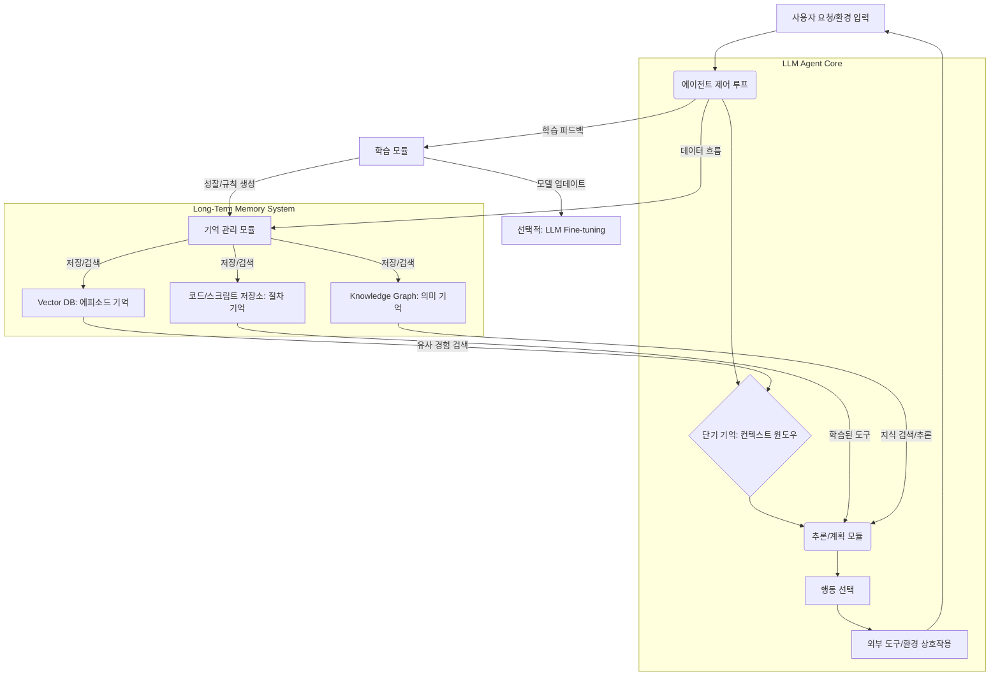

LLM (Large Language Model) 기반 자율 에이전트는 복잡한 태스크를 수행하는 데 강력한 잠재력을 가지고 있지만, 단기 컨텍스트 윈도우의 제약으로 인해 장기적인 계획, 지속적인 학습 및 과거 경험의 활용에 어려움을 겪습니다. 이를 극복하고 에이전트의 '지능'을 심화하기 위해 장기 기억 (Long-Term Memory) 및 학습 시스템 설계는 필수적인 요소입니다. 이 문서는 LLM 에이전트의 장기 기억 및 학습 시스템을 구축하는 핵심 전략과 아키텍처 패턴을 다룹니다.

## 장기 기억의 필요성

현재 LLM은 대규모 데이터로 사전 학습되어 방대한 일반 지식을 가지고 있지만, 특정 상호작용에서 얻은 경험이나 맥락에 따른 지식은 즉시 휘발됩니다. 이는 에이전트가 동일한 실수를 반복하거나, 과거의 성공적인 전략을 재사용하지 못하고, 장기적인 목표를 유지하며 진행 상황을 추적하기 어렵게 만듭니다. 장기 기억은 에이전트가 지속적으로 경험을 축적하고, 이를 바탕으로 더 정교하고 효율적인 행동을 학습하며, 복잡하고 장기적인 태스크를 성공적으로 완료하도록 돕는 핵심입니다.

## 장기 기억 아키텍처 패턴

LLM 에이전트의 장기 기억은 크게 세 가지 유형으로 분류되며, 각 유형에 맞는 저장 및 관리 전략이 필요합니다.

### 1. 에피소드 기억 (Episodic Memory)

에이전트가 경험한 특정 사건, 관찰, 행동 시퀀스 등 시공간적 맥락을 가지는 기억입니다. 마치 사람의 일기와 같습니다. 이는 에이전트의 과거 상호작용 로그, 태스크 실행 기록, 중간 상태 등을 저장합니다.

*   **구현**: Vector Database (예: Pinecone, Weaviate)는 임베딩된 경험 벡터를 저장하고, 유사성 검색을 통해 관련성 높은 과거 에피소드를 효율적으로 검색할 수 있게 합니다. RAG (Retrieval-Augmented Generation) 패턴과 결합하여 LLM의 컨텍스트를 풍부하게 만듭니다.

### 2. 의미 기억 (Semantic Memory)

사실적 지식, 개념, 관계 등 일반화된 정보입니다. 이는 에이전트가 세상에 대해 이해하는 '상식'이나 특정 도메인 지식에 해당합니다.

*   **구현**: Knowledge Graph (예: Neo4j, Grakn)는 엔티티와 그 관계를 그래프 형태로 저장하여 복잡한 추론과 관계 분석을 가능하게 합니다. 구조화된 데이터베이스는 정형화된 사실을 저장하는 데 효율적입니다. 에이전트가 새로운 사실을 발견하거나 기존 지식을 업데이트할 때 Knowledge Graph를 활용하여 지식 베이스를 확장할 수 있습니다.

### 3. 절차 기억 (Procedural Memory)

특정 작업을 수행하는 방법, 기술, 규칙 등 '어떻게 할 것인가'에 대한 기억입니다. 이는 에이전트의 '스킬' 학습과 관련이 깊습니다.

*   **구현**: 프롬프트 템플릿, Tool Use 스키마, Fine-tuning된 모델 가중치 등이 절차 기억의 형태로 간주될 수 있습니다. 에이전트가 특정 작업을 성공적으로 수행한 후, 해당 작업에 대한 최적의 프롬프트 구성이나 도구 사용 시퀀스를 저장하여 재사용합니다.

## 지속적인 학습 메커니즘

장기 기억에 저장된 데이터를 단순히 보관하는 것을 넘어, 에이전트가 이를 활용하여 성능을 개선하는 것이 중요합니다. 다음은 주요 학습 메커니즘입니다.

### 1. 성찰 (Reflection) 및 자기 수정 (Self-Correction)

에이전트가 자신의 행동 결과를 평가하고, 성공과 실패의 원인을 분석하여 미래 행동 전략을 개선하는 과정입니다. 과거의 에피소드 기억을 회상하고, LLM을 활용하여 이를 분석하며, 새로운 인사이트나 규칙을 추출하여 절차 기억 또는 의미 기억을 업데이트할 수 있습니다.

```python
class AgentMemorySystem:
    def __init__(self, vector_db_client, knowledge_graph_client, llm_model):
        self.vector_db = vector_db_client # 에피소드 기억
        self.knowledge_graph = knowledge_graph_client # 의미 기억
        self.llm = llm_model

    def add_episodic_memory(self, observation, action, outcome, embedding):
        """에이전트의 경험을 에피소드 기억에 저장합니다."""
        memory_id = self.vector_db.upsert(vectors=[(embedding, {"obs": observation, "act": action, "out": outcome})])
        return memory_id

    def retrieve_episodic_memory(self, query_embedding, top_k=5):
        """쿼리 임베딩과 유사한 과거 경험을 검색합니다."""
        results = self.vector_db.query(vector=query_embedding, top_k=top_k, include_metadata=True)
        return [r.metadata for r in results.matches]

    def update_semantic_memory(self, entity, relation, target):
        """의미 기억(지식 그래프)을 업데이트합니다."""
        self.knowledge_graph.create_triple(entity, relation, target)
        print(f"Knowledge updated: {entity} - {relation} -> {target}")

    def reflect_on_experience(self, current_task_context, past_experiences):
        """과거 경험을 바탕으로 성찰하여 학습합니다."""
        reflection_prompt = (
            f"Given the current task: {current_task_context}. "
            f"Review these past experiences: {past_experiences}. "
            "What lessons can be learned? What strategies should be adopted or avoided?"
        )
        reflection_output = self.llm.invoke(reflection_prompt)
        # 여기에서 reflection_output을 파싱하여 의미 기억 또는 절차 기억 업데이트 로직 호출
        print(f"Reflection output: {reflection_output}")
        return reflection_output

# 예시 사용법 (실제 DB 및 LLM 클라이언트 필요)
# memory_system = AgentMemorySystem(mock_vector_db, mock_knowledge_graph, mock_llm)
# memory_system.add_episodic_memory("observed X", "did Y", "got Z", [0.1, 0.2, ...])
# relevant_memories = memory_system.retrieve_episodic_memory(query_embedding)
# memory_system.reflect_on_experience("debug code", relevant_memories)
```

### 2. 경험 재생 (Experience Replay)

성공적인 태스크 수행 경로를 '긍정적 경험'으로, 실패한 경로를 '부정적 경험'으로 분류하여 장기 기억에 저장하고, 유사한 상황에서 이를 재활용하거나 회피합니다. 이는 강화 학습의 개념과 유사하며, 에이전트의 효율적인 의사결정을 돕습니다.

### 3. 지식 그래프 증강 (Knowledge Graph Augmentation)

에이전트가 새로운 정보를 습득하거나 기존 정보 간의 관계를 파악할 때, 이를 Knowledge Graph에 추가하거나 업데이트하여 의미 기억을 지속적으로 확장합니다. 이는 에이전트의 추론 능력을 강화하고, '세상 모델'을 더욱 정교하게 만듭니다.

### 4. 지속적인 Fine-tuning (Continual Fine-tuning)

일부 고급 시나리오에서는 에이전트가 특정 도메인이나 태스크에 특화된 새로운 데이터로 LLM 자체를 지속적으로 Fine-tuning하여 절차 기억을 강화할 수 있습니다. 그러나 이 방법은 비용이 많이 들고, '파국적 망각 (Catastrophic Forgetting)'의 위험이 있어 신중한 접근이 필요합니다.

## 통합 아키텍처

LLM 에이전트의 장기 기억 및 학습 시스템은 단일 구성 요소가 아닌, 다양한 모듈의 유기적인 결합으로 이루어집니다. 아래 Mermaid 다이어그램은 이들의 상호작용을 보여줍니다.



## 트레이드오프

*   **Vector DB vs. Knowledge Graph**: Vector DB는 대량의 비정형 에피소드 기억을 빠르게 저장하고 유사성으로 검색하는 데 효과적입니다. 언제 좋은가: 시계열 데이터, 로그, 대화 기록 등 패턴 기반의 경험 검색이 중요할 때. 언제 나쁜가: 복잡한 관계 추론, 정확한 사실 검색, 온톨로지 관리가 필요할 때 한계가 있습니다. Knowledge Graph는 구조화된 지식과 관계 추론에 강합니다. 언제 좋은가: 도메인 지식, 엔티티 관계, 논리적 추론이 필수적인 태스크. 언제 나쁜가: 대량의 비정형 데이터를 저장하고 검색하는 데 비효율적이며, 구축 및 유지보수 비용이 높습니다.

*   **온라인 학습 (Reflection) vs. 오프라인 학습 (Fine-tuning)**: 온라인 학습은 에이전트가 실시간으로 자신의 경험을 성찰하고 행동을 조정하는 방식입니다. 언제 좋은가: 빠르고 유연한 적응, 새로운 상황에 대한 즉각적인 대처. 언제 나쁜가: LLM의 환각이나 편향에 취약할 수 있으며, 학습 결과가 시스템 전체에 반영되기 어려울 수 있습니다. 오프라인 Fine-tuning은 학습 데이터를 모아 모델 자체를 업데이트합니다. 언제 좋은가: 특정 도메인에 대한 성능 최적화, 일관된 행동 패턴 보장. 언제 나쁜가: 학습 비용이 높고, 파국적 망각 발생 가능성, 업데이트 주기가 길어 실시간 적응에 부적합합니다.

*   **기억 검색의 복잡성**: 더 정교한 기억 시스템은 더 풍부한 정보를 제공하지만, 검색 과정이 복잡해지고 지연 시간이 늘어날 수 있습니다. 언제 좋은가: 고정밀 추론, 장기 계획이 필요한 미션 크리티컬 태스크. 언제 나쁜가: 실시간 응답이 필수적이거나, 단순하고 반복적인 태스크에서는 오버헤드가 될 수 있습니다.

*   **메모리 일관성 및 업데이트 전략**: 여러 유형의 기억 저장소가 존재할 때, 이들 간의 일관성을 유지하고 충돌 없이 업데이트하는 것이 중요합니다. 언제 좋은가: 에이전트의 지식 베이스가 안정적이고 신뢰할 수 있어야 할 때. 언제 나쁜가: 빠르게 변화하는 환경에서 실시간으로 모든 기억을 동기화하고 일관성을 보장하기 어려울 수 있으며, 복잡한 동기화 로직이 필요합니다.

## 실전 체크리스트

프로젝트에 LLM 에이전트의 장기 기억 및 학습 시스템을 적용할 때 다음 항목들을 확인합니다.

- [ ] 에이전트가 해결할 태스크의 '장기성'과 '학습 필요성'이 명확히 정의되었는가? (단순 질의응답은 장기 기억 불필요)
- [ ] 어떤 유형의 기억(에피소드, 의미, 절차)이 가장 중요하며, 각 기억 유형에 적합한 저장소(Vector DB, Knowledge Graph, RDB)를 선정했는가?
- [ ] 기억 저장소에서 LLM이 활용할 수 있는 형태로 정보를 임베딩하고 검색하는 RAG 파이프라인이 설계되었는가?
- [ ] 에이전트의 행동 결과(성공/실패)를 명확히 정의하고, 이를 바탕으로 성찰 및 자기 수정 로직을 구현했는가?
- [ ] 기억 시스템의 확장성 및 비용 효율성(저장 비용, 검색 Latency, LLM 토큰 사용량)을 고려한 아키텍처를 선택했는가?
- [ ] 새로운 지식이 장기 기억에 저장될 때, 기존 지식과의 충돌을 감지하고 해소하는 메커니즘을 마련했는가?
- [ ] 에이전트의 학습 진행 상황을 모니터링하고, 학습 효과를 정량적으로 평가할 수 있는 지표(KPI)가 정의되었는가?