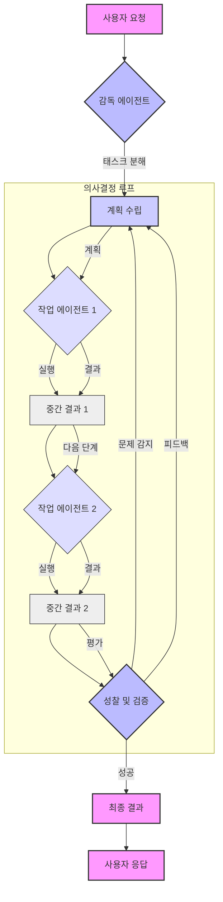

LLM 기반 자율 에이전트는 복잡한 다단계 의사결정 태스크를 처리하기 위해 진화하고 있습니다. 단일 프롬프트로 해결하기 어려운 문제들을 여러 단계로 나누어 순차적, 반복적으로 처리함으로써 신뢰성과 성능을 향상시키는 것이 핵심입니다. 이는 에이전트가 단순히 정보를 생성하는 것을 넘어, 능동적으로 문제를 분석하고 해결책을 찾아 실행하는 '자율성'을 부여하는 과정입니다.

## 다단계 의사결정의 필요성

기존의 LLM 활용 방식은 주로 단일 질의-응답에 초점을 맞추었습니다. 그러나 실제 세계의 복잡한 문제들은 종종 여러 하위 목표로 분해되고, 각 하위 목표는 서로 다른 정보, 도구, 추론 단계를 요구합니다. 예를 들어, "최신 시장 동향을 분석하고 신제품 아이디어를 제안하라"는 태스크는 데이터 수집, 분석, 아이디어 도출, 평가 등 다양한 단계가 필요하며, 각 단계에서 발생할 수 있는 오류를 스스로 감지하고 수정하는 능력이 중요합니다.

## 핵심 개발 패턴

다단계 의사결정을 위한 LLM 기반 자율 에이전트 개발에는 다음과 같은 핵심 패턴이 활용됩니다.

### 1. 태스크 분해 (Task Decomposition)

복잡한 상위 목표를 관리 가능한 작은 하위 태스크로 분해하는 패턴입니다. 이는 LLM이 한 번에 처리해야 할 정보의 양을 줄이고, 각 단계에 집중하여 더 정확한 결과를 도출하도록 돕습니다.
*   **Chain-of-Thought (CoT)**: LLM이 최종 답변에 도달하기까지의 추론 과정을 명시적으로 출력하도록 유도하여 중간 단계를 노출합니다.
*   **Tree-of-Thought (ToT)**: CoT의 확장으로, 여러 가능한 추론 경로를 탐색하고 그중 최적의 경로를 선택하여 에이전트가 다양한 시나리오를 고려하고, 막다른 길에 도달했을 때 되돌아갈 수 있도록 합니다.
*   **Plan-and-Execute**: LLM이 먼저 전체 계획을 수립한 후, 각 계획 단계를 순차적으로 실행하는 방식입니다. 계획 단계에서 잠재적 문제를 예측하고, 실행 중 문제가 발생하면 계획을 수정할 수 있습니다.

### 2. 성찰적 추론 (Reflective Reasoning) 및 자가 수정 (Self-Correction)

에이전트가 자신의 행동이나 출력 결과를 평가하고, 부족하거나 잘못된 부분을 스스로 식별하여 수정하는 능력입니다. 이는 에이전트의 신뢰성과 견고성을 크게 향상시킵니다.
*   **Critique & Refine**: 에이전트가 초기 출력을 생성한 후, '비판 에이전트' 또는 동일 에이전트가 비판적 프롬프트를 통해 해당 출력을 평가하고 개선점을 도출하여 수정합니다.
*   **Verification**: 외부 도구나 지식 베이스를 사용하여 에이전트의 중간 또는 최종 결과를 검증합니다. 예를 들어, 생성된 코드를 실행하거나, 데이터베이스 쿼리 결과를 확인하거나, API 호출의 성공 여부를 검사하는 방식입니다.

### 3. 계층적 계획 (Hierarchical Planning) 및 조정 (Orchestration)

상위 레벨의 '감독 에이전트 (Supervisor Agent)'가 전체 목표를 관리하고, 하위 레벨의 '작업 에이전트 (Worker Agent)'들에게 세부 태스크를 위임하여 실행하는 패턴입니다. 이는 복잡한 시스템을 모듈화하고 관리 효율성을 높입니다.
*   **Meta-Agent Architecture**: 하나의 메타 에이전트가 전체 워크플로우를 조율하고, 필요한 경우 특정 전문성을 가진 하위 에이전트들을 호출하여 태스크를 수행하게 합니다.
*   **Multi-Agent Collaboration**: 여러 독립적인 에이전트가 각자의 전문 분야에 따라 태스크를 분담하고, 서로 정보를 공유하며 협력하여 공동의 목표를 달성합니다.

### 4. 상태 관리 (State Management) 및 영속성 (Persistence)

다단계 의사결정 과정에서 에이전트가 과거의 정보, 중간 결과, 현재의 목표 등을 기억하고 활용하는 능력은 필수적입니다.
*   **Persistent Context**: 각 의사결정 단계마다 필요한 정보를 LLM의 컨텍스트 윈도우에 효율적으로 관리하고 전달합니다. 이는 이전 단계의 결과를 바탕으로 다음 단계를 진행할 수 있도록 합니다.
*   **Long-Term Memory**: 에이전트의 장기 기억은 벡터 데이터베이스나 지식 그래프와 같은 외부 저장소를 활용하여, 과거의 학습 경험, 성공 및 실패 사례, 습득한 지식 등을 저장하고 필요할 때 검색하여 활용합니다.

## 실전 코드 예제: 다단계 에이전트 워크플로우 (Python)

다음은 LLM 기반 에이전트가 다단계 의사결정을 수행하는 기본적인 파이썬 예시입니다. 여기서는 `plan`, `execute`, `reflect` 단계를 포함하는 단순화된 워크플로우를 보여줍니다.

```python
from typing import Dict, Any, List

class LLMService:
    def call(self, prompt: str, context: Dict[str, Any]) -> str:
        # Simulate LLM API call
        print(f"--- LLM Call ---")
        print(f"Prompt: {prompt}")
        print(f"Context: {context}")
        # In a real scenario, this would call an actual LLM (e.g., OpenAI, Anthropic)
        if "plan" in prompt.lower():
            return "1. Fetch current stock price of AAPL. 2. Analyze recent news. 3. Determine buy/sell recommendation."
        elif "execute" in prompt.lower() and "fetch" in context.get("plan", "").lower():
            return "AAPL stock price is $170.50 (simulated data)."
        elif "execute" in prompt.lower() and "analyze" in context.get("plan", "").lower():
            return "Recent news indicates strong Q3 earnings (simulated)."
        elif "execute" in prompt.lower() and "recommendation" in context.get("plan", "").lower():
            return "Based on price and news, recommendation: BUY."
        elif "reflect" in prompt.lower():
            return "The execution was successful. The recommendation seems sound given the data."
        return "Simulated LLM response."

class Agent:
    def __init__(self, llm_service: LLMService, name: str):
        self.llm = llm_service
        self.name = name
        self.state: Dict[str, Any] = {}
        print(f"Agent {self.name} initialized.")

    def run(self, initial_task: str) -> Dict[str, Any]:
        self.state["task"] = initial_task
        print(f"\nAgent {self.name} received task: {initial_task}")

        # Step 1: Planning
        planning_prompt = f"Given the task '{initial_task}', create a detailed plan with sequential steps."
        plan_output = self.llm.call(planning_prompt, self.state)
        self.state["plan"] = plan_output
        print(f"Agent {self.name} Plan: {plan_output}")

        # Step 2: Execution (Iterative based on plan steps)
        steps = [step.strip() for step in plan_output.split("\n") if step.strip()]
        for step in steps:
            execute_prompt = f"Execute the following step based on the current plan and state: '{step}'"
            self.state["current_step"] = step # Update state for context
            execution_output = self.llm.call(execute_prompt, self.state)
            self.state[f"result_step_{steps.index(step)}"] = execution_output
            print(f"Agent {self.name} Executed '{step}': {execution_output}")
            # Optionally, update state with execution_output for subsequent steps
            self.state["context_history"] = self.state.get("context_history", []) + [f"Executed '{step}': {execution_output}"]


        # Step 3: Reflection
        reflection_prompt = f"Given the initial task '{initial_task}', the plan '{plan_output}', and execution results {self.state.get('context_history')}, reflect on the overall outcome and suggest improvements or confirm success."
        reflection_output = self.llm.call(reflection_prompt, self.state)
        self.state["reflection"] = reflection_output
        print(f"Agent {self.name} Reflection: {reflection_output}")

        return self.state

# Example usage
llm_api = LLMService()
stock_agent = Agent(llm_api, "StockAnalyst")
final_state = stock_agent.run("Analyze Apple (AAPL) stock for a buy/sell recommendation.")
print("\n--- Final Agent State ---")
print(final_state)
```

## 다단계 에이전트 의사결정 흐름



## 2026년 트렌드 반영

2026년에는 LLM 기반 에이전트의 다단계 의사결정 패턴이 더욱 고도화될 것으로 예상됩니다.
*   **Context Window 확장 및 최적화**: LLM의 컨텍스트 윈도우가 크게 확장되어 더 많은 정보를 한 번에 처리할 수 있게 되면서, 장기적인 계획과 복잡한 상황 인식이 용이해집니다. 동시에 효율적인 Context Compaction 기술이 발전하여 비용을 절감합니다.
*   **Multi-Modal Agents**: 텍스트 외에 이미지, 오디오, 비디오 등 다양한 양식의 정보를 이해하고 생성하는 멀티모달 LLM 에이전트가 현실 세계의 복잡한 태스크에서 더욱 강력한 의사결정을 내릴 것입니다.
*   **Specialized Small Language Models (SLMs)**: 특정 도메인이나 태스크에 특화된 소형 LLM(SLM)들이 핵심 의사결정 단계에 통합되어, 전반적인 효율성과 정확성을 높이면서도 운영 비용을 절감하는 하이브리드 아키텍처가 부상합니다.
*   **Enhanced Tool Use**: 에이전트가 외부 도구, API, 지식 베이스를 활용하는 능력이 더욱 정교해져, 실시간 데이터 접근 및 복잡한 연산 처리가 매끄러워집니다.
*   **Safety & Alignment**: 다단계 의사결정 과정에서 발생할 수 있는 잠재적 위험(Hallucination, 오용)을 탐지하고 완화하기 위한 엄격한 가드레일 (Guardrails) 및 안전 메커니즘 개발이 중요해집니다.

## 트레이드오프

### 1. 복잡성 vs. 신뢰성 및 성능
*   **언제 좋음**: 복잡한 다단계 의사결정 패턴은 에이전트의 신뢰성과 복잡한 문제 해결 능력을 크게 향상시킵니다. 특히 Critical Mission이나 높은 정확도가 요구되는 시나리오에서 오류율을 낮추고 예측 가능성을 높입니다.
*   **언제 나쁨**: 아키텍처의 복잡성이 증가하여 설계, 구현, 디버깅, 유지보수 비용이 높아집니다. 단순한 태스크에는 과도한 오버헤드가 발생할 수 있습니다.

### 2. 비용 및 지연 시간 vs. 정확성
*   **언제 좋음**: 각 단계별로 LLM 호출을 분리하고 성찰적 추론을 추가하면 결과의 정확성이 극대화됩니다. 이는 금융 분석, 법률 자문, 의료 진단 등 높은 정확성이 요구되는 분야에 필수적입니다.
*   **언제 나쁨**: 다단계 호출은 LLM API 비용을 증가시키고, 각 단계의 처리 시간만큼 전체 응답 지연 시간 (Latency)을 늘립니다. 실시간 응답이 중요한 서비스에는 적합하지 않을 수 있습니다.

### 3. 유연성 vs. 제어 가능성
*   **언제 좋음**: 모듈화된 다단계 접근 방식은 각 단계의 로직을 독립적으로 개선하거나 새로운 도구를 쉽게 통합할 수 있는 유연성을 제공합니다. 에이전트의 행동을 더 세밀하게 제어하고 디버깅할 수 있습니다.
*   **언제 나쁨**: 각 단계 간의 상태 전달 및 컨텍스트 관리가 복잡해질 수 있으며, 단계가 많아질수록 전체 시스템의 일관성을 유지하는 데 어려움이 생길 수 있습니다. 잘못된 상태 관리는 에이전트의 예측 불가능한 행동으로 이어질 수 있습니다.

### 4. 범용성 vs. 전문성
*   **언제 좋음**: 태스크 분해 및 계층적 구조를 통해 다양한 도메인의 문제를 해결할 수 있는 범용 에이전트를 구축하기 용이합니다. 각 단계에 맞는 전문 에이전트를 교체하여 활용할 수도 있습니다.
*   **언제 나쁨**: 특정 도메인에 최적화된 단일 모델 솔루션에 비해, 일반적인 다단계 에이전트는 특정 고도로 전문화된 태스크에서 미묘한 성능 차이를 보일 수 있습니다. 초기 설계 시 범용성과 전문성 사이의 균형점을 잘 찾아야 합니다.

## 실전 체크리스트

프로젝트에 다단계 의사결정 LLM 에이전트를 적용하기 위한 실전 체크리스트입니다.

*   [ ] **태스크 분해 명확성**: 최상위 목표를 3~7개의 논리적이고 독립적인 하위 태스크로 명확하게 분해했는가?
*   [ ] **단계별 목표 및 성공 기준 정의**: 각 하위 태스크의 구체적인 목표와 성공/실패 기준을 정의하고 이를 검증할 수 있는 메커니즘이 있는가?
*   [ ] **상태 관리 일관성**: 각 단계에서 필요한 컨텍스트 정보를 다음 단계로 효율적이고 일관되게 전달하며, 불필요한 정보는 제거하여 컨텍스트 윈도우를 최적화했는가?
*   [ ] **자가 수정 루프 구현**: 에이전트가 자신의 출력을 평가하고 오류를 감지했을 때, 어느 수준까지 스스로 수정하거나 인간 개입을 요청할 것인지 명확한 정책을 수립했는가?
*   [ ] **외부 도구 통합 전략**: 각 태스크 단계에서 필요한 외부 도구 (API, 데이터베이스, 웹 검색 등) 가 명확하게 식별되었고, 에이전트가 이를 안정적으로 호출하고 결과를 해석할 수 있는가?
*   [ ] **성능 및 비용 모니터링**: 에이전트의 각 단계별 LLM 호출 비용과 지연 시간을 실시간으로 모니터링하고, 과도한 비용이나 성능 저하 발생 시 알림 시스템을 구축했는가?
*   [ ] **인간 피드백 루프**: 에이전트의 의사결정이 복잡하거나 중요할 때, 인간 전문가가 개입하여 의사결정을 검토하고 피드백을 제공할 수 있는 핸드오프 (Hand-off) 메커니즘이 있는가?