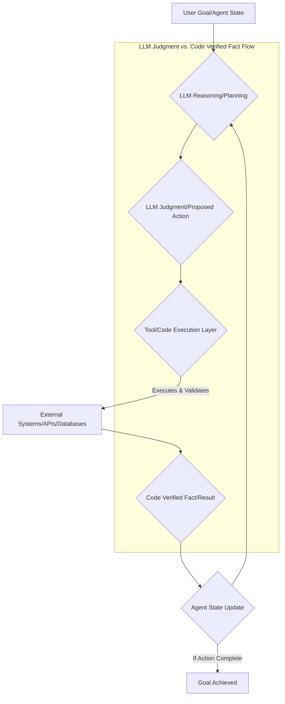

The proliferation of AI agents in critical systems necessitates robust architectures that guarantee reliability and transparency. A key challenge in agent development is managing the inherent uncertainty of Large Language Models (LLMs), which, while powerful, can generate plausible but unverified information (hallucinations) or make judgments not grounded in current facts. The "LLM Judgment and Code Verification Separation" pattern addresses this by explicitly distinguishing the LLM's analytical outputs or intentions from facts rigorously confirmed by executable code or external tools.

## Why Separation is Crucial
In autonomous agent runtimes, LLMs often serve as the "brain," generating plans, making decisions, and interpreting information. However, relying solely on LLM outputs for critical actions introduces risks:
*   **Hallucination**: LLMs can confidently present false information as fact.
*   **Outdated Knowledge**: LLMs are trained on historical data and may lack real-time context.
*   **Lack of Determinism**: LLM outputs can vary, making reproducibility and debugging difficult.
*   **Auditability**: Tracing the provenance of an agent's decision—whether it was an LLM's best guess or a code-verified fact—is vital for debugging, compliance, and trust.

By separating LLM judgment from code-verified facts, a robust mechanism is established where the LLM proposes, and the code verifies. This ensures critical operations are always grounded in empirically verifiable data.

## The Separation Pattern Explained
The core of this pattern involves designing the agent runtime to explicitly differentiate and manage two distinct types of information flow:

1.  **LLM Judgment/Intent**: The output from the LLM, representing its understanding, reasoning, proposed actions, or hypotheses. This is treated as a *proposal* rather than an unverified *truth*.
2.  **Code-Verified Fact**: Information or results obtained from executing deterministic code, querying reliable external APIs, or interacting with controlled environments. These are treated as *ground truth*.

The agent runtime acts as an orchestrator, guiding the LLM's judgment through a verification layer powered by code.

### Implementation Flow



### Core Components

1.  **LLM Interaction Module**: Responsible for prompting the LLM and parsing its output into structured `intent` or `hypothesis` objects. Defines the LLM's role as generating ideas or plans.
2.  **Tool/Code Execution Engine**: Translates LLM's proposed actions into executable code. It interacts with pre-defined tools and applies verification logic (e.g., schema validation, logical checks, cross-referencing).
3.  **Fact Integration Layer**: Updates the agent's internal state with `code-verified facts` after successful execution and verification, ensuring subsequent LLM interactions operate on proven truth.
4.  **Agent State Manager**: Maintains the canonical state, ensuring modifications based on LLM output are committed only after code verification.

### Practical Example (Python)

Consider an agent tasked with scheduling a meeting. The LLM might propose a time, but the system needs to verify availability.

```python
import json

class AgentRuntime:
    def __init__(self, llm_client, calendar_api):
        self.llm_client = llm_client
        self.calendar_api = calendar_api
        self.agent_state = {"current_task": "Schedule Meeting", "meeting_details": {}}

    def _get_llm_judgment(self, prompt):
        # Mock LLM response for demonstration
        if "propose meeting time" in prompt:
            return json.dumps({"action": "propose_time", "time": "2026-07-20T10:00:00", "duration": 60})
        return json.dumps({"action": "none"})

    def _verify_and_execute_code(self, llm_judgment):
        judgment_data = json.loads(llm_judgment)
        action = judgment_data.get("action")

        if action == "propose_time":
            proposed_time = judgment_data.get("time")
            duration = judgment_data.get("duration")
            
            is_available = self.calendar_api.check_availability(proposed_time, duration)
            if is_available:
                # self.calendar_api.book_meeting(proposed_time, duration) # Actual booking logic
                verified_fact = f"Meeting slot `{proposed_time}` for `{duration}` minutes is AVAILABLE."
                return {"status": "success", "fact": verified_fact, "details": judgment_data}
            else:
                verified_fact = f"Meeting slot `{proposed_time}` for `{duration}` minutes is NOT AVAILABLE."
                return {"status": "failure", "reason": verified_fact}
        return {"status": "failure", "reason": "Unknown action"}

    def run_cycle(self, user_input):
        llm_prompt = f"Given the task `{self.agent_state['current_task']}` and user input: '{user_input}', propose meeting time."
        llm_judgment = self._get_llm_judgment(llm_prompt)
        
        verification_result = self._verify_and_execute_code(llm_judgment)

        if verification_result["status"] == "success":
            self.agent_state["meeting_details"] = verification_result["details"]
        else:
            pass # Handle failure logic

class MockCalendarAPI:
    def check_availability(self, time, duration):
        # Simulate availability check
        return True

# Initialize and run
mock_llm = None
mock_calendar = MockCalendarAPI()
agent = AgentRuntime(mock_llm, mock_calendar)
agent.run_cycle("Please schedule a team sync for next Monday morning.")
```

### 2026 Trend Reflections
As AI agents become more sophisticated, the need for auditable, reliable, and transparent decision-making intensifies. This separation pattern aligns with several key trends for 2026:
*   **Agentic Orchestration**: Provides a foundational element for building reliable orchestration layers in complex multi-agent systems.
*   **Trustworthy AI**: Supports regulatory pushes for explainability and safety by demonstrating how decisions are made, differentiating judgment from fact.
*   **LLM Hardening**: Architecturally mitigates LLM limitations like hallucinations, crucial for production-grade agents.
*   **Hybrid AI Systems**: Acts as a bridge, grounding LLM outputs in symbolic, verifiable logic by integrating rule-based systems with neural AI.

## 트레이드오프

### 1. 신뢰성 및 투명성 향상 vs. 복잡성 증가
*   **언제 좋은가?** 금융, 의료, 자율 주행 등 높은 신뢰성과 감사 가능성이 요구되는 도메인에서 치명적인 판단 오류를 방지하는 데 매우 효과적입니다. 디버깅 및 규제 준수에 유리합니다.
*   **언제 나쁜가?** 단순 정보 검색이나 창의적 콘텐츠 생성과 같이 빠른 프로토타이핑이나 LLM의 자유로운 상상력이 더 중요한 시나리오에서는 시스템 복잡성을 불필요하게 증가시킬 수 있습니다.

### 2. 환각 및 오류 감소 vs. 지연 시간 증가
*   **언제 좋은가?** LLM의 환각(hallucination) 문제나 논리적 오류를 효과적으로 필터링하여 에이전트의 출력 품질과 안정성을 대폭 향상시킵니다. 예측 가능하고 결정론적인 결과를 보장합니다.
*   **언제 나쁜가?** LLM 판단 이후 코드 검증 단계를 추가하므로 전체 에이전트의 응답 지연 시간(latency)이 증가합니다. 실시간 반응이 매우 중요한 애플리케이션에서는 성능 병목이 될 수 있습니다.

### 3. 일관된 동작 보장 vs. 유연성 감소
*   **언제 좋은가?** 코드 검증은 에이전트가 항상 일관된 규칙과 실제 데이터를 기반으로 행동하도록 보장합니다. 시스템의 예측 가능성과 안정성을 높여 장기적인 운영에 유리합니다.
*   **언제 나쁜가?** LLM이 제안하는 혁신적인 접근 방식이나 경계를 넘나드는 창의적인 해결책이 코드 검증의 엄격한 규칙에 의해 제한될 수 있습니다. 탐색적인 문제 해결 과정에서 LLM의 잠재력을 완전히 발휘하기 어려울 수 있습니다.

### 4. 자원 효율성 최적화 vs. 인프라 비용
*   **언제 좋은가?** 코드 검증을 통해 불필요하거나 잘못된 LLM 호출을 조기에 차단하여 LLM API 호출 비용을 최적화할 수 있습니다. 시스템 안정성 향상으로 유지보수 비용을 절감할 수 있습니다.
*   **언제 나쁜가?** 별도의 코드 실행 환경, 도구(tool) 통합, 검증 로직 구현 및 관리를 위한 추가적인 인프라 및 개발 자원이 필요하며, 이는 상당한 초기 투자 비용이 될 수 있습니다.

## 실전 체크리스트

이 패턴을 프로젝트에 적용할 때 다음 항목들을 검증합니다:

*   [ ] **LLM 판단과 코드 검증 역할 분리 명확성**: 에이전트의 각 단계에서 LLM의 역할(추론, 제안)과 코드의 역할(실행, 검증)이 문서화되어 명확히 정의되었는가?
*   [ ] **검증 로직의 포괄성 및 정확성**: LLM이 제안할 수 있는 모든 중요한 액션 및 데이터 포인트에 대해 코드 기반의 검증 로직이 충분히 포괄적이고 정확하게 구현되었는가?
*   [ ] **도구(Tool) 통합 및 안정성**: LLM이 호출하도록 설계된 모든 외부 도구(API, DB 등)가 안정적으로 통합되었으며, 오류 처리 및 재시도 메커니즘이 구현되었는가?
*   [ ] **성능 오버헤드 측정**: LLM 판단-코드 검증-실행 파이프라인 도입 후 에이전트의 평균 응답 지연 시간(latency)이 허용 가능한 수준 내에 있는지 측정하고 최적화 방안을 마련했는가?
*   [ ] **로그 및 감사 추적 기능**: LLM의 원시 판단, 코드에 의해 검증된 사실, 그리고 최종 결과가 명확히 기록되어 감사(audit) 및 디버깅이 가능한가? (판단과 사실의 출처를 구분하여 기록)
*   [ ] **실패 시나리오 처리**: 코드 검증 단계에서 실패가 발생했을 때 에이전트가 어떻게 재시도, 대체 경로 탐색, 또는 사용자 개입을 요청하는지 명확한 폴백(fallback) 전략이 정의되어 있는가?
*   [ ] **점진적 도입 전략**: 기존 에이전트 시스템에 이 패턴을 도입하는 경우, 핵심 기능부터 점진적으로 적용하고 효과를 측정할 수 있는 마이그레이션 계획이 수립되었는가?
