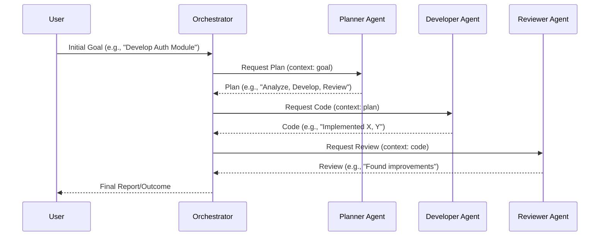

LLM 기반 멀티 에이전트 시스템(Multi-Agent Systems, MAS)은 복잡한 문제 해결, 분산 태스크 처리, 지속적인 상호작용이 필요한 시나리오에서 단일 LLM의 한계를 극복하기 위해 등장했습니다. 각 에이전트는 특정 역할과 목표를 가지고 자율적으로 행동하며, 상호 협력하여 전체 시스템의 목표를 달성합니다. 2026년 현재, 이러한 시스템은 엔터프라이즈 자동화, 복잡한 소프트웨어 개발, 과학 연구 등 다양한 분야에서 실질적인 활용도를 높이는 핵심 방법론으로 부상하고 있습니다.

## 핵심 구성 요소 (Core Components)
LLM 기반 멀티 에이전트 시스템은 여러 독립적인 에이전트가 특정 환경 내에서 상호작용하며 목표를 달성하는 구조를 가집니다. 주요 구성 요소는 다음과 같습니다:

### 에이전트 (Agent)
LLM 코어를 기반으로 자체적인 목표, 계획, 행동, 기억을 가진 독립적인 주체입니다. Tool Use, Reflection 등의 기능을 포함할 수 있으며, 특정 도메인 지식이나 기능을 전문화할 수 있습니다.

### 환경 (Environment)
에이전트들이 상호작용하고 태스크를 수행하는 공간입니다. 외부 API, 데이터베이스, 파일 시스템, 사용자 인터페이스, 또는 다른 소프트웨어 시스템 등이 될 수 있습니다. 환경은 에이전트의 행동에 대한 피드백을 제공합니다.

### 메시징 및 통신 (Messaging & Communication)
에이전트 간 정보 교환 및 협업을 위한 프로토콜과 채널입니다. Publish/Subscribe 모델, Direct Messaging, 공유 메모리(Shared Memory) 등 다양한 방식이 사용될 수 있으며, 효율적이고 신뢰성 있는 통신이 시스템 성능에 중요합니다.

### 오케스트레이터/감독자 (Orchestrator/Supervisor)
에이전트의 생성, 관리, 태스크 할당, 충돌 해결, 전체 시스템 목표 모니터링을 담당합니다. 중앙 집중식 또는 분산식으로 구현될 수 있으며, 시스템의 복잡도와 요구사항에 따라 그 역할의 범위가 달라집니다.

### 기억 시스템 (Memory System)
에이전트가 과거 경험을 학습하고 활용할 수 있도록 지원합니다. 단기 기억(Short-term Memory)은 현재 컨텍스트를 저장하고, 장기 기억(Long-term Memory)은 벡터 데이터베이스(Vector Database)나 지식 그래프(Knowledge Graph)를 통해 축적된 지식을 저장하여 회상(Retrieval)에 사용됩니다.

## 아키텍처 패턴 (Architectural Patterns)
멀티 에이전트 시스템을 설계할 때는 여러 아키텍처 패턴을 고려할 수 있습니다.

### 중앙 집중식 (Centralized Architecture)
하나의 오케스트레이터가 모든 에이전트의 활동을 조정하고 관리합니다. 구현이 비교적 간단하고 제어가 용이하지만, 확장성 및 단일 실패 지점(Single Point of Failure) 문제가 발생할 수 있습니다.

### 분산식 (Decentralized Architecture)
에이전트들이 자율적으로 상호작용하며 협상 프로토콜을 통해 조정됩니다. 복잡성이 높지만 견고성과 확장성이 뛰어나며, 병렬 처리에 유리합니다.

### 계층형 (Hierarchical Architecture)
상위 에이전트가 하위 에이전트 그룹을 감독하며, 태스크를 계층적으로 분해하고 할당합니다. 복잡한 태스크를 구조화하고 관리하는 데 유용하며, 중앙 집중식과 분산식의 장점을 결합할 수 있습니다.

## 통신 및 협업 전략 (Communication & Collaboration Strategies)
에이전트들이 효과적으로 협업하기 위한 전략은 다음과 같습니다.

### 태스크 분해 및 할당 (Task Decomposition & Assignment)
복잡한 상위 태스크를 에이전트의 전문성에 맞춰 더 작은 하위 태스크로 분해하고 각 에이전트에게 할당하는 과정입니다. 이는 시스템의 효율성과 병렬 처리 능력을 극대화합니다.

### 결과 통합 및 검증 (Result Integration & Validation)
각 에이전트의 결과물을 취합하고, 일관성과 정확성을 검증하여 최종 결과물을 생성합니다. 이 과정에서 `evaluation/llm-output-validation-automation-failure-prevention` 같은 메커니즘이 중요하며, 여러 에이전트의 의견을 종합하여 최종 결론을 도출하는 합의 메커니즘이 포함될 수 있습니다.

### 갈등 해결 (Conflict Resolution)
에이전트 간 의견 충돌이나 자원 경합이 발생할 경우, 이를 해결하기 위한 메커니즘이 필수적입니다. 감독 에이전트의 중재, 투표 시스템, 또는 사전에 정의된 우선순위 규칙 등을 통해 갈등을 해결할 수 있습니다. 이는 `agents/collaboration-conflict-resolution-multi-agent-systems`의 핵심 주제입니다.

## 코드 예제: 단순화된 멀티 에이전트 워크플로우 (Python)
아래는 Planner, Developer, Reviewer 에이전트가 협력하여 소프트웨어 개발 목표를 달성하는 단순화된 멀티 에이전트 시스템 예제입니다. 각 에이전트는 독립적인 `act` 메소드를 가지고, Orchestrator가 이들의 상호작용을 조정합니다.

```python
from abc import ABC, abstractmethod
from typing import List, Dict, Any

class Agent(ABC):
    def __init__(self, name: str, role: str):
        self.name = name
        self.role = role
        self.memory: List[str] = []

    @abstractmethod
    def act(self, context: Dict[str, Any]) -> str:
        pass

    def add_memory(self, event: str):
        self.memory.append(event)
        print(f"[{self.name}] added memory: {event}")

class PlannerAgent(Agent):
    def __init__(self):
        super().__init__("Planner", "task_planning")

    def act(self, context: Dict[str, Any]) -> str:
        goal = context.get("goal")
        if not goal:
            return "Error: Goal not provided."
        
        # Simulate LLM planning based on goal
        plan = f"Plan for '{goal}': 1. Analyze requirements. 2. Develop solution. 3. Review."
        self.add_memory(f"Planned for goal: {goal}")
        return plan

class DeveloperAgent(Agent):
    def __init__(self):
        super().__init__("Developer", "code_development")

    def act(self, context: Dict[str, Any]) -> str:
        plan = context.get("plan")
        if not plan:
            return "Error: Plan not provided."
        
        # Simulate LLM code generation
        code = f"Developed code based on plan: '{plan}'. Implemented feature X and Y."
        self.add_memory(f"Developed code based on plan: {plan}")
        return code

class ReviewerAgent(Agent):
    def __init__(self):
        super().__init__("Reviewer", "code_review")

    def act(self, context: Dict[str, Any]) -> str:
        code = context.get("code")
        if not code:
            return "Error: Code not provided."
        
        # Simulate LLM code review
        review = f"Reviewed code: '{code}'. Identified potential improvements in performance."
        self.add_memory(f"Reviewed code: {code}")
        return review

class MultiAgentOrchestrator:
    def __init__(self, agents: List[Agent]):
        self.agents = {agent.name: agent for agent in agents}
        self.history: List[Dict[str, Any]] = []

    def run_workflow(self, initial_goal: str):
        print(f"Orchestrator: Starting workflow for goal: {initial_goal}")
        
        context = {"goal": initial_goal}
        
        # Planner's turn
        planner_agent = self.agents["Planner"]
        plan = planner_agent.act(context)
        self.history.append({"agent": planner_agent.name, "output": plan})
        print(f"[Planner] output: {plan}")
        context["plan"] = plan

        # Developer's turn
        developer_agent = self.agents["Developer"]
        code = developer_agent.act(context)
        self.history.append({"agent": developer_agent.name, "output": code})
        print(f"[Developer] output: {code}")
        context["code"] = code

        # Reviewer's turn
        reviewer_agent = self.agents["Reviewer"]
        review = reviewer_agent.act(context)
        self.history.append({"agent": reviewer_agent.name, "output": review})
        print(f"[Reviewer] output: {review}")
        context["review"] = review

        print("\nOrchestrator: Workflow completed.")
        return self.history

if __name__ == "__main__":
    planner = PlannerAgent()
    developer = DeveloperAgent()
    reviewer = ReviewerAgent()

    orchestrator = MultiAgentOrchestrator(agents=[planner, developer, reviewer])
    result_history = orchestrator.run_workflow(initial_goal="Develop a user authentication module")

    print("\n--- Agent Memories ---")
    for agent in orchestrator.agents.values():
        print(f"{agent.name}'s memory: {agent.memory}")
```

## 멀티 에이전트 워크플로우 시퀀스 다이어그램
아래 Mermaid 다이어그램은 위 코드 예제의 에이전트 간 기본적인 상호작용 흐름을 시각화합니다.



## 트레이드오프 (Trade-offs)
LLM 기반 멀티 에이전트 시스템을 설계할 때는 다음과 같은 트레이드오프를 고려해야 합니다.

*   **복잡성 vs. 유연성**: 
    *   **언제 좋은가**: 복잡한 비즈니스 로직이나 다양한 전문가 지식이 필요한 문제에 대해 유연하게 대응하고 확장 가능한 솔루션을 제공할 때 유리합니다.
    *   **언제 나쁜가**: 단순하고 명확한 태스크에는 과도한 오버헤드를 발생시키며, 시스템 설계 및 디버깅의 복잡도를 크게 증가시킬 수 있습니다.

*   **성능 vs. 견고성**: 
    *   **언제 좋은가**: 에이전트 간 병렬 처리 및 책임 분리를 통해 특정 에이전트의 실패가 전체 시스템에 미치는 영향을 최소화하고 견고성을 높일 수 있습니다.
    *   **언제 나쁜가**: 에이전트 간 통신 오버헤드와 조정 비용으로 인해 단일 LLM 솔루션 대비 응답 시간이 길어지거나 처리량이 낮아질 수 있습니다.

*   **자율성 vs. 제어 가능성**: 
    *   **언제 좋은가**: 에이전트가 환경 변화에 자율적으로 적응하고 동적으로 태스크를 해결해야 하는 시나리오에서 높은 효율을 보입니다. 
    *   **언제 나쁜가**: 에이전트의 자율성이 너무 강하면 예측 불가능한 행동이나 통제 불능 상태(Runaway Agents)로 이어질 수 있어, 엄격한 제어 및 모니터링 메커니즘이 필수적입니다. 이와 관련된 상세 내용은 `agents/ai-agent-runaway-cost-prevention-control-systems` 및 `evaluation/ai-agent-sandbox-escape-security-hardening` 에서 확인할 수 있습니다.

*   **비용 효율성 vs. 인프라 요구사항**: 
    *   **언제 좋은가**: 복잡한 문제 해결을 통해 얻는 가치가 인프라 및 운영 비용을 상회할 때, 장기적으로는 비용 효율적일 수 있습니다.
    *   **언제 나쁜가**: 다수의 LLM 호출, 병렬 처리, 분산 기억 시스템 등으로 인해 단일 LLM 대비 높은 컴퓨팅 자원 및 복잡한 인프라 관리가 필요하여 초기 및 운영 비용이 크게 증가할 수 있습니다.

## 실전 체크리스트 (Practical Checklist)
LLM 기반 멀티 에이전트 시스템을 프로젝트에 성공적으로 적용하기 위한 검증 항목들입니다.

*   - [ ] **에이전트 역할 정의 명확성**: 각 에이전트의 책임(Responsibility)과 전문성(Expertise)이 명확히 정의되어 있으며, 중복되거나 누락된 부분이 없는가?
*   - [ ] **통신 프로토콜 표준화**: 에이전트 간 메시지 형식, 교환 방식, 응답 규약이 표준화되어 있어 상호 운용성이 보장되는가?
*   - [ ] **오케스트레이션 전략 적합성**: 태스크의 복잡성과 시스템의 확장성 요구사항에 맞춰 중앙 집중식, 분산식, 또는 계층형 오케스트레이션 모델이 적절하게 선택되었는가?
*   - [ ] **메모리 시스템 최적화**: 에이전트의 장/단기 기억 관리 전략(예: RAG, Knowledge Graph)이 LLM의 컨텍스트 윈도우(Context Window) 한계를 고려하여 효율적으로 설계되었는가? 관련 내용은 `context-engineering/ai-agent-context-management-project-memory` 에서 추가로 탐색할 수 있습니다.
*   - [ ] **에이전트 Tool Use 설계**: 각 에이전트가 외부 도구(External Tools)를 언제, 어떻게 사용해야 하는지 명확한 가이드라인과 인터페이스가 마련되어 있는가? `agents/llm-agent-tool-use-design-patterns` 을 참조하여 설계할 수 있습니다.
*   - [ ] **에러 처리 및 복구 메커니즘**: 개별 에이전트 또는 통신 채널에서 에러 발생 시, 시스템 전체의 안정성을 유지하기 위한 복구 및 재시도 로직이 구현되어 있는가? `agents/ai-agent-robust-tool-error-recovery` 에서 에러 처리 패턴을 확인할 수 있습니다.
*   - [ ] **모니터링 및 로깅 시스템**: 에이전트의 행동, 통신 내용, 성능 지표를 실시간으로 추적하고 분석할 수 있는 모니터링 및 로깅 시스템이 구축되어 있는가? `evaluation/llm-agent-observability-spanlens-trace-monitoring` 에서 에이전트 가시성 확보에 대한 상세 내용을 찾을 수 있습니다.
