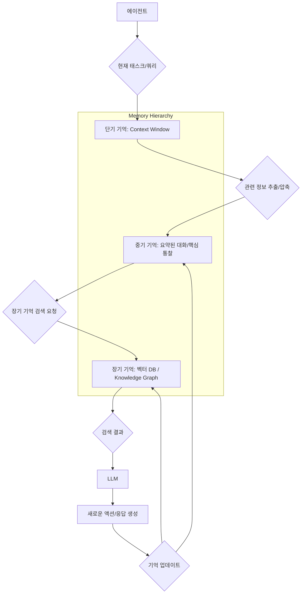

복잡한 문제 해결과 지속적인 상호작용이 필요한 AI 에이전트에게 장기 기억(Long-Term Memory)은 필수적인 요소입니다. 단기 기억(Context Window)의 한계를 극복하고, 과거의 경험과 학습 내용을 지속적으로 활용하여 일관된 행동과 고도화된 의사결정을 가능하게 합니다. 이는 에이전트의 성능과 신뢰성을 유지하는 핵심 기술 갭을 채우는 데 기여합니다.

## 장기 기억의 필요성
기존 LLM 기반 에이전트들은 주로 프롬프트 컨텍스트 윈도우 내에서 정보를 처리하며, 이는 대화의 맥락이 길어지거나 복잡한 작업이 수반될 때 정보 유실과 일관성 저하 문제를 야기합니다. 장기 기억 시스템은 이러한 제약을 우회하여, 에이전트가 시간이 지나도 지식을 축적하고, 이전 태스크의 결과를 기억하며, 학습된 패턴을 새로운 상황에 적용할 수 있도록 돕습니다. 2026년 기준, 에이전트의 자율성과 적응성을 높이는 핵심 아키텍처 패턴으로 자리매김하고 있습니다.

### 기억의 유형
AI 에이전트의 장기 기억은 인간의 기억 체계와 유사하게 여러 유형으로 분류될 수 있습니다.

*   **에피소드 기억 (Episodic Memory)**: 특정 사건, 대화, 상호작용의 순차적 기록입니다. 과거의 경험을 시간순으로 저장하여 "언제, 무엇을 했는지"를 회상하는 데 사용됩니다.
*   **의미론적 기억 (Semantic Memory)**: 일반적인 사실, 개념, 지식 및 언어적 정보입니다. RAG(Retrieval-Augmented Generation) 시스템이나 지식 그래프(Knowledge Graph)를 통해 구현되며, 에이전트의 세계 지식을 구성합니다.
*   **절차적 기억 (Procedural Memory)**: 특정 작업을 수행하는 방법, 스킬, 행동 패턴에 대한 기억입니다. 도구 사용(Tool Use) 패턴이나 특정 루틴을 학습하고 적용하는 데 중요합니다.

## 장기 기억 관리 패턴

### 1. Retrieval-Augmented Generation (RAG)
RAG는 에이전트가 외부 지식 저장소에서 관련 정보를 검색하여 컨텍스트 윈도우에 포함시키는 방식입니다. 이는 에이전트가 최신 정보나 특정 도메인 지식을 활용하여 응답을 생성하는 데 매우 효과적입니다.

*   **임베딩 (Embedding)**: 문서를 벡터 공간에 임베딩하여 의미적 유사성을 계산합니다.
*   **벡터 데이터베이스 (Vector Database)**: 임베딩된 문서를 효율적으로 저장하고 검색합니다. `Faiss`, `Pinecone`, `Weaviate` 등이 활용됩니다.
*   **검색 메커니즘 (Retrieval Mechanism)**: 사용자의 질의나 에이전트의 현재 목표에 가장 관련성이 높은 문서를 검색합니다.

### 2. Knowledge Graphs
지식 그래프는 실체(entities)와 관계(relationships)를 노드와 엣지로 연결하여 지식을 구조화하는 방식입니다. 복잡한 추론과 다단계 질문에 대한 정확한 답변을 제공하는 데 강점이 있습니다.

*   **온톨로지 (Ontology)**: 지식의 구조와 관계를 정의합니다.
*   **추론 엔진 (Inference Engine)**: 그래프 내의 관계를 기반으로 새로운 지식을 추론합니다.

### 3. 계층적 메모리 시스템 (Hierarchical Memory Systems)
단기, 중기, 장기 기억을 계층적으로 관리하여 각 기억의 특성과 목적에 맞게 정보를 처리합니다. 예를 들어, 최근 대화는 단기 기억에, 요약된 대화나 중요한 통찰은 중기 기억에, 핵심 지식이나 반복되는 학습 내용은 장기 기억에 저장합니다.



### 4. 자동화된 컨텍스트 관리 (Automated Context Management)
컨텍스트 윈도우의 제약을 관리하기 위한 기술입니다. 불필요한 정보를 제거하고 핵심만 남겨 토큰 사용을 최적화합니다.

*   **압축 (Compaction)**: 오래되거나 중요도가 낮은 정보를 요약하거나 제거합니다.
*   **요약 (Summarization)**: 긴 대화나 문서에서 핵심 내용을 추출하여 저장합니다.
*   **프루닝 (Pruning)**: 중요도 임계값에 따라 기억을 삭제합니다.

### 코드 예제: 간단한 RAG 기반 장기 기억 시스템
아래 Python 코드는 벡터 데이터베이스를 사용하여 에이전트의 질문에 가장 관련성 높은 지식을 검색하고 LLM에 전달하는 간단한 RAG 패턴을 보여줍니다. `FAISS`와 `Sentence-Transformers`를 활용하여 메모리를 관리합니다.

```python
from sentence_transformers import SentenceTransformer
from faiss import IndexFlatL2
import numpy as np

class AgentMemory:
    def __init__(self, model_name='all-MiniLM-L6-v2', dimension=384):
        self.encoder = SentenceTransformer(model_name)
        self.memory_store = [] # List of (text, embedding) tuples
        self.index = IndexFlatL2(dimension) # FAISS index for quick similarity search
        self.dimension = dimension

    def add_memory(self, text: str):
        """새로운 기억을 추가하고 임베딩하여 저장합니다."""
        embedding = self.encoder.encode(text).astype('float32').reshape(1, -1)
        self.memory_store.append((text, embedding))
        self.index.add(embedding)
        print(f"Added memory: {text[:50]}...")

    def retrieve_memory(self, query: str, k=1):
        """쿼리에 가장 관련성 높은 k개의 기억을 검색합니다."""
        query_embedding = self.encoder.encode(query).astype('float32').reshape(1, -1)
        D, I = self.index.search(query_embedding, k)
        
        retrieved_memories = []
        for idx in I[0]:
            if idx < len(self.memory_store): # Ensure index is valid
                retrieved_memories.append(self.memory_store[idx][0])
        return retrieved_memories

# LLM 연동 시뮬레이션
def simulate_llm_response(prompt: str, retrieved_context: list):
    context_str = "\n".join(retrieved_context)
    full_prompt = f"Context:\n{context_str}\n\nQuestion: {prompt}\nAnswer:"
    # 실제 LLM API 호출 대신 간단한 응답 반환
    if "Python" in context_str and "패턴" in prompt:
        return "RAG 패턴을 사용하면 Python에서 에이전트의 지식 기반을 확장할 수 있습니다."
    elif "AI" in context_str and "중요" in prompt:
        return "장기 기억은 AI 에이전트의 복잡한 문제 해결 능력에 중요합니다."
    return "제공된 컨텍스트로 답변을 생성하기 어렵습니다."

# 사용 예제
agent_long_term_memory = AgentMemory()
agent_long_term_memory.add_memory("RAG (Retrieval-Augmented Generation)는 외부 지식 검색을 통해 LLM의 응답 품질을 향상시키는 기술이다.")
agent_long_term_memory.add_memory("FAISS는 고차원 벡터의 효율적인 유사성 검색을 위한 라이브러리이다.")
agent_long_term_memory.add_memory("AI 에이전트의 장기 기억은 컨텍스트 윈도우의 한계를 극복하는 데 필수적이다.")
agent_long_term_memory.add_memory("파이썬은 AI 개발에 널리 사용되는 프로그래밍 언어이다.")

query1 = "AI 에이전트에서 장기 기억이 왜 중요한가?"
retrieved1 = agent_long_term_memory.retrieve_memory(query1)
print(f"\nQuery: {query1}")
print(f"Retrieved Context: {retrieved1}")
print(f"LLM Response: {simulate_llm_response(query1, retrieved1)}")

query2 = "Python에서 RAG 패턴을 어떻게 활용할 수 있을까?"
retrieved2 = agent_long_term_memory.retrieve_memory(query2)
print(f"\nQuery: {query2}")
print(f"Retrieved Context: {retrieved2}")
print(f"LLM Response: {simulate_llm_response(query2, retrieved2)}")
```

## 트레이드오프

*   **RAG (Retrieval-Augmented Generation)**:
    *   **장점**: 최신 데이터와 특정 도메인 지식 활용 가능, 할루시네이션(Hallucination) 감소. 대규모의 동적인 지식 베이스에 적합합니다.
    *   **단점**: 검색 지연(latency) 및 검색 정확도(recall/precision)에 따라 전체 에이전트 성능이 좌우됩니다. 임베딩 및 벡터 DB 관리 비용이 발생하며, 실시간 정보 갱신이 중요할 때 복잡성이 증가합니다.
*   **Knowledge Graphs**: 
    *   **장점**: 구조화된 지식으로 복잡한 관계 추론 및 일관성 유지가 용이합니다. 정밀한 질문에 대한 정확한 답변에 강합니다.
    *   **단점**: 지식 그래프 구축 및 유지보수에 높은 초기 비용과 전문성이 요구됩니다. 비정형 데이터 처리에는 부적합하며, 그래프 스키마 변경 시 유연성이 떨어집니다.
*   **계층적 메모리 시스템**: 
    *   **장점**: 다양한 기억 유형을 효율적으로 관리하고, 중요한 정보를 장기적으로 보존하며 컨텍스트 윈도우 압박을 줄입니다. 에이전트의 장기적인 일관성과 학습 능력을 향상시킵니다.
    *   **단점**: 시스템 설계의 복잡성이 증가하고, 각 계층 간의 정보 흐름 및 동기화 메커니즘 구축이 어렵습니다. 어떤 정보를 어느 계층에 저장하고 언제 검색할지 결정하는 휴리스틱 설계가 중요합니다.
*   **자동화된 컨텍스트 관리 (압축/요약/프루닝)**:
    *   **장점**: 컨텍스트 윈도우 제약을 완화하여 더 긴 대화나 복잡한 태스크를 처리할 수 있도록 합니다. 토큰 비용을 절감합니다.
    *   **단점**: 정보 압축 및 요약 과정에서 중요한 세부 정보가 손실될 위험이 있습니다. 어떤 정보가 중요한지 판단하는 기준을 정교하게 설계해야 하며, 잘못된 프루닝은 에이전트의 의사결정 품질을 저하시킬 수 있습니다.

## 실전 체크리스트

- [ ] 에이전트의 목표와 태스크 복잡도를 고려하여 RAG, Knowledge Graph, 또는 하이브리드 접근 방식 중 적절한 장기 기억 패턴을 선정했는가?
- [ ] 장기 기억 저장소를 위한 임베딩 모델과 벡터 데이터베이스 (또는 지식 그래프 솔루션)를 프로젝트 요구사항에 맞춰 선택하고 구축했는가?
- [ ] 기억 검색(retrieval) 전략 (예: 유사도 검색, 키워드 검색, 그래프 탐색)을 최적화하여 관련성 높은 정보를 효율적으로 회상하도록 설계했는가?
- [ ] 주기적으로 장기 기억의 지식 베이스를 업데이트하고, 오래되거나 부정확한 정보를 관리하는 파이프라인(pipeline)을 구축했는가?
- [ ] 컨텍스트 윈도우 내에서 단기 기억과 장기 기억 간의 정보를 효과적으로 통합하고, 프롬프트 엔지니어링을 통해 LLM이 검색된 지식을 적절히 활용하도록 유도했는가?
- [ ] 장기 기억 시스템의 검색 지연(latency) 및 처리량(throughput)을 모니터링하고, 에이전트의 전반적인 성능에 미치는 영향을 평가하고 최적화 방안을 마련했는가?
- [ ] 에이전트가 기억을 생성, 저장, 검색, 업데이트하는 일련의 과정을 투명하게 기록하고 디버깅할 수 있는 로깅(logging) 및 가시성(visibility) 메커니즘을 구현했는가?
