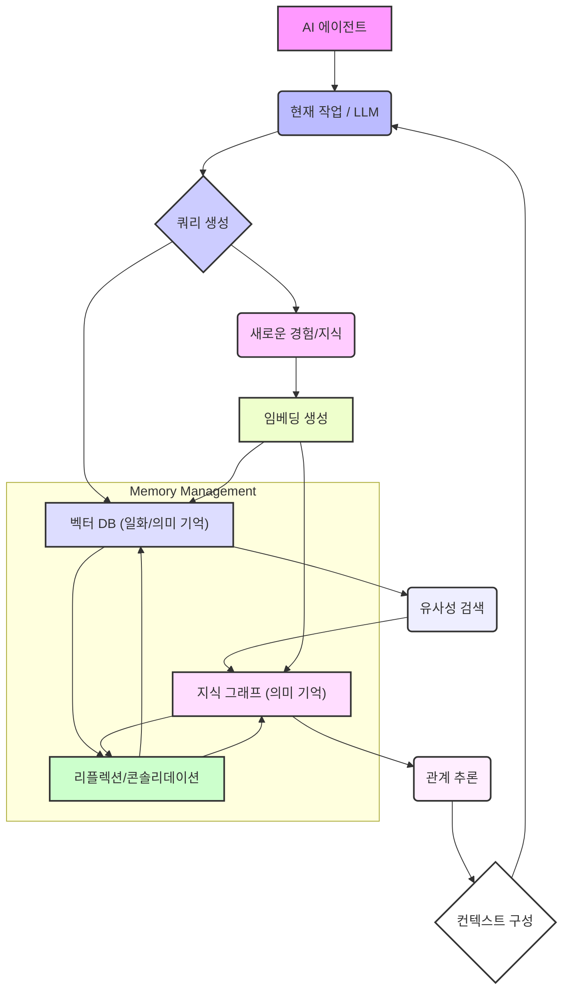

AI 에이전트의 장기 기억(Long-Term Memory) 시스템은 에이전트가 복잡한 문제를 해결하고, 지속적으로 학습하며, 시간이 지나도 일관된 행동을 유지하는 데 필수적인 요소입니다. 대규모 언어 모델(LLM)의 제한된 컨텍스트 윈도우(Context Window)는 에이전트가 처리할 수 있는 정보의 양과 기간을 제약합니다. 이를 극복하고 에이전트의 실제 문제 해결 능력을 향상시키기 위해, 효과적인 장기 기억 관리 시스템 설계는 핵심적인 과제입니다.

### 장기 기억의 필요성
에이전트가 단순한 질의응답을 넘어 복잡한 작업을 수행하고 장기적인 목표를 달성하려면 과거의 경험, 학습된 지식, 환경에 대한 이해를 지속적으로 축적하고 활용해야 합니다. 이는 인간의 장기 기억과 유사하게, 시간이 지나도 정보가 소실되지 않고 필요할 때 효율적으로 검색될 수 있는 시스템을 요구합니다. 장기 기억은 에이전트가 새로운 상황에 유연하게 대처하고, 오류로부터 학습하며, 진화하는 능력을 부여합니다.

### 메모리 관리 시스템 설계 패턴

AI 에이전트의 장기 기억 시스템은 일반적으로 다음 패턴을 결합하여 설계됩니다.

#### 1. 계층적 메모리 구조 (Hierarchical Memory Architecture)
에이전트의 메모리를 여러 계층으로 나누어 관리하는 방식입니다.
*   **단기 기억 (Short-Term Memory / Context Window)**: 현재 대화나 작업의 즉각적인 컨텍스트를 유지합니다. LLM의 컨텍스트 윈도우가 여기에 해당합니다. 휘발성이 강하며, 새로운 정보로 빠르게 대체됩니다.
*   **작업 기억 (Working Memory / Scratchpad)**: 현재 진행 중인 작업의 중간 단계, 계획, 임시 결과 등을 저장합니다. 단기 기억보다 약간 더 오래 유지될 수 있으며, 특정 태스크의 범위 내에서 활용됩니다.
*   **일화 기억 (Episodic Memory)**: 에이전트가 경험한 특정 이벤트, 상호작용, 행동 시퀀스 등을 시간 순서대로 기록합니다. "무엇을 언제 어디서 했는지"에 대한 기록으로, 과거 경험의 재구성을 돕습니다. 주로 텍스트 로그 형태로 저장되며, 벡터 임베딩을 통해 검색될 수 있습니다.
*   **의미 기억 (Semantic Memory)**: 사실, 개념, 일반화된 지식, 스킬, 관계 등을 추상화하여 저장합니다. "무엇을 아는지"에 대한 기록으로, 지식 그래프(Knowledge Graph), 벡터 데이터베이스(Vector Database) 등의 형태로 구현됩니다.

#### 2. 벡터 데이터베이스 기반 검색 (Vector Database-based Retrieval)
의미 기억 및 일화 기억을 저장하고 검색하는 가장 일반적인 방법 중 하나입니다. 에이전트의 경험, 관찰, 학습된 지식 등을 임베딩(Embedding) 벡터로 변환하여 벡터 데이터베이스에 저장합니다.
새로운 쿼리(Query)가 들어오면, 쿼리 또한 임베딩 벡터로 변환하여 데이터베이스 내의 기존 벡터들과의 유사도(Similarity)를 계산하고, 가장 유사한 정보를 검색하여 컨텍스트로 주입합니다. Pinecone, Weaviate, Milvus, Chroma 등의 벡터 데이터베이스가 활용됩니다.

```python
from langchain_community.vectorstores import Chroma
from langchain_openai import OpenAIEmbeddings
from langchain_core.documents import Document

# 2026년 최신 트렌드 반영: 임베딩 모델 선택의 중요성
# 다국어 지원 및 특정 도메인에 최적화된 임베딩 모델 사용 고려
embeddings_model = OpenAIEmbeddings(model="text-embedding-3-large")

# 초기 메모리 생성
db = Chroma.from_documents(
    [
        Document(page_content="지난 주에 사용자 'Alice'는 시스템 설정 변경을 요청했다."),
        Document(page_content="프로젝트 X의 요구사항 문서는 2026년 3월 15일에 업데이트되었다."),
        Document(page_content="가장 최근의 시스템 장애는 데이터베이스 연결 문제로 발생했다."),
        Document(page_content="에이전트 A는 '사용자 지원' 태스크를 담당하고 있다."),
        Document(page_content="새로운 기능 Y 개발에는 3주가 소요될 것으로 예상된다.")
    ],
    embeddings_model
)

# 새로운 경험 추가
new_experience = "오늘 'Alice'가 제안한 새로운 기능은 기존 아키텍처와 충돌할 수 있다."
db.add_documents([Document(page_content=new_experience)])

# 관련 정보 검색
query = "Alice의 요청과 관련된 정보는 무엇인가?"
retrieved_docs = db.similarity_search(query, k=2)

print("--- 검색된 관련 정보 ---")
for doc in retrieved_docs:
    print(f"- {doc.page_content}")

# 에이전트는 이 검색된 정보를 LLM의 컨텍스트 윈도우에 포함하여 추론을 수행
# 예를 들어, "Alice의 새로운 기능 제안은 기존 설정 변경 요청과 어떤 관련이 있는가?"
```

#### 3. 지식 그래프 (Knowledge Graph)
정형화된 지식을 저장하고 복잡한 관계 추론을 가능하게 합니다. 엔티티(Entity)와 그들 간의 관계(Relation)를 그래프 형태로 표현하여, 에이전트가 단순히 유사한 정보를 찾는 것을 넘어 논리적인 추론을 수행할 수 있도록 돕습니다. 예를 들어, `(Person)-[WORKS_AT]->(Company)` 와 같은 트리플(Triple) 형태로 지식을 저장합니다. 온톨로지(Ontology)와 시맨틱 웹(Semantic Web) 기술과 결합될 수 있습니다.

#### 4. 리플렉션 및 콘솔리데이션 (Reflection & Consolidation)
에이전트가 일화 기억을 주기적으로 검토하여 중요한 패턴, 통찰, 일반화된 지식을 추출하고 이를 의미 기억으로 통합하는 과정입니다. 이를 통해 에이전트는 단순히 경험을 축적하는 것을 넘어, 경험으로부터 학습하고 지식을 정제할 수 있습니다. 예를 들어, 특정 유형의 문제 해결 경험이 반복될 경우, 해당 문제 해결 전략을 일반화된 스킬로 의미 기억에 저장하는 방식입니다. 이 과정은 에이전트의 메타 학습(Meta-learning) 능력을 향상시킵니다.

### 2026년 최신 트렌드
*   **다중 모달(Multi-modal) 메모리 통합**: 텍스트뿐만 아니라 이미지, 오디오, 비디오 등 다양한 모달리티의 정보를 통합적으로 저장하고 검색하는 시스템이 발전하고 있습니다. 이는 에이전트가 더욱 풍부한 환경 이해를 할 수 있게 합니다.
*   **자가 개선(Self-improving) 메모리 시스템**: 에이전트 스스로 메모리 관리 전략을 학습하고 최적화하는 연구가 활발합니다. 예를 들어, 검색 실패율을 기반으로 임베딩 모델을 업데이트하거나, 지식 그래프의 노드 가중치를 조정하는 방식입니다.
*   **동적 메모리 할당 및 압축**: 에이전트의 현재 작업 부하와 중요도에 따라 메모리 자원을 동적으로 할당하고, 불필요하거나 중복된 정보를 압축하거나 제거하는 기술이 중요해지고 있습니다. 이는 효율성을 극대화합니다.



## 트레이드오프

*   **벡터 데이터베이스 vs. 지식 그래프**:
    *   **벡터 데이터베이스**: 유연하고 대규모의 비정형 데이터를 빠르게 검색할 수 있습니다. **언제 좋고**: 방대한 양의 경험적/일화적 지식 저장 및 유사성 기반 검색에 유리합니다. **언제 나쁜지**: 복잡한 논리적 관계나 다단계 추론에는 적합하지 않습니다. 지식의 구조적 일관성 유지가 어렵습니다.
    *   **지식 그래프**: 엔티티 간의 명확한 관계를 정의하고 복잡한 추론을 지원합니다. **언제 좋고**: 정형화된 지식, 규칙 기반 추론, 설명 가능성(Explainability)이 중요한 시나리오에 유리합니다. **언제 나쁜지**: 구축 및 유지보수에 높은 비용과 노력이 필요하며, 비정형 데이터 처리에는 한계가 있습니다.
*   **메모리 콘솔리데이션 주기**:
    *   **잦은 콘솔리데이션**: 에이전트의 지식을 빠르게 업데이트하고 최신 상태를 유지할 수 있습니다. **언제 좋고**: 빠르게 변화하는 환경이나 새로운 경험에서 신속하게 학습해야 할 때 유리합니다. **언제 나쁜지**: 계산 비용이 높아지고, 에이전트의 주요 작업 수행에 지연을 초래할 수 있습니다.
    *   **느슨한 콘솔리데이션**: 계산 자원을 절약할 수 있습니다. **언제 좋고**: 비교적 안정적인 환경에서 장기적인 지식 통합에 적합합니다. **언제 나쁜지**: 에이전트의 지식이 최신 상태를 반영하지 못하여 성능 저하를 야기할 수 있습니다.
*   **메모리 저장 방식 (온라인 vs. 오프라인)**:
    *   **온라인 저장/검색**: 에이전트가 실시간으로 메모리에 접근하고 업데이트할 수 있습니다. **언제 좋고**: 즉각적인 반응과 최신 정보 반영이 중요한 대화형 에이전트나 실시간 제어 시스템에 적합합니다. **언제 나쁜지**: 높은 처리량과 낮은 지연 시간이 요구되어 인프라 비용이 증가하고 시스템 복잡도가 높아집니다.
    *   **오프라인 저장/배치 처리**: 메모리 업데이트 및 정제가 주기적인 배치 작업으로 이루어집니다. **언제 좋고**: 비용 효율적이며, 대량의 데이터를 안정적으로 처리할 수 있습니다. **언제 나쁜지**: 실시간성이 떨어져 즉각적인 지식 반영이 어렵고, 오래된 정보로 인한 판단 오류가 발생할 수 있습니다.
*   **메모리 크기 및 비용**:
    *   **대규모 메모리**: 에이전트가 더 많은 정보를 기억하고 복잡한 문제를 해결할 수 있습니다. **언제 좋고**: 광범위한 지식 도메인이나 장기적인 프로젝트를 수행하는 에이전트에 유리합니다. **언제 나쁜지**: 저장 공간 및 검색 비용이 기하급수적으로 증가하며, 관련 없는 정보로 인한 노이즈(Noise)가 발생할 가능성이 높아집니다.
    *   **소규모 메모리**: 비용 효율적이고 검색 속도가 빠릅니다. **언제 좋고**: 특정 도메인에 특화되거나 자원 제약이 있는 환경에 적합합니다. **언제 나쁜지**: 에이전트의 일반화 능력과 복잡한 문제 해결 능력이 제한될 수 있습니다.

## 실전 체크리스트

AI 에이전트의 장기 기억 시스템을 설계하고 구현할 때 다음 항목들을 검증해야 합니다.

*   - [ ] **메모리 유형 분류 및 스토리지 매핑**: 에이전트가 사용할 단기, 작업, 일화, 의미 기억의 종류를 명확히 정의하고, 각 기억 유형에 적합한 저장소(e.g., LLM 컨텍스트, 임시 저장소, 벡터 DB, 지식 그래프)를 매핑했는가?
*   - [ ] **임베딩 모델 최적화**: 사용 중인 임베딩 모델이 에이전트의 도메인(Domain)과 작업 특성에 맞춰 최적화되었으며, 다국어 또는 특정 데이터 유형(e.g., 코드, 이미지)을 효율적으로 처리할 수 있는가?
*   - [ ] **검색 정확도 및 효율성 검증**: 벡터 검색 또는 지식 그래프 쿼리의 정확도(Precision)와 재현율(Recall)을 정량적으로 측정하고 있으며, 대규모 데이터셋(Dataset)에서도 검색 지연 시간(Latency)이 허용 가능한 수준을 유지하는가?
*   - [ ] **메모리 업데이트 및 삭제 정책**: 에이전트의 경험이 어떻게, 얼마나 자주 메모리에 추가/업데이트되고, 더 이상 필요 없는 정보(Stale Information)를 어떻게 삭제하거나 아카이브할지 명확한 정책이 수립되어 있는가? (e.g., TTL, LRU, 중요도 기반)
*   - [ ] **리플렉션/콘솔리데이션 주기 및 트리거**: 에이전트가 언제, 어떤 기준으로 과거 경험을 되돌아보고(Reflection) 새로운 지식으로 통합할지(Consolidation)에 대한 주기와 트리거(Trigger) 메커니즘이 정의되어 있으며, 그 효율성이 검증되었는가?
*   - [ ] **메모리 비용 모니터링**: 메모리 저장 및 검색에 발생하는 컴퓨팅 및 스토리지 비용을 지속적으로 모니터링하고 있으며, 예상치 못한 비용 증가를 방지하기 위한 최적화 전략이 마련되어 있는가?
*   - [ ] **보안 및 프라이버시 고려**: 에이전트의 장기 기억에 저장되는 정보(특히 민감 정보)에 대한 접근 제어, 암호화, 프라이버시 보호 메커니즘이 설계 및 적용되었는가?