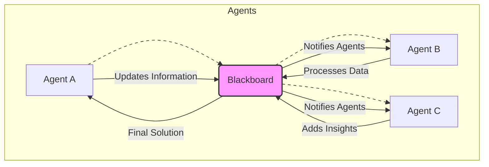

복잡한 현실 세계의 문제를 해결하기 위한 멀티 에이전트 시스템은 개별 에이전트의 능력으로는 불가능한 수준의 지능과 유연성을 제공한다. 단일 에이전트가 모든 정보를 처리하고 모든 결정을 내리는 대신, 전문화된 여러 에이전트가 협력하여 문제를 분해하고, 병렬로 처리하며, 상호 보완적인 방식으로 솔루션을 구축하는 접근 방식이다. 이는 특히 불확실성이 높고, 동적으로 변화하며, 다양한 도메인 지식이 요구되는 문제 해결에 필수적이다.

## 멀티 에이전트 협업의 핵심 원칙

멀티 에이전트 시스템의 성공적인 협업은 다음 세 가지 핵심 원칙에 기반한다.

### 1. 역할 분담과 전문화 (Role Partitioning and Specialization)
각 에이전트는 특정 기술, 지식, 또는 임무에 특화되어야 한다. 예를 들어, 한 에이전트는 데이터 수집을, 다른 에이전트는 분석을, 또 다른 에이전트는 의사 결정을 담당하는 식이다. 이러한 전문화는 개별 에이전트의 복잡도를 줄이고, 전체 시스템의 효율성을 높인다.

### 2. 효율적인 통신 및 조정 (Efficient Communication and Coordination)
에이전트 간의 정보 교환은 명확하고 효율적이어야 한다. 통신 프로토콜, 메시지 형식, 그리고 정보 공유 메커니즘은 시스템의 성능에 결정적인 영향을 미친다. 2026년에는 LLM (Large Language Model) 기반의 에이전트들이 복잡한 자연어 추론을 통해 더욱 정교한 통신과 조정을 수행하며, 비동기 통신 및 이벤트 기반 아키텍처가 보편화되고 있다.

### 3. 목표 정렬 및 충돌 해결 (Goal Alignment and Conflict Resolution)
모든 에이전트의 최종 목표는 전체 시스템의 목표와 일치해야 한다. 에이전트 간에 발생할 수 있는 자원 경쟁이나 상충하는 결정은 효과적인 충돌 해결 메커니즘을 통해 관리되어야 한다. 이는 우선순위 기반, 협상 기반, 또는 메타-에이전트 (Meta-Agent) 중재 기반 방식으로 구현될 수 있다.

## 주요 협업 패턴

### 1. 위임 패턴 (Delegation Pattern)
주요 에이전트가 복잡한 태스크를 더 작고 관리 가능한 서브태스크로 분해하고, 이를 전문화된 다른 에이전트에게 위임하는 방식이다. 위임받은 에이전트는 서브태스크를 완료한 후 결과를 다시 주 에이전트에게 보고한다. 이는 계층적 구조의 문제 해결에 적합하다.

```python
# Python 예제: 위임 패턴

class Task:
    def __init__(self, name, description, priority):
        self.name = name
        self.description = description
        self.priority = priority
        self.status = "pending"
        self.result = None

class MasterAgent:
    def __init__(self, name="Master"):
        self.name = name
        self.sub_agents = {}

    def add_sub_agent(self, agent_name, agent_instance):
        self.sub_agents[agent_name] = agent_instance

    def assign_task(self, task, sub_agent_name):
        if sub_agent_name in self.sub_agents:
            print(f"{self.name} assigns '{task.name}' to {sub_agent_name}")
            self.sub_agents[sub_agent_name].receive_task(task)
        else:
            print(f"Error: Sub-agent '{sub_agent_name}' not found.")

    def receive_result(self, task, result):
        task.status = "completed"
        task.result = result
        print(f"{self.name} received result for '{task.name}': {result}")

class WorkerAgent:
    def __init__(self, name):
        self.name = name
        self.master = None

    def set_master(self, master_agent):
        self.master = master_agent

    def receive_task(self, task):
        print(f"{self.name} received task: '{task.name}'")
        # Simulate task execution
        import time
        time.sleep(1)
        result = f"Processed {task.description} by {self.name}"
        print(f"{self.name} completed task '{task.name}'.")
        if self.master:
            self.master.receive_result(task, result)

# 시스템 구성 및 실행
master = MasterAgent()
worker1 = WorkerAgent("DataProcessor")
worker2 = WorkerAgent("Analyzer")

worker1.set_master(master)
worker2.set_master(master)

master.add_sub_agent("DataProcessor", worker1)
master.add_sub_agent("Analyzer", worker2)

task1 = Task("Collect Sales Data", "Retrieve sales data from DB", 1)
task2 = Task("Analyze Market Trend", "Perform trend analysis on collected data", 2)

master.assign_task(task1, "DataProcessor")
master.assign_task(task2, "Analyzer")
```

### 2. 브로커 패턴 (Broker Pattern)
중앙 집중식 브로커 에이전트가 존재하여, 서비스 요청 에이전트와 서비스 제공 에이전트 사이의 통신을 중개한다. 요청 에이전트는 브로커에게 태스크를 전달하고, 브로커는 해당 태스크를 처리할 수 있는 가장 적합한 에이전트를 찾아 연결해준다. 이는 시스템의 유연성과 확장성을 높이는 데 기여한다.

### 3. 블랙보드 패턴 (Blackboard Pattern)
모든 에이전트가 공유하는 중앙 데이터 저장소인 '블랙보드'를 통해 협력하는 방식이다. 각 에이전트는 블랙보드의 내용을 모니터링하고, 자신의 전문 분야에 해당하는 새로운 정보가 나타나면 이를 처리하여 다시 블랙보드에 업데이트한다. 이는 복잡하고 예측 불가능한 문제 해결에 특히 효과적이다.



### 4. 스웜 인텔리전스 (Swarm Intelligence) / 피어-투-피어 (Peer-to-Peer)
중앙 집중식 제어 없이, 에이전트들이 간단한 규칙에 따라 상호작용하며 복잡한 집단 행동을 나타내는 분산 협업 방식이다. 각 에이전트가 주변 환경 및 다른 에이전트의 상태에 반응하여 의사결정을 내리고, 이러한 개별적인 행동이 모여 전체 시스템의 목표 달성에 기여한다. 이는 높은 복원력과 적응성을 제공한다.

## 2026년 멀티 에이전트 시스템 트렌드

2026년 현재, 멀티 에이전트 시스템은 LLM의 발전과 함께 더욱 지능적이고 자율적인 방향으로 진화하고 있다. 동적 태스크 할당 (Dynamic Task Allocation), 적응형 협업 전략 (Adaptive Collaboration Strategies), 그리고 인간-에이전트 팀워크 (Human-Agent Teaming)가 핵심 트렌드로 부상하고 있다. 특히, LLM 기반 에이전트들은 추론 능력을 바탕으로 상황을 인지하고, 필요에 따라 협업 패턴을 동적으로 변경하며, 복잡한 대화를 통해 문제 해결 과정을 정교화하고 있다. 또한, 분산 원장 기술 (Distributed Ledger Technology)을 활용한 신뢰성 높은 에이전트 간 상호작용 및 자율 계약 실행에 대한 연구도 활발히 진행 중이다.

## 트레이드오프

멀티 에이전트 시스템 협업 패턴을 적용할 때는 다음과 같은 트레이드오프를 고려해야 한다.

*   **확장성 vs. 조정 오버헤드 (Scalability vs. Coordination Overhead)**
    *   **언제 좋고**: 분산된 태스크를 처리해야 하거나, 시스템에 참여하는 에이전트 수가 많을 때 확장성 이점이 크다. (예: 대규모 데이터 처리, 복잡한 시뮬레이션)
    *   **언제 나쁜지**: 에이전트 간 통신 및 조정 비용이 너무 커서 개별 에이전트의 처리 능력 향상 효과를 상쇄할 때 효율성이 저하될 수 있다. 특히 실시간 응답이 중요한 시스템에서 통신 지연이 병목이 될 수 있다.

*   **유연성 vs. 복잡성 (Flexibility vs. Complexity)**
    *   **언제 좋고**: 문제의 정의가 불확실하거나, 환경이 동적으로 변화하여 다양한 접근 방식이 필요할 때 높은 유연성을 제공한다. (예: 탐색적 연구, 예측 불가능한 상황 대응)
    *   **언제 나쁜지**: 시스템 설계 및 구현이 단일 에이전트 시스템보다 훨씬 복잡해지며, 디버깅 및 유지보수가 어려워진다. 에이전트 수가 많아질수록 상호작용의 경우의 수가 기하급수적으로 늘어난다.

*   **강건성 vs. 효율성 (Robustness vs. Efficiency)**
    *   **언제 좋고**: 일부 에이전트의 실패에도 불구하고 전체 시스템이 기능을 유지할 수 있는 높은 강건성을 제공한다. (예: 미션 크리티컬 시스템, 분산 컴퓨팅 환경)
    *   **언제 나쁜지**: 중복된 작업, 통신 재시도, 충돌 해결 과정 등으로 인해 단일 에이전트 시스템보다 자원 소모가 크고 처리 속도가 느려질 수 있다. 모든 에이전트가 항상 최적의 경로로 협력하지 않을 수 있다.

## 실전 체크리스트

멀티 에이전트 시스템 협업 패턴을 프로젝트에 적용하기 위한 실전 체크리스트는 다음과 같다.

- [ ] **에이전트 역할 정의 명확성**: 각 에이전트의 책임, 전문성, 그리고 상호작용 방식을 명확하게 정의했는가? 이는 중복을 피하고 효율적인 자원 할당을 가능하게 한다.
- [ ] **통신 프로토콜 표준화**: 에이전트 간 통신에 사용될 메시지 형식, 채널, 그리고 동기/비동기 방식을 표준화하여 상호 운용성을 확보했는가? (예: REST API, Kafka, gRPC)
- [ ] **충돌 해결 메커니즘 설계**: 에이전트 간 자원 경쟁, 목표 상충, 또는 의사 결정 불일치가 발생했을 때 이를 어떻게 감지하고 해결할 것인지에 대한 전략 (예: 우선순위, 투표, 협상)을 마련했는가?
- [ ] **태스크 분해 및 할당 전략**: 복잡한 문제를 서브태스크로 어떻게 분해하고, 이러한 서브태스크를 어떤 기준으로 에이전트에게 할당할 것인지에 대한 동적 또는 정적 전략을 수립했는가?
- [ ] **성능 모니터링 및 최적화**: 에이전트별 성능, 통신 지연, 태스크 완료율 등을 모니터링하고, 시스템 전체의 병목 현상을 식별하여 최적화할 수 있는 대시보드 및 로깅 시스템을 구축했는가?
- [ ] **동적 재구성 능력**: 에이전트의 추가/제거, 태스크 우선순위 변경, 또는 환경 변화에 따라 시스템이 협업 구조를 동적으로 재구성하고 적응할 수 있는 유연성을 갖추었는가?
- [ ] **보안 및 격리 (Security and Isolation)**: 각 에이전트의 접근 권한을 최소화하고, 외부 위협으로부터 시스템을 보호하며, 에이전트 간 악의적인 상호작용을 방지하기 위한 보안 메커니즘을 고려했는가?