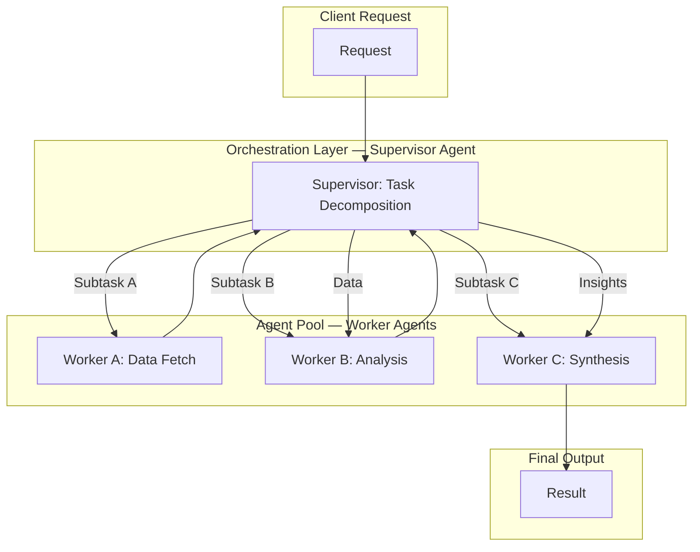

2026년에는 단일 AI 에이전트로는 처리하기 어려운 복잡하고 상호 의존적인 태스크가 증가함에 따라, 여러 에이전트가 협력하여 문제를 해결하는 다중 에이전트 시스템(Multi-Agent Systems, MAS)의 설계 역량이 critical하게 부상하고 있습니다. MAS는 각 에이전트가 특정 전문성을 가지고 상호작용하며 복합적인 목표를 달성하는 시스템 아키텍처를 제공합니다. 이는 기존의 모놀리식 AI 또는 단순한 LLM 호출 체인으로는 어려운 문제 분해(problem decomposition), 병렬 처리, 자원 최적화, 그리고 견고한 오류 복구(robust error recovery)를 가능하게 합니다.

### 핵심 협업 패턴 (Core Collaboration Patterns)

복합 태스크 수행을 위한 MAS 디자인에는 여러 협업 패턴이 존재하며, 각 패턴은 특정 유형의 문제에 최적화되어 있습니다.

#### 1. 순차적 협업 (Sequential Collaboration / Pipeline Pattern)
하나의 에이전트가 태스크의 일부를 완료하면 그 결과를 다음 에이전트에게 전달하는 파이프라인(pipeline) 형태입니다. 각 에이전트는 특정 단계의 전문성을 가집니다. 예: 사용자 요청 분석 -> 데이터 수집 -> 보고서 생성.

#### 2. 병렬 협업 (Parallel Collaboration / Divide and Conquer Pattern)
복잡한 태스크를 독립적인 서브태스크로 분해하고, 다른 에이전트가 병렬로 처리한 후 결과를 통합(aggregate)합니다. 처리 시간 단축 및 리소스 활용도 증가에 유리합니다. 예: 대규모 문서 분석 병렬 처리.

#### 3. 계층적 협업 (Hierarchical Collaboration / Supervisor-Worker Pattern)
상위 에이전트(Supervisor Agent)가 전체 태스크를 관리하고, 하위 에이전트(Worker Agents)들에게 서브태스크를 할당하며 진행 상황을 모니터링합니다. Supervisor는 오케스트레이션(orchestration) 역할을 수행합니다. 예: 프로젝트 매니저 에이전트가 개발 및 테스트 에이전트에게 업무 지시.

#### 4. 스웜 협업 (Swarm Collaboration / Decentralized Pattern)
명시적인 중앙 제어 없이, 각 에이전트가 로컬 정보와 간단한 규칙에 기반하여 상호작용하며 전체 시스템의 emergent behavior로 복잡한 태스크를 해결합니다. 유연성과 확장성이 뛰어나지만 예측 및 디버깅이 어려울 수 있습니다.

### 상호작용 프로토콜 디자인 (Interaction Protocol Design)

MAS의 효과적인 협업을 위해서는 명확한 상호작용 프로토콜(Interaction Protocol) 설계가 필수적입니다.
*   **메시지 형식**: 에이전트 간 데이터 교환을 위한 표준화된 메시지 형식.
*   **통신 채널**: Pub/Sub, Message Queues, REST API 등 적절한 메커니즘 선택.
*   **역할 정의**: 각 에이전트의 책임과 역할(Responsibility and Role)을 명확히 정의.

### 코드 예제: 간단한 계층적 협업 (Python)

```python
import abc, time, queue, threading

class Agent(abc.ABC):
    def __init__(self, name):
        self.name = name
        self.inbox = queue.Queue()
        self._running = True
    @abc.abstractmethod
    def run(self): pass
    def send(self, recipient_q, msg): recipient_q.put(msg)
    def receive(self): return self.inbox.get() if not self.inbox.empty() else None
    def stop(self): self._running = False

class WorkerAgent(Agent):
    def __init__(self, name, task_fn): super().__init__(name); self.task_fn = task_fn
    def run(self):
        while self._running:
            msg = self.receive()
            if msg and msg['type'] == 'ASSIGN_TASK':
                res = self.task_fn(msg['data'])
                self.send(msg['reply_to'], {'type': 'TASK_COMPLETED', 'sender': self.name, 'task_id': msg['task_id'], 'result': res})
            time.sleep(0.05)

class SupervisorAgent(Agent):
    def __init__(self, name, workers): super().__init__(name); self.workers = {w.name: w for w in workers}; self.pending = {}
    def assign_task(self, worker_name, task_id, data):
        if worker_name in self.workers:
            self.send(self.workers[worker_name].inbox, {'type': 'ASSIGN_TASK', 'sender': self.name, 'reply_to': self.inbox, 'task_id': task_id, 'data': data})
            self.pending[task_id] = {'worker': worker_name, 'status': 'ASSIGNED'}
    def run(self):
        while self._running:
            msg = self.receive()
            if msg and msg['type'] == 'TASK_COMPLETED':
                if msg['task_id'] in self.pending: self.pending[msg['task_id']]['status'] = 'COMPLETED'; print(f"[{self.name}] Task {msg['task_id']} by {msg['sender']} -> {msg['result']}")
            if not self.pending or all(p['status'] == 'COMPLETED' for p in self.pending.values()):
                print(f"[{self.name}] Initiating new tasks...")
                self.assign_task('w1', 'tA1', 10); self.assign_task('w2', 'tB1', 20)
                self.pending = {}; time.sleep(1)
            time.sleep(0.05)

if __name__ == "__main__":
    w1 = WorkerAgent("w1", lambda x: f"Proc {x*2}")
    w2 = WorkerAgent("w2", lambda x: f"Gen {x/2}")
    sup = SupervisorAgent("sup", [w1, w2])
    threads = [threading.Thread(target=a.run) for a in [w1, w2, sup]]
    [t.start() for t in threads]
    try: time.sleep(3)
    except KeyboardInterrupt: pass
    finally:
        print("\nStopping agents...")
        w1.stop(); w2.stop(); sup.stop()
        [t.join() for t in threads]; print("Agents stopped.")
```

### 다중 에이전트 시스템 협업 흐름 (Mermaid Diagram)



### ## 트레이드오프

다중 에이전트 시스템의 협업 패턴 디자인은 여러 요소에 대한 트레이드오프를 수반합니다.

*   **복잡성 vs. 유연성**:
    *   **좋은 경우**: 계층적/순차적 패턴은 예측 가능한 흐름으로 복잡성 관리에 유리하나, 동적 태스크 변화에 유연성이 떨어집니다.
    *   **나쁜 경우**: 스웜 패턴은 유연하지만 행동 예측 및 디버깅이 어렵습니다.

*   **성능 vs. 오버헤드**:
    *   **좋은 경우**: 병렬 협업은 독립적 서브태스크에 대해 처리량(throughput)을 극대화합니다.
    *   **나쁜 경우**: 에이전트 간 통신(communication) 및 조정(coordination) 오버헤드가 크면 성능 저하가 발생할 수 있습니다.

*   **확장성 vs. 관리 용이성**:
    *   **좋은 경우**: 분산된 에이전트 구조는 워크로드 증가 시 스케일 아웃(scale out)으로 확장성이 높습니다.
    *   **나쁜 경우**: 에이전트 수가 많아질수록 상태 관리, 모니터링, 오류 진단 및 디버깅이 복잡해집니다.

### ## 실전 체크리스트

프로젝트에 다중 에이전트 시스템을 적용할 때 다음 체크리스트를 활용하여 디자인 및 구현의 완성도를 검증하십시오.

- [ ] **태스크 분해 및 역할 정의**: 복합 태스크가 명확한 서브태스크로 분해되었으며, 각 에이전트의 책임과 역할(Responsibility and Role)이 명확히 정의되었는가?
- [ ] **협업 패턴 선택 적절성**: 문제 특성에 가장 적합한 협업 패턴(Sequential, Parallel, Hierarchical, Swarm)이 선택되었는가? 선택의 근거가 명확한가?
- [ ] **상호작용 프로토콜 표준화**: 에이전트 간 메시지 형식, 통신 채널, 오류 처리 방식 등 상호작용 프로토콜(Interaction Protocol)이 표준화되고 명세화되었는가?
- [ ] **에이전트 상태 관리 및 동기화**: 각 에이전트의 상태(State)가 적절히 관리되며, 필요한 경우 에이전트 간 상태 동기화 메커니즘이 구현되었는가?
- [ ] **오케스트레이션 및 조정 메커니즘**: 태스크 할당, 결과 취합, 충돌 해결(Conflict Resolution) 등 오케스트레이션(Orchestration) 로직이 견고하게 설계되었는가?
- [ ] **모니터링 및 로깅 시스템**: 각 에이전트의 실행 상태, 태스크 진행, 에러 발생 등을 추적할 수 있는 중앙 집중식 모니터링 및 로깅 시스템이 구축되었는가?
- [ ] **확장성 및 성능 벤치마킹**: 에이전트 수 증가에 따른 시스템 확장성이 유지되며, 통신 오버헤드를 고려한 성능 벤치마킹이 수행되었는가?