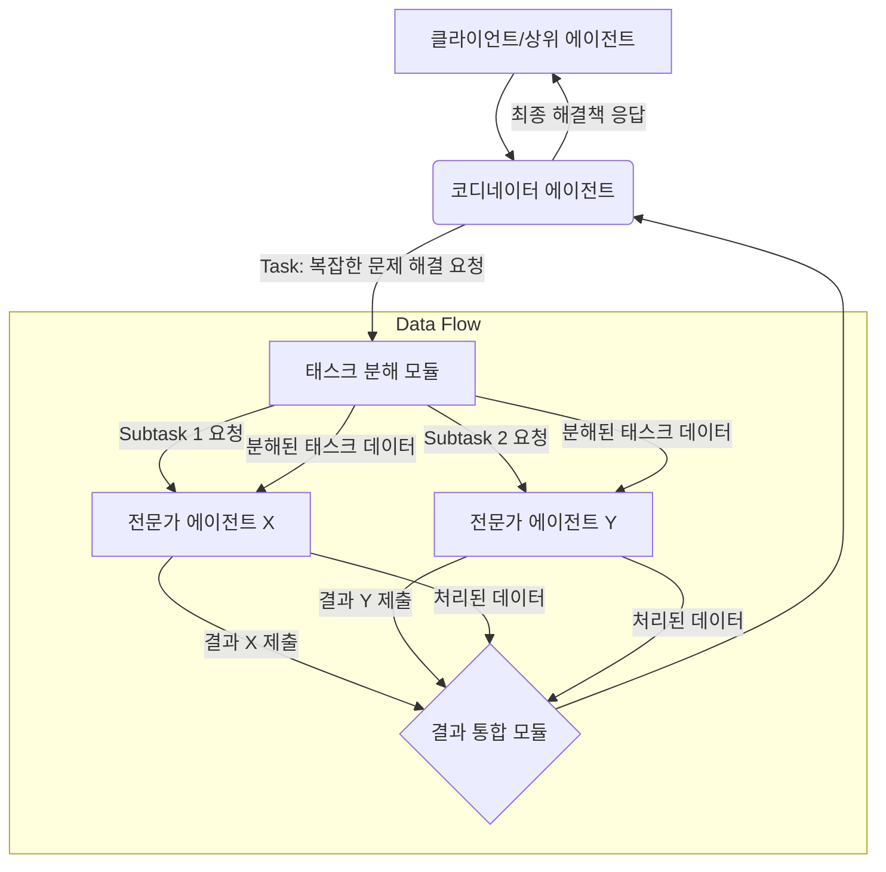

복잡한 문제 해결 환경에서 단일 에이전트의 한계를 넘어, 여러 에이전트가 상호작용하고 협력하는 멀티 에이전트 시스템(Multi-Agent Systems, MAS)의 중요성이 부각되고 있습니다. 특히 2026년 현재, LLM 기반의 자율 에이전트(Autonomous Agents)가 등장하며 MAS는 더욱 정교하고 동적인 협업 및 조정 메커니즘을 요구하게 되었습니다. 본 문서는 MAS의 성공적인 구축을 위한 협업 및 조정 메커니즘 설계 원칙과 실제 적용 가능한 패턴들을 다룹니다.

## 멀티 에이전트 시스템 협업의 중요성

멀티 에이전트 시스템은 분산된 지식과 역량을 가진 에이전트들이 복잡한 목표를 달성하기 위해 함께 작업하는 패러다임입니다. 각 에이전트는 제한된 시야와 능력을 가질 수 있지만, 효과적인 협업을 통해 개별 에이전트의 한계를 극복하고 시스템 전체의 성능과 견고성(Robustness)을 향상시킬 수 있습니다. 예를 들어, 물류 최적화, 재난 대응, 복잡한 소프트웨어 개발 등 다양한 분야에서 MAS는 고도의 자율성과 효율성을 제공합니다.

## 핵심 개념: 통신, 조정, 협력

MAS 설계 시 고려해야 할 세 가지 핵심 개념은 다음과 같습니다.

### 1. 통신 프로토콜 (Communication Protocols)

에이전트 간의 정보 교환 방식과 규칙을 정의합니다. 메시지 전달(Message Passing), 공유 메모리(Shared Memory), 블랙보드 시스템(Blackboard System) 등이 대표적입니다. 2026년 트렌드는 비동기 메시지 큐(Asynchronous Message Queues)와 LLM 기반의 의미론적 통신(Semantic Communication)을 통해 복잡한 의도를 전달하는 방식이 강조됩니다.

### 2. 조정 메커니즘 (Coordination Mechanisms)

에이전트의 행동을 동기화하고 충돌을 방지하며, 자원 할당을 최적화하는 방법을 다룹니다. 경매(Auction) 기반 시스템, 스케줄링(Scheduling), 분산 합의(Distributed Consensus) 알고리즘 등이 있습니다. 자율 에이전트 환경에서는 동적인 상황 변화에 따라 실시간으로 조정 전략을 변경하는 적응형 조정(Adaptive Coordination)이 필수적입니다.

### 3. 협력 전략 (Collaboration Strategies)

공동의 목표를 달성하기 위해 에이전트들이 어떻게 협력할 것인가에 대한 상위 수준의 접근 방식입니다. 역할 분담(Role Assignment), 작업 분해(Task Decomposition), 결과 통합(Result Integration) 등이 포함됩니다. LLM 기반 에이전트들은 복잡한 문제의 하위 작업을 스스로 분해하고, 다른 에이전트에게 위임하며, 최종 결과를 통합하는 능력이 강화되고 있습니다.

## 일반적인 협업 및 조정 패턴

*   **블랙보드 시스템 (Blackboard System)**: 공유된 작업 공간(Blackboard)을 통해 에이전트들이 문제를 해결하고 정보를 교환하는 중앙 집중식 협업 모델입니다. 지식 소스(Knowledge Sources) 에이전트들이 블랙보드의 데이터를 읽고 쓰는 방식으로 작동합니다.

*   **계약망 프로토콜 (Contract Net Protocol)**: 태스크 할당을 위한 분산된 경매 기반 메커니즘입니다. 매니저(Manager) 에이전트가 태스크를 제안하고, 입찰자(Bidder) 에이전트가 입찰하며, 매니저가 최적의 입찰자를 선택하여 계약을 체결합니다.

*   **계층적 제어 (Hierarchical Control)**: 상위 에이전트가 하위 에이전트에게 작업을 위임하고 감독하는 구조입니다. 복잡한 시스템의 관리와 제어를 용이하게 하지만, 상위 에이전트의 병목 현상(Bottleneck)이 발생할 수 있습니다.

*   **군집 지능 (Swarm Intelligence)**: 개별 에이전트의 간단한 규칙과 상호작용을 통해 전체 시스템 수준에서 복잡한 행동이 출현하는 분산형 모델입니다. 개미 군집 알고리즘(Ant Colony Optimization), 입자 군집 최적화(Particle Swarm Optimization) 등이 있습니다.

아래 Mermaid 다이어그램은 간단한 태스크 위임 및 결과 통합 시나리오를 보여줍니다:



## 코드 예제: 간단한 메시지 큐 기반 협업

아래 Python 코드는 `queue` 모듈을 사용하여 에이전트 간의 간단한 메시지 기반 통신 및 조정을 구현하는 예제입니다. 코디네이터 에이전트가 태스크를 할당하고, 워커 에이전트들이 이를 처리 후 결과를 반환합니다. 이는 공유 메모리나 블랙보드 시스템의 간소화된 형태입니다.

```python
import queue
import threading
import time

class WorkerAgent:
    def __init__(self, name: str, task_q: queue.Queue, result_q: queue.Queue):
        self.name = name
        self.task_queue = task_q
        self.result_queue = result_q

    def run(self):
        print(f"{self.name} 시작.")
        while True:
            try:
                task = self.task_queue.get(timeout=1) # 태스크 대기 (1초 타임아웃)
                if task is None: # 종료 시그널 수신
                    print(f"{self.name} 종료 시그널 수신.")
                    break
                
                print(f"{self.name} 태스크 처리 중: {task}")
                # 실제 작업 시뮬레이션
                time.sleep(0.5)
                processed_result = f"[완료] {self.name}이/가 '{task}' 처리"
                self.result_queue.put(processed_result)
                self.task_queue.task_done()
            except queue.Empty:
                # 큐가 비어있으면 계속 대기
                continue
        print(f"{self.name} 종료.")

def main_coordinator_simulation():
    task_queue = queue.Queue()
    result_queue = queue.Queue()

    # 3개의 워커 에이전트 생성
    workers = [WorkerAgent(f"Worker-{i+1}", task_queue, result_queue) for i in range(3)]
    worker_threads = []
    for worker in workers:
        t = threading.Thread(target=worker.run)
        worker_threads.append(t)
        t.start()

    # 코디네이터가 태스크 할당
    tasks_to_assign = ["데이터 분석", "보고서 생성", "코드 리뷰", "성능 최적화", "문서화"]
    for task in tasks_to_assign:
        task_queue.put(task)
        print(f"코디네이터가 태스크 할당: {task}")
        time.sleep(0.2) # 태스크 할당 간격

    # 모든 태스크가 처리될 때까지 대기
    task_queue.join()
    print("\n--- 모든 태스크가 워커에 의해 처리되었습니다 ---")

    # 결과 수집
    results = []
    while not result_queue.empty():
        results.append(result_queue.get())
    print("수집된 최종 결과:", results)

    # 워커 에이전트들에게 종료 시그널 전송
    for _ in workers:
        task_queue.put(None)
    for t in worker_threads:
        t.join()

    print("\n--- 모든 에이전트가 종료되었습니다. 코디네이터 시뮬레이션 완료. ---")

# if __name__ == "__main__":
#     main_coordinator_simulation()
```

이 예제는 코디네이터(Coordinator)와 워커(Worker) 에이전트 간의 간단한 분산 태스크 처리 과정을 보여줍니다. `task_queue`는 코디네이터가 워커에게 태스크를 전달하는 통신 채널이며, `result_queue`는 워커가 처리 결과를 코디네이터에게 다시 전달하는 채널입니다. `task_queue.join()`은 모든 할당된 태스크가 `task_done()` 호출로 완료될 때까지 코디네이터를 대기시켜 조정 역할을 수행합니다.

## 2026년 멀티 에이전트 시스템 트렌드

*   **LLM 기반 동적 조정 (LLM-driven Dynamic Coordination)**: 대규모 언어 모델(LLM)이 각 에이전트의 추론 및 의사결정을 담당하며, 복잡한 상황 변화에 따라 실시간으로 협업 전략을 재구성하는 능력이 강화됩니다. 이를 통해 예상치 못한 시나리오에도 유연하게 대응할 수 있습니다.
*   **Emergent Behavior (발현 행동)**: 명시적인 프로그래밍 없이 에이전트 간의 간단한 상호작용 규칙에서 복잡하고 지능적인 전체 시스템 행동이 자연스럽게 나타나는 현상에 대한 연구가 활발합니다.
*   **인간-에이전트 협업 (Human-Agent Teaming)**: 에이전트 시스템이 단순히 자동화된 작업을 수행하는 것을 넘어, 인간 팀원과 효과적으로 소통하고 협력하여 공동 목표를 달성하는 하이브리드 시스템 설계가 중요해지고 있습니다.
*   **분산 온톨로지 및 지식 그래프 (Distributed Ontologies & Knowledge Graphs)**: 에이전트들이 공유하는 지식 기반을 분산된 형태로 유지하고, 온톨로지(Ontology)를 통해 서로의 지식과 역량을 이해하여 보다 심층적인 협업을 가능하게 합니다.

## 트레이드오프

멀티 에이전트 시스템의 협업 및 조정 메커니즘을 설계할 때는 다양한 트레이드오프를 고려해야 합니다.

*   **중앙 집중식 vs. 분산식 제어 (Centralized vs. Decentralized Control)**:
    *   **중앙 집중식 (예: 블랙보드 시스템, 계층적 제어)**: 구현이 간단하고 시스템 전반의 최적화가 용이합니다. 그러나 단일 실패 지점(Single Point of Failure)이 될 수 있고, 확장성(Scalability)이 제한적입니다. `작은 규모의 고정된 태스크`나 `엄격한 감독이 필요한 경우`에 좋습니다. `대규모 동적 환경`에서는 병목 현상과 견고성 저하가 발생할 수 있습니다.
    *   **분산식 (예: 계약망 프로토콜, 군집 지능)**: 단일 실패 지점이 없고, 확장성과 견고성이 우수합니다. 그러나 전역적인 최적화가 어렵고, 에이전트 간의 불필요한 통신 오버헤드(Communication Overhead)가 발생할 수 있습니다. `대규모 분산 환경`이나 `높은 견고성이 요구되는 경우`에 좋습니다. `최적의 전체 성능 보장이 어려운` 단점이 있습니다.

*   **명시적 vs. 암묵적 조정 (Explicit vs. Implicit Coordination)**:
    *   **명시적 (예: 명시적 메시지 전달, 공유 계획)**: 에이전트 간의 의도와 행동이 명확하게 정의되어 이해하기 쉽습니다. 그러나 복잡한 상황에서 설계 및 유지보수가 어렵고, 통신 비용이 높을 수 있습니다. `예측 가능한 환경`이나 `명확한 역할 분담`이 필요한 경우에 좋습니다. `동적인 상황 변화`나 `자유로운 에이전트 행동`에는 부적합합니다.
    *   **암묵적 (예: 환경 변화 감지, 행동 관찰)**: 에이전트가 다른 에이전트의 행동이나 환경 변화를 관찰하여 자신의 행동을 조정합니다. 통신 오버헤드가 적고 유연합니다. 그러나 의도 파악이 어렵고, 예상치 못한 충돌이 발생할 수 있습니다. `간단한 상호작용 규칙`을 가진 `대규모 군집 시스템`에 좋습니다. `복잡한 의사소통`이나 `정밀한 협력이 필요한 경우`에는 신뢰도가 낮습니다.

*   **견고성 vs. 효율성 (Robustness vs. Efficiency)**:
    *   **견고성 중심**: 에이전트 실패나 환경 변화에도 시스템이 안정적으로 작동하도록 중복성(Redundancy)과 오류 처리(Error Handling)에 초점을 맞춥니다. 안정성은 높지만 자원 사용이 비효율적일 수 있습니다. `안전이 중요하거나 오류 비용이 높은 시스템`에 좋습니다. `최대 성능`이나 `자원 제약이 있는 경우`에는 과도한 비용이 들 수 있습니다.
    *   **효율성 중심**: 최소한의 자원으로 최대의 성능을 달성하는 데 초점을 맞춥니다. 성능은 높지만 특정 에이전트의 실패 시 전체 시스템이 영향을 받을 수 있습니다. `자원 제약이 심하거나 실시간 처리`가 중요한 경우에 좋습니다. `예측 불가능한 오류`에 취약할 수 있습니다.

## 실전 체크리스트

멀티 에이전트 시스템의 협업 및 조정 메커니즘을 설계하고 적용할 때 다음 항목들을 점검하십시오.

*   [ ] **에이전트 역할 및 책임 명확화**: 각 에이전트의 목표, 능력, 자원 접근 권한이 명확하게 정의되었는가?
*   [ ] **통신 채널 및 프로토콜 설계**: 에이전트 간의 정보 교환 방식(예: 메시지 큐, 공유 블랙보드)과 메시지 구조(Schema)가 명확하게 정의되고 표준화되었는가?
*   [ ] **충돌 감지 및 해결 전략 포함**: 에이전트 간의 자원 경합 또는 목표 충돌 발생 시 이를 감지하고 해결하는 메커니즘(예: 우선순위, 경매)이 명시적으로 설계되었는가?
*   [ ] **실패 시나리오 및 복구 전략 고려**: 에이전트가 실패하거나 예상치 못한 상황이 발생했을 때 시스템 전체의 안정성을 유지하기 위한 대체 에이전트, 재할당 또는 롤백(Rollback) 전략이 있는가?
*   [ ] **확장성 및 동적 적응성 평가**: 새로운 에이전트의 추가나 태스크 요구사항 변경에 시스템이 얼마나 유연하게 대응하고 확장될 수 있는가?
*   [ ] **모니터링 및 로깅 체계 구축**: 에이전트 간의 통신, 태스크 진행 상황, 리소스 사용량 등을 모니터링하고 로깅하여 시스템의 상태를 파악하고 디버깅할 수 있는가?
*   [ ] **보안 및 접근 제어 구현**: 에이전트 간의 통신과 공유 자원에 대한 보안 및 접근 제어(Authentication & Authorization)가 적절히 구현되어 무단 접근을 방지하는가?