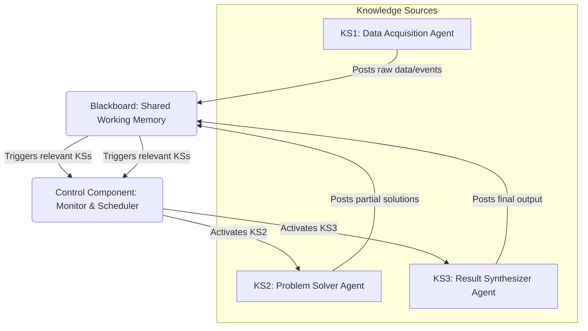

Multi-Agent Systems (MAS)는 자율 에이전트들이 복잡한 문제를 해결하기 위해 협력하는 시스템입니다. 자율 주행, 스마트 그리드, 복잡한 소프트웨어 개발 등 다양한 분야에서 효율적인 협업 및 의사결정 로직 디자인은 MAS의 핵심 성공 요소입니다. 이 엔트리는 에이전트들이 효과적으로 상호작용하고 합리적인 결정을 내릴 수 있도록 돕는 핵심 디자인 패턴과 2026년 최신 트렌드를 탐구합니다.

## 멀티 에이전트 시스템의 협업 및 의사결정 핵심 개념
MAS는 각기 다른 목표, 능력, 정보 상태를 가진 여러 에이전트가 모여 더 큰 목표를 달성하는 구조입니다. 효과적인 협업은 태스크 분배, 정보 공유, 자원 할당, 갈등 해결을 포함하며, 의사결정은 개별 에이전트의 자율적 판단부터 집단적 합의에 이르기까지 다양합니다. 디자인 패턴은 이러한 복잡한 상호작용을 구조화하고 예측 가능하게 만듭니다.

### 1. Contract Net Protocol (CNP)
Contract Net Protocol은 분산 태스크 할당을 위한 고전적인 패턴입니다. '매니저' 에이전트가 '제안 요청(CFP)'을 브로드캐스트하면, '입찰자' 에이전트들이 자신의 능력과 부하를 고려하여 '입찰'을 제출합니다. 매니저는 최적의 입찰자를 선정하여 태스크를 '위임'하고, 입찰자는 태스크를 실행합니다. 높은 유연성과 확장성을 제공합니다.

### 2. Blackboard Architecture
Blackboard Architecture는 모든 에이전트가 접근할 수 있는 중앙 집중식 '블랙보드'라는 공유 작업 공간을 사용하는 패턴입니다. 각 '지식 소스' 에이전트는 블랙보드의 상태 변화를 모니터링하고, 전문성에 따라 부분적인 해결책을 게시하거나 다른 에이전트의 정보를 활용합니다. '제어 컴포넌트'는 블랙보드와 지식 소스 간의 상호작용을 조율하여 전체적인 문제 해결을 이끌어갑니다. 복잡한 문제를 점진적으로 해결하는 데 효과적입니다.

### 3. Consensus Mechanisms
Consensus Mechanisms는 여러 에이전트가 특정 결정에 대해 합의에 도달하는 방법입니다. 단순한 '다수결 투표'부터 '가중치 투표', '반복적 협상'에 이르기까지 다양한 형태가 있습니다. 이 패턴은 시스템의 견고성과 신뢰성을 높여주지만, 통신 오버헤드와 합의 도달 시간이 증가할 수 있습니다.

### 4. Hierarchical/Federated Architectures
이 아키텍처는 에이전트들을 계층적 구조(상위 감독, 하위 작업) 또는 연합 구조로 조직합니다. 계층 구조는 복잡한 태스크를 세분화하고 제어 흐름을 명확히 하는 데 유리하며, 연합 구조는 독립적인 도메인 간의 느슨한 협력을 가능하게 합니다. 2026년 트렌드에서는 LLM(Large Language Model) 기반 에이전트들이 동적으로 역할을 할당받고, 상황에 따라 협업 프로토콜을 변경하는 등 더욱 유연한 하이브리드 아키텍처가 부상하고 있습니다. 이는 사전 정의된 규칙보다 상황적 추론과 적응성을 강조합니다.

### 코드 예시: Contract Net Protocol (Python)

```python
import random

class Agent:
    def __init__(self, agent_id, capability):
        self.agent_id = agent_id
        self.capability = capability

    def bid_for_task(self, task_description):
        if self.capability > random.random():
            bid_cost = round(100 - (self.capability * 50), 2)
            return {"agent_id": self.agent_id, "bid": bid_cost, "task": task_description}
        return None

    def execute_assigned_task(self, task):
        return f"Agent {self.agent_id} (Capability: {self.capability:.2f}) completed '{task}'"

class Manager:
    def __init__(self, agents):
        self.agents = agents

    def orchestrate_task_via_contract_net(self, task_description):
        proposals = []
        for agent in self.agents:
            proposal = agent.bid_for_task(task_description)
            if proposal:
                proposals.append(proposal)

        if not proposals:
            return "Task failed: No agents could bid."

        winning_proposal = min(proposals, key=lambda x: x['bid'])
        winning_agent = next(a for a in self.agents if a.agent_id == winning_proposal['agent_id'])

        return winning_agent.execute_assigned_task(task_description)

if __name__ == "__main__":
    agents = [Agent(i, random.uniform(0.3, 0.9)) for i in range(3)]
    manager = Manager(agents)
    print(manager.orchestrate_task_via_contract_net("Analyze Sales Report"))
    print(manager.orchestrate_task_via_contract_net("Update Database Record"))
```

### Mermaid Diagram: Blackboard Architecture Concept



## 트레이드오프

*   **분산 제어 vs. 중앙 집중 제어 (Distributed vs. Centralized Control)**
    *   **언제 좋음**: 분산 제어 패턴 (예: Contract Net Protocol)은 확장성과 장애 허용성(fault tolerance)이 중요할 때 유리합니다. 단일 실패 지점(Single Point of Failure)이 줄고, 에이전트의 자율성이 높아 동적인 환경에 더 잘 적응합니다.
    *   **언제 나쁨**: 전역 최적화나 일관된 시스템 상태 유지가 필수적일 경우 (예: 민감한 데이터 처리, 엄격한 규제 준수), 중앙 집중 제어 패턴이 더 효과적입니다. 분산 시스템은 전역 시야가 부족해 비효율적인 의사결정을 초래할 수 있습니다.

*   **유연성 vs. 예측 가능성 (Flexibility vs. Predictability)**
    *   **언제 좋음**: 동적 협업 패턴 (예: LLM 기반 에이전트의 동적 역할 할당)은 변화무쌍한 환경이나 미지의 태스크를 처리해야 할 때, 높은 적응성이 요구될 때 강점을 가집니다.
    *   **언제 나쁨**: 안전이 critical하거나 검증 가능한 행동, 엄격한 성능 보장이 필요한 시스템에서는 예측 가능하고 디버깅이 용이한 정적/명시적 패턴이 선호됩니다. 유연성이 높은 패턴은 복잡성으로 인해 검증과 디버깅이 어려울 수 있습니다.

*   **통신 오버헤드 vs. 의사결정 품질 (Communication Overhead vs. Decision Quality)**
    *   **언제 좋음**: 에이전트 간 풍부한 정보 교환과 합의 과정을 포함하는 패턴 (예: Consensus Mechanisms)은 의사결정의 품질, 견고성, 신뢰도를 높일 수 있습니다. 특히 다양한 관점이 필요한 복잡한 문제 해결에 적합합니다.
    *   **언제 나쁨**: 통신량이 네트워크 대역폭이나 에이전트 처리 능력을 과도하게 소비하여 병목 현상을 일으킬 경우, 시스템 실시간 성능이 저하됩니다. 대규모 분산 시스템이나 저지연(low-latency) 환경에서는 통신량을 최소화하는 패턴이 필요합니다.

*   **초기 설계 복잡성 vs. 런타임 효율성 (Initial Design Complexity vs. Runtime Efficiency)**
    *   **언제 좋음**: 계층적 또는 연합형 아키텍처는 대규모 시스템의 설계 복잡성을 관리하고, 특정 도메인 내 에이전트들이 효율적으로 협력하도록 구조화하는 데 유리합니다. 잘 정의된 계층은 역할을 명확히 하고 의사소통 경로를 최적화할 수 있습니다.
    *   **언제 나쁨**: 소규모 문제나 에이전트 간 상호작용이 단순한 경우에는 과도한 계층 구조나 추상화가 불필요한 설계 복잡성만 추가하고 런타임 오버헤드를 발생시킬 수 있습니다.

## 실전 체크리스트

*   - [ ] **태스크 분해 명확성**: 전체 시스템 목표가 개별 에이전트가 수행할 수 있는 구체적인 태스크로 명확하게 분해되었으며, 각 에이전트의 책임 범위가 정의되었는가?
*   - [ ] **정보 공유 프로토콜 최적화**: 에이전트 간 정보 공유 방식이 데이터 민감도, 규모, 실시간성 요구 사항에 맞춰 최적화되었고, 불필요한 통신 오버헤드를 줄이는 메커니즘이 포함되었는가?
*   - [ ] **의사결정 로직 정의**: 각 에이전트의 개별 의사결정 로직 및 집단적 합의 로직(예: Conflict resolution strategy, Voting threshold)이 명시적으로 정의되고 문서화되었는가?
*   - [ ] **확장성 및 유연성 고려**: 미래 태스크 증가나 환경 변화에 대응하기 위해 협업 및 의사결정 패턴이 시스템의 확장성 및 유연성을 지원하는가?
*   - [ ] **장애 허용성 및 복구 메커니즘**: 에이전트 실패 또는 오작동 시 시스템 전체 목표 달성을 방해하지 않도록, 태스크 재할당, 대체 에이전트 활성화 등의 복구 메커니즘이 설계되었는가?
*   - [ ] **LLM 에이전트 제약 조건 명시**: LLM 기반 에이전트를 사용하는 경우, 프롬프트 엔지니어링을 통해 협업 규칙, 의사결정 제약 조건, 윤리적 가이드라인이 명확하게 주입되었는가?
*   - [ ] **모니터링 및 디버깅 용이성**: 에이전트 상호작용, 의사결정 과정, 시스템 전체 성능을 실시간으로 추적하고 분석할 수 있는 로깅 및 모니터링 시스템이 구축되었는가?