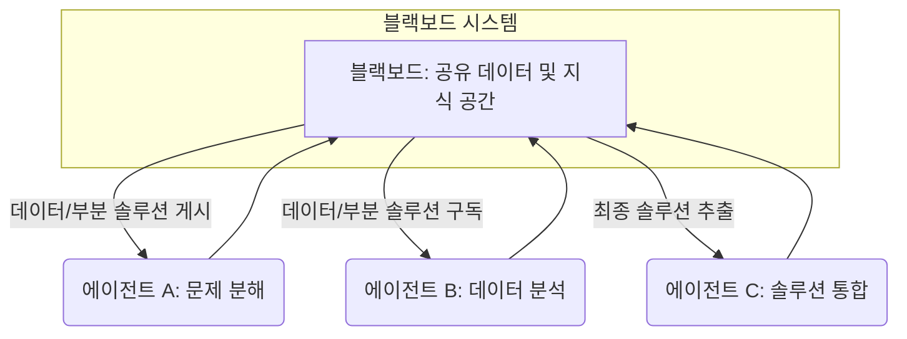

## 멀티 에이전트 시스템 협업 패턴 설계: 성능 및 효율성 최적화

멀티 에이전트 시스템 (Multi-Agent Systems, MAS)은 복잡한 문제 해결, 분산 컴퓨팅, 자율 시스템 구축에 필수적인 패러다임입니다. 각 에이전트가 독립적인 목표를 가지면서도 전체 시스템의 목표 달성을 위해 협력해야 하는 환경에서, 효과적인 협업 패턴 디자인은 시스템의 성능, 효율성, 견고성을 크게 좌우합니다. 2026년 현재, LLM 기반 에이전트의 발전과 함께 MAS의 응용 범위가 넓어지면서, 협업 패턴의 중요성은 더욱 부각되고 있습니다.

### 핵심 협업 메커니즘 (Core Collaboration Mechanisms)

성공적인 멀티 에이전트 협업을 위해서는 다음 메커니즘들을 고려해야 합니다.

1.  **조정 메커니즘 (Coordination Mechanisms)**:
    *   **중앙 집중식 (Centralized)**: 단일 코디네이터 에이전트가 모든 태스크 할당과 자원 관리를 담당합니다. 구현이 간단하지만 단일 실패점(Single Point of Failure)이 될 수 있고 확장성에 한계가 있습니다.
    *   **분산식 (Decentralized)**: 에이전트들이 자율적으로 협상하거나 상호 작용 규칙에 따라 태스크를 조정합니다. 확장성이 높고 견고하지만, 복잡한 충돌 해결 로직이 필요할 수 있습니다.
2.  **통신 프로토콜 (Communication Protocols)**:
    *   **메시지 패싱 (Message Passing)**: 에이전트 간 직접적인 메시지 교환을 통해 정보를 공유하고 요청을 전달합니다. FIPA ACL (Agent Communication Language) 같은 표준이 존재합니다.
    *   **공유 메모리/블랙보드 (Shared Memory/Blackboard)**: 모든 에이전트가 접근할 수 있는 중앙 데이터 저장소를 통해 정보를 공유합니다. 에이전트들은 블랙보드에 데이터를 게시하고, 관심 있는 데이터를 구독합니다.
3.  **역할 할당 및 전문화 (Role Assignment & Specialization)**:
    *   각 에이전트가 특정 전문 지식이나 기능을 가지도록 역할을 정의합니다. 이를 통해 태스크를 효율적으로 분해하고 병렬 처리를 가능하게 합니다.
4.  **태스크 분해 및 위임 (Task Decomposition & Delegation)**:
    *   복잡한 메인 태스크를 더 작고 관리하기 쉬운 서브 태스크로 분해합니다. 이후 이 서브 태스크들을 적절한 에이전트에게 위임하여 처리합니다.

### 주요 협업 패턴 (Key Collaboration Patterns)

다양한 MAS 시나리오에 적용할 수 있는 검증된 협업 패턴들이 존재합니다.

#### 1. 블랙보드 패턴 (Blackboard Pattern)

블랙보드 패턴은 모든 에이전트가 공유하는 중앙 데이터 저장소(블랙보드)를 중심으로 협업하는 방식입니다. 에이전트들은 블랙보드에 부분적인 솔루션이나 데이터를 게시하고, 다른 에이전트들이 이 정보를 활용하여 문제 해결을 진행합니다.



이 패턴은 다양한 전문 지식을 가진 에이전트들이 비동기적으로 협력해야 하는 복잡하고 예측 불가능한 문제에 특히 유용합니다. 예를 들어, 보안 위협 탐지 시스템에서 각 에이전트가 특정 종류의 위협을 분석하고, 그 결과를 블랙보드에 공유하여 전체 시스템이 종합적인 위협을 탐지할 수 있습니다.

#### 2. 매니저-워커 패턴 (Manager-Worker Pattern)

매니저-워커 패턴은 하나의 중앙 에이전트(매니저)가 상위 수준의 태스크를 받아 여러 하위 에이전트(워커)에게 서브 태스크를 할당하고 그 결과를 취합하는 계층적 구조입니다.

```python
import threading
import queue
import time

class Worker:
    def __init__(self, id_val):
        self.id = id_val
        print(f"Worker {self.id} initialized.")

    def process_task(self, task):
        print(f"Worker {self.id} processing task: {task}...")
        time.sleep(task['duration']) # Simulate work
        result = f"Worker {self.id} completed task {task['id']}"
        print(result)
        return result

class Manager:
    def __init__(self, num_workers):
        self.task_queue = queue.Queue()
        self.result_queue = queue.Queue()
        self.workers = [Worker(i) for i in range(num_workers)]
        self.worker_threads = []

    def assign_task(self, task):
        self.task_queue.put(task)
        print(f"Manager assigned task {task['id']}.")

    def _worker_runner(self, worker):
        while True:
            task = self.task_queue.get()
            if task is None: # Sentinel for termination
                self.task_queue.task_done()
                break
            result = worker.process_task(task)
            self.result_queue.put(result)
            self.task_queue.task_done()

    def start_workers(self):
        for worker in self.workers:
            thread = threading.Thread(target=self._worker_runner, args=(worker,))
            thread.start()
            self.worker_threads.append(thread)
        print("Manager started all workers.")

    def stop_workers(self):
        for _ in self.workers:
            self.task_queue.put(None) # Signal workers to stop
        for thread in self.worker_threads:
            thread.join()
        print("Manager stopped all workers.")

    def collect_results(self):
        results = []
        while not self.result_queue.empty():
            results.append(self.result_queue.get())
        return results

# Example Usage
if __name__ == "__main__":
    manager = Manager(num_workers=3)
    manager.start_workers()

    tasks = [
        {'id': 'A', 'duration': 2},
        {'id': 'B', 'duration': 1},
        {'id': 'C', 'duration': 3},
        {'id': 'D', 'duration': 1}
    ]

    for task in tasks:
        manager.assign_task(task)

    # Wait for all tasks to be processed
    manager.task_queue.join() 
    print("All tasks processed by workers.")

    results = manager.collect_results()
    print("Collected Results:", results)

    manager.stop_workers()
```
이 패턴은 태스크 분해가 명확하고, 각 서브 태스크가 독립적으로 처리될 수 있는 시나리오에 적합합니다. 예를 들어, 대규모 데이터 처리, 코드 분석, 또는 복잡한 시뮬레이션에서 서브 태스크를 병렬로 실행하는 데 활용될 수 있습니다. 2026년의 LLM 기반 에이전트에서는 매니저 에이전트가 복잡한 요청을 프롬프트 엔지니어링을 통해 작은 태스크로 분해하고, 여러 워커 LLM 에이전트에게 할당하는 방식으로 활용됩니다.

#### 3. 컨트랙트 넷 프로토콜 (Contract Net Protocol, CNP)

CNP는 분산 환경에서 태스크 위임을 위한 대표적인 협상 기반 패턴입니다. 하나의 에이전트(발주자, Initiator)가 태스크를 제안하면, 다른 에이전트(입찰자, Bidder)들이 자신의 능력과 가용성을 평가하여 입찰하고, 발주자는 최적의 입찰자를 선택하여 계약을 맺는 방식입니다. 이는 자율적인 에이전트 간의 동적 태스크 할당에 매우 효과적입니다.

### 2026년 최신 트렌드 반영 (Reflecting 2026 Trends)

*   **LLM 기반 에이전트의 역할 분담 및 협업**: 대규모 언어 모델 (LLM)을 기반으로 하는 에이전트들이 복잡한 태스크를 해결하기 위해 서로 다른 전문성을 가지고 협력하는 추세가 강화되고 있습니다. 한 에이전트는 계획(planning)을, 다른 에이전트는 코드 생성(code generation)을, 또 다른 에이전트는 테스트 및 검증(testing & validation)을 담당하는 식입니다.
*   **자기 개선 협업 패턴 (Self-Improving Collaboration Patterns)**: 에이전트들이 과거 협업 경험을 통해 실패 사례를 학습하고, 동적으로 협업 전략을 조정하거나 새로운 패턴을 생성하는 메타 학습(meta-learning) 접근 방식이 연구되고 있습니다.
*   **적응형 및 동적 패턴 (Adaptive and Dynamic Patterns)**: 시스템 환경 변화나 태스크의 특성에 따라 가장 효율적인 협업 패턴을 실시간으로 선택하거나 변형하는 유연한 MAS 아키텍처가 중요해지고 있습니다.

## 트레이드오프 (Trade-offs)

멀티 에이전트 시스템의 협업 패턴을 설계할 때는 여러 장단점을 고려하여 특정 상황에 맞는 최적의 선택을 해야 합니다.

*   **중앙 집중식 조정 vs. 분산식 조정**:
    *   **중앙 집중식 (Manager-Worker)**:
        *   **언제 좋고**: 태스크가 명확히 분해 가능하고, 코디네이션 복잡도가 낮으며, 시스템 규모가 작거나 중간일 때 효율적입니다. 빠른 의사결정과 제어가 가능합니다.
        *   **언제 나쁜지**: 매니저 에이전트의 단일 실패점 위험이 크고, 확장성(Scalability)이 떨어지며, 매니저에게 과도한 부하가 집중될 수 있습니다.
    *   **분산식 (Blackboard, Contract Net)**:
        *   **언제 좋고**: 높은 확장성과 견고성(Robustness)이 요구될 때, 태스크가 동적으로 변화하거나 예측 불가능할 때 유용합니다. 단일 실패점 위험이 적습니다.
        *   **언제 나쁜지**: 에이전트 간의 통신 오버헤드가 증가할 수 있고, 충돌 해결 및 합의(Consensus) 도달 메커니즘이 복잡해질 수 있습니다. 구현 및 디버깅이 더 어렵습니다.
*   **명시적 통신 vs. 암묵적 통신 (Explicit vs. Implicit Communication)**:
    *   **명시적 통신 (Message Passing, CNP)**:
        *   **언제 좋고**: 메시지 내용과 의도가 명확하게 정의되어야 할 때, 에이전트 간 강한 독립성을 유지해야 할 때 좋습니다. 디버깅이 비교적 용이합니다.
        *   **언제 나쁜지**: 메시지 전송 및 처리에 따른 네트워크 부하 및 지연이 발생할 수 있습니다. 복잡한 정보 공유에는 오버헤드가 큽니다.
    *   **암묵적 통신 (Blackboard)**:
        *   **언제 좋고**: 대량의 정보가 비동기적으로 공유되고, 에이전트 간의 관심사가 중첩될 때 효율적입니다. Loose Coupling이 가능합니다.
        *   **언제 나쁜지**: 블랙보드 자체의 병목 현상이 발생할 수 있으며, 데이터 일관성 및 동시성 제어(Concurrency Control)가 복잡해질 수 있습니다. 에이전트 간의 직접적인 협상 기회가 줄어들어 유연성이 저하될 수 있습니다.
*   **고정된 역할 vs. 동적 역할 할당**:
    *   **고정된 역할**:
        *   **언제 좋고**: 시스템의 기능이 명확하고 안정적일 때, 에이전트의 전문성을 최대한 활용하여 효율성을 높일 수 있습니다.
        *   **언제 나쁜지**: 환경 변화나 새로운 태스크 요구사항에 대한 유연성이 떨어집니다. 특정 에이전트의 고장 시 전체 시스템의 성능 저하가 발생할 수 있습니다.
    *   **동적 역할 할당**:
        *   **언제 좋고**: 변화하는 환경과 태스크에 유연하게 대응해야 할 때, 에이전트의 가용성에 따라 부하를 분산해야 할 때 좋습니다.
        *   **언제 나쁜지**: 역할 할당 및 재할당 로직이 복잡해지며, 동적 할당 과정에서 발생하는 오버헤드가 시스템 성능에 영향을 줄 수 있습니다.

## 실전 체크리스트 (Practical Checklist)

멀티 에이전트 시스템의 효과적인 협업 패턴을 설계하고 구현할 때 다음 체크리스트를 활용하여 시스템의 견고성과 효율성을 검증합니다.

*   [ ] **에이전트 역할 및 책임 명확화**: 각 에이전트의 고유한 역할, 목표, 전문 지식 및 책임을 명확하게 정의했는가?
*   [ ] **통신 프로토콜 표준화**: 에이전트 간 정보 교환 및 태스크 위임을 위한 표준화된 통신 프로토콜 (예: FIPA ACL, REST API)을 설계하고 일관되게 적용했는가?
*   [ ] **태스크 분해 및 할당 전략 정의**: 복잡한 태스크를 서브 태스크로 효과적으로 분해하고, 이를 에이전트에게 할당하는 전략 (예: 매니저-워커, 컨트랙트 넷)이 시스템 목표에 부합하는가?
*   [ ] **충돌 감지 및 해결 메커니즘 구현**: 에이전트 간 자원 경합 또는 목표 충돌 발생 시 이를 감지하고 해결하기 위한 명확한 전략과 메커니즘 (예: 협상, 중재자)을 갖추었는가?
*   [ ] **오류 처리 및 복구 전략 포함**: 통신 실패, 에이전트 고장, 태스크 실패 등 예외 상황 발생 시 시스템이 안정적으로 복구되고 작업을 지속할 수 있도록 오류 처리 로직을 설계했는가?
*   [ ] **확장성 및 유연성 고려**: 에이전트 수의 증가, 새로운 태스크 유형의 추가, 환경 변화에 시스템이 유연하게 대응하고 확장될 수 있는 아키텍처를 선택했는가?
*   [ ] **협업 효율성 모니터링 및 측정**: 에이전트 간의 통신 빈도, 태스크 완료 시간, 리소스 사용량 등 협업의 효율성을 측정하고 개선할 수 있는 모니터링 지표를 설정했는가?