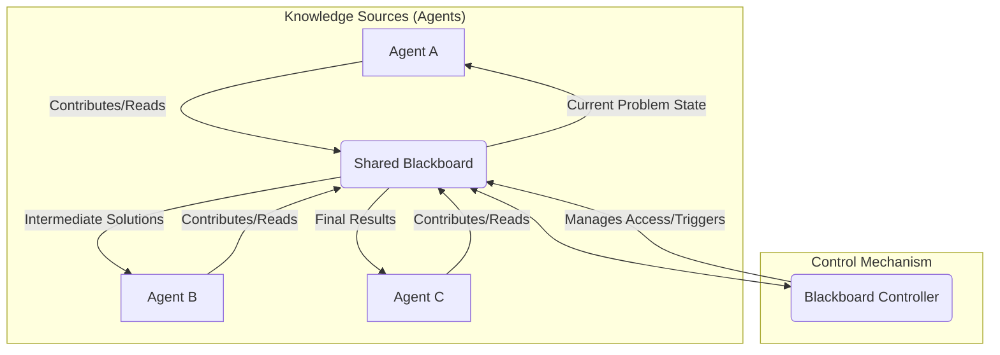

복잡한 태스크는 단일 AI 에이전트의 역량을 넘어서는 경우가 많습니다. 이러한 문제를 해결하기 위해 여러 에이전트 간의 효과적인 상호작용 및 협업 전략을 설계하는 것은 필수적입니다. 멀티 에이전트 시스템 (Multi-Agent Systems, MAS) 에서 에이전트들이 정보를 공유하고, 작업을 분담하며, 조율된 행동을 수행하도록 돕는 디자인 패턴은 시스템의 효율성, 확장성, 그리고 견고성을 결정합니다.

## 멀티 에이전트 협업의 핵심 원칙

성공적인 멀티 에이전트 협업은 몇 가지 핵심 원칙에 기반합니다:

*   **통신 (Communication)**: 에이전트 간의 정보 교환 메커니즘. 메시지 큐, 공유 메모리, API 호출 등 다양한 형태가 될 수 있습니다.
*   **조정 (Coordination)**: 에이전트의 행동이 서로 충돌하지 않고, 전체 시스템 목표에 부합하도록 정렬하는 과정. 동기화, 자원 할당, 스케줄링 등이 포함됩니다.
*   **작업 분해 및 할당 (Task Decomposition & Assignment)**: 복잡한 태스크를 더 작고 관리하기 쉬운 서브 태스크로 나누고, 각 서브 태스크를 적절한 에이전트에 할당하는 능력.
*   **지식 공유 (Knowledge Sharing)**: 에이전트들이 공통의 목표와 환경에 대한 정보를 공유하여 의사결정의 질을 높이는 것.

## 주요 협업 디자인 패턴

### 1. 계층적 오케스트레이션 패턴 (Hierarchical Orchestration Pattern)

이 패턴에서는 하나의 중앙 오케스트레이터 에이전트가 전체 태스크를 총괄하고, 하위의 전문 에이전트들에게 서브 태스크를 위임합니다. 오케스트레이터는 태스크를 분해하고, 진행 상황을 모니터링하며, 하위 에이전트들의 결과를 취합하여 최종 결과물을 생성합니다.

*   **장점**: 명확한 제어 흐름, 중앙 집중식 의사결정을 통한 일관성 유지 용이.
*   **단점**: 오케스트레이터가 병목 지점이나 단일 장애 지점이 될 수 있으며, 복잡한 시스템에서는 오케스트레이터의 부담이 커집니다.

### 2. 브로커 패턴 (Broker Pattern)

브로커 패턴에서 에이전트들은 서로 직접 통신하지 않고, 중개자 역할을 하는 브로커 에이전트를 통해 통신합니다. 태스크를 요청하는 에이전트는 브로커에게 요청을 보내고, 브로커는 해당 태스크를 처리할 수 있는 에이전트를 찾아 연결해줍니다.

*   **장점**: 에이전트 간의 결합도를 낮추고, 유연성을 높입니다. 새로운 에이전트를 추가하거나 제거하기 용이합니다.
*   **단점**: 브로커의 성능이 전체 시스템의 성능에 영향을 미치며, 브로커가 단일 장애 지점이 될 수 있습니다.

### 3. 블랙보드 패턴 (Blackboard Pattern)

블랙보드 패턴은 에이전트들이 공유하는 중앙 데이터 저장소인 '블랙보드'를 중심으로 협업합니다. 각 에이전트는 블랙보드의 현재 상태를 읽고, 자신의 전문 지식을 사용하여 새로운 정보를 블랙보드에 추가하거나 기존 정보를 수정합니다. 에이전트들은 독립적으로 작동하면서도 블랙보드를 통해 암묵적으로 조정됩니다.

*   **장점**: 높은 유연성과 확장성. 에이전트 간의 직접적인 통신 없이도 복잡한 문제 해결이 가능합니다.
*   **단점**: 블랙보드의 일관성 유지와 에이전트 간의 충돌 해결 메커니즘이 중요합니다. 병렬 처리 시 경쟁 상태 발생 가능성이 있습니다.



### 4. 컨센서스/투표 패턴 (Consensus/Voting Pattern)

이 패턴에서 여러 에이전트는 독립적으로 솔루션이나 의견을 제안하고, 이들 중에서 최적의 결정을 도출하기 위해 컨센서스 또는 투표 메커니즘을 사용합니다. 이는 특히 불확실성이 높은 환경이나 단일 에이전트의 결정이 위험할 수 있는 상황에서 유용합니다.

*   **장점**: 결정의 견고성과 신뢰성을 높입니다. 다양한 관점을 통합할 수 있습니다.
*   **단점**: 합의 과정이 복잡해질 수 있고, 시간과 자원이 많이 소요될 수 있습니다. 악의적인 에이전트에 대한 방어가 필요할 수 있습니다.

## 2026년 최신 트렌드 반영

2026년에는 멀티 에이전트 시스템 협업에 있어 다음과 같은 트렌드가 더욱 중요해질 것입니다:

*   **LLM 기반 동적 역할 할당 (Dynamic Role Assignment with LLMs)**: 대규모 언어 모델 (LLM) 이 에이전트의 역할을 동적으로 정의하고, 태스크의 특성에 따라 최적의 협업 전략을 선택하는 메타 에이전트 역할을 수행합니다. 이는 시스템의 적응성과 효율성을 극대화합니다.
*   **자율 조직 에이전트 네트워크 (Self-Organizing Agent Networks)**: 중앙 집중식 제어 없이 에이전트들이 자체적으로 협업 구조를 형성하고 진화시키는 자율 조직 원리가 적용됩니다. 그래프 기반의 네트워크 구조가 이를 지원합니다.
*   **신뢰 및 평판 시스템 (Trust and Reputation Systems)**: 에이전트 간의 상호작용에서 신뢰도를 평가하고, 이를 기반으로 협업 파트너를 선택하는 시스템이 중요해집니다. 이는 시스템의 안정성과 보안을 강화합니다.
*   **인간-에이전트 하이브리드 협업 (Human-Agent Hybrid Collaboration)**: 복잡한 의사결정 과정에 인간 전문가가 에이전트와 함께 참여하여 시너지를 창출하는 패턴이 확산됩니다. 에이전트들은 인간에게 정보와 대안을 제공하고, 인간은 최종 결정을 내리거나 에이전트의 작업을 지시합니다.

## 코드 예제: 간단한 블랙보드 시스템

아래 Python 코드는 블랙보드 패턴을 사용하여 두 개의 간단한 에이전트가 공유된 문제 공간에서 협업하는 방식을 보여줍니다. 'ProblemSolverAgent'는 숫자를 처리하고, 'ResultAggregatorAgent'는 결과를 취합합니다.

```python
import threading
import time

class Blackboard:
    def __init__(self):
        self.data = []
        self.lock = threading.Lock()

    def add_data(self, item):
        with self.lock:
            self.data.append(item)
            print(f