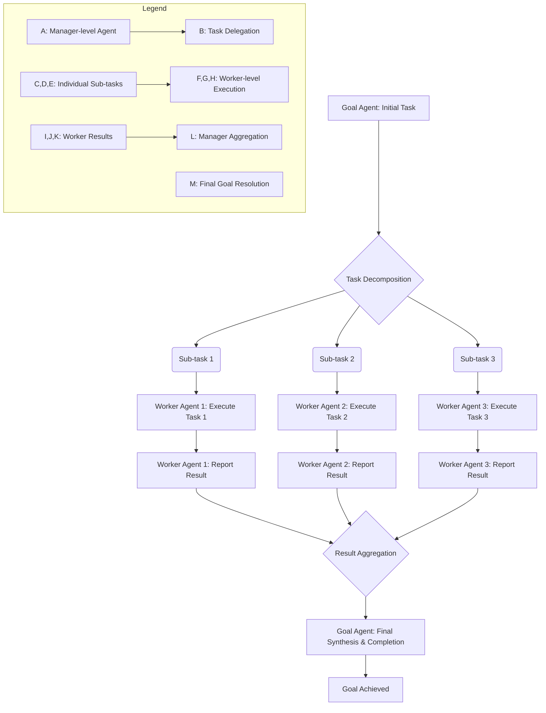

멀티 에이전트 시스템(Multi-Agent Systems, MAS)은 단일 에이전트로는 해결하기 어려운 복잡하고 역동적인 문제들을 해결하기 위해 여러 에이전트가 협력하는 분산형 시스템입니다. 최근 갭 분석(Gap Analysis)에서 최고 수준의 갭 스코어는 에이전트 시스템이 복잡한 실제 적용 사례에 대한 심층적인 필요성을 충족시키지 못하고 있음을 시사합니다. 이는 에이전트 간의 효율적이고 견고한 협업 패턴 디자인의 중요성을 강조합니다. 본 문서는 MAS의 핵심 협업 패턴과 2026년 트렌드를 반영한 디자인 전략, 그리고 실제 구현 시 고려사항을 제시합니다.

## 멀티 에이전트 협업의 중요성

복잡한 문제 영역에서 에이전트들이 개별적으로 최적의 의사결정을 하더라도, 전체 시스템의 목표 달성을 위해서는 체계적인 협업이 필수적입니다. 협업은 자원 공유, 작업 분할, 지식 통합, 충돌 해결 등의 형태로 나타납니다. 특히 대규모 언어 모델(LLM) 기반의 에이전트들이 등장하면서, 각 에이전트가 특정 전문성을 가지고 상호작용하며 복잡한 태스크를 수행하는 시나리오가 현실화되고 있습니다.

## 핵심 협업 패턴

멀티 에이전트 시스템의 협업은 다양한 패턴으로 디자인될 수 있으며, 문제의 성격과 시스템의 요구사항에 따라 적절한 패턴을 선택해야 합니다.

### 1. 매니저-워커 패턴 (Manager-Worker Pattern)

중앙의 매니저 에이전트가 전체 작업을 분해하고, 분해된 서브 태스크(Sub-task)를 워커 에이전트들에게 할당합니다. 워커 에이전트는 할당받은 태스크를 처리한 후 결과를 매니저에게 보고합니다. 이는 작업 분할 및 병렬 처리에 유리하며, 매니저가 전체 흐름을 제어하므로 시스템 제어가 용이합니다.

### 2. 피어-투-피어 패턴 (Peer-to-Peer Pattern)

모든 에이전트가 동등한 지위를 가지고 서로 직접 통신하며 협력하는 방식입니다. 중앙 집중식 제어가 없어 단일 실패 지점(Single Point of Failure)이 줄어들고, 유연성과 확장성이 높습니다. 그러나 복잡한 상호작용으로 인해 조정(Coordination) 및 충돌 해결이 어려울 수 있습니다.

### 3. 블랙보드 패턴 (Blackboard Pattern)

모든 에이전트가 접근 가능한 공유 데이터 공간(블랙보드)을 통해 간접적으로 협력하는 방식입니다. 각 에이전트는 블랙보드에 있는 정보를 모니터링하고, 자신의 전문성에 따라 정보를 추가하거나 수정합니다. 이는 지식 기반 시스템이나 부분적인 지식으로 전체 문제를 해결해야 하는 경우에 유용합니다.

### 4. 경매 기반 패턴 (Auction-Based Pattern)

매니저 또는 태스크를 가진 에이전트가 작업을 '경매'에 부치면, 워커 에이전트들이 해당 작업을 수행할 수 있는 능력과 비용을 고려하여 '입찰'합니다. 가장 적합한 에이전트에게 작업이 할당되는 방식으로, 자원 할당의 효율성을 높일 수 있습니다.

## 2026년 트렌드 반영 디자인 원칙

최신 에이전트 시스템은 단순히 정적인 패턴을 따르기보다는, 더욱 지능적이고 적응적인 협업을 요구합니다.

*   **동적 역할 할당 (Dynamic Role Assignment)**: 에이전트의 역할이 고정되지 않고, 시스템의 현재 상태나 태스크의 요구사항에 따라 유연하게 변경될 수 있어야 합니다. LLM의 능력을 활용하여 에이전트가 스스로 역할을 정의하고 전환하는 것이 가능해집니다.
*   **적응형 조정 메커니즘 (Adaptive Coordination Mechanisms)**: 시스템 환경 변화나 예기치 않은 상황 발생 시, 에이전트들이 자체적으로 협업 전략을 조정할 수 있는 메커니즘을 내장해야 합니다. 이는 메타-에이전트(Meta-Agent)의 감독이나 강화 학습(Reinforcement Learning)을 통해 구현될 수 있습니다.
*   **투명한 의사소통 및 설명 가능성 (Transparent Communication & Explainability)**: 에이전트 간의 모든 의사소통 및 의사결정 과정을 기록하고 추적할 수 있어야 합니다. 이는 디버깅, 감사, 그리고 인간-에이전트 협업에서 신뢰를 구축하는 데 필수적입니다. 특히 2026년에는 에이전트의 `rationale` (추론 과정) 저장 및 학습 시스템의 중요성이 더욱 강조됩니다.

## 협업 패턴 예제: 매니저-워커 시스템

다음 Python 코드는 간단한 매니저-워커 패턴 기반의 멀티 에이전트 시스템을 보여줍니다. `Coordinator`가 작업을 생성하고 `Agent`들에게 분배하며, `Agent`들은 작업을 처리한 후 결과를 보고합니다.

```python
import queue
import threading
import time

class Agent:
    def __init__(self, name, task_queue, result_queue):
        self.name = name
        self.task_queue = task_queue
        self.result_queue = result_queue
        self.stop_event = threading.Event()

    def run(self):
        print(f"{self.name} started.")
        while not self.stop_event.is_set():
            try:
                task = self.task_queue.get(timeout=1)
                if task is None: # Sentinel for shutdown
                    break
                print(f"{self.name} processing task: {task}")
                # Simulate work
                time.sleep(0.5)
                result = f"Result from {self.name} for {task}"
                self.result_queue.put(result)
                self.task_queue.task_done()
            except queue.Empty:
                continue
            except Exception as e:
                print(f"Error in {self.name}: {e}")
        print(f"{self.name} stopped.")

    def stop(self):
        self.stop_event.set()

class Coordinator:
    def __init__(self, num_agents):
        self.task_queue = queue.Queue()
        self.result_queue = queue.Queue()
        self.agents = []
        self.threads = []
        for i in range(num_agents):
            agent = Agent(f"Agent-{i+1}", self.task_queue, self.result_queue)
            self.agents.append(agent)
            thread = threading.Thread(target=agent.run)
            self.threads.append(thread)

    def start_system(self):
        for thread in self.threads:
            thread.start()
        print("All agents started.")

    def assign_task(self, task):
        self.task_queue.put(task)

    def collect_results(self, timeout=None):
        results = []
        try:
            while True:
                result = self.result_queue.get(timeout=timeout)
                results.append(result)
        except queue.Empty:
            pass
        return results

    def stop_system(self):
        for _ in self.agents:
            self.task_queue.put(None)
        self.task_queue.join() # Wait for all tasks to be done

        for agent in self.agents:
            agent.stop()
        for thread in self.threads:
            thread.join()
        print("All agents stopped.")

if __name__ == "__main__":
    coordinator = Coordinator(num_agents=3)
    coordinator.start_system()

    tasks = ["Analyze Data A", "Process Request B", "Generate Report C", "Validate Input D"]
    for task in tasks:
        coordinator.assign_task(task)
        time.sleep(0.1)

    coordinator.task_queue.join(timeout=10)

    print("\n--- Collecting Results ---")
    results = coordinator.collect_results(timeout=2)
    for res in results:
        print(res)

    coordinator.stop_system()
```

이 예제는 스레드와 큐를 사용하여 에이전트 간의 간단한 비동기 통신 및 태스크 처리를 구현합니다. 실제 시스템에서는 메시지 브로커(예: RabbitMQ, Kafka)를 사용하거나 분산 컴퓨팅 프레임워크(예: Ray, Dask)와 통합하여 확장성을 확보합니다.

## 협업 패턴 시각화: 매니저-워커 태스크 흐름

아래 Mermaid 다이어그램은 매니저-워커 패턴에서 태스크가 어떻게 분해되고 처리되는지 보여줍니다.



## 트레이드오프

멀티 에이전트 시스템 협업 패턴을 디자인할 때는 다양한 요소들을 고려하여 균형 잡힌 결정을 내려야 합니다.

*   **중앙 집중식 vs. 분산형 제어**: 중앙 집중식(예: 매니저-워커)은 초기 구현이 쉽고 제어가 명확하지만, 단일 실패 지점(SPOF)이 될 수 있고 확장성이 제한될 수 있습니다. 분산형(예: 피어-투-피어)은 SPOF를 피하고 확장성이 높으나, 복잡한 조정 및 충돌 해결 메커니즘이 필요합니다.  언제 좋은가: 중앙 집중식은 소규모/중요도가 높은 시스템에 적합하며, 분산형은 대규모/유연성이 요구되는 시스템에 적합합니다. 언제 나쁜가: 중앙 집중식은 고가용성(High Availability)이 필요한 대규모 시스템에 부적합하며, 분산형은 빠른 개발 및 디버깅이 필요한 초기 단계 시스템에 부적합합니다.
*   **명시적 vs. 암시적 커뮤니케이션**: 명시적 커뮤니케이션(메시지 패싱)은 에이전트 간의 상호작용이 투명하지만, 메시지 오버헤드가 발생할 수 있습니다. 암시적 커뮤니케이션(블랙보드)은 결합도(Coupling)를 낮추지만, 데이터 불일치나 변경 사항 감지 지연 문제가 발생할 수 있습니다. 언제 좋은가: 명시적 커뮤니케이션은 에이전트 간의 강한 의존성이 있을 때 좋으며, 암시적 커뮤니케이션은 유연한 데이터 공유가 필요할 때 좋습니다. 언제 나쁜가: 명시적 커뮤니케이션은 에이전트 수가 많아질수록 복잡도가 기하급수적으로 증가하며, 암시적 커뮤니케이션은 실시간 반응성이 중요한 시스템에 부적합합니다.
*   **정적 vs. 동적 역할/태스크 할당**: 정적 할당은 시스템 설계가 단순하고 예측 가능하지만, 환경 변화에 대한 적응력이 낮습니다. 동적 할당은 유연성과 효율성을 높이지만, 할당 알고리즘 및 오케스트레이션의 복잡성이 증가합니다. 언제 좋은가: 정적 할당은 안정적인 환경에서 성능 예측이 쉬울 때 좋으며, 동적 할당은 변화무쌍한 실제 환경에서 자원 활용을 최적화해야 할 때 좋습니다. 언제 나쁜가: 정적 할당은 시스템 부하가 급변하는 경우 비효율적이며, 동적 할당은 시스템 오버헤드와 디버깅 난이도가 높아질 수 있습니다.

## 실전 체크리스트

멀티 에이전트 시스템의 협업 패턴을 프로젝트에 적용할 때 다음 항목들을 검증하여 성공적인 구현을 보장해야 합니다.

- [ ]  **에이전트 역할 정의 명확성**: 각 에이전트의 책임(Responsibility)과 능력(Capability)이 명확하게 정의되었는가? (예: `Goal Agent`, `Task Decomposition Agent`, `Worker Agent` 등)
- [ ]  **통신 프로토콜 일관성**: 에이전트 간의 메시지 형식, 전달 방식, 오류 처리 규칙이 모든 에이전트에 걸쳐 일관되게 적용되었는가?
- [ ]  **조정 메커니즘 견고성**: 에이전트 간의 충돌(Conflict) 상황을 감지하고 해결하기 위한 자동화된 조정 메커니즘이 설계 및 구현되었는가?
- [ ]  **확장성 및 유연성 테스트**: 새로운 에이전트 추가, 태스크 증가 또는 에이전트 실패 시 시스템이 안정적으로 동작하며 성능 저하가 최소화되는지 확인하였는가?
- [ ]  **시스템 가시성(Observability)**: 에이전트의 내부 상태, 통신 내용, 의사결정 과정 등을 모니터링하고 추적할 수 있는 로깅 및 시각화 도구가 마련되었는가?
- [ ]  **보안 및 신뢰성 확보**: 에이전트 간의 통신 채널이 안전하게 보호되고, 악의적인 에이전트나 데이터 변조로부터 시스템을 보호하는 메커니즘이 포함되었는가?
- [ ]  **트레이드오프 분석 기반 패턴 선택**: 현재 프로젝트의 특성(규모, 중요도, 리소스)을 고려하여 중앙 집중식, 분산형 등 최적의 협업 패턴이 선택되었으며, 그 선택에 대한 명확한 근거가 존재하는가?
- [ ]  **LLM 연동 시 컨텍스트 관리**: LLM 기반 에이전트의 경우, 컨텍스트 윈도우(Context Window) 한계를 고려하여 효과적인 컨텍스트 압축, 요약, 메모리 관리 전략이 구현되었는가?