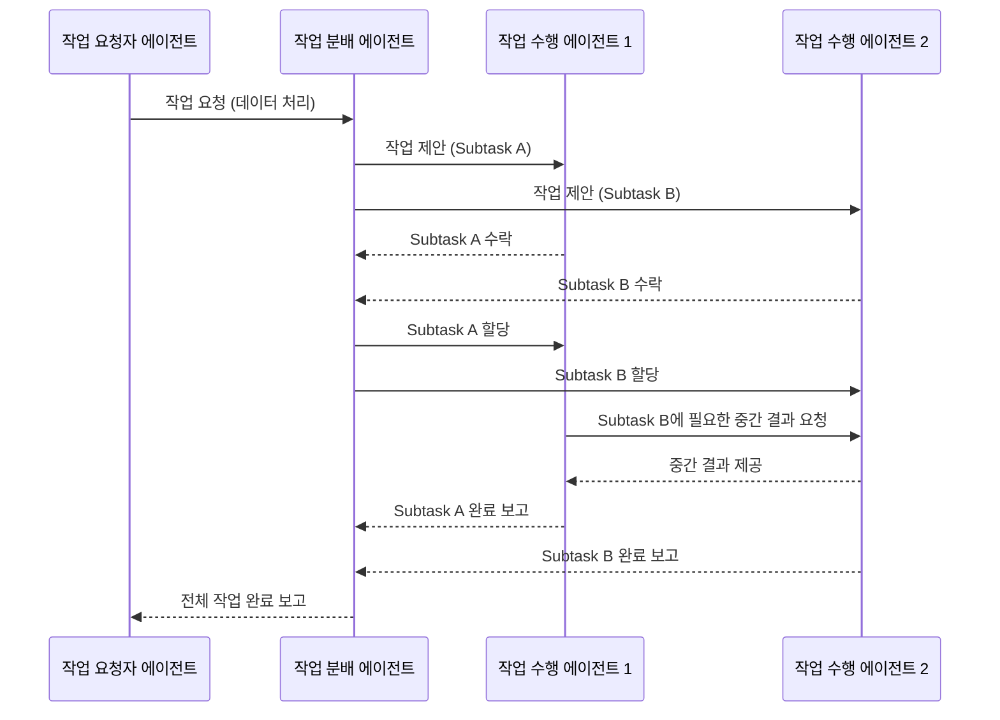

멀티 에이전트 시스템(Multi-Agent Systems, MAS)은 복잡한 실제 비즈니스 문제를 해결하기 위한 강력한 패러다임이다. 특히, 다양한 전문성을 가진 자율 에이전트들이 상호작용하며 목표를 달성하는 과정에서 효율적인 협업 프로토콜(Collaboration Protocol) 디자인은 시스템의 성공을 좌우하는 핵심 요소다. 갭 분석(Gap Analysis)을 통해 에이전트들이 개별적으로는 해결할 수 없는 문제를 협력을 통해 극복하도록 만드는 것이 목표다.

## 협업 프로토콜의 핵심 개념

협업 프로토콜은 에이전트들이 정보를 교환하고, 작업을 분배하며, 공동의 의사결정을 내리는 데 필요한 규칙과 절차를 정의한다. 이는 다음과 같은 요소로 구성된다.

### 1. 통신 프리미티브 (Communication Primitives)
에이전트 간 메시지 교환의 기본 단위와 형식을 지정한다.
*   **메시지 형식 (Message Format)**: 언어학적 구조와 의미론적 해석을 위한 표준이 필요하다. FIPA-ACL(Foundation for Intelligent Physical Agents - Agent Communication Language)은 행위 수행 발화(Performative)를 기반으로 정보 요청, 제안, 동의 등의 의미를 전달하는 표준으로 널리 사용된다.
*   **통신 채널 (Communication Channels)**: 메시지가 전달되는 경로. 직접 통신, 브로드캐스트, 메시지 큐(Message Queue), 공유 메모리 등 다양한 방식이 있다. 2026년에는 분산 원장 기술(Distributed Ledger Technology, DLT)을 활용한 안전하고 투명한 통신 채널이 중요해지고 있다.

### 2. 조정 메커니즘 (Coordination Mechanisms)
에이전트들이 공동 목표 달성을 위해 행동을 조율하는 방식이다.
*   **협상 (Negotiation)**: 에이전트들이 목표, 자원, 제약 조건을 두고 합의에 도달하는 과정. 경매(Auction), 계약 네트워크 프로토콜(Contract Net Protocol, CNP), 게임 이론(Game Theory) 기반 접근법 등이 사용된다.
*   **공동 계획 (Joint Planning)**: 여러 에이전트가 함께 목표 달성을 위한 일련의 행동을 계획하는 것. 분산 AI(Distributed AI) 및 병렬 태스크 오케스트레이션(Parallel Task Orchestration)이 중요하다.
*   **갈등 해결 (Conflict Resolution)**: 에이전트 간 목표, 자원 경합 또는 불일치가 발생했을 때 이를 해결하는 절차.

### 3. 역할 및 책임 (Roles and Responsibilities)
각 에이전트의 권한, 역할, 그리고 수행해야 할 태스크를 명확히 정의한다. 이는 에이전트 간의 중복 작업 방지 및 효율적인 자원 할당에 필수적이다.

## 프로토콜 디자인 원칙

*   **명확성 (Clarity)**: 프로토콜의 모든 규칙과 절차가 모호함 없이 명확해야 한다.
*   **강건성 (Robustness)**: 예외 상황, 에이전트 실패, 통신 오류 등에도 시스템이 안정적으로 동작해야 한다.
*   **확장성 (Scalability)**: 에이전트 수가 증가하거나 새로운 태스크가 추가되어도 시스템 성능이 저하되지 않아야 한다.
*   **보안 (Security)**: 통신 내용의 기밀성, 무결성, 가용성을 보장해야 한다.

## 2026년 최신 트렌드

### 1. LLM 기반 동적 프로토콜 생성 및 해석
거대 언어 모델(Large Language Models, LLM)은 자연어 기반의 협업을 가능하게 하며, 정형화된 프로토콜을 넘어서 상황에 따라 유연하게 커뮤니케이션 전략을 변경하거나 새로운 프로토콜을 즉석에서 생성하고 해석할 수 있는 능력을 제공한다. 이는 복잡하고 예측 불가능한 시나리오에 대한 에이전트 시스템의 적응력을 크게 향상시킨다.

### 2. 온톨로지 및 지식 그래프 통합
에이전트 간의 의미론적(Semantic) 이해를 높이기 위해 공유 온톨로지(Shared Ontology)와 지식 그래프(Knowledge Graph)가 적극적으로 활용된다. 이를 통해 에이전트들은 도메인 지식을 공유하고, 메시지의 문맥(Context)을 정확하게 파악하여 오해를 줄이고 효율적인 협업을 가능하게 한다.

### 3. 블록체인 및 분산 원장 기술 (DLT) 기반 협업
DLT는 에이전트 간의 트랜잭션(Transaction)과 합의(Consensus) 과정을 투명하고 불변하게 기록할 수 있어, 신뢰가 부족한 환경에서도 협업을 가능하게 한다. 스마트 계약(Smart Contracts)을 통해 협업 조건을 자동화하고 강제할 수 있으며, 이는 에이전트의 자율성과 시스템의 무결성을 동시에 보장한다.

## 코드 예시: 간단한 메시지 큐 기반 협업

다음 Python 예제는 두 에이전트가 메시지 큐를 통해 작업을 협상하는 매우 단순화된 시나리오를 보여준다. `AgentA`는 작업을 제안하고, `AgentB`는 이를 수락 또는 거부한다.

```python
import queue
import threading
import time

class Message:
    def __init__(self, sender, receiver, content, msg_type="inform"):
        self.sender = sender
        self.receiver = receiver
        self.content = content
        self.msg_type = msg_type # e.g., "propose", "accept", "reject"

    def __str__(self):
        return f"[{self.msg_type}] {self.sender} -> {self.receiver}: {self.content}"

class Agent:
    def __init__(self, name, message_queue):
        self.name = name
        self.message_queue = message_queue
        self.thread = threading.Thread(target=self.run)

    def send_message(self, receiver, content, msg_type="inform"):
        msg = Message(self.name, receiver, content, msg_type)
        self.message_queue.put(msg)
        print(f"Agent {self.name} sent: {msg}")

    def receive_message(self):
        # A simple non-blocking check for messages intended for this agent
        messages = []
        while not self.message_queue.empty():
            msg = self.message_queue.get_nowait()
            if msg.receiver == self.name:
                messages.append(msg)
            else:
                # Put back messages not for this agent, this is a very naive approach
                # In real systems, a dedicated inbox or routing is used.
                self.message_queue.put_nowait(msg) # This could lead to infinite loop if not careful
        return messages

    def handle_message(self, msg):
        print(f"Agent {self.name} received: {msg}")
        if msg.msg_type == "propose":
            if "task A" in msg.content:
                # Simulate decision logic
                if self.name == "AgentB":
                    if time.time() % 2 < 1: # Random decision
                        self.send_message(msg.sender, "Task A accepted.", "accept")
                    else:
                        self.send_message(msg.sender, "Task A rejected due to overload.", "reject")
            else:
                self.send_message(msg.sender, "Unknown proposal.", "inform")
        elif msg.msg_type == "accept":
            print(f"Agent {self.name}: Proposal accepted by {msg.sender}.")
        elif msg.msg_type == "reject":
            print(f"Agent {self.name}: Proposal rejected by {msg.sender}.")

    def run(self):
        print(f"Agent {self.name} started.")
        for i in range(3): # Simulate limited active time
            messages = self.receive_message()
            for msg in messages:
                self.handle_message(msg)
            time.sleep(1) # Simulate some work or waiting

        print(f"Agent {self.name} finished.")


if __name__ == "__main__":
    shared_queue = queue.Queue()

    agent_a = Agent("AgentA", shared_queue)
    agent_b = Agent("AgentB", shared_queue)

    agent_a.thread.start()
    agent_b.thread.start()

    # Initial interaction
    agent_a.send_message("AgentB", "Can you handle task A?", "propose")
    # Give some time for messages to be processed
    time.sleep(5)

    agent_a.thread.join()
    agent_b.thread.join()

    print("Simulation finished.")
```

## 에이전트 협업 워크플로우 예시 (Mermaid)



## 트레이드오프

*   **프로토콜의 복잡성 vs. 유연성**:
    *   **언제 좋고**: 단순하고 표준화된 프로토콜은 에이전트 구현 및 디버깅을 용이하게 한다. 확장성이 좋고 예측 가능한 환경에 적합하다.
    *   **언제 나쁜지**: 복잡하고 동적인 환경에서는 사전 정의된 단순 프로토콜이 에이전트의 적응성과 문제 해결 능력을 제한할 수 있다. LLM 기반의 동적 프로토콜은 이러한 한계를 극복하나, 시스템의 복잡도가 증가한다.
*   **중앙 집중식 조정 vs. 분산형 조정**:
    *   **언제 좋고**: 중앙 집중식 조정(예: Coordinator Agent)은 초기 설계가 용이하고 전역 최적화(Global Optimization)에 유리하다. 소규모 또는 관리 용이성이 중요한 시스템에 적합하다.
    *   **언제 나쁜지**: 단일 실패 지점(Single Point of Failure)이 될 수 있으며, 확장성과 강건성(Robustness)이 떨어진다. 대규모 분산 시스템에서는 병목 현상과 통신 오버헤드가 발생한다.
*   **메시지 오버헤드 vs. 의미론적 풍부함**:
    *   **언제 좋고**: 메시지 내용이 풍부하고 의미론적으로 상세할수록 에이전트의 이해도가 높아져 협업의 질이 향상된다. 특히 복잡한 도메인에서 오해를 줄이는 데 좋다.
    *   **언제 나쁜지**: 메시지 크기가 커지고 처리 시간이 길어져 통신 오버헤드가 증가한다. 대량의 실시간 데이터 처리에는 비효율적일 수 있다.
*   **표준 프로토콜 사용 vs. 맞춤형 프로토콜 개발**:
    *   **언제 좋고**: FIPA-ACL 같은 표준 프로토콜은 상호운용성(Interoperability)을 높이고 개발 시간을 단축한다. 커뮤니티 지원과 검증된 패턴을 활용할 수 있다.
    *   **언제 나쁜지**: 특정 도메인이나 시스템의 고유한 요구사항을 완벽하게 충족하지 못할 수 있다. 오버헤드가 발생하거나 불필요한 복잡성을 초래할 수 있다.
*   **자동화된 협상 vs. 인간 개입**:
    *   **언제 좋고**: 완전히 자동화된 협상 프로토콜은 속도와 효율성을 극대화하여 대규모 태스크를 빠르게 처리한다. 비용 절감 및 24/7 운영에 유리하다.
    *   **언제 나쁜지**: 윤리적 문제, 고위험 의사결정, 예측 불가능한 상황에서는 인간의 감독이나 개입이 필수적이다. 투명성(Transparency)과 설명 가능성(Explainability)이 낮은 경우 문제 발생 시 책임 소재가 불분명해진다.

## 실전 체크리스트

*   [ ] **에이전트 역할 정의 명확성**: 각 에이전트의 기능, 책임, 권한이 명확히 정의되었는가? (예: `agents/multi-agent-role-collaboration-design-patterns`)
*   [ ] **메시지 형식 표준화**: 모든 에이전트가 이해할 수 있는 공통된 메시지 형식(예: JSON, Protobuf, FIPA-ACL 기반)을 사용하는가?
*   [ ] **통신 채널의 강건성**: 메시지 손실, 지연, 순서 오류를 처리할 수 있는 메커니즘이 포함되었는가? (예: 재시도, 타임아웃, 메시지 큐)
*   [ ] **갈등 및 오류 해결 전략**: 에이전트 간 충돌 또는 태스크 실패 시 이를 감지하고 해결하기 위한 프로토콜(예: 재협상, 대체 에이전트 할당)이 설계되었는가?
*   [ ] **성능 및 확장성 테스트**: 에이전트 수가 증가하거나 작업량이 많아질 때 시스템의 응답 시간과 처리량이 목표치를 만족하는가? (예: 부하 테스트 수행)
*   [ ] **보안 프로토콜 적용**: 에이전트 통신에 인증, 인가, 암호화 등의 보안 메커니즘이 적용되었는가? (예: TLS, JWT)
*   [ ] **프로토콜의 설명 가능성**: 에이전트가 특정 결정을 내리거나 협업 과정에서 발생하는 주요 이벤트를 추적하고 설명할 수 있는가? (XAI 통합 여부)