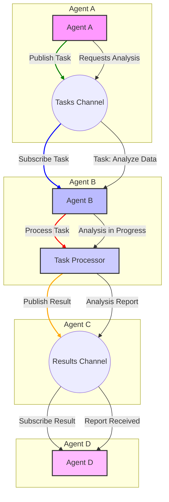

멀티 에이전트 시스템(Multi-Agent Systems, MAS)은 복잡하고 동적인 환경에서 단일 에이전트의 한계를 극복하기 위해 여러 AI 에이전트가 협력하여 목표를 달성하는 고도화된 아키텍처입니다. 이러한 시스템의 핵심은 에이전트 간의 효율적인 상호작용과 조정을 가능하게 하는 견고한 통신 프로토콜 및 협업 메커니즘 설계에 있습니다. 2026년 현재, LLM 기반 에이전트의 발전과 함께 MAS의 중요성은 더욱 부각되고 있으며, 단순한 정보 교환을 넘어 전략적 협력과 자율적인 문제 해결 능력이 요구됩니다.

## 멀티 에이전트 시스템 통신 프로토콜의 중요성

AI 에이전트들이 각자의 전문성을 가지고 독립적으로 작동하면서도, 공동의 목표를 향해 시너지를 내기 위해서는 명확하고 효율적인 통신 규칙이 필수적입니다. 통신 프로토콜은 에이전트들이 정보를 교환하고, 작업을 분배하며, 충돌을 해결하는 기반을 제공합니다. 이는 시스템 전체의 안정성, 확장성, 그리고 최종적으로 성능에 직접적인 영향을 미칩니다.

### 핵심 프로토콜 설계 고려사항

1.  **메시지 구조 (Message Structure)**: 에이전트 간 교환되는 정보의 형식과 내용. FIPA ACL (Foundation for Intelligent Physical Agents Agent Communication Language)과 같은 표준화된 언어는 Performative (행위 유형), Sender, Receiver, Content, Language, Ontology 등 구조화된 메시지 필드를 제공하여 의미론적 상호운용성(Semantic Interoperability)을 높입니다.
2.  **통신 채널 (Communication Channels)**: 에이전트들이 메시지를 주고받는 방식. 직접적인 P2P 통신, 중앙 집중식 메시지 브로커(Message Broker) (예: Kafka, RabbitMQ), 또는 공유 메모리(Shared Memory)나 블랙보드(Blackboard) 시스템을 활용할 수 있습니다. 각 방식은 시스템의 확장성, 지연 시간(Latency), 그리고 장애 허용성(Fault Tolerance)에 영향을 미칩니다.
3.  **조정 메커니즘 (Coordination Mechanisms)**: 에이전트들이 공동 목표 달성을 위해 행동을 조율하는 전략.
    *   **계획 기반 조정 (Plan-Based Coordination)**: 사전에 정의된 공유 계획에 따라 에이전트들이 역할을 수행합니다.
    *   **협상 (Negotiation) 및 경매 (Auction)**: 자원 할당이나 작업 분배 시 에이전트 간 합의 도출.
    *   **Emergent Coordination**: 명시적인 조정 없이도 개별 에이전트의 자율적 행동이 전체 시스템에 유익한 결과를 도출하는 방식 (예: 스웜 인텔리전스).
    *   **LLM 기반 조정**: 최신 트렌드에서는 대규모 언어 모델(LLM)이 에이전트 간의 복잡한 대화와 협상을 중재하고, 동적으로 조정 전략을 생성하여 적응력을 높이는 데 활용됩니다.

## 통신 프로토콜 예시: Redis Pub/Sub을 활용한 비동기 통신

실제 환경에서는 메시지 큐(Message Queue) 시스템을 활용하여 에이전트 간의 비동기 통신을 구현하는 경우가 많습니다. 이는 에이전트들이 독립적으로 메시지를 발행(Publish)하고 구독(Subscribe)하여 결합도를 낮추고 확장성을 높이는 데 기여합니다. 다음은 Redis Pub/Sub을 사용한 간단한 Python 예제입니다.

```python
import redis
import json
import threading
import time

class Agent:
    def __init__(self, agent_id, redis_client):
        self.agent_id = agent_id
        self.redis_client = redis_client
        self.pubsub = self.redis_client.pubsub()
        print(f"Agent {self.agent_id} initialized.")

    def subscribe_to_channel(self, channel):
        self.pubsub.subscribe(channel)
        print(f"Agent {self.agent_id} subscribed to {channel}.")
        threading.Thread(target=self._listen_for_messages, daemon=True).start()

    def _listen_for_messages(self):
        for message in self.pubsub.listen():
            if message['type'] == 'message':
                data = json.loads(message['data'].decode('utf-8'))
                print(f"Agent {self.agent_id} received from {data['sender']} on {message['channel'].decode('utf-8')}: {data['content']}")
                self.process_message(data)

    def publish_message(self, channel, content):
        message = {
            "sender": self.agent_id,
            "content": content,
            "timestamp": time.time()
        }
        self.redis_client.publish(channel, json.dumps(message))
        print(f"Agent {self.agent_id} published to {channel}: {content}")

    def process_message(self, data):
        # 메시지 내용에 따라 에이전트의 로직 수행
        if "task_request" in data['content']:
            print(f"Agent {self.agent_id} processing task: {data['content']['task_request']}")
            # Simulate work
            time.sleep(0.5)
            self.publish_message("results_channel", {"task_response": f"Task {data['content']['task_request']} completed by {self.agent_id}"})

if __name__ == "__main__":
    # Redis 클라이언트 초기화 (실제 Redis 서버가 실행 중이어야 합니다)
    # docker run --name some-redis -p 6379:6379 -d redis
    r = redis.Redis(host='localhost', port=6379, db=0)

    # 에이전트 생성
    agent1 = Agent("Agent-A", r)
    agent2 = Agent("Agent-B", r)
    agent3 = Agent("Agent-C", r)

    # 에이전트들은 'tasks_channel'에서 작업을 받고, 'results_channel'에 결과를 발행
    agent1.subscribe_to_channel("tasks_channel")
    agent2.subscribe_to_channel("tasks_channel")
    agent3.subscribe_to_channel("results_channel")

    time.sleep(1) # 구독이 완료될 시간을 줌

    # Agent-A가 작업을 요청
    agent1.publish_message("tasks_channel", {"task_request": "Analyze Data"})
    time.sleep(0.1)
    agent1.publish_message("tasks_channel", {"task_request": "Generate Report"})
    time.sleep(0.1)
    agent1.publish_message("tasks_channel", {"task_request": "Update Database"})

    time.sleep(5) # 메시지 처리 및 결과 수신 대기
    print("Simulation finished.")
    r.close()
```

이 예시에서는 `tasks_channel`이라는 공유 채널을 통해 에이전트들이 작업을 받아 처리하고, `results_channel`을 통해 결과를 공유합니다. 이는 느슨하게 결합된(Loosely Coupled) 에이전트 협업의 기본을 보여줍니다.

## 멀티 에이전트 통신 아키텍처 (2026 트렌드)

2026년에는 멀티 에이전트 통신 프로토콜 디자인에서 다음과 같은 트렌드가 두드러집니다.

*   **LLM 기반 동적 프로토콜 (LLM-driven Dynamic Protocols)**: 고정된 프로토콜 대신, LLM이 에이전트의 현재 상태, 목표, 그리고 환경에 따라 최적의 통신 전략이나 메시지 형식을 동적으로 결정하고 생성하는 방식이 중요해지고 있습니다. 이는 복잡하고 예측 불가능한 시나리오에서 에이전트 시스템의 유연성(Flexibility)과 적응성(Adaptability)을 극대화합니다.
*   **보안 및 신뢰성 (Security & Trustworthiness)**: 에이전트 간 통신의 무결성(Integrity), 기밀성(Confidentiality), 그리고 인증(Authentication)은 필수적입니다. 블록체인 기반의 분산 신뢰 시스템(Distributed Trust Systems)이나 영지식 증명(Zero-Knowledge Proofs)과 같은 기술이 에이전트 상호작용의 보안을 강화하는 데 탐색되고 있습니다.
*   **분산형 및 자율 네트워크 (Decentralized & Autonomous Networks)**: 중앙 집중식 메시지 브로커의 단일 장애점(Single Point of Failure) 문제를 해결하고, 에이전트 시스템의 레질리언스(Resilience)를 높이기 위해 IPFS(InterPlanetary File System)와 같은 분산 파일 시스템이나 자율적인 P2P 네트워크 구조가 강조됩니다.
*   **의미론적 상호운용성 강화 (Enhanced Semantic Interoperability)**: 온톨로지(Ontology)와 지식 그래프(Knowledge Graph)를 활용하여 에이전트들이 교환하는 정보의 의미를 명확히 하고, 서로 다른 도메인이나 언어를 사용하는 에이전트 간에도 심층적인 이해를 기반으로 협력할 수 있도록 지원합니다.



## 트레이드오프

멀티 에이전트 시스템의 통신 프로토콜을 설계할 때는 다양한 트레이드오프를 고려해야 합니다.

*   **중앙 집중식 vs. 분산형 통신 (Centralized vs. Decentralized Communication)**
    *   **중앙 집중식 (예: 메시지 브로커)**:
        *   **언제 좋은가**: 시스템 규모가 중간 정도이고, 통신 흐름에 대한 중앙 집중적 제어 및 모니터링이 필요한 경우. 구현이 간단하고, 에이전트의 연결 관리가 용이합니다.
        *   **언제 나쁜가**: 고도로 분산된 대규모 시스템이나 단일 장애점(Single Point of Failure)이 치명적인 시스템. 브로커의 병목 현상(Bottleneck)이 발생할 수 있습니다.
    *   **분산형 (예: P2P, 블록체인)**:
        *   **언제 좋은가**: 높은 확장성, 장애 허용성, 검열 저항성(Censorship Resistance)이 필요한 대규모 분산 시스템. 중앙 제어가 불가능하거나 바람직하지 않은 경우.
        *   **언제 나쁜가**: 초기 구현 복잡성이 높고, 에이전트 발견(Agent Discovery) 및 네트워크 관리 오버헤드가 크며, 메시지 전달의 신뢰성과 순서 보장이 어려울 수 있습니다.
*   **동기식 vs. 비동기식 통신 (Synchronous vs. Asynchronous Communication)**
    *   **동기식 (예: RPC)**:
        *   **언제 좋은가**: 즉각적인 응답이 필요하고, 요청-응답 패턴이 명확한 경우. 작업 흐름을 예측하기 쉽습니다.
        *   **언제 나쁜가**: 높은 대기 시간(Latency)이 발생할 수 있으며, 호출 에이전트가 응답을 기다리는 동안 블로킹(Blocking)되어 시스템 전체의 처리량(Throughput)이 저하될 수 있습니다.
    *   **비동기식 (예: 메시지 큐)**:
        *   **언제 좋은가**: 높은 처리량, 낮은 결합도, 그리고 장시간이 소요되는 작업에 적합. 에이전트 간의 독립성을 높여 시스템 확장성을 향상시킵니다.
        *   **언제 나쁜가**: 메시지 순서 보장, 오류 처리, 그리고 전체 작업 흐름 추적(End-to-End Tracing)이 더 복잡해질 수 있습니다.
*   **명시적 vs. 묵시적 조정 (Explicit vs. Implicit Coordination)**
    *   **명시적 (예: 공유 계획, 경매)**:
        *   **언제 좋은가**: 복잡한 작업 분배, 자원 충돌 해결, 그리고 명확한 역할 정의가 필요한 경우. 시스템 동작을 예측하고 디버깅하기 용이합니다.
        *   **언제 나쁜가**: 환경 변화에 대한 유연성이 떨어지고, 중앙 조정자의 병목 현상이 발생할 수 있습니다. 설계 초기 비용이 높습니다.
    *   **묵시적 (예: 스웜 인텔리전스, 환경 변화 감지)**:
        *   **언제 좋은가**: 동적인 환경 변화에 대한 높은 적응성, 그리고 개별 에이전트의 단순한 규칙으로 복잡한 전체 시스템 행동이 나타나는 경우.
        *   **언제 나쁜가**: 시스템 동작을 예측하기 어렵고, 특정 목표 달성보다는 전반적인 최적화에 더 적합합니다. 디버깅이 어려울 수 있습니다.

## 실전 체크리스트

프로젝트에 멀티 에이전트 시스템 통신 프로토콜을 적용할 때 다음 항목들을 검증합니다.

- [ ] **에이전트 역할 및 책임 명확화**: 각 에이전트의 주요 역할(Role)과 책임(Responsibility)이 명확히 정의되어 있으며, 이들이 통신 프로토콜 설계에 반영되었는가?
- [ ] **메시지 스키마 정의**: 에이전트 간 교환되는 모든 메시지에 대해 명확하고 일관된 데이터 스키마(Data Schema)가 JSON Schema 또는 Protocol Buffers 등으로 정의되어 있으며, 버전 관리(Versioning)되고 있는가?
- [ ] **통신 채널 선택의 합리성**: 시스템의 확장성, 지연 시간, 장애 허용성 요구사항을 고려하여 Redis Pub/Sub, Kafka, RPC 등 적절한 통신 채널이 선택되었는가?
- [ ] **오류 처리 및 재시도 전략**: 메시지 전송 실패, 에이전트 응답 없음 등 통신 관련 오류에 대한 강력한 처리 로직과 재시도(Retry) 전략이 구현되어 있는가? 데드 레터 큐(Dead Letter Queue) 사용 여부도 확인한다.
- [ ] **보안 프로토콜 적용**: 에이전트 통신 채널에 대한 인증(Authentication), 인가(Authorization), 암호화(Encryption) 등의 보안 메커니즘이 적용되어 민감 정보 노출 위험을 최소화하는가?
- [ ] **성능 및 확장성 테스트**: 에이전트 수가 증가하거나 메시지 트래픽이 급증할 때 통신 프로토콜이 성능 저하 없이 확장될 수 있는지 부하 테스트(Load Test) 및 스트레스 테스트(Stress Test)를 수행했는가?
- [ ] **모니터링 및 로깅**: 에이전트 간의 모든 통신 활동(메시지 전송/수신, 오류 등)이 중앙 집중식으로 로깅(Logging)되고 모니터링되어 시스템의 건전성(Health)을 실시간으로 파악할 수 있는가?