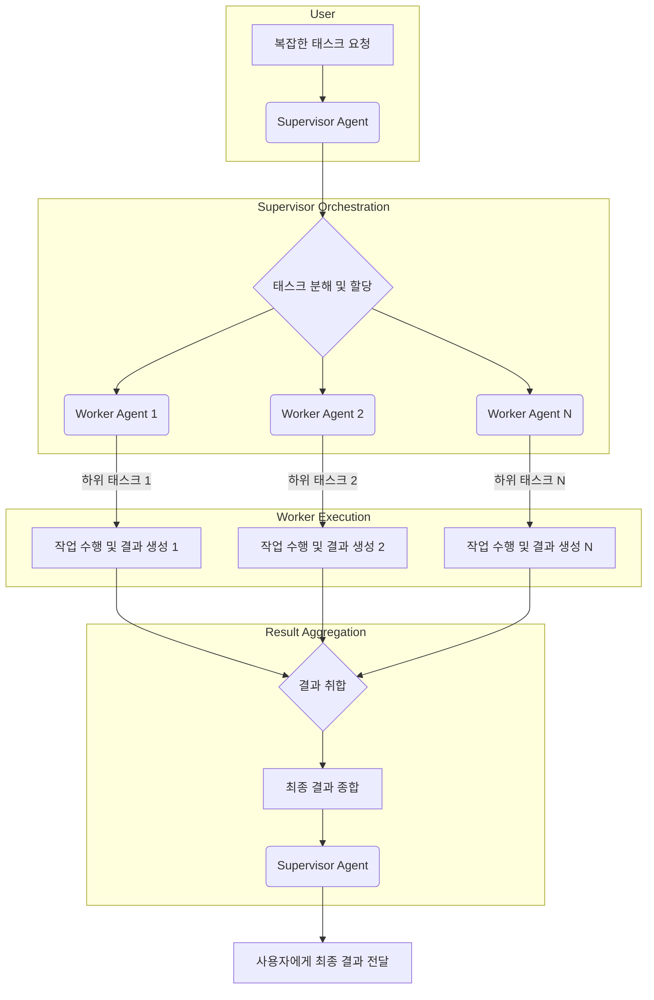

다중 에이전트 협업 시스템 (Multi-Agent Collaboration System)은 복잡한 태스크를 해결하기 위해 여러 AI 에이전트가 효과적으로 상호작용하는 방법을 제공하는 핵심적인 설계 패러다임입니다. 단일 에이전트로는 처리하기 어려운 문제를 분해하고, 각 에이전트가 특정 전문성을 가지고 협력함으로써 전체 시스템의 효율성, 견고성, 확장성을 높일 수 있습니다. 특히 2026년에는 AI 시스템이 더욱 복잡한 현실 세계 문제에 직면함에 따라, 다중 에이전트 시스템은 자율성과 협업 능력을 동시에 요구하는 시나리오에서 필수적인 아키텍처로 자리 잡고 있습니다.

## 핵심 설계 패턴 (Core Design Patterns)

다중 에이전트 시스템의 협업을 설계할 때 고려할 수 있는 몇 가지 핵심 패턴이 있습니다.

### 1. 감독자-작업자 패턴 (Supervisor-Worker Pattern)
중앙 감독자(Supervisor) 에이전트가 전체 태스크를 하위 태스크로 분해하고, 이를 여러 작업자(Worker) 에이전트에게 할당하며 진행 상황을 모니터링하는 방식입니다. 작업자는 할당된 특정 하위 태스크를 수행하고 결과를 감독자에게 보고합니다.

*   **장점**: 중앙 집중식 제어로 태스크 흐름 제어가 용이하며, 작업자 에이전트의 복잡도를 낮출 수 있습니다.
*   **단점**: 감독자 에이전트가 병목 현상이나 단일 실패 지점(Single Point of Failure)이 될 수 있습니다.

### 2. 블랙보드 패턴 (Blackboard Pattern)
모든 에이전트가 접근할 수 있는 공유된 지식 공간(Blackboard)을 사용하는 패턴입니다. 각 에이전트는 블랙보드에 있는 정보를 읽고, 자신의 전문 지식을 활용하여 새로운 정보를 추가하거나 기존 정보를 업데이트합니다. 태스크 해결은 블랙보드의 상태 변화에 따라 점진적으로 이루어집니다.

*   **장점**: 높은 유연성과 확장성을 제공하며, 에이전트 간 직접적인 통신 없이도 느슨한 결합(Loose Coupling)을 유지할 수 있습니다.
*   **단점**: 블랙보드의 일관성 유지와 충돌 해결 메커니즘이 복잡해질 수 있으며, 에이전트 간 협력 시점이 불확실할 수 있습니다.

### 3. 컨덕터-오케스트레이터 패턴 (Conductor-Orchestrator Pattern)
감독자-작업자 패턴과 유사하지만, 오케스트레이터가 단순히 태스크를 할당하는 것을 넘어, 에이전트 간의 복잡한 상호작용 흐름과 의존성을 관리하는 데 더 중점을 둡니다. 오케스트레이터는 워크플로우를 정의하고, 각 단계에서 필요한 에이전트를 동적으로 선택하여 조율합니다.

*   **장점**: 복잡한 워크플로우를 체계적으로 관리하고, 에이전트의 동적 재구성을 지원합니다.
*   **단점**: 오케스트레이터의 설계가 복잡해지며, 특정 도메인에 종속될 수 있습니다.

### 4. 분산/스와프 패턴 (Decentralized/Swarm Pattern)
중앙 제어 없이 에이전트들이 직접 상호작용하며 문제를 해결하는 방식입니다. 각 에이전트는 지역적인 규칙에 따라 행동하고, 이러한 지역적 상호작용을 통해 전체 시스템 수준에서 복잡한 행동이나 해결책이 Emergence(창발)됩니다.

*   **장점**: 단일 실패 지점이 없고, 높은 확장성과 내고장성(Fault Tolerance)을 가집니다.
*   **단점**: 시스템의 행동을 예측하기 어렵고, 전역적인 최적화가 어려울 수 있습니다.

## 다중 에이전트 협업 시스템 예시 (Example: Multi-Agent Collaboration)

다음은 간단한 `Supervisor-Worker` 패턴을 모방한 파이썬 코드 예제입니다. 감독자 에이전트가 작업자 에이전트에게 특정 작업을 할당하고 결과를 집계합니다.

```python
import time
import random

class WorkerAgent:
    def __init__(self, agent_id, specialty):
        self.agent_id = agent_id
        self.specialty = specialty
        print(f"Worker {self.agent_id} initialized with specialty: {self.specialty}")

    def perform_task(self, task_description):
        print(f"Worker {self.agent_id} ({self.specialty}) is processing: {task_description}")
        time.sleep(random.uniform(0.5, 2.0)) # Simulate work
        result = f"Result from {self.agent_id} for '{task_description}': Task completed successfully."
        print(f"Worker {self.agent_id} completed task.")
        return result

class SupervisorAgent:
    def __init__(self, workers):
        self.workers = {worker.agent_id: worker for worker in workers}
        print("Supervisor Agent initialized.")

    def assign_and_monitor_tasks(self, tasks):
        results = {}
        for task_id, task_description in tasks.items():
            worker_id = random.choice(list(self.workers.keys())) # Simple assignment
            print(f"Supervisor assigning task '{task_description}' to Worker {worker_id}")
            worker_result = self.workers[worker_id].perform_task(task_description)
            results[task_id] = worker_result
            print(f"Supervisor received result for '{task_id}'.")
        return results

if __name__ == "__main__":
    # Initialize worker agents
    worker1 = WorkerAgent("W1", "Data Analysis")
    worker2 = WorkerAgent("W2", "Code Generation")
    worker3 = WorkerAgent("W3", "Documentation")

    # Initialize supervisor agent with workers
    supervisor = SupervisorAgent([worker1, worker2, worker3])

    # Define tasks
    project_tasks = {
        "task_A": "Analyze customer feedback data",
        "task_B": "Generate Python function for API call",
        "task_C": "Draft project documentation outline",
        "task_D": "Summarize market research report"
    }

    # Supervisor assigns and monitors tasks
    final_results = supervisor.assign_and_monitor_tasks(project_tasks)
    print("\n--- Final Project Results ---")
    for task_id, result in final_results.items():
        print(f"{task_id}: {result}")
```

## 다중 에이전트 상호작용 다이어그램 (Multi-Agent Interaction Diagram)

Mermaid 다이어그램을 통해 감독자-작업자 패턴의 일반적인 흐름을 시각화할 수 있습니다.



## 트레이드오프 (Trade-offs)

다중 에이전트 협업 시스템을 설계할 때 고려해야 할 중요한 트레이드오프는 다음과 같습니다.

*   **중앙 집중식 제어 vs. 분산형 제어**:
    *   **언제 좋고**: 태스크의 순차적 의존성이 강하고, 전역적인 최적화가 중요하며, 시스템의 복잡도가 초기에는 낮은 경우(감독자-작업자 패턴 등)에 유리합니다. 시스템의 행동 예측 및 디버깅이 용이합니다.
    *   **언제 나쁜지**: 시스템 규모가 매우 크고, 내고장성이 중요하며, 태스크가 독립적이거나 창발적인(Emergent) 해결책이 필요한 경우(분산/스와프 패턴 등)에는 중앙 집중식 제어가 병목 현상과 단일 실패 지점을 야기하여 확장성을 저해할 수 있습니다.

*   **통신 오버헤드 vs. 정보 공유의 정확성**:
    *   **언제 좋고**: 에이전트 간 정교하고 정확한 정보 공유가 필수적이며, 태스크 해결을 위한 풍부한 컨텍스트(Context)가 요구될 때 통신 프로토콜을 정밀하게 설계하는 것이 좋습니다. 이를 통해 오류를 줄이고 결과 품질을 높일 수 있습니다.
    *   **언제 나쁜지**: 에이전트 수가 많고, 실시간 상호작용이 잦으며, 각 에이전트의 역할이 비교적 단순할 때는 과도한 통신 프로토콜 설계가 시스템 성능을 저하시키고 개발 복잡도를 증가시킬 수 있습니다.

*   **초기 설계 복잡도 vs. 장기적 유지보수 용이성**:
    *   **언제 좋고**: 시스템의 수명이 길고, 요구사항이 자주 변경될 가능성이 있으며, 새로운 에이전트 추가나 기존 에이전트 수정이 빈번할 것으로 예상될 때, 모듈화되고 유연한 아키텍처(블랙보드 패턴, 오케스트레이터 패턴)를 초기에 투자하여 장기적인 유지보수 비용을 절감할 수 있습니다.
    *   **언제 나쁜지**: 단기 프로젝트이거나, 태스크 범위가 명확하고 변경 가능성이 낮은 경우에는 초기 설계 복잡도를 낮추고 단순한 구조를 채택하여 빠르게 개발하는 것이 더 효율적일 수 있습니다.

## 실전 체크리스트 (Practical Checklist)

다중 에이전트 협업 시스템을 프로젝트에 적용할 때 다음 항목들을 검증하십시오.

*   [ ] **에이전트 역할 및 책임 명확화**: 각 에이전트의 전문 분야와 책임 범위가 명확하게 정의되어 있으며, 중복되거나 누락된 기능이 없는가?
*   [ ] **통신 프로토콜 설계**: 에이전트 간 메시지 형식, 데이터 교환 방식(동기/비동기), 오류 처리 메커니즘이 명확하게 정의되고 구현되었는가? (예: REST API, 메시지 큐, 공유 메모리)
*   [ ] **협업 워크플로우 정의**: 복잡한 태스크를 해결하기 위한 에이전트 간 상호작용 순서와 조건, 태스크 분해 및 통합 전략이 명시적으로 문서화되어 있는가?
*   [ ] **충돌 해결 및 조정 메커니즘**: 에이전트 간 의견 불일치, 자원 경합, 상호 배타적 행동 발생 시 이를 감지하고 해결하기 위한 전략(예: 투표, 경매, 중앙 조정자)이 마련되어 있는가?
*   [ ] **확장성 및 내고장성 고려**: 에이전트 수가 증가할 경우 시스템 성능이 저하되지 않도록 설계되었으며, 일부 에이전트의 실패가 전체 시스템에 치명적인 영향을 미 미치지 않도록 방어 로직이 구현되었는가?
*   [ ] **모니터링 및 로깅 시스템**: 각 에이전트의 실행 상태, 태스크 처리 현황, 통신 내역 등을 실시간으로 모니터링하고 분석할 수 있는 로깅 및 시각화 도구가 구축되어 있는가?
*   [ ] **보안 및 접근 제어**: 에이전트 간 통신 및 공유 자원에 대한 접근 제어, 데이터 암호화 등 보안 취약점을 방지하기 위한 조치가 충분히 고려되었는가?