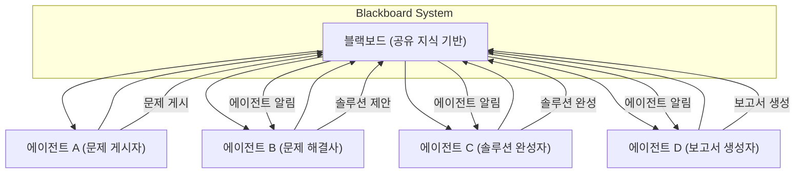

멀티 에이전트 시스템(Multi-Agent System, MAS)은 개별 에이전트들이 상호작용하며 복잡한 문제를 해결하는 분산형 시스템입니다. 2026년 현재, LLM(Large Language Model) 기반 에이전트의 발전으로 그 복잡성과 잠재력은 더욱 커졌습니다. 그러나 에이전트 간의 효율적인 협업을 위해서는 명확하고 견고한 의사결정 조정 패턴 디자인이 필수적입니다. 조정 없는 에이전트의 자율적 행동은 비효율성, 자원 충돌, 목표 불일치로 이어질 수 있습니다.

## 멀티 에이전트 의사결정 조정의 중요성

에이전트들이 고유한 목표와 능력을 가지고 자율적으로 작동하는 환경에서, 전체 시스템의 일관된 목표 달성을 위해서는 의사결정 조정 메커니즘이 중요합니다. 이는 다음과 같은 이점을 제공합니다:

*   **효율성 증대**: 중복 작업 제거 및 자원 할당 최적화.
*   **충돌 해결**: 에이전트 간의 목표 또는 행동 충돌을 감지하고 해결.
*   **강건성(Robustness)**: 일부 에이전트의 실패에도 불구하고 시스템의 전반적인 기능 유지.
*   **확장성**: 에이전트 수가 증가함에 따라 시스템 성능을 유지할 수 있는 능력.
*   **긴급 행동(Emergent Behavior) 관리**: 예상치 못한 시스템 행동을 통제하고 활용.

## 주요 의사결정 조정 패턴

### 1. 중앙 집중식 오케스트레이터 패턴 (Centralized Orchestrator Pattern)

단일 에이전트(오케스트레이터)가 전체 시스템의 의사결정과 태스크 할당을 총괄합니다. 다른 에이전트들은 오케스트레이터의 지시를 받아 작업을 수행하고 결과를 보고합니다. 이는 소규모 또는 고도로 통제된 환경에서 구현이 단순하고 예측 가능성이 높다는 장점이 있습니다.

### 2. 분산형 블랙보드 패턴 (Distributed Blackboard Pattern)

모든 에이전트가 접근하고 수정할 수 있는 공유 데이터 저장소(블랙보드)를 활용합니다. 각 에이전트는 블랙보드의 상태를 모니터링하고, 자신의 전문 분야와 관련된 문제가 발생하면 해결책을 제시하거나 데이터를 업데이트합니다. 이는 복잡하고 지식 집약적인 문제 해결에 적합하며, 유연성과 확장성이 뛰어납니다.



### 3. 경매/협상 패턴 (Auction/Negotiation Pattern)

태스크나 자원이 필요할 때, 에이전트들이 이를 놓고 서로 입찰하거나 협상하여 할당받는 방식입니다. 이는 시장 기반의 메커니즘으로, 에이전트의 자율성과 동적인 자원 할당이 필요한 환경에 적합합니다. 예를 들어, 태스크 생성 에이전트가 작업을 '경매'에 올리면, 가장 효율적이거나 적합한 에이전트가 '입찰'을 통해 작업을 수주합니다.

### 4. 역할 기반 위임 패턴 (Role-Based Delegation Pattern)

각 에이전트에 특정 역할(Role)을 부여하고, 그 역할에 따라 책임과 권한을 명확히 합니다. 상위 에이전트가 하위 에이전트에게 태스크를 위임하고, 하위 에이전트는 자신의 역할 범위 내에서 자율적으로 의사결정을 수행합니다. 이는 계층적 구조의 문제 해결에 효과적이며, 대규모 시스템에서 복잡성을 관리하는 데 도움을 줍니다.

## LLM 기반 에이전트를 위한 조정 메커니즘

LLM 기반 에이전트들은 자연어 이해, 추론, 생성 능력을 통해 복잡한 상황을 인지하고 유연하게 대응할 수 있습니다. 이를 조정 패턴에 통합하는 것은 시스템의 지능을 한 차원 높일 수 있습니다.

*   **동적 역할 할당**: LLM이 에이전트의 역량과 현재 상황을 기반으로 최적의 역할을 동적으로 할당.
*   **어댑티브 프로토콜**: LLM이 통신 프로토콜을 상황에 맞춰 조정하거나, 비정형 메시지를 해석하여 조정에 활용.
*   **메타-조정**: 특정 에이전트가 다른 에이전트들의 행동 패턴을 학습하고, 전체 시스템의 의사결정 전략을 개선하는 데 기여.

### Python을 활용한 간단한 블랙보드 패턴 예제

```python
import threading
import time

class Blackboard:
    def __init__(self):
        self.knowledge = {}
        self.lock = threading.Lock()
        self.listeners = []

    def add_listener(self, agent_name, callback):
        self.listeners.append((agent_name, callback))

    def update_knowledge(self, key, value, source_agent):
        with self.lock:
            print(f"[Blackboard] {source_agent} updated {key} to {value}")
            self.knowledge[key] = value
            self._notify_listeners(source_agent, key, value)

    def get_knowledge(self, key):
        with self.lock:
            return self.knowledge.get(key)

    def _notify_listeners(self, source_agent, key, value):
        for agent_name, callback in self.listeners:
            if agent_name != source_agent: # Don't notify self-updater
                callback(key, value)

class Agent(threading.Thread):
    def __init__(self, name, blackboard, task):
        super().__init__()
        self.name = name
        self.blackboard = blackboard
        self.task = task
        self.blackboard.add_listener(self.name, self.on_blackboard_update)
        print(f"{self.name} initialized.")

    def on_blackboard_update(self, key, value):
        print(f"{self.name}: Notified about {key}={value}")
        if key == "problem" and self.task == "solve":
            if value == "calculate_sum":
                num1 = self.blackboard.get_knowledge("num1")
                num2 = self.blackboard.get_knowledge("num2")
                if num1 is not None and num2 is not None:
                    result = num1 + num2
                    self.blackboard.update_knowledge("solution", result, self.name)
            elif value == "report_solution": # Assuming agent is also a reporter
                 solution = self.blackboard.get_knowledge("solution")
                 if solution is not None:
                     print(f"[{self.name}] Final Report: The solution is {solution}")


    def run(self):
        if self.task == "post_problem":
            print(f"{self.name}: Posting problem 'calculate_sum'")
            self.blackboard.update_knowledge("problem", "calculate_sum", self.name)
            time.sleep(0.1)
            self.blackboard.update_knowledge("num1", 10, self.name)
            time.sleep(0.1)
            self.blackboard.update_knowledge("num2", 20, self.name)
            time.sleep(0.5) # Give other agents time to process
            self.blackboard.update_knowledge("problem", "report_solution", self.name)


if __name__ == "__main__":
    bb = Blackboard()

    agent_problem_poster = Agent("ProblemPoster", bb, "post_problem")
    agent_solver = Agent("Solver", bb, "solve")
    agent_reporter = Agent("Reporter", bb, "report") # Reporter task is implicitly handled by solve agent for simplicity

    agent_problem_poster.start()
    agent_solver.start()
    # agent_reporter.start() # No separate reporter thread for this simple example

    agent_problem_poster.join()
    agent_solver.join()
    # agent_reporter.join()

    print("\n--- Final Blackboard State ---")
    print(bb.knowledge)
```

이 예제에서 `Blackboard` 클래스는 공유 지식 저장소 역할을 하며, `Agent` 클래스는 블랙보드에 정보를 업데이트하거나 블랙보드의 변화에 반응합니다. `ProblemPoster` 에이전트가 문제를 게시하면 `Solver` 에이전트가 이를 인지하고 해결책을 제시하는 식으로 협업이 이루어집니다.

## 트레이드오프

멀티 에이전트 시스템의 의사결정 조정 패턴은 각각 고유한 장단점을 가지며, 시스템의 요구사항에 따라 신중하게 선택해야 합니다.

*   **중앙 집중식 오케스트레이터 패턴**
    *   **장점**: 구현 단순성, 높은 통제력, 예측 가능한 동작. 작은 규모의 시스템이나 엄격한 일관성이 요구될 때 유리합니다.
    *   **단점**: 단일 실패 지점(Single Point of Failure), 병목 현상, 확장성 제한. 대규모 분산 시스템이나 높은 자율성이 요구될 때 부적합합니다.
*   **분산형 블랙보드 패턴**
    *   **장점**: 유연하고 강력한 문제 해결 능력, 높은 확장성, 에이전트 간 낮은 결합도. 복잡하고 지식 집약적인 문제, 동적으로 변화하는 환경에 적합합니다.
    *   **단점**: 동기화 및 일관성 관리의 복잡성, 높은 자원 경쟁 가능성, 잠재적인 데이터 충돌. 성능 병목이 우려되거나 실시간성이 중요한 시스템에서는 추가적인 최적화가 필요합니다.
*   **경매/협상 패턴**
    *   **장점**: 높은 확장성, 에이전트의 자율성 증대, 동적 자원 할당. 예측 불가능한 태스크 부하 또는 다양한 에이전트 역량을 가진 시스템에 유용합니다.
    *   **단점**: 복잡한 협상 프로토콜 설계, 잠재적으로 최적화되지 않은 결과, 계산 오버헤드. 단순하고 빠르게 해결해야 하는 태스크에는 비효율적일 수 있습니다.
*   **역할 기반 위임 패턴**
    *   **장점**: 대규모 시스템의 복잡성 관리 용이, 책임 분산, 모듈성. 계층적 의사결정 구조가 자연스러운 조직 또는 시스템에 적합합니다.
    *   **단점**: 역할 정의 및 계층 구조 설계의 초기 비용, 역할 간의 유연성 부족, 엄격한 위계가 불필요한 상황에서는 오버헤드. 동적인 역할 변화나 완전히 평등한 협업이 필요한 경우 한계가 있습니다.

## 실전 체크리스트

멀티 에이전트 시스템에 의사결정 조정 패턴을 적용할 때 다음 사항들을 검토하세요.

- [ ]  선택한 조정 패턴이 시스템의 핵심 요구사항(확장성, 강건성, 실시간성)을 충족하는지 평가 완료 여부.
- [ ]  에이전트 간 통신 프로토콜(Message Format, Latency Tolerance)이 명확히 정의되고 문서화되었는지 여부.
- [ ]  충돌 감지 및 해결 전략(Conflict Resolution Strategy)이 시스템의 모든 가능한 충돌 시나리오를 커버하는지 검증 여부.
- [ ]  시스템 부하 테스트를 통해 의사결정 조정 패턴이 대규모 에이전트 환경에서 성능 병목을 일으키지 않는지 확인 완료 여부.
- [ ]  에이전트 실패 시 시스템 전체의 견고성(Robustness)과 복구 메커니즘이 설계되고 테스트되었는지 여부.
- [ ]  LLM 기반 에이전트의 의사결정 과정이 투명하게 로깅되고 분석 가능한지 확인하는 방안 마련 여부.
- [ ]  조정 패턴 변경 또는 업그레이드 시, 기존 에이전트 시스템에 미치는 영향 분석 및 마이그레이션 전략 수립 여부.
- [ ]  보안 및 개인 정보 보호 측면에서 에이전트 간 데이터 공유 및 의사결정 권한이 적절히 관리되는지 검토 여부.