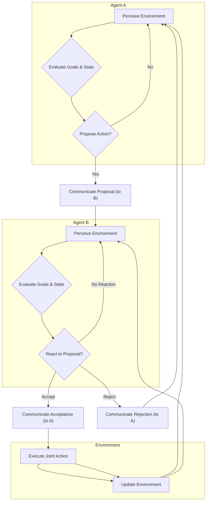

멀티 에이전트 시스템(Multi-Agent System, MAS)은 복잡하고 동적인 환경에서 다수의 자율 에이전트가 상호작용하며 공통 또는 개별 목표를 달성하는 시스템을 의미한다. 이러한 시스템의 성공적인 운영을 위해 에이전트 간의 효율적인 의사결정 패턴 설계는 핵심적인 요소이다. 특히, 불확실성과 동시성이 높은 환경에서 에이전트들이 협력적 혹은 경쟁적으로 목표를 추구할 때, 체계적인 의사결정 전략 없이는 비효율, 충돌, 또는 목표 미달성으로 이어질 수 있다. 갭 분석(Gap Analysis) 관점에서, 각 에이전트의 개별 역량과 시스템 전체의 요구 사항 사이의 간극을 메우고, 복잡한 환경 속에서 에이전트들의 효율적인 협업 및 목표 달성 전략을 수립하는 데 있어 의사결정 패턴은 필수적이다.

## 핵심 의사결정 패턴 (Core Decision-Making Patterns)

MAS에서 에이전트의 의사결정 방식은 크게 세 가지 주요 패턴으로 분류할 수 있다. 각 패턴은 시스템의 특성, 복잡성, 그리고 요구되는 유연성에 따라 적합성이 달라진다.

### 중앙 집중형 의사결정 (Centralized Decision-Making)

이 패턴에서 하나의 마스터 에이전트 또는 전역 코디네이터가 전체 시스템의 의사결정을 담당한다. 모든 하위 에이전트(worker agents)는 자신의 정보와 상태를 중앙 에이전트에 보고하고, 중앙 에이전트로부터 지시를 받아 행동한다.

*   **장점**: 전역 최적화(global optimization) 가능성이 높고, 시스템의 일관된 제어가 용이하다. 구현이 비교적 단순하며, 의사결정의 복잡성이 한 곳에 집중되어 관리하기 쉽다.
*   **단점**: 중앙 에이전트에 대한 단일 실패점(Single Point of Failure, SPoF)이 존재하며, 확장성(scalability)이 제한적이다. 정보 병목 현상(information bottleneck)이 발생할 수 있고, 동적인 환경 변화에 대한 반응 속도가 느릴 수 있다.

### 분산형 의사결정 (Decentralized Decision-Making)

분산형 패턴에서는 각 에이전트가 자신의 로컬 정보를 기반으로 자율적으로 의사결정을 수행한다. 에이전트들은 직접적인 통제 없이 상호작용하며 목표를 달성한다. 의사소통은 인접 에이전트 간에 주로 발생하며, 전역적인 조율보다는 로컬 상호작용을 통해 시스템 수준의 행동이emerge한다.

*   **장점**: 단일 실패점이 없고, 높은 확장성과 견고성(robustness)을 가진다. 동적인 환경 변화에 빠르게 적응할 수 있으며, 병렬 처리가 용이하다.
*   **단점**: 전역 최적화가 어렵고, 에이전트 간 충돌(conflict) 발생 가능성이 높다. 시스템 전체의 일관성 유지 및 모니터링이 복잡하며, 의도치 않은 비효율적인 행동이 나타날 수 있다.

### 하이브리드 의사결정 (Hybrid Decision-Making)

하이브리드 패턴은 중앙 집중형과 분산형의 장점을 결합한 형태이다. 예를 들어, 시스템의 고수준(high-level) 전략은 중앙 집중적으로 결정하고, 저수준(low-level) 전술적 실행은 분산된 에이전트가 자율적으로 수행하는 계층적 구조(hierarchical structure)를 가질 수 있다. 팀 기반 의사결정(team-based decision-making)이나 리더-팔로워(leader-follower) 모델도 이 범주에 속한다.

*   **장점**: 시스템의 확장성과 일관성을 동시에 확보할 수 있으며, 특정 실패 지점의 영향을 줄일 수 있다. 복잡한 문제를 계층적으로 분해하여 처리할 수 있어 효율적이다.
*   **단점**: 설계 및 구현 복잡도가 높으며, 중앙과 분산 요소 간의 균형점을 찾는 것이 어렵다. 계층 간의 효과적인 정보 흐름 및 조율 메커니즘이 중요하다.

## 의사결정 사이클 (Decision-Making Cycle)

대부분의 에이전트는 다음 단계를 반복하며 의사결정을 수행한다.

### 정보 수집 (Information Gathering)

에이전트는 센서, 통신 또는 공유 지식 베이스(shared knowledge base)를 통해 환경 및 다른 에이전트에 대한 정보를 수집한다. 2026년 트렌드에서는 LLM을 활용하여 비정형 데이터를 구조화하고, 복잡한 텍스트 정보를 상황 인지(context awareness)에 활용하는 것이 일반화되고 있다.

### 대안 생성 (Option Generation)

수집된 정보를 바탕으로 에이전트는 가능한 행동 대안(action alternatives)을 생성한다. 이는 Rule-based, Model-based, 또는 LLM의 생성 능력을 활용하여 다양한 시나리오와 대응 방안을 탐색하는 방식으로 이루어질 수 있다.

### 평가 및 선택 (Evaluation and Selection)

생성된 대안들을 목표 달성도, 자원 소모, 위험도 등 다양한 기준에 따라 평가하고, 가장 적합한 행동을 선택한다. 강화 학습(Reinforcement Learning)이나 Utility Function이 일반적으로 사용되며, LLM은 복잡한 다중 기준 평가(multi-criteria evaluation)에서 휴리스틱(heuristics)을 제공하는 데 기여한다.

### 실행 및 학습 (Execution and Learning)

선택된 행동을 실행하고, 그 결과를 모니터링하여 시스템의 상태를 업데이트하며, 향후 의사결정의 질을 높이기 위한 학습(learning) 과정으로 이어진다. 메타 학습(Meta-learning)과 자율 학습(Self-supervised Learning) 기술이 2026년 에이전트 학습 과정에서 중요하게 다루어진다.

## 코드 예제: 간단한 협업 의사결정 에이전트 (Python)

아래 코드는 두 에이전트가 '작업 분담'이라는 공통 목표를 가지고 의사결정하고 협업하는 간단한 시나리오를 보여준다. Agent A는 작업을 제안하고, Agent B는 이를 평가하여 수락하거나 거절한다.

```python
import random

class Agent:
    def __init__(self, name, capabilities):
        self.name = name
        self.capabilities = capabilities # List of tasks it can perform
        self.current_task = None
        self.knowledge_base = {}

    def perceive(self, environment_state, messages):
        """ 환경 상태와 메시지를 인지 """
        self.knowledge_base.update(environment_state)
        for msg in messages:
            if msg['recipient'] == self.name:
                print(f"{self.name} received: {msg['content']}")
                return msg
        return None

    def decide(self, received_message=None):
        """ 인지된 정보를 바탕으로 의사결정 """
        if self.name == "AgentA":
            if self.current_task is None and "available_tasks" in self.knowledge_base:
                task_to_propose = random.choice(self.knowledge_base["available_tasks"])
                if task_to_propose not in self.knowledge_base.get("assigned_tasks", []):
                    print(f"{self.name} proposing task: {task_to_propose}")
                    return {"type": "proposal", "task": task_to_propose}
        elif self.name == "AgentB":
            if received_message and received_message['type'] == "proposal":
                proposed_task = received_message['task']
                if proposed_task in self.capabilities:
                    if random.random() < 0.8: # Simulate B's decision to accept
                        self.current_task = proposed_task
                        print(f"{self.name} accepted task: {proposed_task}")
                        return {"type": "acceptance", "task": proposed_task}
                    else:
                        print(f"{self.name} rejected task: {proposed_task}")
                        return {"type": "rejection", "task": proposed_task}
        return None

    def act(self, decision_output):
        """ 의사결정 결과를 바탕으로 행동 (메시지 전송 또는 내부 상태 변경) """
        if decision_output:
            if decision_output["type"] == "proposal":
                return {"sender": self.name, "recipient": "AgentB", "content": decision_output}
            elif decision_output["type"] == "acceptance":
                # Update shared state or inform AgentA
                return {"sender": self.name, "recipient": "AgentA", "content": decision_output}
            elif decision_output["type"] == "rejection":
                return {"sender": self.name, "recipient": "AgentA", "content": decision_output}
        return None

# Simulation environment
environment = {
    "available_tasks": ["Task1", "Task2", "Task3", "Task4"],
    "assigned_tasks": []
}
messages_queue = []

agent_a = Agent("AgentA", ["Task1", "Task2", "Task3", "Task4"])
agent_b = Agent("AgentB", ["Task1", "Task3"])

# Simulation loop
for i in range(3):
    print(f"\n--- Step {i+1} ---")
    agent_a_msg_in = agent_a.perceive(environment, messages_queue)
    agent_a_decision = agent_a.decide(agent_a_msg_in)
    if agent_a_decision:
        action_a = agent_a.act(agent_a_decision)
        if action_a: messages_queue.append(action_a)

    agent_b_msg_in = agent_b.perceive(environment, messages_queue)
    agent_b_decision = agent_b.decide(agent_b_msg_in)
    if agent_b_decision:
        action_b = agent_b.act(agent_b_decision)
        if action_b: messages_queue.append(action_b)

    # Clear messages for next round, or process them more deliberately
    # For simplicity, we process and then clear relevant ones
    new_messages_queue = []
    for msg in messages_queue:
        if msg['recipient'] == "AgentA" and msg['content']['type'] == "acceptance":
            environment["assigned_tasks"].append(msg['content']['task'])
            print(f"Environment updated: {msg['content']['task']} assigned.")
        else:
            new_messages_queue.append(msg) # Keep messages for other agents if any
    messages_queue = new_messages_queue

print("\nFinal Environment State:", environment)
```

## 멀티 에이전트 의사결정 흐름 (Multi-Agent Decision Flow)

아래 Mermaid 다이어그램은 분산형 의사결정 환경에서 에이전트 간의 상호작용 및 의사결정 흐름을 시각화한다.



## 2026년 최신 트렌드: LLM 기반 의사결정의 부상

2026년에는 대규모 언어 모델(Large Language Models, LLMs)이 멀티 에이전트 시스템의 의사결정 역량을 획기적으로 향상시키고 있다. LLM은 다음과 같은 방식으로 활용된다:

*   **복합 추론 및 계획**: 에이전트가 복잡한 시나리오를 분석하고, 고수준의 계획(high-level plans)을 수립하며, 잠재적인 결과를 예측하는 데 LLM의 추론 능력을 사용한다.
*   **동적 역할 할당 및 협상**: LLM은 에이전트의 강점과 약점을 기반으로 동적으로 역할을 할당하고, 자원 제약 및 목표 우선순위를 고려하여 다른 에이전트와 효과적으로 협상하는 데 도움을 준다.
*   **적응형 전략**: 실시간으로 변화하는 환경에 맞춰 의사결정 전략을 동적으로 조정하고, 예상치 못한 상황에 대한 창의적인 해결책을 제안하는 데 LLM이 활용된다.
*   **자연어 기반 상호작용**: 에이전트 간의 복잡한 의사소통 및 목표 정렬(goal alignment)을 자연어 기반으로 처리하여, 시스템의 유연성과 설계 복잡도를 낮춘다.

## 트레이드오프 (Trade-offs)

멀티 에이전트 시스템의 의사결정 패턴을 선택할 때는 다음과 같은 트레이드오프를 고려해야 한다.

*   **중앙 집중형 vs. 분산형**: 시스템의 견고성(Robustness)과 제어 용이성 사이의 트레이드오프이다. 중앙 집중형은 제어가 쉽고 전역 최적화에 유리하지만 SPoF에 취약하며 확장성이 낮다. 분산형은 견고성과 확장성이 높지만 전역 최적화가 어렵고 충돌 관리가 복잡하다. (언제 좋고/언제 나쁜지): **중앙 집중형**은 소규모, 명확한 목표, 고도로 통제된 환경에서 유리하다. **분산형**은 대규모, 동적이고 예측 불가능한 환경, 높은 가용성이 요구될 때 유리하다.
*   **의사소통 비용 vs. 의사결정 품질**: 에이전트 간 의사소통량 증가는 의사결정 품질을 향상시킬 수 있지만, 통신 오버헤드와 지연 시간을 발생시킨다. (언제 좋고/언제 나쁜지): **높은 의사소통 비용 감수**는 미션 크리티컬하거나 오류 비용이 높은 시스템에 적합하다. **낮은 의사소통**은 실시간 요구사항이 강하거나 자원 제약이 있는 시스템에 적합하다.
*   **자율성 vs. 제어**: 각 에이전트의 자율성을 높이면 유연성과 적응력이 향상되지만, 시스템 전체의 일관된 행동을 보장하기 어려워진다. (언제 좋고/언제 나쁜지): **높은 자율성**은 탐색적(exploratory)이거나 빠르게 변화하는 환경에서 혁신이 필요할 때 좋다. **강력한 제어**는 안전, 보안, 규정 준수가 최우선인 시스템에 필수적이다.
*   **복잡성 vs. 성능**: 정교한 의사결정 알고리즘은 더 나은 성능을 제공할 수 있지만, 구현 및 유지보수 복잡도를 증가시킨다. (언제 좋고/언제 나쁜지): **복잡한 알고리즘**은 고정밀, 고효율이 필수적인 경우에 적합하다. **단순한 휴리스틱**은 빠른 개발과 낮은 컴퓨팅 자원으로 충분할 때 효과적이다.

## 실전 체크리스트 (Practical Checklist)

멀티 에이전트 시스템의 의사결정 패턴을 설계하고 구현할 때 다음 체크리스트를 활용하여 검증한다.

- [ ] **환경 특성 분석**: 시스템이 작동할 환경의 동적 특성, 불확실성, 자원 제약 등을 명확히 정의했는가? (예: 실시간 요구사항, 데이터 변화 주기)
- [ ] **목표 정렬 메커니즘**: 에이전트 개별 목표와 시스템 전역 목표 간의 정렬(alignment)을 위한 명확한 메커니즘 (예: 공유 보상 함수, 목표 계층 구조)을 설계했는가?
- [ ] **충돌 해결 전략**: 에이전트 간 잠재적 충돌 상황을 예측하고, 이를 해결하기 위한 전략 (예: 협상, 경매, 리더십 기반)을 수립했는가?
- [ ] **의사소통 프로토콜**: 에이전트 간의 효율적이고 안전한 정보 교환을 위한 의사소통 프로토콜과 메시지 형식을 정의했는가? (예: JSON, Protobuf, Topic-based Pub/Sub)
- [ ] **확장성 및 견고성 평가**: 설계된 의사결정 패턴이 예상되는 에이전트 수 증가 및 부분 에이전트 실패 상황에서도 시스템이 안정적으로 작동하는지 시뮬레이션 또는 테스트를 통해 검증했는가?
- [ ] **LLM 통합 전략**: LLM을 활용할 경우, LLM의 추론 결과에 대한 검증 및 에이전트의 자율적 판단과의 균형을 어떻게 유지할 것인가? (예: LLM Guardrails, Human-in-the-Loop)
- [ ] **성능 및 자원 효율성**: 선택된 의사결정 패턴이 시스템의 성능 요구사항 (예: 지연 시간, 처리량)을 만족하며, 컴퓨팅 자원을 효율적으로 사용하는지 측정했는가?
- [ ] **학습 및 적응 메커니즘**: 에이전트가 과거 의사결정 경험을 통해 학습하고, 환경 변화에 동적으로 적응할 수 있는 메커니즘 (예: 강화 학습, 정책 업데이트)을 포함했는가?