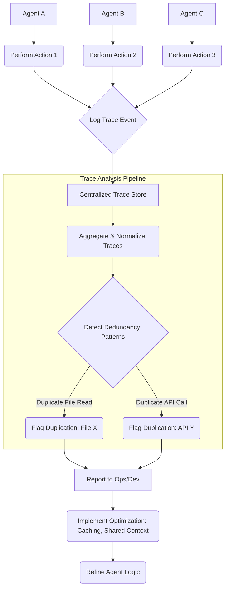

Multi-agent 시스템은 복잡한 작업을 분할하여 여러 자율 에이전트가 협력하도록 설계됩니다. 그러나 이러한 분산된 아키텍처는 의도치 않게 중복 작업을 유발하여 불필요한 비용과 비효율성을 초래할 수 있습니다. 특히 파일 읽기, API 호출, 데이터 처리와 같은 정보 획득 단계에서 여러 에이전트가 동일한 리소스에 반복적으로 접근하는 경우가 빈번합니다. 각 에이전트는 자신의 관점에서는 최적의 행동을 수행하지만, 시스템 전체적인 관점에서는 상당한 낭비가 발생합니다.

이러한 중복 작업은 에이전트의 개별 로그나 작업 흐름만으로는 쉽게 파악하기 어렵습니다. 문제의 핵심은 에이전트 간의 '상호작용 맥락'에 존재하며, 이를 탐지하고 최적화하기 위해서는 전체 시스템의 활동을 추적하고 분석하는 Trace Analysis 기법이 필수적입니다. Boxdawn과 같은 오픈소스 도구는 이러한 멀티 에이전트 Trace 파일을 분석하여 중복 지점을 식별하고, 숨겨진 비용 발생 원인을 밝혀내는 데 기여합니다.

## 중복 작업의 본질과 비용 최적화 필요성

멀티 에이전트 환경에서 중복 작업은 주로 다음과 같은 형태로 나타납니다.
*   **중복된 파일 읽기 (Duplicate File Reads)**: 여러 에이전트가 동일한 파일을 독립적으로 읽어들이는 경우. 이는 특히 대용량 파일이나 자주 접근되는 설정 파일에서 큰 비용으로 이어질 수 있습니다.
*   **동일한 API 호출 (Identical API Calls)**: 같은 파라미터로 외부 API를 여러 에이전트가 호출하는 경우. 이는 API 사용료와 네트워크 지연 비용을 증가시킵니다.
*   **불필요한 컨텍스트 리트리벌 (Redundant Context Retrieval)**: RAG (Retrieval Augmented Generation) 패턴에서 여러 에이전트가 동일한 쿼리로 벡터 데이터베이스에서 중복된 문서를 검색하는 경우.

2026년 현재, LLM 기반 에이전트 시스템은 그 복잡성과 규모가 더욱 커지고 있으며, 이에 따라 Operation Cost(운영 비용) 최적화는 '있으면 좋은' 기능이 아닌 '반드시 필요한' 핵심 역량으로 부상하고 있습니다. 개별 에이전트의 효율성을 넘어, 에이전트 간의 협업 및 자원 활용 효율성을 높이는 것이 전체 시스템의 경제성과 성능을 좌우합니다. Trace analysis를 통해 이러한 중복을 식별하고, 캐싱, 공유 컨텍스트 관리, 작업 위임 최적화 등의 방식으로 해결함으로써 상당한 비용 절감 효과를 얻을 수 있습니다.

## Trace Analysis를 통한 중복 감지 메커니즘

중복 작업 감지의 핵심은 각 에이전트의 활동을 통합된 형태로 추적하는 것입니다. 이는 OpenTelemetry와 같은 표준화된 분산 트레이싱 프레임워크를 활용하거나, 각 에이전트가 실행하는 도구 호출(Tool Call), LLM 호출, 파일 I/O 등의 이벤트를 구조화된 로그로 기록함으로써 구현할 수 있습니다.

트레이스 데이터를 수집한 후에는 다음과 같은 단계를 통해 중복을 감지합니다.
1.  **Event Aggregation**: 모든 에이전트의 트레이스 이벤트를 시간 순서대로 또는 작업 ID 별로 집계합니다.
2.  **Normalization**: 이벤트 데이터를 표준화하여 비교 가능한 형태로 만듭니다. 예를 들어, 파일 경로, API 엔드포인트와 파라미터, LLM 프롬프트 해시 등을 추출합니다.
3.  **Duplicate Identification**: 특정 필드(예: 파일 경로, API 호출 시그니처)가 동일하고, 특정 시간 내에 발생한 이벤트를 그룹화하여 중복 여부를 판단합니다.

다음은 Go 언어를 사용한 간략한 중복 파일 읽기 감지 로직의 예시입니다.

```go
package main

import (
	"fmt"
	"sync"
	"time"
)

// AgentTrace represents a single action by an agent.
type AgentTrace struct {
	AgentID   string
	EventType string // e.g., "FILE_READ", "API_CALL", "LLM_INFERENCE"
	Resource  string // e.g., file path, API endpoint
	Timestamp time.Time
	Details   map[string]interface{} // e.g., file hash, API params
}

// TraceStore simulates a centralized trace storage.
type TraceStore struct {
	mu     sync.Mutex
	traces []AgentTrace
}

func (ts *TraceStore) AddTrace(trace AgentTrace) {
	ts.mu.Lock()
	defer ts.mu.Unlock()
	ts.traces = append(ts.traces, trace)
}

// DetectDuplicateFileReads identifies duplicate file read operations within a time window.
func (ts *TraceStore) DetectDuplicateFileReads(window time.Duration) []string {
	ts.mu.Lock()
	defer ts.mu.Unlock()

	// Map to store (filepath -> list of agent IDs that read it within the window)
	fileReads := make(map[string][]string)
	
	now := time.Now()
	for _, trace := range ts.traces {
		if trace.EventType == "FILE_READ" && now.Sub(trace.Timestamp) < window {
			fileReads[trace.Resource] = append(fileReads[trace.Resource], trace.AgentID)
		}
	}

	var duplicates []string
	for filePath, agentIDs := range fileReads {
		if len(agentIDs) > 1 {
			// Filter for unique agent IDs if an agent reads it multiple times, but we care about cross-agent duplicates
			uniqueAgentIDs := make(map[string]bool)
			for _, id := range agentIDs {
				uniqueAgentIDs[id] = true
			}
			if len(uniqueAgentIDs) > 1 {
				duplicates = append(duplicates, fmt.Sprintf("File '%s' read by multiple agents: %v", filePath, agentIDs))
			}
		}
	}
	return duplicates
}

func main() {
	store := &TraceStore{}

	// Simulate agent activities
	store.AddTrace(AgentTrace{AgentID: "AgentA", EventType: "FILE_READ", Resource: "/data/config.json", Timestamp: time.Now().Add(-10 * time.Second)})
	store.AddTrace(AgentTrace{AgentID: "AgentB", EventType: "FILE_READ", Resource: "/data/config.json", Timestamp: time.Now().Add(-5 * time.Second)})
	store.AddTrace(AgentTrace{AgentID: "AgentC", EventType: "FILE_READ", Resource: "/data/report.csv", Timestamp: time.Now().Add(-15 * time.Second)})
	store.AddTrace(AgentTrace{AgentID: "AgentA", EventType: "API_CALL", Resource: "/api/users", Timestamp: time.Now().Add(-12 * time.Second)})
	store.AddTrace(AgentTrace{AgentID: "AgentB", EventType: "API_CALL", Resource: "/api/users", Timestamp: time.Now().Add(-8 * time.Second)}) // Duplicate API call example
	store.AddTrace(AgentTrace{AgentID: "AgentD", EventType: "FILE_READ", Resource: "/data/report.csv", Timestamp: time.Now().Add(-3 * time.Second)})

	// Detect duplicates within a 20-second window
	duplicateReads := store.DetectDuplicateFileReads(20 * time.Second)
	if len(duplicateReads) > 0 {
		fmt.Println("Detected duplicate file reads:")
		for _, dup := range duplicateReads {
			fmt.Println(dup)
		}
	} else {
		fmt.Println("No duplicate file reads detected.")
	}
}
```

위 코드는 `AgentTrace` 구조체를 정의하고, `TraceStore`에 트레이스를 저장한 후, 특정 시간 윈도우 내에서 중복된 파일 읽기 작업을 감지하는 `DetectDuplicateFileReads` 함수를 보여줍니다. 실제 시스템에서는 `Details` 필드에 파일 해시나 API 파라미터 해시 등을 포함하여 더욱 정확한 중복성 판단을 수행할 수 있습니다.



## 트레이드오프

*   **감지 세분화 (Detection Granularity) vs. 오버헤드 (Overhead)**
    *   **언제 좋은가**: 높은 세분화 (예: 파일 내용 해싱, API 파라미터 딥 비교)는 미묘한 중복까지 정확하게 찾아내어 비용 절감 효과를 극대화할 수 있습니다.
    *   **언제 나쁜가**: 세분화가 높을수록 트레이스 수집, 저장, 분석에 필요한 컴퓨팅 자원과 시간이 기하급수적으로 증가하여 자체적인 운영 오버헤드가 커질 수 있습니다. 초기 단계에는 핵심적인 중복 패턴에 집중하고 점진적으로 세분화를 높이는 것이 좋습니다.

*   **실시간 감지 (Real-time Detection) vs. 배치 분석 (Batch Analysis)**
    *   **언제 좋은가**: 실시간 감지는 중복 작업이 발생하는 즉시 이를 감지하고 에이전트에게 피드백을 주어 불필요한 비용 발생을 즉각적으로 방지합니다. 미션 크리티컬한 실시간 시스템에 적합합니다.
    *   **언제 나쁜가**: 실시간 시스템은 복잡한 아키텍처, 높은 지연 시간(latency) 요구 사항, 오류 처리의 어려움을 수반합니다. 배치 분석은 구현이 훨씬 간단하며, 주기적인 비용 최적화 및 사후 분석에 효과적입니다. 학습 데이터셋 생성이나 일괄 작업 최적화에 유리합니다.

*   **도구별(Tool-specific) 감지 vs. 일반(Generic) 감지**
    *   **언제 좋은가**: 도구의 특성(예: HTTP GET은 idempotent, 파일은 특정 버전)을 이해하는 도구별 감지는 높은 정확도를 제공하며, 의미론적 중복을 더 잘 식별할 수 있습니다. 예를 들어, `GET /users/1`과 `GET /users/1?cachebuster=<uuid>`가 동일한 요청임을 파악하는 데 유용합니다.
    *   **언제 나쁜가**: 각 도구와 상호작용 방식에 대한 맞춤형 로직이 필요하므로 구현 비용이 높고, 새로운 도구 추가 시마다 업데이트가 필요하여 유지보수 부담이 큽니다. 일반 감지는 모든 도구에 적용하기 쉽지만, 특정 도구의 미묘한 중복을 놓칠 수 있습니다.

*   **에이전트 자율성 (Agent Autonomy) vs. 중앙 통제 (Centralized Control)**
    *   **언제 좋은가**: 중앙에서 중복을 감지하고 최적화 지시를 내리면 시스템 전체의 효율성을 보장할 수 있습니다. 에이전트 간의 조율 부족으로 인한 문제를 해결하는 데 효과적입니다.
    *   **언제 나쁜가**: 중앙 통제가 너무 강해지면 에이전트의 자율적 판단과 유연성을 저해할 수 있습니다. 때로는 중복처럼 보이는 작업이 예상치 못한 발견이나 특정 목적을 위한 필수적인 과정일 수 있으므로, 과도한 통제는 시스템의 적응성을 떨어뜨릴 수 있습니다.

## 실전 체크리스트

프로젝트에 멀티 에이전트 중복 작업 감지 및 비용 최적화 전략을 적용하기 위한 실전 체크리스트입니다.

*   - [ ] **중복 정의 및 범위 설정**: 각 에이전트 도구(Tool) 및 리소스 유형(파일, API, 데이터베이스 쿼리)에 대해 '중복'의 명확한 정의 (예: 동일한 파일 경로 및 해시, 동일한 API 엔드포인트와 요청 바디 해시)를 수립합니다.
*   - [ ] **통합 트레이싱 구현**: 모든 에이전트의 주요 활동(LLM 호출, 도구 호출, 파일 I/O, 외부 API 호출 등)을 OpenTelemetry 같은 표준을 사용하여 중앙 집중식으로 추적하고 기록하는 시스템을 구축합니다.
*   - [ ] **트레이스 데이터 저장 및 접근성**: 수집된 트레이스 데이터를 Elasticsearch, ClickHouse 또는 NoSQL 데이터베이스와 같이 검색 및 분석이 용이한 저장소에 효율적으로 저장하고, 분석을 위한 접근 계층을 마련합니다.
*   - [ ] **N-Agent 중복 분석 엔진 개발**: 특정 시간 창(Time Window) 또는 고유한 작업 컨텍스트 내에서 N개 이상의 에이전트가 동일한 리소스에 접근하거나 동일한 작업을 수행하는 패턴을 식별하는 분석 로직을 개발합니다.
*   - [ ] **비용 임계값 및 알림 시스템 구축**: 감지된 중복 작업으로 인한 예상 비용 절감액이 특정 임계값(예: 월 100 USD 이상)을 초과할 경우, 담당자에게 자동으로 알리거나 Slack, Jira 등으로 보고하는 시스템을 구현합니다.
*   - [ ] **자동화된 최적화 또는 권고 피드백 루프**: 중복이 감지되면 자동으로 캐싱 레이어를 도입하거나, 공유 컨텍스트 시스템 사용을 권고하거나, 에이전트의 프롬프트나 툴 정의를 수정하도록 제안하는 피드백 루프를 설계합니다.
*   - [ ] **정기적인 중복 패턴 리뷰 및 에이전트 행동 개선**: 주기적으로 감지된 중복 패턴을 분석하여 에이전트의 학습 데이터셋을 보강하거나, 상위 레벨의 오케스트레이션 로직을 개선하여 향후 중복 발생을 근본적으로 줄입니다. 예를 들어, 공통 리소스에 대한 접근 시 캐시 확인 로직을 추가하는 에이전트 툴을 개발합니다.