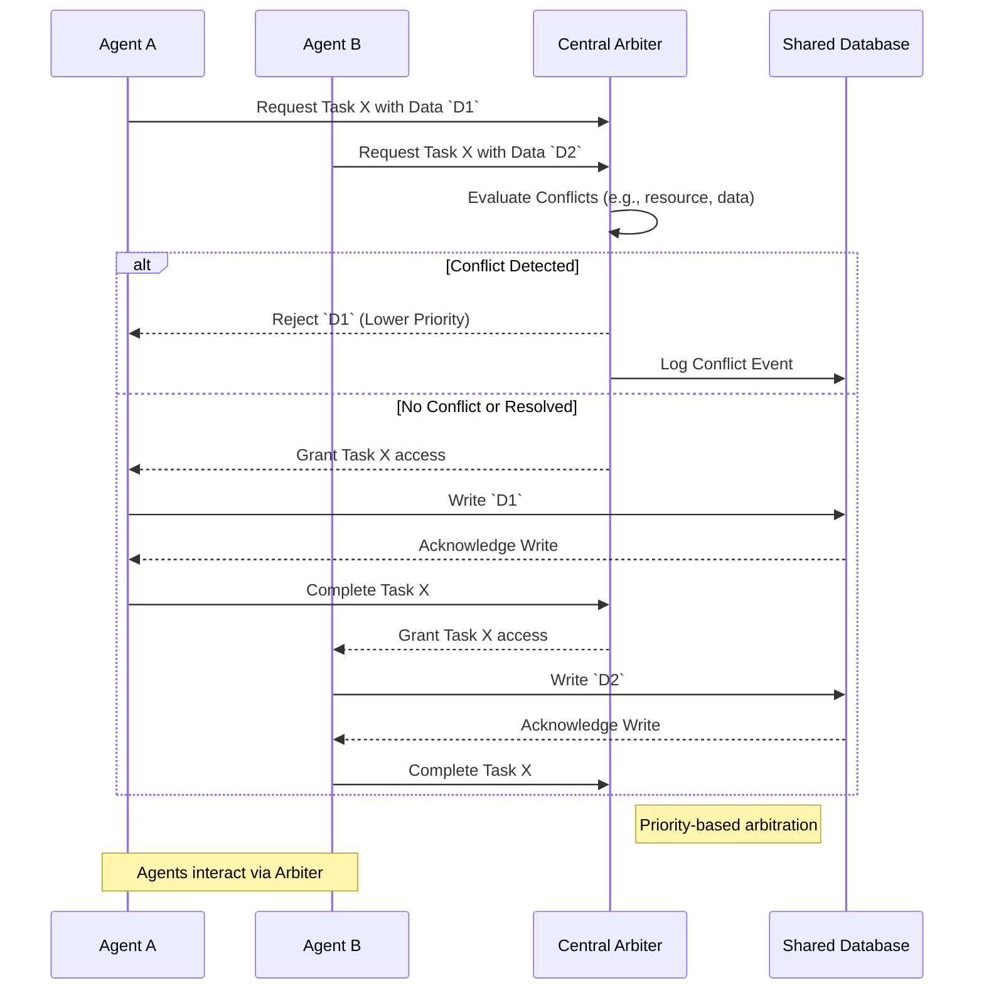

2026년에는 여러 에이전트가 복잡하게 상호작용하는 멀티 에이전트 시스템(Multi-Agent Systems, MAS)이 보편화될 것입니다. 이러한 환경에서 시스템의 신뢰성을 확보하고 불가피하게 발생하는 충돌을 효과적으로 해결하는 것은 안정적인 운영을 위한 핵심 과제입니다.

## 멀티 에이전트 시스템의 신뢰성 확보

멀티 에이전트 시스템에서 신뢰성(Reliability)은 개별 에이전트의 안정성과 더불어 에이전트 간 상호작용의 견고성(Robustness)을 의미합니다. 통신 오류, 에이전트 오작동, 예상치 못한 환경 변화 등 다양한 요인들이 시스템의 신뢰성을 저해할 수 있습니다.

### 신뢰성 패턴

*   **Redundancy and Replication (중복 및 복제)**: 핵심 서비스나 데이터를 여러 에이전트 또는 위치에 중복시켜 하나의 에이전트가 실패해도 시스템 전체의 기능이 유지되도록 합니다. 이는 고가용성(High Availability) 및 내결함성(Fault Tolerance)을 제공합니다.
*   **Monitoring and Health Checks (모니터링 및 상태 확인)**: 각 에이전트의 상태를 지속적으로 모니터링하고, 이상 징후 발생 시 즉시 감지하여 선제적으로 대응합니다. 이는 빠른 장애 탐지 및 복구에 필수적입니다.
*   **Fallback Mechanisms (대체 메커니즘)**: 특정 서비스나 에이전트가 실패할 경우, 미리 정의된 대체 경로(fallback path)나 다른 에이전트가 해당 작업을 대신 수행하도록 설계합니다. 이는 시스템의 서비스 중단을 최소화합니다.
*   **Idempotency (멱등성)**: 작업을 여러 번 수행하더라도 시스템의 상태가 동일하게 유지되도록 설계합니다. 이는 통신 실패 등으로 인해 작업 재시도(retries)가 발생할 때 예측 불가능한 부작용을 방지합니다.

## 멀티 에이전트 시스템의 충돌 해결

여러 에이전트가 제한된 자원, 상충되는 목표, 또는 불완전한 정보 속에서 협력할 때 충돌(Conflict)은 자연스럽게 발생합니다. 효과적인 충돌 해결(Conflict Resolution)은 시스템의 효율성과 안정성에 직결됩니다.

### 충돌 해결 패턴

*   **Arbitration (중재)**: 중앙 집중식 중재자(Arbiter)가 충돌 상황을 인지하고, 미리 정의된 규칙이나 우선순위에 따라 결정을 내립니다. 구현이 간단하지만, 중재자가 단일 장애점(Single Point of Failure)이 될 수 있습니다.
*   **Negotiation (협상)**: 충돌하는 에이전트들이 서로 정보를 교환하고 양보하며 합의점(Compromise)을 찾아나갑니다. LLM 기반 에이전트의 경우, 복잡한 협상 시나리오를 효과적으로 처리할 수 있습니다.
*   **Consensus Protocols (합의 프로토콜)**: 분산 시스템에서 여러 에이전트가 특정 값이나 행동에 대해 동의하는 메커니즘입니다. Paxos, Raft와 같은 프로토콜은 데이터 일관성 및 결정의 신뢰성을 보장하는 데 사용됩니다.
*   **Prioritization (우선순위 부여)**: 에이전트나 작업에 미리 우선순위를 부여하여 충돌 발생 시 우선순위가 높은 쪽의 결정이나 요청을 따릅니다. 이는 중요도에 따른 자원 할당에 유용합니다.
*   **Resource Locking/Allocation (자원 잠금/할당)**: 공유 자원에 대한 동시 접근을 제어하기 위해 락(Lock) 메커니즘을 사용하거나, 특정 에이전트에게 자원을 독점적으로 할당합니다. 이는 교착 상태(Deadlock) 방지에 중요합니다.

## 패턴 적용 예시: 자원 충돌 해결

다음 Python 코드는 간단한 중재자(Arbiter) 패턴을 사용하여 두 에이전트가 공유 자원 `Resource X`에 접근하는 충돌을 해결하는 예시입니다. `threading.Lock`은 중재자의 역할을 추상화하여 구현한 것입니다.

```python
import threading
import time
import random

class ResourceArbiter:
    def __init__(self):
        self.lock = threading.Lock()
        self.resource_owner = None

    def acquire_resource(self, agent_id):
        if self.lock.acquire(blocking=False):
            self.resource_owner = agent_id
            print(f"Agent (agent_id) acquired Resource X.")
            return True
        else:
            print(f"Agent (agent_id) could not acquire Resource X. Currently owned by (self.resource_owner).")
            return False

    def release_resource(self, agent_id):
        if self.resource_owner == agent_id:
            self.resource_owner = None
            self.lock.release()
            print(f"Agent (agent_id) released Resource X.")
            return True
        else:
            print(f"Agent (agent_id) tried to release Resource X, but is not the owner.")
            return False

class Agent(threading.Thread):
    def __init__(self, agent_id, arbiter):
        super().__init__()
        self.agent_id = agent_id
        self.arbiter = arbiter

    def run(self):
        for _ in range(3):
            time.sleep(random.uniform(0.1, 0.5))
            print(f"Agent (self.agent_id) attempting to acquire Resource X.")
            if self.arbiter.acquire_resource(self.agent_id):
                time.sleep(random.uniform(0.5, 1.0)) # Simulate using resource
                self.arbiter.release_resource(self.agent_id)
            else:
                print(f"Agent (self.agent_id) will retry later.")

# 시스템 실행
arbiter = ResourceArbiter()
agent1 = Agent("A", arbiter)
agent2 = Agent("B", arbiter)

agent1.start()
agent2.start()

agent1.join()
agent2.join()

print("All agents finished.")
```

이 예제에서는 `ResourceArbiter`가 `threading.Lock`을 사용하여 `Resource X`에 대한 접근을 중재합니다. 에이전트가 자원을 요청했을 때, 이미 다른 에이전트가 소유하고 있다면 접근을 거부하고 나중에 재시도하도록 합니다. 이는 기본적인 자원 충돌 해결 메커니즘을 보여줍니다.

## 2026년 트렌드와 적용

2026년에는 LLM 기반의 자율 에이전트들이 다양한 산업 분야에 걸쳐 복잡한 비즈니스 로직을 수행할 것입니다. 이들 에이전트의 자율성과 상호작용의 복잡도가 증가함에 따라, 신뢰성 및 충돌 해결 패턴의 중요성은 더욱 커집니다. 특히, LLM이 의사결정 프로세스에 깊이 관여하게 되면서, 에이전트 간의 동적 협상(dynamic negotiation) 및 지능형 중재(intelligent arbitration) 시스템의 설계가 필수적입니다. 예측 불가능한 에이전트 행동을 제어하고, 비용 효율적인 방식으로 안정성을 유지하는 것이 핵심 역량이 될 것입니다.



## 트레이드오프

*   **중앙 집중식 조정(Centralized Coordination) vs. 분산형 조정(Decentralized Coordination)**
    *   **중앙 집중식**: 구현이 간단하고 일관성 유지가 용이합니다. 그러나 중재자가 단일 장애점(Single Point of Failure)이 될 수 있으며, 시스템 규모가 커질수록 확장성(Scalability)이 제한됩니다. 작은 규모의 시스템이나 엄격한 제어가 필요한 경우에 적합합니다.
    *   **분산형**: 단일 장애점 위험이 적고, 높은 견고성(Robustness) 및 확장성을 제공합니다. 하지만 충돌 해결을 위한 복잡한 분산 프로토콜이 필요하며, 일관성 유지(Consistency)가 어려울 수 있습니다. 대규모, 고가용성 시스템에 적합합니다.
*   **적극적 복구(Proactive Recovery) vs. 수동적 복구(Reactive Recovery)**
    *   **적극적**: 장애를 예측하고 사전에 조치하여 서비스 중단을 최소화합니다. 시스템에 추가적인 모니터링 및 분석 오버헤드(Overhead)를 발생시키고, 오탐(False Positive)으로 인한 불필요한 작업이 발생할 수 있습니다. 미션 크리티컬(Mission-Critical) 시스템에 유리합니다.
    *   **수동적**: 장애가 발생한 후에야 복구 작업을 시작합니다. 오버헤드가 낮지만, 장애 발생 시 일정 시간 동안 서비스 중단이 불가피합니다. 비용 효율성이 중요하거나 서비스 중단이 허용되는 시스템에 적합합니다.
*   **엄격한 합의(Strict Consensus) vs. 유연한 합의(Eventual Consistency)**
    *   **엄격한**: 모든 에이전트 간의 데이터 일관성(Data Consistency)을 최우선으로 보장합니다. 이로 인해 성능(Performance)이 저하될 수 있으며, 시스템 복잡성이 증가합니다. 금융 거래와 같이 데이터 정합성이 필수적인 경우에 사용됩니다.
    *   **유연한**: 성능 및 가용성(Availability)을 우선시하며, 데이터 불일치가 일시적으로 허용됩니다. 불일치를 해결하기 위한 추가적인 메커니즘이 필요하며, 데이터 불일치가 시스템에 큰 영향을 미치지 않는 경우에 적합합니다.
*   **자율성 제한(Limited Autonomy) vs. 완전 자율성(Full Autonomy)**
    *   **제한**: 에이전트의 행동을 미리 정의된 규칙이나 범위 내로 제한하여 예측 가능성을 높이고 안전성을 확보하기 용이합니다. 하지만 에이전트의 잠재적인 문제 해결 능력을 제약할 수 있습니다. 초기 개발 단계나 안전에 민감한 영역에 적합합니다.
    *   **완전**: 에이전트가 복잡한 환경에서 스스로 학습하고 의사결정을 내려 문제 해결 능력을 극대화합니다. 예상치 못한 동작이 발생할 수 있으며, 통제 및 검증이 어렵습니다. 복잡하고 동적인 문제 해결이 필요한 경우에 고려됩니다.

## 실전 체크리스트

멀티 에이전트 시스템에 신뢰성 및 충돌 해결 패턴을 적용할 때 다음 항목들을 검토해야 합니다.

*   [ ] 모든 에이전트 간 통신 프로토콜이 명확히 정의되고, 메시지 형식 및 오류 처리 규칙이 문서화되었는가?
*   [ ] 중요 자원(critical resources)에 대한 접근 제어 및 동시성 관리(concurrency management) 메커니즘(예: 락, 세마포어)이 구현되었고, 교착 상태(deadlock) 가능성이 분석되었는가?
*   [ ] 에이전트 장애 발생 시 자동으로 감지하고, 해당 에이전트를 격리하거나 대체 에이전트가 작업을 인계받는 복구 전략(recovery strategy)이 존재하는가?
*   [ ] 에이전트 간 충돌 발생 시, 이를 해결하기 위한 우선순위, 중재자 로직, 또는 협상 프로토콜이 명확히 정의되었으며, 다양한 시나리오에 대해 테스트를 통해 검증되었는가?
*   [ ] 시스템의 각 구성 요소(에이전트, 서비스)가 멱등성(Idempotency)을 보장하여 재시도(retries)가 안전하게 이루어지고, 데이터 불일치를 일으키지 않는가?
*   [ ] 시스템 전체의 신뢰성(예: 가용성, 오류율) 및 충돌 해결 성공률에 대한 핵심 메트릭(metrics)이 정의되고, 실시간으로 모니터링되고 있으며, 경고(alert) 시스템이 구축되었는가?
*   [ ] 새로운 에이전트나 기능 추가 시, 기존 시스템의 신뢰성 및 충돌 해결 메커니즘에 미치는 영향(impact)을 평가하고 통합하는 표준 프로세스가 수립되었는가?
*   [ ] 복구(recovery) 및 롤백(rollback) 프로세스가 정기적으로 테스트되고, 예상치 못한 상황에서도 시스템이 안정적으로 작동할 수 있도록 훈련(drill)이 진행되는가?