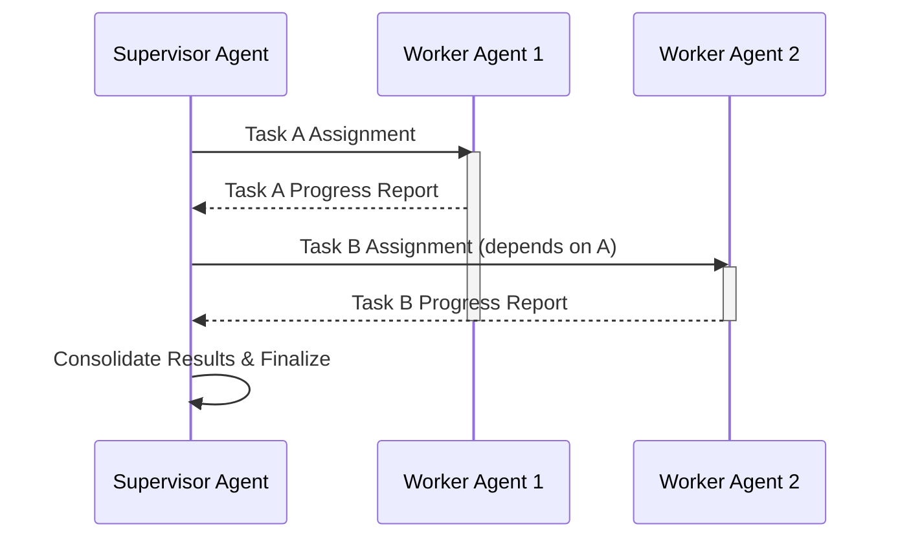

복잡한 문제 해결을 위해 다수의 AI 에이전트가 협업하는 멀티 에이전트 시스템(Multi-Agent System, MAS)은 2026년 현재 인공지능 분야의 핵심 트렌드입니다. 그러나 실제 서비스에 적용 가능한 수준의 신뢰성과 효율성을 확보하기 위해서는 에이전트 간의 협업 및 조율 과정에서 발생하는 비효율과 오류를 효과적으로 관리하는 설계 패턴이 필수적입니다. 이 엔트리에서는 신뢰성 높은 멀티 에이전트 시스템 구축을 위한 핵심 협업 및 조율 패턴을 다룹니다.

## 멀티 에이전트 협업의 중요성
단일 에이전트는 제한된 전문성과 처리 능력을 가지므로, 복잡하고 광범위한 태스크를 수행하는 데 한계가 있습니다. 이를 극복하기 위해 여러 에이전트가 각자의 강점을 활용하여 협업하는 방식이 요구됩니다. 예를 들어, 코드 생성, 테스트, 디버깅, 문서화를 각각 담당하는 에이전트들이 유기적으로 연결되어 소프트웨어 개발 워크플로우를 자동화할 수 있습니다. 이러한 시스템의 성공은 에이전트 간의 원활한 정보 교환, 책임 분배, 그리고 충돌 해결 능력에 달려 있습니다.

## 핵심 협업 및 조율 패턴

### 1. 중앙 집중식 오케스트레이션 (Centralized Orchestration)
중앙 집중식 오케스트레이션은 하나의 상위 감독(Supervisor) 에이전트가 전체 태스크의 흐름을 관리하고, 하위 작업 에이전트들에게 지시를 내리며, 그들의 진행 상황을 모니터링하는 방식입니다. 이 패턴은 시스템의 복잡도가 낮고 예측 가능한 워크플로우에서 효과적입니다.



### 2. 분산형 협업 (Decentralized Collaboration)
에이전트들이 직접 상호작용하며 태스크를 분배하고 해결하는 방식입니다. 감독 에이전트의 단일 장애점(Single Point of Failure) 위험을 줄이고 확장성을 높일 수 있습니다. 주요 기법으로는 메시지 패싱(Message Passing)과 공유 메모리/블랙보드(Shared Memory/Blackboard)가 있습니다.

#### 메시지 패싱 (Message Passing)
각 에이전트가 명시적인 메시지를 통해 서로 정보를 교환하고 작업을 요청합니다. 비동기 통신을 지원하여 에이전트들의 독립적인 실행을 보장합니다.

```python
# Python pseudo-code for Message Passing
class Message:
    def __init__(self, sender, receiver, content, task_id):
        self.sender = sender
        self.receiver = receiver
        self.content = content
        self.task_id = task_id

class Agent:
    def __init__(self, name, message_queue):
        self.name = name
        self.message_queue = message_queue

    def send_message(self, receiver, content, task_id):
        message = Message(self.name, receiver, content, task_id)
        self.message_queue.put(message)
        print(f"[{self.name}] Sent message to {receiver} for Task {task_id}: {content}")

    def process_message(self, message):
        print(f"[{self.name}] Received message from {message.sender} for Task {message.task_id}: {message.content}")
        if "need-data" in message.content:
            self.send_message(message.sender, "data-ready", message.task_id)
        # Simulate task processing

# Example usage with a shared message queue (e.g., multiprocessing.Queue)
# from queue import Queue
# mq = Queue()
# agent1 = Agent("DataFetcher", mq)
# agent2 = Agent("Processor", mq)
# agent1.send_message("Processor", "fetch-data-for-report", "report-001")
# # In a real system, agents would continuously poll their queues.
```

#### 공유 메모리/블랙보드 (Shared Memory/Blackboard)
모든 에이전트가 접근할 수 있는 중앙 집중형 데이터 저장소(블랙보드)를 통해 정보를 공유합니다. 각 에이전트는 블랙보드의 특정 영역을 모니터링하고, 변경 사항이 발생하면 관련 작업을 수행합니다. 이는 지식 기반 시스템에서 복잡한 문제 해결에 유용합니다.

### 3. 역할 기반 협업 (Role-Based Collaboration)
각 에이전트에게 특정 역할(e.g., 분석가, 설계자, 구현자, 테스터)을 부여하고, 이 역할에 맞는 책임과 권한을 정의하여 협업 효율성을 높입니다. 역할 정의는 LLM(Large Language Model) 에이전트의 프롬프트 엔지니어링 단계에서 명확히 지정될 수 있습니다.

### 4. 동적 태스크 분배 및 재할당 (Dynamic Task Distribution and Re-assignment)
2026년의 최신 트렌드는 에이전트 시스템이 예상치 못한 상황(e.g., 에이전트 오류, 자원 부족)에 직면했을 때, 유연하게 태스크를 재분배하거나 다른 에이전트에 재할당하는 능력입니다. 이는 감독 에이전트 또는 분산된 합의 메커니즘을 통해 이루어질 수 있으며, LLM의 강화된 추론 능력과 동적 플래닝(Dynamic Planning)을 활용하여 실현됩니다.

### 5. 충돌 해결 및 합의 메커니즘 (Conflict Resolution and Consensus Mechanisms)
다수 에이전트 간의 의견 불일치나 리소스 충돌은 필연적입니다. 이를 해결하기 위해 투표(Voting), 경매(Auction) 기반 리소스 할당, 또는 상위 에이전트의 중재(Arbitration)와 같은 합의 메커니즘을 설계해야 합니다. 특히 LLM 에이전트의 경우, 'Rationale Storage & Decision Learning System'과 연계하여 과거의 성공적인 합의 사례를 학습하고 적용하는 것이 중요합니다.

## 트레이드오프

*   **중앙 집중식 오케스트레이션 vs. 분산형 협업**: 중앙 집중식은 구현이 간단하고 초기 제어가 용이하지만, 감독 에이전트의 병목 현상 및 단일 장애점 위험이 있습니다. 반면 분산형은 확장성과 내결함성이 뛰어나지만, 설계 및 디버깅 복잡도가 높고 상태 일관성 관리가 어렵습니다.
*   **통신 오버헤드 vs. 정보 일관성**: 에이전트 간 메시지 교환이 많아질수록 시스템 전체의 통신 오버헤드와 지연 시간(Latency)이 증가합니다. 반대로 통신을 최소화하면 정보 불일치로 인한 오류 가능성이 커지므로, 적절한 균형점을 찾아야 합니다.
*   **에이전트 자율성 vs. 시스템 통제**: 에이전트에게 높은 자율성을 부여하면 유연하고 창의적인 문제 해결이 가능하지만, 예측 불가능성과 통제 불능 상태로 이어질 위험이 있습니다. 시스템의 안정성을 위해서는 적절한 제어 메커니즘과 가드레일(Guardrails)이 필요합니다.
*   **복잡한 플래닝 vs. 반응형 동작**: 동적 플래닝은 복잡한 환경 변화에 잘 대응하지만, 계획 수립에 많은 연산 자원과 시간이 소요됩니다. 반면 단순 반응형 동작은 빠르지만, 전역 최적화나 장기적인 목표 달성에는 한계가 있습니다.
*   **메모리 사용량 vs. 컨텍스트 유지**: LLM 기반 에이전트의 경우, 긴 컨텍스트(Context) 유지는 협업의 깊이를 증가시키지만, 메모리 사용량과 비용을 급증시킵니다. 중요한 정보만을 선별하여 컨텍스트를 압축하거나(Context Compaction) 장기 메모리(Long-Term Memory) 시스템을 활용하는 전략이 필요합니다.

## 실전 체크리스트

*   [ ] **에이전트 역할 및 책임 명확화**: 각 에이전트의 전문 분야와 협업 시 기대하는 역할을 구체적으로 정의했는가? (e.g., `role: code-reviewer`, `responsibility: identify-security-vulnerabilities`).
*   [ ] **강건한 통신 프로토콜 설계**: 에이전트 간 메시지 전달 실패, 지연, 손실에 대한 재시도(Retry), 타임아웃(Timeout), 오류 처리 메커니즘이 구현되어 있는가?
*   [ ] **공유 상태 관리 전략 수립**: 공유 리소스(Blackboard, Database)에 대한 동시성 제어(Concurrency Control) 및 일관성(Consistency) 유지 전략(e.g., 락, 트랜잭션, 버전 관리)이 명확한가?
*   [ ] **충돌 감지 및 해결 메커니즘 구현**: 에이전트 간 의견 충돌, 자원 경합 상황을 자동으로 감지하고, 이를 해결하기 위한 합의(Consensus) 또는 중재(Arbitration) 로직이 포함되어 있는가?
*   [ ] **오류 전파 및 복구 전략 정의**: 특정 에이전트의 실패가 전체 시스템에 미치는 영향을 최소화하고, 실패한 에이전트 또는 태스크를 복구하거나 대체하는 전략(e.g., 헬스 체크, 재시작, 태스크 재할당)이 마련되어 있는가?
*   [ ] **협업 성과 지표(Metrics) 모니터링**: 에이전트 간 메시지 수, 태스크 완료율, 충돌 발생 빈도, 해결 시간 등 협업 효율성과 신뢰성을 측정할 수 있는 지표를 수집하고 모니터링하고 있는가?
*   [ ] **동적 플래닝 및 재조율 기능 도입**: 시스템의 목표나 환경 변화에 따라 에이전트들의 태스크 플랜을 동적으로 수정하고, 협업 방식을 재조율할 수 있는 유연한 아키텍처를 갖추고 있는가?
